<div align="center">

<a href="#codex-merchants">
  
</a>

<a href="#codex-merchants">
  
</a>

<br/>

<a href="https://cos301-se-2026.github.io/Gesture-Based-Drone-Control/"></a>&nbsp;&nbsp;<a href="https://cos301-se-2026.github.io/Gesture-Based-Drone-Control/docs/"></a>&nbsp;&nbsp;<a href="https://www.youtube.com/@CodexMerchants"></a>

[](https://github.com/COS301-SE-2026/Gesture-Based-Drone-Control/actions/workflows/test.yml)
[](https://github.com/COS301-SE-2026/Gesture-Based-Drone-Control/actions/workflows/lint.yml)
[](https://github.com/COS301-SE-2026/Gesture-Based-Drone-Control/actions/workflows/docs.yml)
[](https://codecov.io/gh/COS301-SE-2026/Gesture-Based-Drone-Control)
[](https://github.com/COS301-SE-2026/Gesture-Based-Drone-Control/issues)

<br/>

[](https://cos301-se-2026.github.io/Gesture-Based-Drone-Control/docs/SRS/)
[](https://cos301-se-2026.github.io/Gesture-Based-Drone-Control/docs/SAS/)
[](https://cos301-se-2026.github.io/Gesture-Based-Drone-Control/docs/MANUAL/)
[](https://www.youtube.com/@CodexMerchants)
[](https://github.com/orgs/COS301-SE-2026/projects/70)
[](https://cos301-se-2026.github.io/Gesture-Based-Drone-Control/docs/BRAND/)
[](https://cos301-se-2026.github.io/Gesture-Based-Drone-Control/docs/api/API_REFERENCE/)
[](https://cos301-se-2026.github.io/Gesture-Based-Drone-Control/docs/testing/TESTING/)

<br/>

[](https://python.org)
[](https://fastapi.tiangolo.com)
[](https://mediapipe.dev)
[](https://react.dev)
[](https://vite.dev)
[](https://postgresql.org)
[](https://docs.astral.sh/uv/)
[](https://taskfile.dev)

</div>

<br/>

> **Codex Merchants. Gesture Based Drone Control.** A real-time computer-vision system that eliminates the physical drone controller entirely. Hand gestures are detected through a live camera feed, classified by a landmark-driven recognition engine, and translated directly into drone flight commands, with a mandatory calibration gate and safety fail-safes built in from the ground up. A drone simulator ships alongside the app so every feature can be flown in a virtual environment, and keyboard, gamepad and on-screen inputs remain available as accessible alternatives to gestures.

<br/>

<div align="center">

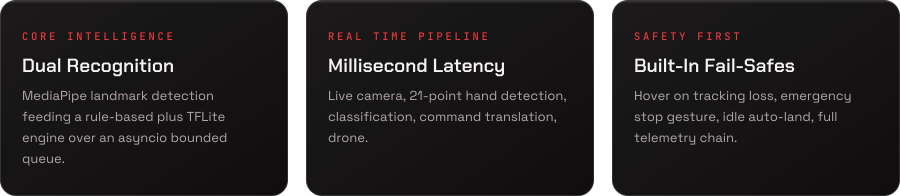

</div>

<br/>


> The project ships a live site: the **[landing page](https://cos301-se-2026.github.io/Gesture-Based-Drone-Control/)** introduces the product, and the **[documentation hub](https://cos301-se-2026.github.io/Gesture-Based-Drone-Control/docs/)** hosts every deliverable. All documents also live in the repo under [`docs/`](docs/) as Markdown or PDF. Both are built and deployed together by the `docs.yml` workflow.

<table>
  <tr>
    <th width="40">#</th><th>Document</th><th>Purpose</th><th width="120">Link</th>
  </tr>
  <tr>
    <td align="center">01</td><td><b>Demo Videos</b></td><td>Recorded demo walkthroughs on the Codex Merchants channel</td><td><a href="https://www.youtube.com/@CodexMerchants">Watch</a></td>
  </tr>
  <tr>
    <td align="center">02</td><td><b>User Manual</b></td><td>Set up, sign in, calibrate, and fly the drone with your hand</td><td><a href="https://cos301-se-2026.github.io/Gesture-Based-Drone-Control/docs/MANUAL/">Manual</a></td>
  </tr>
  <tr>
    <td align="center">03</td><td><b>Software Requirements Specification</b></td><td>Functional requirements, use cases, domain model, quality requirements</td><td><a href="https://cos301-se-2026.github.io/Gesture-Based-Drone-Control/docs/SRS/">SRS</a></td>
  </tr>
  <tr>
    <td align="center">04</td><td><b>Software Architecture Specification</b></td><td>Architectural patterns, services, design decisions, diagrams</td><td><a href="https://cos301-se-2026.github.io/Gesture-Based-Drone-Control/docs/SAS/">SAS</a></td>
  </tr>
  <tr>
    <td align="center">05</td><td><b>Brand and Design System</b></td><td>Style guide, wireframes, colour palette, typography</td><td><a href="https://cos301-se-2026.github.io/Gesture-Based-Drone-Control/docs/BRAND/">Brand</a></td>
  </tr>
  <tr>
    <td align="center">06</td><td><b>Coding Standards</b></td><td>Conventions, Ruff and ESLint rules, review requirements</td><td><a href="https://cos301-se-2026.github.io/Gesture-Based-Drone-Control/docs/CODING/">Coding</a></td>
  </tr>
  <tr>
    <td align="center">07</td><td><b>Testing Policy</b></td><td>Testing types, coverage targets, acceptance criteria</td><td><a href="https://cos301-se-2026.github.io/Gesture-Based-Drone-Control/docs/POLICY/">Policy</a></td>
  </tr>
  <tr>
    <td align="center">08</td><td><b>Testing Manual</b></td><td>How to run the suites and what they cover</td><td><a href="https://cos301-se-2026.github.io/Gesture-Based-Drone-Control/docs/testing/TESTING/">Testing</a></td>
  </tr>
  <tr>
    <td align="center">09</td><td><b>API Reference</b></td><td>REST and WebSocket contracts, schemas, examples</td><td><a href="https://cos301-se-2026.github.io/Gesture-Based-Drone-Control/docs/api/API_REFERENCE/">API</a></td>
  </tr>
  <tr>
    <td align="center">10</td><td><b>Project Plan</b></td><td>Roadmap, milestones, demo deliverables</td><td><a href="https://cos301-se-2026.github.io/Gesture-Based-Drone-Control/docs/PLAN/">Plan</a></td>
  </tr>
  <tr>
    <td align="center">11</td><td><b>Git Conventions</b></td><td>Branching, commits, PR rules</td><td><a href="https://cos301-se-2026.github.io/Gesture-Based-Drone-Control/docs/GIT/">Git</a></td>
  </tr>
  <tr>
    <td align="center">12</td><td><b>CI/CD Pipeline</b></td><td>GitHub Actions workflows and quality gates</td><td><a href="https://cos301-se-2026.github.io/Gesture-Based-Drone-Control/docs/CICD/">CI/CD</a></td>
  </tr>
  <tr>
    <td align="center">13</td><td><b>Component Reference</b></td><td>Frontend atoms, molecules, organisms, routing, service adapters</td><td><a href="https://cos301-se-2026.github.io/Gesture-Based-Drone-Control/docs/frontend/atoms/">Reference</a></td>
  </tr>
  <tr>
    <td align="center">14</td><td><b>Demo 1 Archive</b></td><td>Frozen snapshot of every Demo 1 deliverable</td><td><a href="https://cos301-se-2026.github.io/Gesture-Based-Drone-Control/docs/demo/demo_one_documentation/">Archive</a></td>
  </tr>
  <tr>
    <td align="center">15</td><td><b>Tender Document</b></td><td>Original proposal submitted to client</td><td><a href="docs/reports/tender.pdf">Tender</a></td>
  </tr>
  <tr>
    <td align="center">16</td><td><b>GitHub Project Board</b></td><td>Live sprint board, backlog, in progress</td><td><a href="https://github.com/orgs/COS301-SE-2026/projects/70">Board</a></td>
  </tr>
</table>

<br/>

<a id="the-team-codex-merchants"></a>

<div align="center">

<a href="#the-team-codex-merchants">
  
</a>

<br/><br/>

<table>
<tr>
  <td align="center" width="20%">
    <a href="https://github.com/Ayush-B99">
      
    </a>
    <br/>
    <b>Ayush Beekum</b><br/>
    <sub><code>u23596351</code></sub><br/>
    <sub>Team Lead. Full stack</sub><br/><br/>
    <a href="https://github.com/Ayush-B99"></a>
    <a href="https://www.linkedin.com/in/ayush-beekum-6423862b4/"></a>
  </td>
  <td align="center" width="20%">
    <a href="https://github.com/ShavirV">
      
    </a>
    <br/>
    <b>Shavir Vallabh</b><br/>
    <sub><code>u23718146</code></sub><br/>
    <sub>AI. Optimization. HPC</sub><br/><br/>
    <a href="https://github.com/ShavirV"></a>
    <a href="https://www.linkedin.com/in/shavir-vallabh-a0284026a/"></a>
  </td>
  <td align="center" width="20%">
    <a href="https://github.com/Wave2055">
      
    </a>
    <br/>
    <b>Jaitin Moodally</b><br/>
    <sub><code>u23621372</code></sub><br/>
    <sub>Systems. DevOps. Low level</sub><br/><br/>
    <a href="https://github.com/Wave2055"></a>
    <a href="https://www.linkedin.com/in/jaitin-moodally/"></a>
  </td>
  <td align="center" width="20%">
    <a href="https://github.com/deexglitch">
      
    </a>
    <br/>
    <b>Diya Narotam</b><br/>
    <sub><code>u23533596</code></sub><br/>
    <sub>UI/UX. Frontend. Testing</sub><br/><br/>
    <a href="https://github.com/deexglitch"></a>
    <a href="https://www.linkedin.com/in/diya-narotam-062222412/"></a>
  </td>
  <td align="center" width="20%">
    <a href="https://github.com/ChinmayiSanthosh">
      
    </a>
    <br/>
    <b>Chinmayi Santhosh</b><br/>
    <sub><code>u24585671</code></sub><br/>
    <sub>Frontend. Data analysis</sub><br/><br/>
    <a href="https://github.com/ChinmayiSanthosh"></a>
    
  </td>
</tr>
</table>

<br/>

<details>
<summary><b>Why each member is here. Click to expand individual profiles.</b></summary>

<br/>

<table>
<tr><td>

#### Ayush Beekum. Team Lead

Has delivered production web applications for real clients using React and Python, demonstrating equal strength on both frontend and backend development. Completed several standalone projects from concept to deployment, including a Python system that fetches real-time data from an API and reflects it live in the application. Language proficiency: Python, JavaScript, TypeScript, SQL, C++, Java, PHP. Works across the entire proposed stack. Consistent integration owner and bug fix go-to.

</td></tr>
<tr><td>

#### Shavir Vallabh. AI, Optimization, HPC

Strong background in AI and optimisation: RNNs in PyTorch, Genetic Algorithms, QAOA (quantum), applied to cybersecurity contexts like hashed password cracking and search space optimisation. Led the Tuks team to the finals of the CHPC Student Cluster Competition (DevOps orchestration, compiler tuning, benchmarking, profiling under strict resource constraints). Currently works part time as TechTeam member in UP's CS department on Linux infrastructure and full stack internal tools.

</td></tr>
<tr><td>

#### Jaitin Moodally. Systems, DevOps, Low level

Experience across multiple operating systems and environments. Homelab veteran. Runs different applications on resource constrained VMs. Experienced hosting multi user applications and writing low level code. Top stack: Java, C++, C, Python, TypeScript.

</td></tr>
<tr><td>

#### Diya Narotam. UI/UX and Frontend

Hands on with Python and NumPy for data manipulation. Strong OOP foundations in C++ and Java, proficient SQL. 1st place in a school website update hackathon. UI/UX contributor with PWA experience. Has built offline capable mobile applications. Testing across Playwright, Vitest and Jest gives solid grounding in both unit and end to end testing.

</td></tr>
<tr><td>

#### Chinmayi Santhosh. Frontend and Data

Considerable statistical and data analysis skills. UI engineering across React and Tailwind CSS. Writes unit and integration tests to ensure frontend reliability and catch regressions early. Consistent frontend contributor across every university project. Delivers clean, functional interfaces and collaborates well across the stack.

</td></tr>
</table>

</details>

<br/>

**Team Email:** [codexmerchants@gmail.com](mailto:codexmerchants@gmail.com)

</div>

<br/>


> The full architecture, from raw camera input through to packaged desktop application and CI/CD automation, with all diagrams, lives in the **[Software Architecture Specification](https://cos301-se-2026.github.io/Gesture-Based-Drone-Control/docs/SAS/)**.

<details>
<summary><b>Gesture to Command sequence diagram. Click to expand.</b></summary>

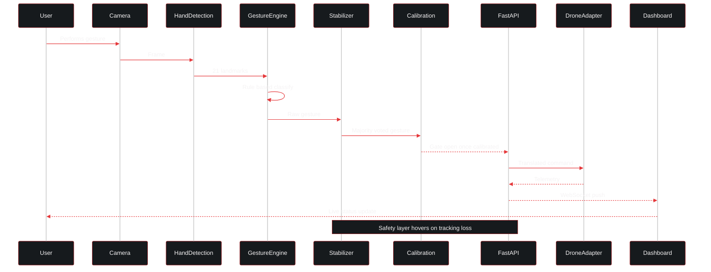

</details>

<br/>

### Gesture vocabulary

The rule-based recognizer classifies six gestures from MediaPipe's 21 hand landmarks, plus an `UNKNOWN` failure state for low-confidence or unmatched frames. Raw per-frame classifications pass through `GestureStabilizer`, which applies majority voting over a rolling buffer so a single blurred or badly lit frame cannot fire a command.

| Gesture | Fingers up | Source |
|:---|:---:|:---|
| `OPEN_PALM` | 5 | Specific pattern, takes priority over raw count |
| `FIST` | 0 | Specific pattern, takes priority over raw count |
| `ONE_FINGER` | 1 | Finger count |
| `TWO_FINGERS` | 2 | Finger count |
| `THREE_FINGERS` | 3 | Finger count |
| `FOUR_FINGERS` | 4 | Finger count |
| `UNKNOWN` | — | Confidence too low or unrecognised pattern |

### Calibration gate

Before any flight command is accepted, the user walks the calibration sequence once. This is a safety net that proves the pipeline can read *this* user's hand under *this* lighting. `CalibrationManager` holds app-wide status and owns at most one `CalibrationSession`.

| Parameter | Value | Meaning |
|:---|:---:|:---|
| `WINDOW_SECONDS` | `3.0` | Rolling evaluation window per gesture |
| `PASS_RATIO` | `0.8` | Fraction of frames in the window that must match the target |
| `MIN_FRAMES` | `45` | Guards against passing on a handful of lucky frames |
| `SUCCESS_DISPLAY_SECONDS` | `2.0` | Green-skeleton confirmation before the next gesture |

The sequence runs `OPEN_PALM → FIST → ONE_FINGER → TWO_FINGERS → THREE_FINGERS → FOUR_FINGERS`. A completed run reports `COMPLETED`; the REST skip endpoint reports `SKIPPED`. Both satisfy the flight-command gate.

### API surface

Everything is mounted under the `/api` prefix. Interactive Swagger docs are served at `/docs` when the backend is running.

| Router | Endpoints |
|:---|:---|
| root | `GET /api/health` |
| `/auth` | `GET /health` · `POST /login` · `POST /signup` · `POST /refresh` · `POST /logout` |
| `/drone` | `GET /health` · `POST /connect` · `POST /disconnect` · `GET /status` · `WS /ws/telemetry` · `WS /ws/commands` |
| `/gestures` | `GET /health` · `GET /status` · `WS /stream` |
| `/calibration` | `GET /status` · `POST /start` · `POST /skip` · `WS /stream` |
| `/input` | `POST /connect` · `POST /disconnect` · `GET /status` · `WS /ws/keyboard` · `WS /ws/gamepad` |
| `/analytics` | `GET /flights` · `GET /summary` |

<br/>


> Monorepo, single `uv` workspace at the root, trunk based. Below is the actual tree (depth 3).

```
Gesture-Based-Drone-Control/
├── .github/workflows/         # CI: test.yml, lint.yml, docs.yml, release.yml
├── apps/
│   ├── backend/               # FastAPI application layer
│   │   ├── app/
│   │   │   ├── api/           # analytics, auth, calibration, drone, gestures, input
│   │   │   ├── cv/            # calibration state machine, frame serialization, stream
│   │   │   ├── main.py        # App factory, lifespan, CORS, router mount
│   │   │   └── state.py       # AppState shared across routes
│   │   └── tests/             # Pytest unit tests
│   ├── frontend/              # React 18 dashboard (JSX, Vite, Tailwind, shadcn/ui)
│   │   ├── electron/          # Electron main + preload for the packaged app
│   │   ├── src/
│   │   │   ├── components/    # atoms, molecules, organisms, layouts, ui
│   │   │   ├── context/       # Commands, Telemetry, Theme providers
│   │   │   ├── hooks/         # useGestureStream, useCalibrationStream, useTelemetry, ...
│   │   │   └── lib/           # api client, hand skeleton renderer
│   │   └── tests/             # Playwright: unitTesting/ and end_to_end/
│   ├── desktop/               # Legacy Electron shell (superseded by frontend/electron)
│   └── mobile/                # Capacitor scaffold (iOS, Android)
│
├── landing_page/              # Public site (React, TypeScript, Vite, Three.js)
│   └── src/                   # Atomic design: atoms, molecules, organisms
│
├── services/                  # Core Python service layer
│   ├── auth/                  # Auth manager, password service, tokens, cookies, schemas
│   ├── commands/              # Command model and dispatch
│   ├── cv_pipeline/
│   │   ├── camera/            # OpenCV camera feed
│   │   ├── hand_detection/    # MediaPipe landmark detector
│   │   ├── gestures/          # gesture_engine, stabilizer, recognizers/
│   │   └── processing/        # Async bounded-queue pipeline
│   ├── database_manager/      # SQLAlchemy models/ and managers/
│   ├── drone_control/adapters/# drone_adapter (ABC), airsim, project_airsim, dummy, xfly
│   ├── input/sources/         # input_adapter (ABC), keyboard, gamepad, gesture, dummy
│   ├── telemetry/             # observer, manager, storage/ (sqlite, postgres)
│   └── tests/                 # adapter, auth, cv_pipeline, database_manager suites
│
├── packages/                  # Shared across apps and services
│   ├── api-contracts/
│   ├── contracts/             # python (Pydantic) and typescript types
│   ├── domain/models/         # Domain models
│   └── utils/                 # Shared helpers
│
├── infrastructure/
│   ├── docker/                # not used
│   └── scripts/               # Setup utilities
│
├── docs/                      # Documentation hub source (MkDocs Material)
│   ├── SRS.md, SAS.md, BRAND.md, CODING.md, POLICY.md
│   ├── MANUAL.md, PLAN.md, GIT.md, CICD.md
│   ├── api/API_REFERENCE.md, testing/TESTING.md
│   ├── frontend/              # atoms, molecules, organisms, routing
│   ├── services/             # Adapter and service reference
│   ├── demo/demo_one_documentation/   # Frozen Demo 1 archive
│   └── reports/tender.pdf
│
├── init-db/                   # Postgres bootstrap SQL (extensions, users, drone, telemetry)
├── vendors/                   # Git submodule: ProjectAirSim fork + sim_config
├── sandbox/                   # Throwaway scripts (not shipped)
├── tests/integration/         # Cross service integration tests
│
├── Taskfile.yml               # Primary task runner (cross platform)
├── makefile                   # Unix shorthand for the same targets
├── pyproject.toml             # Root uv workspace, Ruff, Pytest, coverage config
├── docker-compose.yml         # not used
├── codecov.yml
├── mkdocs.yml
└── README.md
```

<br/>


<div align="center">


</div>

<br/>

<details>
<summary><b>Computer Vision and Gesture Recognition</b></summary>
<br/>

| Technology | Purpose | Version |
|:---|:---|:---:|
|  | Primary language. CV, services, drone SDK integration | `3.11.x` |
|  | Live camera feed and image preprocessing | `4.8+` |
|  | Real time 21-point hand landmark detection and tracking | `0.10.21` |
|  | Vector math. Angles, distances, finger state | `1.26+` |
| Rule Based Recognizer | Deterministic, zero latency gesture classification | `custom` |
| Gesture Stabilizer | Majority voting over a rolling buffer, kills single-frame noise | `custom` |
| ML Recognizer | Second engine behind the same `GestureRecognizer` ABC | `planned` |
| Asyncio plus Bounded Queue | Non blocking real time pipeline, drops stale frames | `built-in` |

</details>

<details>
<summary><b>Drone Integration and Simulation</b></summary>
<br/>

| Adapter | Purpose | Status |
|:---|:---|:---:|
| `DroneAdapter` (ABC) | Common contract. Every backend talks the same interface | `stable` |
| `ProjectAirSimAdapter` | Unreal Engine 5 Project AirSim. Async native (pynng), body-frame velocity | `primary` |
| `AirSimAdapter` | Legacy AirSim via msgpack-rpc. NED conversions handled in-adapter | `supported` |
| `DummyDroneAdapter` | In-memory drone for tests and CI. No simulator required | `stable` |
| `XFlyAdapter` | Physical drone communication | `stubbed` |
| Gazebo plus ArduPilot | High fidelity physics simulation | `not wired up` |

> Project AirSim is vendored as a git submodule (`vendors/`) so the client and `sim_config` stay pinned and reproducible. Clone with `--recurse-submodules`.

</details>

<details>
<summary><b>Input Sources</b></summary>
<br/>

| Adapter | Purpose |
|:---|:---|
| `InputAdapter` (ABC) | Common contract for every control surface |
| `GestureAdapter` | Hand gestures from the CV pipeline |
| `KeyboardAdapter` | Arrow keys, WASD, T, Space, L, Esc. Streamed over `WS /api/input/ws/keyboard` |
| `GamepadAdapter` | Dual-stick and face buttons. Streamed over `WS /api/input/ws/gamepad` |
| `DummyInputAdapter` | Deterministic input for tests |

> On-screen buttons in the dashboard drive the same command set, so gestures, keyboard, gamepad and UI are fully interchangeable. This is the project's accessibility story.

</details>

<details>
<summary><b>Backend, Auth and Database</b></summary>
<br/>

| Technology | Purpose | Version |
|:---|:---|:---:|
|  | REST plus WebSocket API (ASGI), Swagger at `/docs` | `0.136+` |
|  | Async ORM. Models and managers in `services/database_manager` | `2.0+` |
|  | Primary database via `asyncpg`. Bootstrapped by `init-db/` | `16` |
|  | Local and test database via `aiosqlite` | `3.x` |
|  | Schemas, validation, settings (`pydantic-settings`) | `2.13+` |
| PyJWT plus bcrypt | Access and refresh tokens, password hashing, HTTP-only cookies | `latest` |
|  | Unit, integration and API testing. `pytest-asyncio` in auto mode | `9.x` |

</details>

<details>
<summary><b>Frontend</b></summary>
<br/>

| Technology | Purpose | Version |
|:---|:---|:---:|
|  | Dashboard UI. Atomic design, JSX | `18` |
|  | Dev server and bundler | `8.x` |
|  | Utility first styling, light and dark themes | `3.x` |
| shadcn/ui plus lucide-react | Component primitives and icon set | `latest` |
| React Router | Client routing under `RootLayout` | `7.x` |
| Recharts | Real time telemetry and analytics visualisation | `3.x` |
| Leaflet plus react-leaflet | GPS map view for simulated flight paths | `1.9 / 4.2` |
|  | Landing page, Playwright specs, shared contracts | `5.x+` |
|  | Both component-level unit tests and end to end tests | `1.60+` |

</details>

<details>
<summary><b>Packaging and Deployment</b></summary>
<br/>

| Technology | Purpose | Version |
|:---|:---|:---:|
|  | Freezes the backend, CV pipeline and simulator client into one binary | `6.21+` |
|  | Desktop shell. `electron-builder` produces `.exe` and `.AppImage` | `43.x` |
| GitHub Pages | Landing page at `/` and documentation hub at `/docs` | `gh-pages` |

</details>

<details>
<summary><b>DevOps, Tooling and Documentation</b></summary>
<br/>

| Technology | Purpose |
|:---|:---|
|  | Single root workspace resolves backend, services and vendored packages together |
|  | Cross platform task runner. Same commands on Windows, macOS, Linux |
|  | Python lint and format. Single quotes, tab indent, 100 col, `E/F/I/N` rules |
| ESLint plus Prettier | TypeScript and JSX linting and formatting. `format:check` gates CI |
|  | Test, lint, docs deploy and release build pipelines |
|  | Coverage reporting. Separate `backend` and `services` flags, 80% target |
|  | Version control. Trunk based, Use Case branches, submodule for vendors |
| MkDocs Material | Documentation hub (`mkdocs.yml`), deployed alongside the landing page |

</details>

<br/>


> Every use case owns a long-lived branch and a slice of the Project Board. The full catalogue with actors, flows and diagrams lives in the [SRS](https://cos301-se-2026.github.io/Gesture-Based-Drone-Control/docs/SRS/).

<table>
  <tr>
    <th align="center" width="70">ID</th>
    <th>Use Case</th>
    <th align="center" width="110">Priority</th>
    <th align="center" width="110">Status</th>
  </tr>
  <tr>
    <td align="center"><code>UC1</code></td>
    <td><b>Hand Tracking and Gesture Recognition.</b> Live camera feed, MediaPipe landmark detection, rule-based classification, stabilizer smoothing, gesture to command mapping</td>
    <td align="center"></td>
    <td align="center">Implemented</td>
  </tr>
  <tr>
    <td align="center"><code>UC2</code></td>
    <td><b>Dashboard and Telemetry.</b> Real time telemetry display, command history, WebSocket feed, Recharts visualisations</td>
    <td align="center"></td>
    <td align="center">Implemented</td>
  </tr>
  <tr>
    <td align="center"><code>UC3</code></td>
    <td><b>Simulator Adapter.</b> Dynamic adapter switching across Project AirSim, legacy AirSim and the dummy drone, with a live swap demo script</td>
    <td align="center"></td>
    <td align="center">Implemented</td>
  </tr>
  <tr>
    <td align="center"><code>UC4</code></td>
    <td><b>Controller Support.</b> Gamepad adapter, dual-stick mapping, controller layout UI, keyboard fallback</td>
    <td align="center"></td>
    <td align="center">Implemented</td>
  </tr>
  <tr>
    <td align="center"><code>UC5</code></td>
    <td><b>Real Telemetry Logging.</b> Telemetry observer and manager, SQLite and Postgres repositories, flight summary persistence</td>
    <td align="center"></td>
    <td align="center">Implemented</td>
  </tr>
  <tr>
    <td align="center"><code>UC6</code></td>
    <td><b>GPS Simulation.</b> Simulated position feed, Leaflet map view, displacement statistics</td>
    <td align="center"></td>
    <td align="center">Implemented</td>
  </tr>
  <tr>
    <td align="center"><code>UC7</code></td>
    <td><b>User Tutorial and Help.</b> Gesture guide, onboarding tutorial, in-app help page</td>
    <td align="center"></td>
    <td align="center">Implemented</td>
  </tr>
  <tr>
    <td align="center"><code>UC8</code></td>
    <td><b>Gesture Calibration.</b> Guided calibration flow, deterministic backend state machine, REST plus WebSocket endpoints, flight gating</td>
    <td align="center"></td>
    <td align="center">Implemented</td>
  </tr>
  <tr>
    <td align="center"><code>Base</code></td>
    <td><b>Registration and Login.</b> Signup, login, JWT access and refresh tokens, HTTP-only cookies, light and dark themes</td>
    <td align="center"></td>
    <td align="center">Implemented</td>
  </tr>
  <tr>
    <td align="center"><code>Base</code></td>
    <td><b>Landing Page and Docs Hub.</b> Public marketing site with Three.js, MkDocs documentation hub, single Pages deployment</td>
    <td align="center"></td>
    <td align="center">Implemented</td>
  </tr>
  <tr>
    <td align="center"><code>DevOps</code></td>
    <td><b>Infrastructure, CI/CD and Packaging.</b> uv workspace, Task runner, Actions pipelines, Codecov, PyInstaller plus Electron release builds</td>
    <td align="center"></td>
    <td align="center">Implemented</td>
  </tr>
</table>

<br/>


**Prerequisites**

[](https://python.org)
[](https://docs.astral.sh/uv/)
[](https://taskfile.dev)
[](https://nodejs.org)
[](https://yarnpkg.com)

> **Python must be 3.11.** The workspace pins `>=3.11,<3.12` because MediaPipe and the AirSim clients have no wheels beyond it.

On Windows, `task prereqs` installs Python 3.11, uv and DirectX via winget. Otherwise:

```bash
# uv
curl -LsSf https://astral.sh/uv/install.sh | sh

# Task
brew install go-task            # macOS
sudo snap install task --classic  # Linux
winget install Task.Task        # Windows
```

<br/>

**Clone**

```bash
git clone --recurse-submodules https://github.com/COS301-SE-2026/Gesture-Based-Drone-Control.git
cd Gesture-Based-Drone-Control
cp .env.example .env
```

> Already cloned without submodules? Run `git submodule update --init --recursive`. Without `vendors/`, the Project AirSim adapter will not import.

<br/>

**Install**

```bash
task install
```

One command creates the 3.11 virtual environment, seeds the build dependencies AirSim needs, runs `uv sync --all-groups` across the whole workspace, and installs the frontend with Yarn. `make install` is the Unix shorthand for the same thing.

<br/>

**Run locally**

```bash
task dev
```

This starts the FastAPI backend on `BACKENDPORT` (default `3001`) with hot reload on both `apps/backend/app` and `services`, and the Vite dev server for the dashboard. Run them separately with `task backend-dev` and `task frontend-dev`. The landing page runs on its own port with `task landing`.

<br/>

**Run the CV pipeline standalone**

Useful for debugging the vision layer without the API in the way. Each step adds one stage:

```bash
task cv-camera      # camera feed only
task cv-detector    # camera plus MediaPipe hand detection
task cv-engine      # camera, detector, gesture engine
task cv-pipeline    # full async pipeline: landmarks, FPS, speed, confidence
```

<br/>

**Simulator (Windows)**

Point `AS_PATH` and `PAS_PATH` in `.env` at your simulator executables, then:

```bash
task sim-pas        # launch Project AirSim (UE5)
task sim-pas-demo   # launch Project AirSim plus the adapter demo script
task sim-as         # launch legacy AirSim
```

<br/>

**Test**

```bash
task test           # everything: unit, integration, end to end
```

Or by layer:

```bash
task backend-unit-test    # pytest over apps/backend/tests and services/tests, fails under 80%
task frontend-unit-test   # yarn unit-test  (Playwright, tests/unitTesting)
task integration-test     # pytest over tests/
task e2e-test             # yarn e2e-test   (Playwright, tests/end_to_end, single worker)
```

| Suite | Count | Location |
|:---|:---:|:---|
| Backend unit | 131 | `apps/backend/tests/` |
| Services unit | 322 | `services/tests/` |
| Integration | 30 | `tests/integration/` |
| Frontend unit (Playwright) | 91 | `apps/frontend/tests/unitTesting/` |
| End to end (Playwright) | 12 | `apps/frontend/tests/end_to_end/` |

> CI runners have no webcam. `GBDC_E2E_NO_CAMERA=1` is set for the E2E job; keep it when running E2E on a headless machine.

<br/>

**Lint and format**

```bash
task lint     # ruff check (Python) plus eslint and prettier --check (frontend)
task fix      # ruff format, ruff check --fix, prettier --write
```

<br/>

**Build the desktop app**

```bash
task build
```

PyInstaller bundles the backend into a single binary (collecting MediaPipe, AirSim, Project AirSim, bcrypt, asyncpg and the vendored `sim_config`), then `electron-builder` packages the frontend around it. `task clean` removes `release/`, `dist/` and `apps/frontend/dist/`.

<br/>


> Four tier model. `main` must always be in a deployable state. All merges happen before each demo. Every commit is attributed via the Git CLI with `user.name` matching the GitHub username. No GUI Git clients. Full conventions in the [Git docs](https://cos301-se-2026.github.io/Gesture-Based-Drone-Control/docs/GIT/).

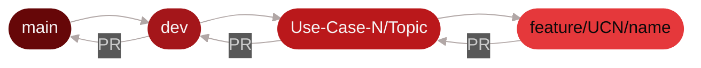

| Branch | Purpose |
|:---|:---|
| `main` | Production. Protected. Merged into before every demo. Triggers the release build. |
| `dev` | Integration. All Use Case branches merge here when ready. |
| `Use-Case-<Word>/<Topic>` | One long-lived branch per Use Case, for example `Use-Case-Eight/Calibration`. Regularly synced with `dev`. |
| `feature/UC<N>/<name>` | Short lived. One per feature or fix, branched from its Use Case branch. Merged back via PR after review. |
| `documentation/*`, `devops/*`, `hotfix/*` | Cross-cutting work that does not belong to a single Use Case. |

> **Keep your Use Case branch current.** Regularly merge `dev` into it to stay aligned and avoid large conflicts. Resolve all conflicts locally before opening a PR.

<br/>


> Four workflows guard the repo. Test and lint run on every pull request, docs deploys on pushes that touch the site, and release builds the packaged app on every push to `main`.

<table>
  <tr>
    <th width="160">Workflow</th><th width="150">Status</th><th>Trigger and jobs</th>
  </tr>
  <tr>
    <td><b>Test</b><br/><sub><code>test.yml</code></sub></td>
    <td><a href="https://github.com/COS301-SE-2026/Gesture-Based-Drone-Control/actions/workflows/test.yml"></a></td>
    <td>PRs into <code>dev</code>, <code>main</code>, <code>Use-Case**</code>. Backend unit, frontend unit, then integration, then E2E. Coverage uploaded to Codecov under <code>backend</code> and <code>services</code> flags</td>
  </tr>
  <tr>
    <td><b>Lint</b><br/><sub><code>lint.yml</code></sub></td>
    <td><a href="https://github.com/COS301-SE-2026/Gesture-Based-Drone-Control/actions/workflows/lint.yml"></a></td>
    <td>Every PR. Ruff over Python, ESLint plus Prettier over the frontend. No style drift</td>
  </tr>
  <tr>
    <td><b>Docs</b><br/><sub><code>docs.yml</code></sub></td>
    <td><a href="https://github.com/COS301-SE-2026/Gesture-Based-Drone-Control/actions/workflows/docs.yml"></a></td>
    <td>Pushes to <code>main</code> or <code>dev</code> touching <code>docs/</code>, <code>landing_page/</code> or <code>mkdocs.yml</code>. Builds both, deploys landing page at <code>/</code> and MkDocs at <code>/docs</code></td>
  </tr>
  <tr>
    <td><b>Release</b><br/><sub><code>release.yml</code></sub></td>
    <td><a href="https://github.com/COS301-SE-2026/Gesture-Based-Drone-Control/actions/workflows/release.yml"></a></td>
    <td>Pushes to <code>main</code>. Matrix build on Windows and Ubuntu, produces <code>.exe</code> and <code>.AppImage</code>, publishes a GitHub Release</td>
  </tr>
  <tr>
    <td><b>Coverage</b><br/><sub><code>codecov.yml</code></sub></td>
    <td><a href="https://codecov.io/gh/COS301-SE-2026/Gesture-Based-Drone-Control"></a></td>
    <td>80% project and patch target, 1% threshold. Tests, <code>__init__.py</code>, <code>sandbox/</code> and <code>vendors/</code> excluded</td>
  </tr>
  <tr>
    <td><b>Issues</b></td>
    <td><a href="https://github.com/COS301-SE-2026/Gesture-Based-Drone-Control/issues"></a></td>
    <td>Open issue count. Tracked on the <a href="https://github.com/orgs/COS301-SE-2026/projects/70">Project Board</a></td>
  </tr>
</table>

<br/>


| Constraint | Detail |
|:---|:---|
| Single User Operation | One operator tracked at a time. Reduces tracking complexity |
| Fixed Gesture Set | Six classifiable gestures, all derived from finger state |
| Calibration Required | No flight command is accepted until calibration completes or is explicitly skipped |
| CPU Bound Inference | No GPU assumed. Must run on developer grade laptops |
| Python 3.11 Only | MediaPipe and the AirSim clients have no wheels past 3.11 |
| Simulator First | Physical drone integration is scoped behind the simulator adapters |



| Role | Name | Email |
|:---|:---|:---|
| Project Owner | Bryan Janse Van Vuuren | [bryan.janse.van.vuuren@epiuse.com](mailto:bryan.janse.van.vuuren@epiuse.com) |
| Project Mentor | Cameron Taberer | [cameron.taberer@epiuse.com](mailto:cameron.taberer@epiuse.com) |
| Team | Codex Merchants | [codexmerchants@gmail.com](mailto:codexmerchants@gmail.com) |

<br/>

<div align="center">


<br/><br/>


</div>