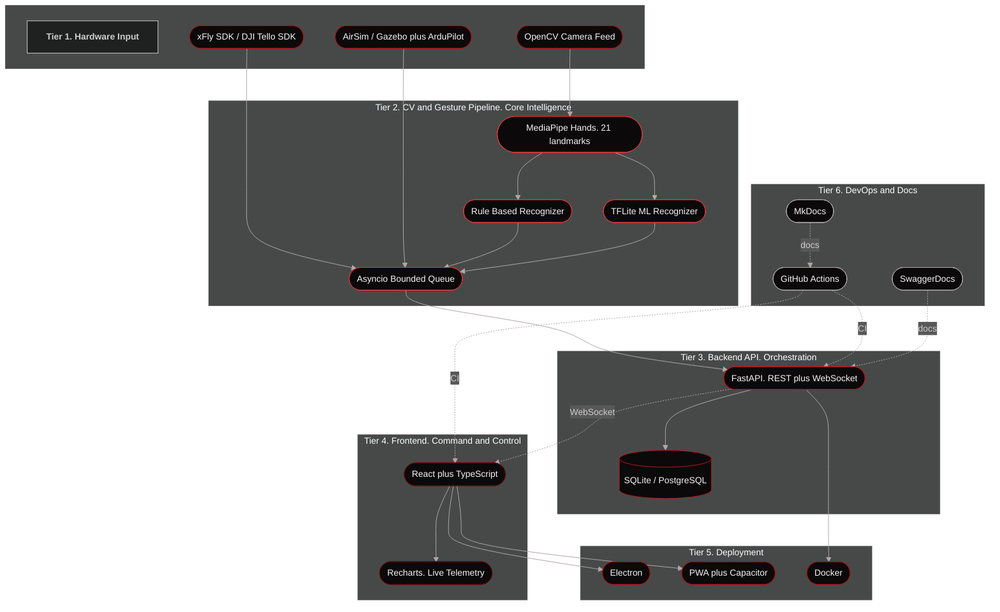
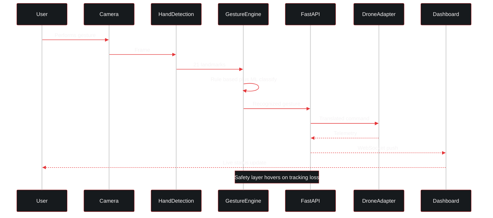
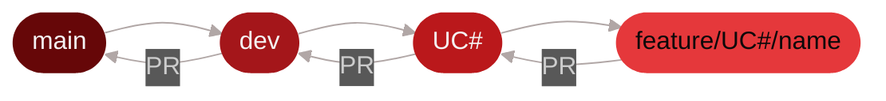
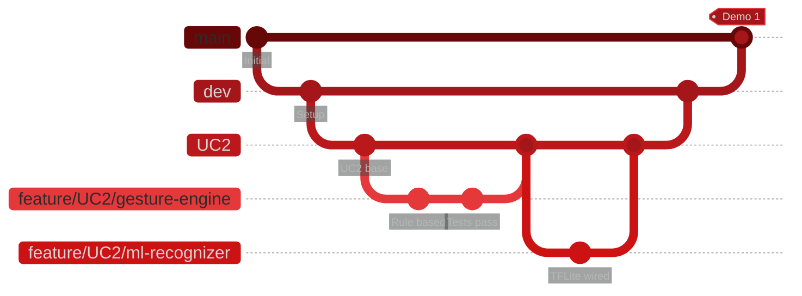

<div align="center">

<a href="#codex-merchants">
  
</a>

<a href="#codex-merchants">
  
</a>

<br/>

[](https://github.com/COS301-SE-2026/Gesture-Based-Drone-Control/actions/workflows/test.yml)
[](https://github.com/COS301-SE-2026/Gesture-Based-Drone-Control/actions/workflows/lint.yml)
[](https://github.com/COS301-SE-2026/Gesture-Based-Drone-Control/actions/workflows/docs.yml)
[](https://github.com/COS301-SE-2026/Gesture-Based-Drone-Control/issues)
[](LICENSE)
[](https://uptimerobot.com)

<br/>

[](docs/SRS.md)
[](https://github.com/orgs/COS301-SE-2026/projects/70)
[](docs/DESIGN.md)
[](docs/api/API_REFERENCE.md)
[](docs/testing/TESTING.md)

<br/>

[](https://python.org)
[](https://react.dev)
[](https://typescriptlang.org)
[](https://fastapi.tiangolo.com)
[](https://mediapipe.dev)
[](https://docker.com)

</div>

<br/>

> **Codex Merchants. Gesture Based Drone Control.** A real-time computer-vision system that eliminates the physical drone controller entirely. Hand gestures are detected through a live camera feed, classified by a dual rule-based and ML recognition engine, and translated directly into drone flight commands, with safety fail-safes built in from the ground up.

<br/>

<div align="center">


<table>
  <tr>
    <td align="center" width="33%">
      <h3>CORE INTELLIGENCE</h3>
      <p><sub>MediaPipe driven landmark detection feeding a dual <b>rule based plus TFLite</b> recognition engine over an asyncio bounded queue.</sub></p>
    </td>
    <td align="center" width="33%">
      <h3>REAL TIME PIPELINE</h3>
      <p><sub>Live camera, 21 point hand detection, gesture classification, command translation, drone. All in milliseconds.</sub></p>
    </td>
    <td align="center" width="33%">
      <h3>SAFETY FIRST</h3>
      <p><sub>Hover on tracking loss, emergency stop gesture, idle detection auto land, and full telemetry observer chain.</sub></p>
    </td>
  </tr>
</table>


</div>

<br/>

##  &nbsp;Documentation


> Every artefact required by the Demo 1 rubric lives in the repo as either Markdown or PDF. No Google Drive, no external links.

<table>
  <tr>
    <th width="40">#</th><th>Document</th><th>Purpose</th><th width="120">Link</th>
  </tr>
  <tr>
    <td align="center">01</td><td><b>Software Requirements Specification</b></td><td>Functional requirements, use cases, domain model, quality requirements</td><td><a href="docs/SRS.md">SRS</a></td>
  </tr>
  <tr>
    <td align="center">02</td><td><b>Architecture and Design</b></td><td>Brand style guide, wireframes, architectural patterns</td><td><a href="docs/DESIGN.md">Design</a></td>
  </tr>
  <tr>
    <td align="center">03</td><td><b>API Reference</b></td><td>REST and WebSocket contracts, schemas, examples</td><td><a href="docs/api/API_REFERENCE.md">API</a></td>
  </tr>
  <tr>
    <td align="center">04</td><td><b>Testing Strategy</b></td><td>Unit, integration, E2E coverage approach</td><td><a href="docs/testing/TESTING.md">Testing</a></td>
  </tr>
  <tr>
    <td align="center">05</td><td><b>CI/CD Pipeline</b></td><td>GitHub Actions workflows and quality gates</td><td><a href="docs/CICD.md">CI/CD</a></td>
  </tr>
  <tr>
    <td align="center">06</td><td><b>Git Conventions</b></td><td>Branching, commits, PR rules</td><td><a href="docs/GIT.md">Git</a></td>
  </tr>
  <tr>
    <td align="center">07</td><td><b>Project Plan</b></td><td>Roadmap, milestones, demo deliverables</td><td><a href="docs/PLAN.md">Plan</a></td>
  </tr>
  <tr>
    <td align="center">08</td><td><b>Tender Document</b></td><td>Original proposal submitted to client</td><td><a href="docs/reports/tender.pdf">Tender</a></td>
  </tr>
  <tr>
    <td align="center">09</td><td><b>GitHub Project Board</b></td><td>Live sprint board, backlog, in progress</td><td><a href="https://github.com/orgs/COS301-SE-2026/projects/70">Board</a></td>
  </tr>
</table>

<br/>

##  &nbsp;The Team. Codex Merchants


<div align="center">

<a href="#the-team-codex-merchants">
  
</a>

<br/><br/>

<table>
<tr>
  <td align="center" width="20%">
    <a href="https://github.com/Ayush-B99">
      
    </a>
    <br/>
    <b>Ayush Beekum</b><br/>
    <sub><code>u23596351</code></sub><br/>
    <sub>Team Lead. Full stack</sub><br/><br/>
    <a href="https://github.com/Ayush-B99"></a>
    <a href="https://linkedin.com/in/ayush-beekum"></a>
  </td>
  <td align="center" width="20%">
    <a href="https://github.com/ShavirV">
      
    </a>
    <br/>
    <b>Shavir Vallabh</b><br/>
    <sub><code>u23718146</code></sub><br/>
    <sub>AI. Optimization. HPC</sub><br/><br/>
    <a href="https://github.com/ShavirV"></a>
    <a href="https://za.linkedin.com/in/shavir-vallabh"></a>
  </td>
  <td align="center" width="20%">
    <a href="https://github.com/Wave2055">
      
    </a>
    <br/>
    <b>Jaitin Moodally</b><br/>
    <sub><code>u23621372</code></sub><br/>
    <sub>Systems. DevOps. Low level</sub><br/><br/>
    <a href="https://github.com/Wave2055"></a>
    
  </td>
  <td align="center" width="20%">
    <a href="https://github.com/deexglitch">
      
    </a>
    <br/>
    <b>Diya Narotam</b><br/>
    <sub><code>u23533596</code></sub><br/>
    <sub>UI/UX. Frontend. Testing</sub><br/><br/>
    <a href="https://github.com/deexglitch"></a>
    
  </td>
  <td align="center" width="20%">
    <a href="https://github.com/ChinmayiSanthosh">
      
    </a>
    <br/>
    <b>Chinmayi Santhosh</b><br/>
    <sub><code>u24585671</code></sub><br/>
    <sub>Frontend. Data analysis</sub><br/><br/>
    <a href="https://github.com/ChinmayiSanthosh"></a>
    
  </td>
</tr>
</table>

<br/>

<details>
<summary><b>Why each member is here. Click to expand individual profiles.</b></summary>

<br/>

<table>
<tr><td>

#### Ayush Beekum. Team Lead

Has delivered production web applications for real clients using React and Python, demonstrating equal strength on both frontend and backend development. Completed several standalone projects from concept to deployment, including a Python system that fetches real-time data from an API and reflects it live in the application. Language proficiency: Python, JavaScript, TypeScript, SQL, C++, Java, PHP. Works across the entire proposed stack. Consistent integration owner and bug fix go-to.

</td></tr>
<tr><td>

#### Shavir Vallabh. AI, Optimization, HPC

Strong background in AI and optimisation: RNNs in PyTorch, Genetic Algorithms, QAOA (quantum), applied to cybersecurity contexts like hashed password cracking and search space optimisation. Led the Tuks team to the finals of the CHPC Student Cluster Competition (DevOps orchestration, compiler tuning, benchmarking, profiling under strict resource constraints). Currently works part time as TechTeam member in UP's CS department on Linux infrastructure and full stack internal tools.

</td></tr>
<tr><td>

#### Jaitin Moodally. Systems, DevOps, Low level

Experience across multiple operating systems and environments. Homelab veteran. Runs different applications on resource constrained VMs. Experienced hosting multi user applications and writing low level code. Top stack: Java, C++, C, Python, TypeScript.

</td></tr>
<tr><td>

#### Diya Narotam. UI/UX and Frontend

Hands on with Python and NumPy for data manipulation. Strong OOP foundations in C++ and Java, proficient SQL. 1st place in a school website update hackathon. UI/UX contributor with PWA experience. Has built offline capable mobile applications. Testing across Playwright, Vitest and Jest gives solid grounding in both unit and end to end testing.

</td></tr>
<tr><td>

#### Chinmayi Santhosh. Frontend and Data

Considerable statistical and data analysis skills. UI engineering across React and Tailwind CSS. Writes unit and integration tests in TypeScript to ensure frontend reliability and catch regressions early. Consistent frontend contributor across every university project. Delivers clean, functional interfaces and collaborates well across the stack.

</td></tr>
</table>

</details>

<br/>

**Team Email:** [codexmerchants@gmail.com](mailto:codexmerchants@gmail.com)

</div>

<br/>

##  &nbsp;System Architecture


<div align="center">

The system is structured across **six integrated tiers**, from raw hardware input through to deployed application and CI/CD automation. The diagram below renders interactively on GitHub.

</div>



<br/>

<details>
<summary><b>Gesture to Command sequence diagram. Click to expand.</b></summary>



</details>

<br/>

##  &nbsp;Repository Structure


> Monorepo, trunk based. Below is the actual tree (depth 3).

```
gesture-drone-control/
├── .github/workflows/         # CI: docs.yml, lint.yml, test.yml
├── apps/
│   ├── backend/               # FastAPI, uv managed, Pytest
│   │   ├── app/               # api, core, dependencies
│   │   ├── tests/             # Pytest unit and integration tests
│   │   ├── pyproject.toml
│   │   └── makefile
│   ├── desktop/               # Electron wrapper (Win, Linux, macOS)
│   │   ├── main.js
│   │   └── preload.js
│   ├── frontend/              # React, TS, Vite, Tailwind
│   │   ├── src/               # Components, pages, hooks
│   │   ├── tests/             # Playwright E2E
│   │   ├── vite.config.js
│   │   └── tailwind.config.js
│   └── mobile/                # Capacitor (iOS, Android)
│       ├── android/
│       └── ios/
│
├── services/                  # Core Python service layer
│   ├── cv_pipeline/           # camera, gestures, hand_detection, processing
│   │   └── gestures/recognizers/   # rule based and ML
│   ├── drone_control/         # adapters/ (AirSim, xFly), controller.py
│   ├── input/sources/         # gesture, keyboard, generic
│   ├── commands/              # Command model and dispatch
│   ├── telemetry/             # observer, manager, storage (SQLite/Postgres)
│   ├── tests/                 # cv_pipeline_testing, adapter_testing
│   ├── pyproject.toml
│   └── makefile
│
├── packages/                  # Shared across apps and services
│   ├── contracts/             # python (Pydantic) and typescript types
│   ├── domain/models/         # Domain models
│   └── utils/                 # Shared helpers
│
├── infrastructure/
│   ├── docker/                # backend.Dockerfile, frontend.Dockerfile, airsim/
│   └── scripts/               # Setup utilities
│
├── docs/
│   ├── SRS.md, DESIGN.md, CICD.md, GIT.md, PLAN.md
│   ├── api/API_REFERENCE.md
│   ├── testing/TESTING.md
│   ├── demo/Deployment.md
│   ├── diagrams/              # drawio sources
│   └── reports/tender.pdf
│
├── sandbox/                   # Throwaway scripts (not shipped)
├── tests/integration/         # Cross service integration tests
├── site/                      # MkDocs generated site
│
├── docker-compose.yml
├── makefile
├── mkdocs.yml
└── README.md
```

<br/>

##  &nbsp;Technology Stack


<div align="center">


</div>

<br/>

<details>
<summary><b>Computer Vision and ML Backend</b></summary>
<br/>

| Technology | Purpose | Version |
|:---|:---|:---:|
|  | Primary language. CV, ML, drone SDK integration | `3.11.x` |
|  | Live camera feed and image preprocessing | `4.8+` |
|  | Real time hand landmark detection and tracking | `0.10+` |
|  | Vector math. Angles, distances, gesture ID | `1.26+` |
|  | ML based gesture recognition (secondary engine) | `2.x` |
| Rule Based Engine | Deterministic, zero latency gesture mapping | `custom` |
| Asyncio plus Bounded Queue | Non blocking real time pipeline | `built-in` |

</details>

<details>
<summary><b>Drone Integration</b></summary>
<br/>

| Technology | Purpose | Version |
|:---|:---|:---:|
| xFly SDK | Primary physical drone communication | `latest` |
| DJI Tello SDK | Alternative drone hardware interface | `latest` |
| AirSim | Primary simulation environment (lightweight) | `latest` |
| Gazebo plus ArduPilot | High fidelity physics simulation | `4.x` |

</details>

<details>
<summary><b>Backend and Database</b></summary>
<br/>

| Technology | Purpose | Version |
|:---|:---|:---:|
|  | REST plus WebSocket API (ASGI) | `0.110+` |
|  | Gesture logs, telemetry, command history | `3.x` |
|  | Scale out alternative database | `15+` |
|  | Backend unit, integration and API testing | `latest` |

</details>

<details>
<summary><b>Frontend</b></summary>
<br/>

| Technology | Purpose | Version |
|:---|:---|:---:|
|  | Component based UI framework | `18` |
|  | Static typing across the frontend | `5.x` |
|  | Utility first styling | `3.x` |
| Recharts | Real time telemetry and data visualisation | `2.x` |
|  | Frontend unit and component testing | `latest` |
| Playwright | End to end browser testing | `latest` |

</details>

<details>
<summary><b>Deployment</b></summary>
<br/>

| Technology | Purpose | Version |
|:---|:---|:---:|
|  | Native desktop packaging (Win, Linux, macOS) | `latest` |
| PWA plus Capacitor | Cross platform mobile delivery (iOS, Android) | `latest` |
|  | Containerisation. Backend on port 8000, frontend on 5173 | `latest` |

</details>

<details>
<summary><b>DevOps and Documentation</b></summary>
<br/>

| Technology | Purpose |
|:---|:---|
|  | CI/CD. Automated testing, linting, quality gates |
|  | Version control. Trunk based. `main`, `dev`, `feature/*` |
| MkDocs | Static site generation for documentation hub (`mkdocs.yml`) |
| SwaggerDocs | Auto generated interactive API documentation |
| Overleaf | Formal LaTeX documentation |

</details>

<br/>

##  &nbsp;Use Cases


> Use cases are tracked as GitHub Issues and linked to the [Project Board](https://github.com/orgs/COS301-SE-2026/projects/70). Core cases target Demo 1. Optional cases extend toward Demo 2 and beyond.

<table>
  <tr>
    <th align="center" width="60">ID</th>
    <th>Use Case</th>
    <th align="center" width="130">Status</th>
    <th align="center" width="100">Priority</th>
    <th align="center" width="90">Issues</th>
  </tr>
  <tr>
    <td align="center"><code>UC1</code></td>
    <td><b>Hand Tracking and Gesture Recognition.</b> Live camera feed, MediaPipe landmark detection, rule based and ML classification, gesture to command mapping, safety logic</td>
    <td align="center">Core. Demo 1</td>
    <td align="center"></td>
    <td align="center"><a href="https://github.com/COS301-SE-2026/Gesture-Based-Drone-Control/issues?q=is%3Aissue+UC1">#72 #74 #36</a></td>
  </tr>
  <tr>
    <td align="center"><code>UC2</code></td>
    <td><b>Statistics Dashboard and Telemetry Logging.</b> Real time telemetry display, gesture event history, WebSocket feed, Recharts visualisations, Playwright testing</td>
    <td align="center">Core. Demo 1</td>
    <td align="center"></td>
    <td align="center"><a href="https://github.com/COS301-SE-2026/Gesture-Based-Drone-Control/issues?q=is%3Aissue+UC2">#71</a></td>
  </tr>
  <tr>
    <td align="center"><code>UC3</code></td>
    <td><b>Drone Simulator Controls and Adapter.</b> Dynamic adapter switching across AirSim, xFly and Tello, gamepad input adapter, demo script for live adapter swap</td>
    <td align="center">Core. Demo 1</td>
    <td align="center"></td>
    <td align="center"><a href="https://github.com/COS301-SE-2026/Gesture-Based-Drone-Control/issues?q=is%3Aissue+UC3">#77 #82</a></td>
  </tr>
  <tr>
    <td align="center"><code>Base</code></td>
    <td><b>User Registration and Login.</b> Auth flow, form validation, light and dark themes</td>
    <td align="center">Core. Demo 1</td>
    <td align="center"></td>
    <td align="center"><a href="https://github.com/COS301-SE-2026/Gesture-Based-Drone-Control/issues?q=is%3Aissue+Base+Feature">#37 #38 #39</a></td>
  </tr>
  <tr>
    <td align="center"><code>DevOps</code></td>
    <td><b>Infrastructure and CI/CD.</b> Docker Compose setup, GitHub Actions pipelines, wiki documentation</td>
    <td align="center">Core. Demo 1</td>
    <td align="center"></td>
    <td align="center"><a href="https://github.com/COS301-SE-2026/Gesture-Based-Drone-Control/issues?q=is%3Aissue+Devops">#40 #46 #61</a></td>
  </tr>
</table>

<br/>

##  &nbsp;Getting Started


**Prerequisites**

[](https://python.org)
[](https://docs.astral.sh/uv/)
[](https://nodejs.org)
[](https://yarnpkg.com)
[](https://docker.com)

> **Note:** Python dependencies are managed with [`uv`](https://docs.astral.sh/uv/). Install it first: `curl -LsSf https://astral.sh/uv/install.sh | sh`

<br/>

**Clone**

```bash
git clone https://github.com/COS301-SE-2026/Gesture-Based-Drone-Control.git
cd Gesture-Based-Drone-Control
cp .env.example .env
```

**Install everything (recommended)**

```bash
make install
```

This runs `uv sync` for both the services and backend layers, and `yarn install` for the frontend. To install layers individually:

```bash
# Services layer
cd services && uv sync --all-groups --python 3.11

# Backend
cd apps/backend && uv sync --all-groups

# Frontend
cd apps/frontend && yarn install
```

**Run locally (two terminals)**

```bash
make dev
# or individually:

# Terminal A. Backend API (default port 3001)
cd apps/backend && uv run fastapi dev app/main.py --port 3001

# Terminal B. Frontend dashboard
cd apps/frontend && yarn dev
```

**Or with Docker (recommended for full stack)**

> Docker exposes the backend on port 8000 and the frontend on port 5173. Ensure your `.env` is populated before running.

```bash
docker-compose up --build
```

**Run the full test suite**

```bash
make test
```

Or by layer:

```bash
# Services layer
cd services && uv run pytest tests/ --cov=services --cov-report=term-missing

# Backend
cd apps/backend && uv run pytest tests/ ../../tests --cov=app --cov-report=term-missing

# Frontend. Unit tests
cd apps/frontend && yarn test

# Frontend. E2E
cd apps/frontend && yarn playwright
```

**Lint and format**

```bash
make lint    # ruff (services and backend) plus eslint (frontend)
make fix     # ruff --fix plus ruff format plus yarn format
```

<br/>

##  &nbsp;Branching Strategy


> Four tier model. `main` must always be in a deployable state. All merges happen before each demo. Aligns with the **Demo 1 spec configuration requirements**: every commit attributed via Git CLI, GitHub username matched `user.name`, no GUI Git clients. Full conventions in [GIT.md](docs/GIT.md).





| Branch | Purpose |
|:---|:---|
| `main` | Production. Protected. Merged into before every demo. |
| `dev` | Integration. All Use Case branches merge here when ready. |
| `UC1`, `UC2` ... `UCn` | One branch per Use Case. All feature work originates here. Regularly synced with `dev`. |
| `feature/UC#/name` | Short lived. One per feature or fix, branched from its UC branch. Merged back via PR after review. |

> **Keep your UC branch current.** Regularly merge `dev` into your UC branch to stay aligned and avoid large conflicts. Resolve all conflicts locally before opening a PR.

<br/>

##  &nbsp;CI/CD and Code Quality


> Every shield below is a live status indicator. The repo's quality gates run on every push, on every PR, and before every merge to `main`.

<table>
  <tr>
    <th>Gate</th><th>Status</th><th>What it checks</th>
  </tr>
  <tr>
    <td><b>Build and Test</b></td>
    <td><a href="https://github.com/COS301-SE-2026/Gesture-Based-Drone-Control/actions/workflows/test.yml"></a></td>
    <td>Pytest (services and backend) plus Jest (frontend) on every push and PR</td>
  </tr>
  <tr>
    <td><b>Lint</b></td>
    <td><a href="https://github.com/COS301-SE-2026/Gesture-Based-Drone-Control/actions/workflows/lint.yml"></a></td>
    <td>ruff (Python) plus eslint and prettier (TypeScript). No style drift</td>
  </tr>
  <tr>
    <td><b>Docs</b></td>
    <td><a href="https://github.com/COS301-SE-2026/Gesture-Based-Drone-Control/actions/workflows/docs.yml"></a></td>
    <td>MkDocs site builds on every push to main</td>
  </tr>
  <tr>
    <td><b>Coverage</b></td>
    <td></td>
    <td>Coveralls. Line plus branch coverage</td>
  </tr>
  <tr>
    <td><b>Issues</b></td>
    <td><a href="https://github.com/COS301-SE-2026/Gesture-Based-Drone-Control/issues"></a></td>
    <td>Open issue count. Tracked on the <a href="https://github.com/orgs/COS301-SE-2026/projects/70">Project Board</a></td>
  </tr>
  <tr>
    <td><b>Uptime</b></td>
    <td></td>
    <td>UptimeRobot. Deployed API liveness</td>
  </tr>
  <tr>
    <td><b>Requirements</b></td>
    <td></td>
    <td>SRS linked via shields.io</td>
  </tr>
</table>

<br/>

##  &nbsp;Project Constraints


| Constraint | Detail |
|:---|:---|
| Single User Operation | One operator tracked at a time. Reduces tracking complexity |
| Indoor Only | Designed and tested for indoor, controlled lighting environments |
| Fixed Gesture Set | Predefined commands only (take off, land, move, hover) |
| CPU Bound Inference | No GPU assumed. Must run on developer grade laptops |

<br/>

##  &nbsp;Methodology


We work **Agile** with **Feature Driven Development**: weekly sprint planning, twice weekly stand ups (5 to 15 minutes, logged on ClickUP per the COS 301 spec), and sprint review. New tech (xFly SDK, AirSim) is learned on the job alongside delivery.

<br/>

##  &nbsp;Contact


| Role | Name | Email |
|:---|:---|:---|
| Project Owner | Bryan Janse Van Vuuren | [bryan.janse.van.vuuren@epiuse.com](mailto:bryan.janse.van.vuuren@epiuse.com) |
| Project Mentor | Cameron Taberer | [cameron.taberer@epiuse.com](mailto:cameron.taberer@epiuse.com) |
| Team | Codex Merchants | [codexmerchants@gmail.com](mailto:codexmerchants@gmail.com) |

<br/>

<div align="center">


<br/>

### In Partnership With

<br/>

<table>
<tr>
<td align="center" width="50%">
<a href="https://www.up.ac.za/">
  
</a>
<br/><br/>
<sub><b>Academic Host</b></sub><br/>
<sub>COS 301 Software Engineering. Faculty of EBIT</sub>
</td>
<td align="center" width="50%">
<a href="https://www.epiuselabs.com/">
  
</a>
<br/><br/>
<sub><b>Industry Sponsor and Client</b></sub><br/>
<sub>Project owner and mentorship</sub>
</td>
</tr>
</table>

<br/>


<br/>


<sub><i>COS 301 Software Engineering. University of Pretoria. 2026. EPI-USE Labs.</i></sub><br/>
<sub><i>Codex Merchants.</i></sub>

<br/><br/>


</div>