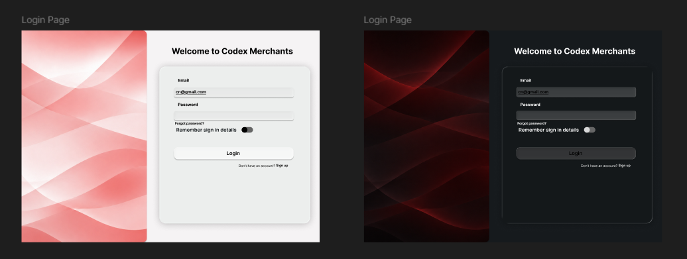
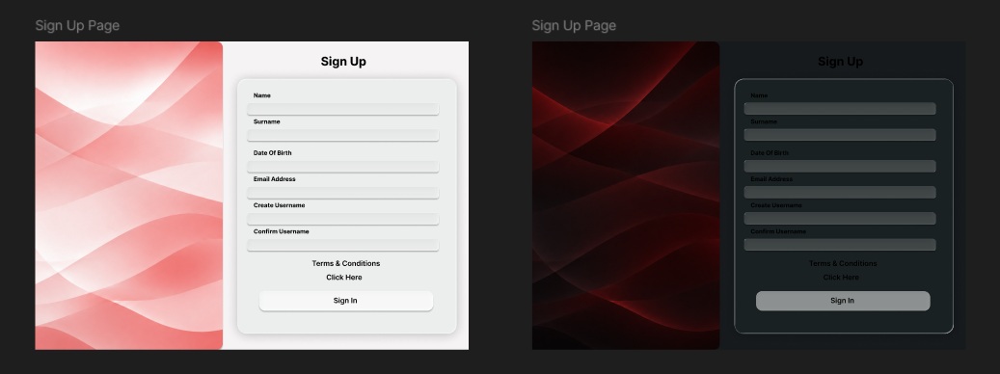
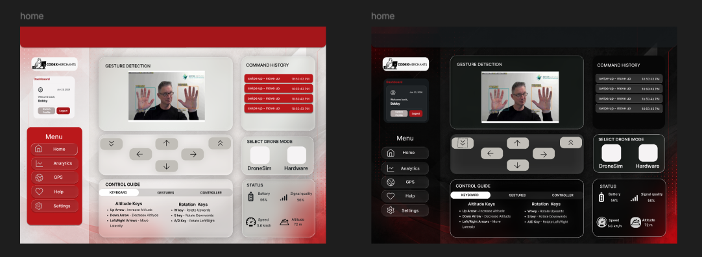
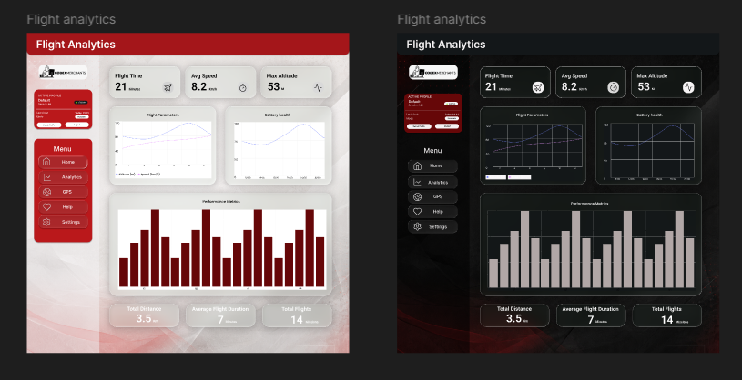
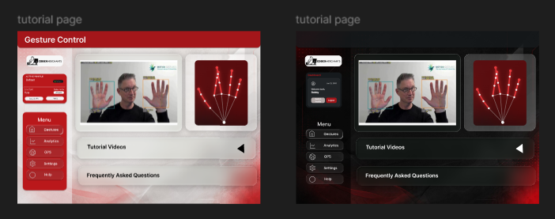

# Brand & Design System

<div class="tx-badges">
  <span class="tx-status"><span class="tx-status__dot"></span>Demo 2 — v2.1</span>
  <span class="tx-status">Accessibility · WCAG 2.2 AA target</span>
  <span class="tx-status">Tokens · canonical in this document</span>
</div>

!!! abstract "What this document covers"
    The Brand & Design System for the **Gesture-Based Drone Control
    System (GBDCS)**. By Demo 2 the system has progressed from
    wireframes to a working implementation, and the visual language
    has matured accordingly. This document is both a **brand guide**
    (palette, logo, voice) and a **design system** (tokens,
    components, layout, accessibility). It is served as a
    first-class page on the project documentation site and is the
    canonical source for visual decisions across the implementation.

!!! note "Demo-2 alignment"
    Several deliverable expectations from the Demo 2 brief land
    on this document. Items still in flight at the time of writing
    are tagged. They include the standalone
    deployed style-guide page alongside the production app, the
    additional logo variants beyond the primary mark, and the
    self-hosting of the font payload.

---

## 1. Brand Story

GBDCS sits at the intersection of accessibility and aviation: it lets
anyone fly a drone with the wave of a hand. The brand has to land in
that intersection — **disciplined enough to be trusted around real
flight hardware, approachable enough to feel like the first thing a
new operator wants to try**.

| Brand pillar | Translation into design |
| --- | --- |
| **Accessible by default** | High-contrast palette anchored on red against off-black; sans-serif typography at generous body sizes; WCAG 2.2 AA on every surface. |
| **Real-time and alive** | Motion is used to confirm system liveness — pulses on the gesture indicator, fade-in on telemetry frames — never as decoration. |
| **Confident, not flashy** | Single dominant colour (red), minimal gradients, no drop shadows on the logo, no extraneous chrome. |
| **Operator-first** | Information density tuned for a pilot who is also gesturing — large hit targets, peripheral-vision-friendly alert colours, no modals interrupting flight. |

---

## 2. Colour Palette

The palette is anchored on a red core (the action colour), an
off-black surface in dark mode, off-white surface in light mode and a translucent "glass" layer used across cards, panels and navigation.. Accent semantic
colours are added only for **success**, **warning**, **info** and **error**
states.

### 2.1 Core palette

| Role | Token | Dark (default) | Light (`data-theme="light"`) | Usage |
| --- | --- | --- | --- | --- |
| Background | `--bg` | `#0B090A` | `#F5F3F4` | Page background. |
| Surface | `--surface` | `#161A1D` | `#FFFFFF` | Raised, non-glass surfaces. |
| Ink (text) | `--ink` | `#F5F3F4` | `#0B090A` | Primary text. |
| Muted | `--dim` | `#B1A7A6` | `rgba(11,9,10,0.55)` | Captions, placeholders, secondary text. |
| Hairline | `--line` | `rgba(211,211,211,0.14)` | `rgba(11,9,10,0.14)` | Dividers, FAQ list rules. |
| Primary | `--red` | `#E5383B` | `#BA181B` | Primary buttons, links, active states, brand accent. |
| Primary (deep) | `--red-deep` | `#BA181B` | `#A4161A` | Gradient partner for `--red` on primary buttons/CTAs. |
| Primary (shadow) | `--red-shadow` | `#660708` | `#E5383B` | Third stop in red-family gradients and pressed shadows. |
| Glow | `--glow` | `rgba(229,56,59,0.8)` | `rgba(186,24,27,0.45)` | Ambient glow on status dots and CTA shadows. |

### 2.2 Glass tokens

| Token | Dark (default) | Light | Usage |
| --- | --- | --- | --- |
| `--panel` | `rgba(22,26,29,0.55)` | `rgba(255,255,255,0.6)` | Solid-ish fallback panel colour. |
| `--nav` | `rgba(11,9,10,0.72)` | `rgba(245,243,244,0.78)` | Nav / sidebar backing layer. |
| `--glass` | `rgba(255,255,255,0.06)` | `rgba(255,255,255,0.55)` | Glass gradient stop 1. |
| `--glass-2` | `rgba(255,255,255,0.015)` | `rgba(255,255,255,0.22)` | Glass gradient stop 2. |
| `--glass-brd` | `rgba(255,255,255,0.13)` | `rgba(11,9,10,0.1)` | Glass border colour. |
| `--glass-hi` | `rgba(255,255,255,0.1)` | `rgba(255,255,255,0.9)` | Inset top highlight on glass surfaces. |
| `--glass-shadow` | `0 12px 40px rgba(0,0,0,0.45)` | `0 10px 30px rgba(11,9,10,0.1)` | Drop shadow under glass surfaces. |

> **How colours are referenced in code:** Colours live as 
CSS custom properties on `.md-root`, overridden under
`.md-root[data-theme="light"]`. Dark is the default theme
and light mode is opted into by setting `data-theme="light"` on the root element. there are no build-time Tailwind config for this layer, values are runtime CSS variables.

### 2.2 Semantic palette

| Role | Token | HEX | Usage |
| --- | --- | --- | --- |
| Success | `#1B7F3A` | Confirmation toasts, telemetry "OK" pill, take-off complete. |
| Warning | `#C77700` | Battery 15–25 %, link flapping, soft failsafe. |
| Error | `#A4161A` | Critical alerts, validation errors, emergency-stop activation. (Re-uses primary red on purpose — failure is a system-level state.) |
| Info | `#1F6FB3` | Tutorial overlays, help menu highlights. |

### 2.3 WCAG 2.2 contrast ratios

All foreground / background pairings used in the production UI are
designed to meet WCAG 2.2 AA at a minimum, with AAA achieved for body
text on both themes. The values below are the design-time ratios; an
automated audit (§8.6) verifies them per build.

| Foreground | Background | Ratio | Level | Use |
| --- | --- | --- | --- | --- |
| `--ink` `#F5F3F4` | `--bg` `#0B090A` | **~18.0 : 1** | AAA | Body text, dark mode. |
| `--ink` `#0B090A` | `--bg` `#F5F3F4` | **~18.0 : 1** | AAA | Body text, light mode. |
| `--red` `#E5383B` | `--bg` `#0B090A` | **~4.7 : 1** | AA | Links, active states, dark mode. |
| `--red` `#BA181B` | `--bg` `#F5F3F4` | **~5.9 : 1** | AA | Links, active states, light mode. |
| `--dim` `#B1A7A6` | `--bg` `#0B090A` | **~8.5 : 1** | AAA | Captions, placeholders, dark mode. |
| `--dim` (blended) | `--bg` `#F5F3F4` | **~4.3 : 1** | AA — large text / UI only | Captions, placeholders, light mode. |
| `#FFFFFF` label | `--red-deep` `#BA181B` (dark) | **~6.5 : 1** | AAA | Primary button labels, dark mode. |
| `#FFFFFF` label | `--red-deep` `#A4161A` (light) | **~7.8 : 1** | AAA | Primary button labels, light mode. |

> **Open item:** `--dim` on the light mode background sits just under
> the AA threshold for normal body text (~4.3:1 against the 4.5:1
> bar). Its fine for large text, captions set at 14px+/500 weight,
> and UI chrome (3:1 bar), but should not be used for small
> long-form body copy in light mode until bumped - same category of
> issue as the muted-grey flag in the previous palette.


### 2.4 Usage rules

- **Red is the action colour.** Reserve it for primary buttons,
  links, and active states. Don't use it for decoration.
- **`--bg` is the base surface; glass sits above it.**
  Never place glass-on-glass without a visible gap.
- **Muted (`--dim`) carries hierarchy.** Captions, placeholders, and
  disabled states use it; avoid using it for primary body text in
  light mode.
- **Semantic colours are reserved for state.** A green pill always
  means "OK"; an amber pill always means "warning". Never use them
  for emphasis.
- **The spotlight glow is a hover-only affordance**, not a static
  decodation. It should only render while the cursor is over the element.

---

## 3. Typography

The system uses a two-family stack for UI, a dedicated display for headings,
and a monospace for numbers, telemetry readouts, and
code blocks.

### 3.1 Families

| Role | Family | Fallback stack | Source | Licence |
| --- | --- | --- | --- | --- |
| Display / headings (`h1`–`h3`) | **Chakra Petch** (weights 400–700) | `"Space Grotesk", sans-serif` | Google Fonts (self-hosting *planned*) | SIL Open Font Licence 1.1 |
| UI / body | **Space Grotesk** (weights 400–600) | `system-ui, sans-serif` | Google Fonts (self-hosting *planned*) | SIL OFL 1.1 |
| Monospace | **JetBrains Mono** (weights 400–500) | `ui-monospace, Consolas, monospace` | Google Fonts (self-hosting *planned*) | Apache 2.0 |


Self-hosting (rather than the Google Fonts CDN) is planned 
and aligns with the SRS `R8.2` posture — no runtime
telemetry to external services. Until that lands, the fonts are
loaded via @import at build time.

### 3.2 Typographic scale

A modular scale at ratio 1.2 anchored on 16 px body.

| Token | Size | Line height | Weight | Letter spacing | Use |
| --- | --- | --- | --- | --- | --- |
| `h1`/`h2` (section) | `clamp(1.9rem, 4.4vw, 3.4rem)` | 1.05 | 600 | normal | Page titles, section headings. |
| `h3` | 20 px / 1.25 rem | 1.05 | 600 | normal | Card titles. |
| Eyebrow | 11 px | 1.2 | 500 | 0.28em | Kicker label above a headline, mono, red. |
| Body (`p`) | 15 px / 0.95 rem | 1.6 | 400 | normal | Default paragraph text. |
| small | 14 px / 0.85 rem | – | 400 | normal | Secondary / helper paragraph text. |
| Code / mono | 12–14 px | – | 400–500 | normal | Telemetry numbers, command tags, code. |

> All `h1`–`h3` elements share the Chakra Petch family and a tight 1.05 line-height
 as set in `index.css`. Meaning headings can run large, so the tighter leading keeps
 multi-line headings from feeling loose.

### 3.3 Weights used

400 (regular), 500 (medium), 600 (semibold), 700 (bold). The team
does not ship 300, 800, or 900 — they would tempt overuse of
decorative weights and increase the font payload.

---

## 4. Logo & Iconography

### 4.1 Logo

The Codex Merchants logo currently ships in one form.

| Form | File | Use | Status |
| --- | --- | --- | --- |
| Full (colour) | `assets/codex_merchants_logo.png` | Default. README, docs site header, landing-page hero. | Available |
| Monogram | `assets/codex_merchants_mark.png` | Tight spaces — favicon, browser tab, app icon, ≤ 32 px usage. | Available |
| Monochrome | `assets/codex_merchants_mono.png` | Print, single-colour contexts. | Available |
| Inverse | `assets/codex_merchants_inverse.png` | On red brand surfaces only. | Available |

#### 4.1.1 Minimum size & clear space

- Full logo: minimum **120 px wide** on screen.
- Monogram (once published): minimum **24 px wide**.
- Clear space around the logo: at least the height of the monogram
  on all four sides. Other elements may not enter this zone.

#### 4.1.2 Forbidden treatments

- Stretching or skewing the logo to fit a frame.
- Recolouring outside of the four documented forms.
- Applying drop shadows, glows, or strokes.
- Placing the logo on a busy photograph without a solid backing.
- Rotating the logo at any angle other than 0°.

### 4.2 Iconography

The system uses **[Lucide](https://lucide.dev/)** as the single icon
library (MIT-licensed).

| Property | Rule |
| --- | --- |
| Default stroke width | `1.75 px` (Lucide default is 2 px; we run lighter for visual harmony with Inter). |
| Default size | `20 × 20 px` inline; `24 × 24 px` standalone in buttons; `32 × 32 px` for empty-state illustrations. |
| Colour | `currentColor` — icons inherit the surrounding text colour. |
| Accessibility | Standalone icon buttons must carry an `aria-label`. Decorative icons must have `aria-hidden="true"`. |

Custom illustrations (e.g. the hand-gesture vocabulary card) are
drawn in the same 1.75 px stroke, `--ink` on `--bg`, to sit
naturally next to Lucide icons and glass surfaces.

---

## 5. Design Tokens

Tokens are the single source of truth for visual properties. The implementation lives in `tailwind.config.js` — this document reflects those values exactly. Drift between the guide and the code is treated as a bug.

### 5.1 Colour tokens

See §2 for values and dark/light pairs.

### 5.2 Spacing scale

| Token | Value | Use |
| --- | --- | --- |
| `xs` | 0.5 rem (8 px) | Tight grouping; icon to label. |
| `sm` | 1 rem (16 px) | Form-field internal padding, list-item gap. |
| `md` | 1.5 rem (24 px) | Card padding, section gap. |
| `lg` | 2 rem (32 px) | Major section divider. |
| `xl` | 3 rem (48 px) | Landing-page section padding, hero padding. |

### 5.3 Radius
 
| Token | Value | Use |
| --- | --- | --- |
| `sm` | 8 px | `.md-cmd`, `.md-dlext`, `.md-modechip`, `.md-sbtheme`. |
| `md` | 12 px | `.md-sbtab` (left corners only). |
| `lg` | 14 px | `.md-telemetry`. |
| `xl` | 16 px | `.md-panel`, `.md-card`, `.md-node`, `.md-mode`, `.md-dlcard`, `.md-screen`. |
| `2xl` | 20 px | `.md-sidebar` (left corners only). |
| `pill` | 999 px | `.md-chips li`. |

Radius values are component-specific under the glass system rather
than a flat numeric scale. see §6 for which toke applies where.

### 5.4 Shadow & glass
 
| Token | Value | Use |
| --- | --- | --- |
| `--glass-shadow` (dark) | `0 12px 40px rgba(0,0,0,0.45)` | Drop shadow under every glass surface. |
| `--glass-shadow` (light) | `0 10px 30px rgba(11,9,10,0.1)` | Same, light mode. |
| Inset highlight | `inset 0 1px 0 var(--glass-hi)` | Paired with the drop shadow on all glass surfaces — reads as a frosted top edge. |
| Hover glow | `0 0 24px rgba(229,56,59,0.16)` | Added to the shadow stack on `.md-card`/`.md-node`/`.md-mode`/`.md-dlcard`/`.md-screen` hover, alongside a border colour shift to `--red`. |
| Backdrop blur | `10px`–`26px` + `saturate(140–150%)` | Scales with surface size — see §6 component table. |

### 5.5 Motion

Motion is functional, not decorative.
 
| Name | Behaviour | Duration | Use |
| --- | --- | --- | --- |
| `.md-ltr` (`md-rise` keyframes) | Rises 0.55em, blur(8px) → 0, fades in | 0.8 s, `cubic-bezier(0.2,0.75,0.25,1)` | Hero eyebrow / headline entrance on load. |
| `.md-reveal` / `.md-reveal.md-in` | Translate 28px → 0 + fade, staggerable via `--rd` | 0.8 s | Scroll-triggered section reveals. |
| `md-pulse` (keyframes) | Opacity 0.35 ↔ 1 | 2 s (paired usage) | Live-status pulsing, gesture indicator heartbeat. |
| `.md-magnet` | Transform shift toward cursor (values set via JS) | 0.22 s, cubic-bezier ease-out | "Magnetic" hover on buttons/icons. |
| `animate-spin` | Loading spinner | 1 s linear | Loading state on primary buttons. |
 
All motion respects `prefers-reduced-motion: reduce` — animations and transitions are
disabled outright (not just shortened), and `.md-reveal`/`.md-ltr` snap directly to 
their resting, visible, untransformed state.

All motion respects `prefers-reduced-motion: reduce` — animations
collapse to a 0 ms duration when the user has requested reduced
motion. The gesture pulse on the dashboard fades to a static badge
in this mode.

```css
@media (prefers-reduced-motion: reduce) {
  *, *::before, *::after {
    animation-duration: 0.01ms !important;
    animation-iteration-count: 1 !important;
    transition-duration: 0.01ms !important;
  }
}
```

> `0.01ms` rather than `0ms` is intentional — it avoids a flash-of-unstyled-content on some browsers while still being imperceptibly fast.

### 5.6 Breakpoints

Tailwind defaults are in use (no custom breakpoints defined in `tailwind.config.js`).

| Token | Value | Target |
| --- | --- | --- |
| `sm:` | 640 px | Mobile landscape, small tablets. |
| `md:` | 768 px | Tablets. |
| `lg:` | 1024 px | Laptops; the dashboard's primary target. |
| `xl:` | 1280 px | Desktop. |
| `2xl:` | 1536 px | Operator workstation, large monitors. |

### 5.7 Backdrop blur
 
Defined in `tailwind.config.js` under `theme.extend.backdropBlur`.
 
| Token | Value | Use |
|---|---|---|
| `xs` | 2 px | Subtle frosting. |
| `sm` | 4 px | Light glass panels. |
| `md` | 12 px | Modal backdrops. |
| `lg` | 16 px | Dashboard overlays. |
| `xl` | 24 px | Full-screen glass. |

---

## 6. Component Library

Visual specifications for every component used in the production
system. 
### 6.1 Button

| Variant | Background | Text | Use |
| --- | --- | --- | --- |
| Primary | `bg-Red` → `hover:bg-LightRed` | `text-OffWhite` | The main action on a screen. Exactly one per view. |
| Secondary | `bg-transperant border border-Red` | `text-Red` | Auxiliary action next to a primary. |
| Ghost | `bg-transperant` no border | `text-OffWhite` | Tertiary action; toolbars. |
| Danger | `bg-Red`(same as primary) | `text-OffWhite` | Destructive action (emergency stop, delete session). |

**Sizes.** sm (32 px height), md (40 px, default), lg (48 px,
landing-page CTAs).

**States.**

- Default — flat fill at the listed colours.
- Hover — fill steps to `LightRed`; `shadow-md`.
- Focus — `ring-2 ring-Red ring-opacity-40` (3 px equivalent).
- Active — fill steps to `DarkRed`.
- Disabled — `opacity-50`; `cursor-not-allowed`; no hover effect.
- Loading — replace label with a 16 px spinner; button width
  preserved; click events suppressed.

### 6.2 Input (text, email, password)

| Property | Value |
| --- | --- |
| Height | 40 px |
| Padding | `px-3` (0.75 rem) horizontal |
| Border | `border border-DarkGrey` |
| Background | `bg-OffWhite` (light) / `bg-white/4` (dark) |
| Focus ring | `focus:ring-2 focus:ring-Red/40` (achieved via Tailwind, `outline: none' is set globally in `index.css` ) |
| Error border | `border-Red`; helper text below in `text-Red` |

### 6.3 Select / Dropdown

Same shape as the Input. Caret is a Lucide `chevron-down` at 16 px.
Open state shows a panel with `shadow-lg` and `rounded-md`.

### 6.4 Modal

| Property | Value |
| --- | --- |
| Width | up to 560 px (`max-w-lg`) |
| Backdrop | `bg-OffBlack/60 backdrop-blur-md` |
| Surface | `bg-OffWhite` (light) / ` bg-OffBlack` (dark) |
| Radius | `rounded-xl` |
| Shadow | `shadow-xl` |
| Open duration | `animate` utilities / `transition` (respects `prefers-reduced-motion `) |
| Escape key | Closes the modal; focus returns to the trigger. |

### 6.5 Toast

| Variant | Surface | Border |
| --- | --- | --- |
| Success |`bg-green-600/12` | `border border-green-600` |
| Warning | `bg-yellow-600/12` | `border border-yellow-600` |
| Error | `bg-Red/12` | `border border-Red` |
| Info | `bg-blue-600/12` | `border border-blue-600`|

Toasts auto-dismiss after 5 s (warning) or 8 s (error). Critical
alerts (link loss, battery < 15 %) **do not auto-dismiss** — they
remain until acknowledged per `R1.2.2`.

### 6.6 Card

`rounded-lg shadow-sm` at rest, `shadow-md` on hover, padded
with `p-sm` (1 rem). The telemetry panel, gesture-indicator panel, and
session-list rows on the replay view are all Cards.

### 6.7 Gesture Indicator (domain-specific)

A 96 × 96 px circular badge in the top-right of the dashboard,
filled with `bg-Red` when a gesture is locked. Pulses at
`animate-pulse` when the gesture changes; static in
`prefers-reduced-motion`. The current gesture name and its mapped
command sit immediately below.

### 6.8 Telemetry Pill

A pill (`rounded-full`) carrying the link status, flight mode, or
battery percentage. Background is the matching semantic colour at
12 % opacity; foreground is the matching semantic colour at full
opacity.

---

## 7. Layout & Spacing

### 7.1 Grid

Tailwind's built-in 12-column grid (`grid grid-cols-12`) with a 'gap-md` (1.5 rem / 24 px) gutter on screens >= `md: `and `gap-sm` ( 1rem / 16 px) below.

### 7.2 Responsive behaviour

| Surface | < `m:` (768 px) | ≥ `md:` | ≥ `g:` (1024 px) |
| --- | --- | --- | --- |
| Landing page | single column, hero stacks vertically | two-column feature grid | three-column feature grid |
| Dashboard | video feed stacks above telemetry; gesture indicator floats top-right | side-by-side video and telemetry | full layout: feed + overlay + telemetry + replay timeline |
| Replay view | session list collapses behind a drawer | session list as left sidebar | session list + waveform + telemetry chart |

### 7.3 Spacing rules

- Inside a card: padding is `p-sm` (1 rem); gap between elements is
  `gap-xs`(1.5 rem).
- Between cards in a grid: gap is `gap-md` (1.5 rem).
- Page-level horizontal padding: `px-sm` on mobile, `px-lg`
  on tablet, `px-xl` on desktop.

---

## 8. Accessibility

GBDCS targets **WCAG 2.2 AA** as the minimum on every surface.
AAA is achieved for body-text contrast on both themes.

### 8.1 Keyboard navigation

- Every interactive element is reachable by `Tab` in document order.
- Modals trap focus; `Esc` closes them and returns focus to the
  trigger.
- The emergency-stop button has a global keybinding (`Ctrl+.`) so
  it never depends on focus state.

### 8.2 Focus indicator

A 3 px `ring-2 ring-Red/40` ring on every focusable element. The
ring is **never** suppressed by `outline: none` without an
equivalent visual replacement.

### 8.3 Screen readers

- Every `aria-label` is human-readable, not a token name.
- The live gesture indicator carries `aria-live="polite"` so a
  screen reader announces gesture changes without interrupting.
- The critical-alert region carries `aria-live="assertive"`.
- All form fields have associated `<label>` elements; placeholders
  are *not* used as labels.

### 8.4 Motion

The system honours `prefers-reduced-motion: reduce`. All animations
defined in §5.5 collapse to 0 ms; the gesture pulse becomes a static
badge.

### 8.5 Colour

No information is conveyed by colour alone. Alerts also carry an
icon and a text label; telemetry pills carry a text value alongside
the colour.

### 8.6 Audit targets


| Surface | Tool | Target | Status |
| --- | --- | --- | --- |
| Landing page | Lighthouse Accessibility | ≥ 90 | *Audit pending* |
| Dashboard | axe DevTools | 0 violations | *Audit pending* |
| Help menu | WAVE | 0 errors, 0 contrast errors | *Audit pending* |


---

## 9. Voice & Tone

GBDCS speaks to pilots. The voice is **calm, direct, and specific**.

| Surface | Tone | Example |
| --- | --- | --- |
| Button labels | Imperative verb, ≤ 3 words. | *"Take off"*, *"End session"*, *"Stop now"*. |
| Empty states | Friendly, action-oriented. | *"No sessions yet — start a flight to see your history here."* |
| Success messages | Quiet confirmation. | *"Drone connected."* (Avoid: *"🎉 Successfully connected to drone!"* — too loud for an operational surface.) |
| Errors | Cause first, then suggestion. | *"Camera not detected. Connect a webcam or check your browser permissions."* (cause + suggestion, per `R11.3`.) |
| Critical alerts | Telegraphic, urgent, never alarmist. | *"Link lost. Hovering until link returns."* |

Tone is **never jokey** in the operational paths. The Help menu and
landing page may be warmer, but the dashboard itself stays
professional — an operator in flight does not want a system that's
trying to be funny.

---

## 10. Changelog from Demo 1

| Area | Demo 1 | Demo 2 | Rationale |
| --- | --- | --- | --- |
| Format | Brand section inside the (now-retired) `DESIGN.md` | Standalone document on the docs site; canonical reference for visual decisions | The retired `DESIGN.md` mixed brand and software-design content; splitting it gives each its own deliverable. A separately deployed live style-guide page alongside the app is *planned for Demo 2*. |
| Palette | 7 colours (3 reds, off-black, 3 neutrals) | Same 7 + 4 semantic colours (success, warning, error, info) with full WCAG audit | The early UI lacked formal state colours; adding them gave the dashboard a vocabulary for telemetry and alerts. |
| Typography | "Use a sans-serif" | Inter + Inter Display + JetBrains Mono with a 1.2 modular scale and named tokens | Implementation needed concrete sizes; the modular scale eliminated ad-hoc font sizes in code. |
| Tokens | Implicit in code | Documented in §5 with the canonical names used by the CSS layer | Drift between docs and code was happening; making the document the canonical source makes drift visible. |
| Components | Wireframes only | Full component spec (button, input, select, modal, toast, card, gesture indicator, telemetry pill) with all states | The system now exists, so the components have variants and states worth documenting. |
| Accessibility | Not formally addressed | WCAG 2.2 AA conformance target with audit targets and per-PR automation planned | Mentor feedback after Demo 1 flagged a11y as a gap; targets and audit cadence are now explicit. |
| Voice & tone | Absent | Added §9 with examples per surface | Several Demo 1 error messages were unclear; making the tone rules explicit fixed the inconsistency. |
| Iconography | "Lucide" mentioned in passing | Stroke width, sizing rules, ARIA rules, custom-illustration alignment | The Demo 1 iconography varied by view; the rules in §4.2 enforce a single visual language. |
| Motion | Not addressed | Three named durations + `prefers-reduced-motion` rule | The dashboard's gesture pulse made some Demo 1 reviewers motion-sick; the reduced-motion rule resolves that. |

---

## 11. Wireframes

The two operator-facing surfaces. Both realise the requirements
cited in their captions.

=== "Login Page"

    

    *Figure 11.1 - Operator Authentication (UC-4, R16.1.3).Left panel with brand imagery; right form with email, password, remember me toggle and a sign up link.*

=== "Signup Page"

    

    *Figure 11.2 - New user registration (R16.1.1, R16.1.2).Mirrors login layout with additional fields: first name, last name , date of birth, password,password confirmation , terms acceptance.*

=== "Gesture Dashboard"

    

    *Figure 11.3 - Live gesture control and telemetry (UC-1,R1.1.1-R1.1.3).Left sidebar with menu ;centre live video feed with hand-landmark overlay; right panels for gesture detection, command history, control guide, and status indicators.*

=== "Analytics Page"

    

    *Figure 11.4 - Telemetry history and flight metrics (UC-2, R1.1.3). Key stats (flight time , avg speed, max altitude) at top; flight movements and battery health charts; performance metrices bar chart; summary pills for total distance, average duration and flight count.*

=== "Tutorial Page"

    

    *Figure 11.5 - User Tutorial (UC-7).central to left shows the live camera feed where users can try out the gestures that are shown in gif formats on the central to right side of the screen.Collapsible sections for tutorial videos and frequently asked questions are below it*

  

