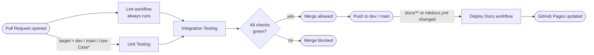

# CI/CD Pipeline

<div class="tx-badges">
  <span class="tx-status"><span class="tx-status__dot"></span>3 workflows · 7 jobs</span>
  <span class="tx-status">Runner · GitHub Actions</span>
  <span class="tx-status">Deploy · GitHub Pages</span>
</div>

!!! abstract "What this document covers"
    Continuous Integration and Continuous Deployment for the
    Gesture-Based Drone Control System. The pipeline enforces the
    quality gates defined in the [SRS](SRS.md#r15-process--documentation)
    (`R15.*`) and the [Project Plan's Definition of Done](PLAN.md#3-definition-of-ready--definition-of-done).
    It is the *gate* that the Git workflow defined in [`GIT.md`](GIT.md)
    pushes every change through.

---

## 1. Overview

The pipeline lives entirely in GitHub Actions and is split across three
workflow files in `.github/workflows/`:

| Workflow | File | Trigger | Purpose |
| --- | --- | --- | --- |
| **Lint** | `lint.yml` | PR to any branch | Style and static-analysis checks on every PR. |
| **Test** | `test.yml` | PR to `dev`, `main`, or `Use-Case*` | Unit and end-to-end tests before integration. |
| **Deploy Docs** | `docs.yml` | Push to `main` or `dev` (paths: `docs/**`, `mkdocs.yml`) | Build and publish the MkDocs site to GitHub Pages. |

The asymmetry between lint and test triggers is deliberate: lint is cheap
and runs on *every* PR (including feature-to-Use-Case PRs); the more
expensive test workflow runs only when a PR targets a long-lived branch
(`dev`, `main`, or a `Use-Case*` integration branch).

### 1.1 Pipeline at a glance



*Figure 1.1 — End-to-end CI/CD flow.*

---

## 2. Lint Workflow

**File:** `.github/workflows/lint.yml`

Lint runs three jobs in parallel — one per top-level codebase. Each job
times out after **5 minutes** to keep PR feedback fast.

| Job | Working directory | Tooling | Command |
| --- | --- | --- | --- |
| `lint` | `Project Root` | Python 3.11 · `uv` 0.11.13 · Ruff and Node 22.22.0 · Yarn (frozen lockfile) · ESLint · Prettier | `task lint` |

!!! tip "Why `uv`?"
    `uv` is used in place of `pip` for the Python jobs because it
    installs dependencies an order of magnitude faster and supports the
    `enable-cache: true` flag in the setup-uv action, which keeps the
    install step under a few seconds on warm cache.

### 2.1 What "fail fast" means here

Ruff and ESLint are configured to fail the job on the first violation —
not just warn. Prettier is checked in `--check` mode, so any unformatted
file fails the job. The team's expectation is: **format locally before
pushing**, not "let CI tell me what's wrong".

---

## 3. Test Workflow

**File:** `.github/workflows/test.yml`

Test runs three jobs in parallel, each with a **10-minute** timeout.

| Job | Working directory | Tooling | Command |
| --- | --- | --- | --- |
| `Backend-Unit-Tests` | `Project Root` | Python 3.11 · `uv` · pytest | `task backend-unit-test` |
| `Frontend-Unit-Tests` | `services` | Node 22.22.0 · Yarn · Playwright | `yarn test` |
| `Integration-Tests` | `Project Root` | Python 3.11 · `uv` · pytest | `task integration-test` |

### 3.1 Playwright browser caching

The frontend job caches Playwright's browser binaries under
`~/.cache/ms-playwright`, keyed by `runner.os` and the hash of
`yarn.lock`. On a cache hit the browser-install step is skipped; on a
miss the job runs `npx playwright install --with-deps` and the cache is
populated for the next run. This is the largest single saving in the
pipeline — installing Chromium / WebKit / Firefox cold costs several
minutes per run.

### 3.2 What runs locally vs. in CI

The same Taskfile targets and yarn scripts that CI invokes are available
locally:

```bash
# Backend
task backend-unit-test

# Frontend
cd apps/frontend && yarn test

#Integration 
task integration-test
```
Before executing any tests the repository must be correctly installed using
```bash
task install
```

If a test passes locally but fails in CI, the cause is almost always a
missing dependency in `requirements.txt` / `pyproject.toml` or
`package.json`, or a hard-coded local path. See
[§7 Troubleshooting](#7-troubleshooting).

---

## 4. Deploy Docs Workflow

**File:** `.github/workflows/docs.yml`

Documentation deployment is **push-triggered**, not PR-triggered, and
runs only when files under `docs/**` or `mkdocs.yml` change on `main`
or `dev`. This satisfies `R15.1` (docs published automatically on push
to `main` and `dev`).

| Step | What it does |
| --- | --- |
| `actions/checkout@v4` with `fetch-depth: 0` | Full history is required for the `git-revision-date-localized` plugin to compute per-page "last updated" timestamps. |
| `actions/setup-python@v5` | Python 3.11 with pip cache. |
| Install MkDocs + plugins | `mkdocs`, `mkdocs-material`, `mkdocs-git-revision-date-localized-plugin`, `pymdown-extensions`, `pillow`, `cairosvg`. |
| Configure Git identity | Required so `mkdocs gh-deploy` can push to the `gh-pages` branch. |
| `mkdocs gh-deploy --force --clean --verbose` | Builds the site and force-pushes it to `gh-pages`, where GitHub Pages serves it. |

Authentication uses the workflow-provided `GITHUB_TOKEN` — no custom
`GH_PAGES_TOKEN` is needed. The required permissions (`contents: write`,
`pages: write`, `id-token: write`) are declared inside `docs.yml`
itself.

### 4.1 Where the site is published

The deployed site is hosted at
[`cos301-se-2026.github.io/Gesture-Based-Drone-Control`](https://cos301-se-2026.github.io/Gesture-Based-Drone-Control/).

---

## 5. Branch Protection &amp; Required Checks

The CI/CD pipeline is only meaningful if `dev` and `main` cannot be
pushed to directly. The repository enforces:

- `main` &mdash; protected. Direct pushes disabled. Requires PR, at
  least one approving review, and **all required checks green**.
- `dev` &mdash; protected. Direct pushes disabled. Requires PR and all
  required checks green.
- `Use-Case*` branches &mdash; protected but more permissive: PRs may be
  merged with the lint workflow green (test workflow runs but is not
  required on every PR into a Use-Case branch, so feature-to-UC merges
  are not blocked by an unrelated test failure).

Required status checks for a PR into `dev` or `main`:

- `lint`
- `Backend-Unit-Tests`, `Frontend-Unit-Tests`, `Integration-Tests`

The exact list of required checks is configured under
*Settings → Branches → Branch protection rules* on GitHub and should
match the job names above verbatim.

---

## 6. Local Workflow

Before opening a PR, every team member is expected to reproduce the CI
checks locally so that the pipeline is a safety net, not a primary
discovery mechanism.

The following steps do assume you have correctly installed the repo using
```bash
  task install
```

=== "Linting"
  ```bash
  task lint
  ```

=== "Backend Unit Testing"

    ```bash
    task backend-unit-test             # pytest
    ```

=== "Frontend (TypeScript / React)"

    ```bash
    cd apps/frontend
    yarn test             # Playwright
    ```

=== "Integration Tests"

```bash
task integration-test
```

=== "Docs site"

    ```bash
    # From repo root
    pip install mkdocs mkdocs-material \
                mkdocs-git-revision-date-localized-plugin \
                pymdown-extensions pillow cairosvg
    mkdocs serve
    # Site available at http://127.0.0.1:8000/
    ```

---

## 7. Troubleshooting

| Symptom | Likely cause | Resolution |
| --- | --- | --- |
| Lint fails on clean-looking code | Prettier hasn't been run | `yarn format` (auto-fix) then re-push. |
| Ruff complains about an import on CI but not locally | Local virtualenv has an extra dep that masks the violation | Reproduce in a fresh checkout; add the missing rule to `pyproject.toml`. |
| Tests pass locally, fail in CI | Missing dependency in `requirements.txt` / `pyproject.toml` / `package.json`, or local-only env var | Compare `uv.lock` / `yarn.lock` against what's installed; check `.env.example`. |
| Playwright fails with *"browser not installed"* | Cache key changed and the install step was skipped | Bust the cache by editing the key in `test.yml`, or run `npx playwright install --with-deps` manually. |
| Docs build fails on `--strict` | Broken internal link or missing image | Run `mkdocs build --strict` locally; the failing path will be in the error. |
| Docs push succeeds but site doesn't update | GitHub Pages is configured to serve from the wrong branch | *Settings → Pages → Source = `gh-pages` / `(root)`*. |
| Job stuck at "Queued" for &gt; 5 minutes | GitHub Actions runner shortage | Wait, or cancel and re-trigger the workflow. |

---

## 8. Adding a New Job

If a future module (e.g. mobile builds, AirSim adapter integration tests)
needs its own CI job, the recipe is:

1. Add the job under the appropriate workflow file (`lint.yml` or
   `test.yml`).
2. Set `working-directory` to the new module's folder.
3. Reuse the existing `setup-uv` + `setup-python` (or `setup-node`)
   blocks for consistency.
4. Add a 5-minute timeout for lint, 10-minute for test (override if the
   job genuinely needs longer).
5. Update §2 or §3 of *this* document with the new row.
6. If the job should block merges, add it to *Settings → Branches →
   Branch protection rules → Require status checks to pass*.

---
