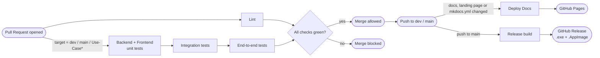

# CI/CD Pipeline

<div class="tx-badges">
  <span class="tx-status"><span class="tx-status__dot"></span>4 workflows · 7 jobs</span>
  <span class="tx-status">Runner · GitHub Actions</span>
  <span class="tx-status">Deploy · GitHub Pages · GitHub Releases</span>
</div>

!!! abstract "What this document covers"
    Continuous Integration and Continuous Deployment for the
    Gesture-Based Drone Control System. The pipeline enforces the
    quality gates defined in the [`POLICY.md`](Policy.md) anf the [Project Plan's DOD](PLAN.md). Every change pushed through the Git workflow in [`GIT.md](GIT.md) passes through it.

---

## 1. Overview

The pipeline lives in GitHub Actions and is split across 4
workflow files in `.github/workflows/`:

| Workflow | File | Trigger | Purpose |
| --- | --- | --- | --- |
| **Lint** | `lint.yml` | PR to any branch | Ruff, ESLint and Prettier checks on every PR. |
| **Test** | `test.yml` | PR to `dev`, `main`, or `Use-Case*` | Unit tests, end-to-end tests and integration tests. |
| **Deploy Docs** | `docs.yml` | Push to `main` or `dev` (paths: `docs/**`, `mkdocs.yml`, `landing_page/**`) | Builds the landing page and MKDocs site, publish both on GitHub Pages. |
| **Releases** | `release.yml` | Push to `main` | Build the packaged desktop app for Windows and Linux and publish a GitHub Release. |

Lint is cheap, so it runs on every PR, including feature-to-Use-Case PRs. The test workflow is more xpesnive and only runs when a PR targets a long-lived branch (`dev`, `main`, or a `Use-Case*` integration branch). Docs and Releases are push-triggered, so they only run after a merge.

### 1.1 Pipeline at a glance



*Figure 1.1 — End-to-end CI/CD flow.*

---

## 2. Lint Workflow

**File:** `.github/workflows/lint.yml`

One job, `lint`, with a **5-minute** timeout. It checks out the repo with submodules, sets up `uv` 0.11.13, Python 3.11 and Task, runs `task install`, then `task lint`. That target runs ruff on the Python codebases and ESLint plus `prettier --check` on the frontend, so one job covers all three codebases

!!! tip Why `uv`?
    `uv` installs dependencies significantly faster than pip/pip3 and supports `enable-cache true` in the setup-cv action, which keeps the install step to a few seconds on a warm cache.

Ruff and ESLint fail the job on any violation, and any unformatted file fails the Prettier check. Format locally before pushing rather than letting CI catch it: `task fix` handles Python and `yarn format` handles the frontend.

---

## 3. Test Workflow

**File:** `.github/workflows/test.yml`

4 jobs. The 2 unit-test jobs run in parallel; integration waits for both, and end-to-end waits for integration.

| Job | Timeout | Working directory | Command |
| --- | --- | --- | --- |
| `Backend-Unit-Tests` | 10 min | repo root | `task backend-unit-test` |
| `Frontend-Unit-Tests` | 60 min| `apps/frontend` | `yarn unit-test` |
| `Integration-Tests` | 10 min | repo root | `task integration-test` |
| `End-To-End-Tests` | 10 min | repo root | `task e2e-test` |

Notes on each:

- **Backend-Unit-Tests** run pytest over `apps/backend/tests` and `services/test` with coverage, and fails if coverage drops below 80% (`--cov-fail-under-80`). 
- **Frontend-Unit-Tests** runs the Playwright unit suite (`playwright.unit.config.ts`), provides a HTML report of what passed and failed if you run it locally.
- **Intergration-Tests** run pytest over `tests/` (auth, database, manager, gesture/calibration, and drone adapter integration tests).
- **End-To-End-Tests** installs both the Python and Node stacks, then runs `task e2e-test` (Playwright, `playwright.e2e.config.ts`, single worker is a must). CI runners have no wecam, so the job sets `GBDC_E2E_NO_CAMERA=1`. Dont remove that variable; the suite fails without it.

### 3.1 Playwright browser caching

The frontend job caches Playwright's browser binaries under
`~/.cache/ms-playwright`, keyed by `runner.os` and the hash of
`yarn.lock`. On a cache hit the browser-install step is skipped; on a
miss the job runs `playwright install --with-deps` and the cache is
populated for the next run. This is the largest single saving in the
pipeline — installing Chromium / Firefox cold costs several
minutes per run.

### 3.2 Running the same checks locally

CI invokes the same Taskfile targets and yarn scripts you have locally. Install first, then run whichever suite you need:

```bash
# Backend
task install               # once, after cloning (run again if devOps changes)

task backend-unit-test     # pytest + coverage
task frontend-unit-test    # Playwright unit suite
task integration-test      # pytest, tests/
task e2e-test              # Playwright end-to-end suite
task test                  # all of the above

```

If a test passes locally but fails in CI, the cause is almost always a
missing dependency in `pyproject.toml` or
`package.json`, or a hard-coded local path. See
[§7 Troubleshooting](#7-troubleshooting).

---

## 4. Deploy Docs Workflow

**File:** `.github/workflows/docs.yml`

Push-triggered on `main` and `dev` and only when `docs/**`, `mkdocs.yml`, `landing_page/**`, or the workflow file itself change. It builds 2 things and publishes them together:

| Step | What it does |
| --- | --- |
| Checkout with `fetch-depth: 0` | Full history is required for the `git-revision-date-localized` plugin to compute per-page "last updated" timestamps. |
| Build landing page | `yarn install --frozen-lockfile` and `yarn build` in `landing_page/` (Node 22). |
| Build docs | Install MkDocs Material + plugins, then `mkdocs build`. |
| Combine | Landing page bundle at the site root, MkDocs output under `/docs`. |
| Deploy | `peaceiris/actions-gh-pages` pushes the combined `deploy/`/ folder to the `gh-pages` branch (`force_orphan: true`). |

Authentication uses the workflow-provided `GITHUB_TOKEN`; the required permissions (`contents`, `pages`, `id-token`) are declared in the workflow itself.

### 4.1 Where the site is published

- Landing page: [cos301-se-2026.github.io/Gesture-Based-Drone-Control]([text](https://cos301-se-2026.github.io/Gesture-Based-Drone-Control/))
- Documentation hub: [cos301-se-2026.github.io/Gesture-Based-Drone-Control/docs]([text](https://cos301-se-2026.github.io/Gesture-Based-Drone-Control/docs/))

---

## 5. Release Workflow

**File:** `.github/workflows/releases.yml`

Runs on every push to `main`. Two stages:

1. **Build** - a matrix job on `windows-latest` and `ubuntu-latest`.
   Each runner does `task install` then `task build`, which packages the backend into a single executable with PyInstaller (bundling MediaPipe, the AirSim client, and the database drivers) and wraps the frontend with electron. Artifacts: windows `.exe` and Linux `.AppImage` from `release/`.
2. **Releases** - reads the version from `apps/frontend/package.json`,     
   downloads both build artifacts, and publishes a GitHub Release tagged `v<version>` with auto-generated release notes.

Bumps the frontend `version` field as part of any PR that should produce a new release; the tag comes straight from it.

---

## 6. Branch Protection & Required checks

`dev` and `main` cannot be pushed to directly.

- `main` - requires a PR, at least one approving review, and all required checks   
   green.
- `dev` - requires a PR and all required checks green.
- `Use-Case*` branches - protected and essentially acts as a "mini" dev to 
   ensure that whatever code pushed to dev is clean working code.

Under no circumstances for any of these branches is that no team member is ever allowed to accept their own PR (blocked already for dev and main) and ci must always pass. `Use-Case*` branches act as a final safety net before pushing code to dev.

## 7. Troubleshooting

| Symptom | Likely cause | Resolution |
| --- | --- | --- |
| Lint fails on clean-looking code | Prettier hasn't been run | `yarn format` (auto-fix) then re-push. |
| Ruff complains about an import on CI but not locally | Local virtualenv has an extra dep that masks the violation | Reproduce in a fresh checkout; add the missing rule to `pyproject.toml`. |
| Tests pass locally, fail in CI | Missing dependency in `pyproject.toml` / `package.json`, or local-only env var | Compare `uv.lock` / `yarn.lock` against what's installed; check `.env.example`. |
| Playwright fails with *"browser not installed"* | Cache key changed and the install step was skipped | Bust the cache by editing the key in `test.yml`, or run `playwright install --with-deps` manually. |
| Docs build fails on `--strict` | Broken internal link or missing image | Run `mkdocs build --strict` locally; the failing path will be in the error. |
| Docs push succeeds but site doesn't update | GitHub Pages is configured to serve from the wrong branch | *Settings → Pages → Source = `gh-pages` / `(root)`*. |
| Job stuck at "Queued" for &gt; 5 minutes | GitHub Actions runner shortage | Wait, or cancel and re-trigger the workflow. |

---

## 8. Adding a New Job

If a future module (e.g. mobile builds, AirSim adapter integration tests)
needs its own CI job, the recipe is:

1. Add the job under the appropriate workflow file (`lint.yml` or
   `test.yml`).
2. Set `working-directory` to the module's folder.
3. Reuse the existing `setup-uv` + `setup-python` (or `setup-node`)
   blocks for consistency.
4. Add a 5-minute timeout for lint jobs, 10-minute for test (override if the
   job genuinely needs longer).
5. Update §2 or §3 or §5 of *this* document with the new row.
6. If the job should block merges, add it to *Settings → Branches →
   Branch protection rules → Require status checks to pass*.

---
