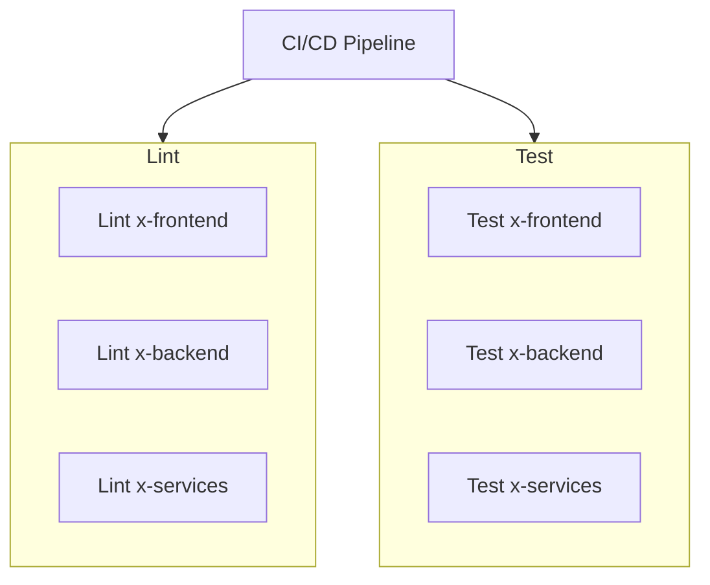

# CI/CD Pipeline

> This Pipeline is responsible for the linting and testing of all code on the repo to ensure code of high quality is committed to the protected branches
 
---

## Table of Contents

- [Overview](#overview)
- [Pipeline Stages](#pipeline-stages)
- [Prerequisites](#prerequisites)
- [Branch Strategy](#branch-strategy)
- [Running Locally](#running-locally)
- [Troubleshooting](#troubleshooting)
- [Contributing](#contributing)

---

## Overview

| Property     | Value                           |
|--------------|---------------------------------|
| CI/CD Tool   | GitHub Actions   |
| Trigger      | Pull Request              |
| Stages       | Lint · Unit Tests · Docs        |

Both lint and Test have three individual jobs to perform their task on the frontend backend and services directories 
These tasks are all run in parrallel to 



---

## Pipeline Stages

### 1. Lint
- Runs on every pull request
- Tools: ESLint, Prettier, Ruff
- Fails fast on violations

### 2. Unit Tests
- Tools: Pytest, Playwright

### 3. MkDocs Build
- Builds documentation site from `docs/`
- Config: `mkdocs.yml`
- On `main`: publishes to <!-- e.g. GitHub Pages via `gh-deploy` -->
- On PRs: build-only check (no publish)

---

## Prerequisites

- [ ] <!-- e.g. Python 3.11+ -->
- [ ] <!-- e.g. Node.js 20+ -->
- [ ] MkDocs installed: `pip install mkdocs-material 

---

## Branch Strategy

```
main              ← stable, docs published here (protected)
  └── dev     ← integration branch (protected)
        └── Use-Case-*  ← use case grouping branches
              └── feature/*   ← feature work
```


---

## Running Locally

```bash
# Install dependencies
# make install

# Run linter
# make lint

# Run unit tests
# make test

# Serve docs locally
mkdocs serve
# Docs available at http://127.0.0.1:8000/Gesture-Based-Drone-Control/CICD/
```

---

## Troubleshooting

| Symptom                        | Likely Cause                    | Resolution                           |
|--------------------------------|---------------------------------|--------------------------------------|
| Lint fails on clean code       | Formatter not run before push   | Run formatter locally and re-push    |
| Tests pass locally, fail in CI | Missing dependency in CI env    | Check `requirements.txt` / lock file |
| MkDocs build fails             | Broken internal link or plugin  | Run `mkdocs build --strict` locally  |
| Docs not publishing            | Missing `GH_PAGES_TOKEN` secret | Add secret in repo settings          |

---

## Contributing

1. Branch from `develop` using the naming convention above.
2. Ensure lint and tests pass locally before opening a PR.
3. MkDocs changes can be previewed with `mkdocs serve`.
4. All checks must pass before merging.

---

