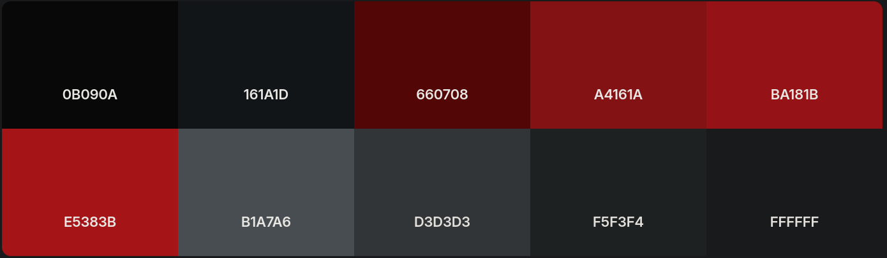
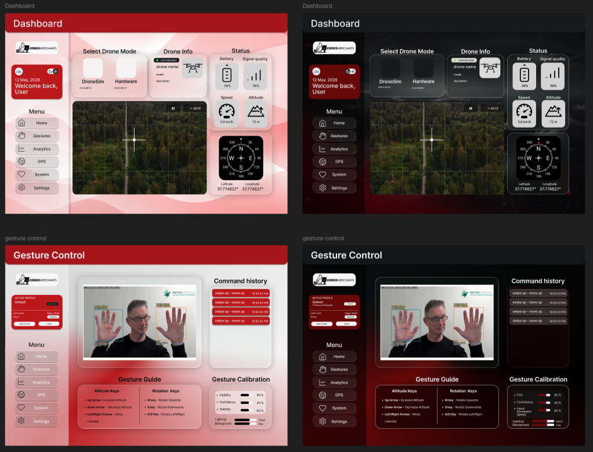
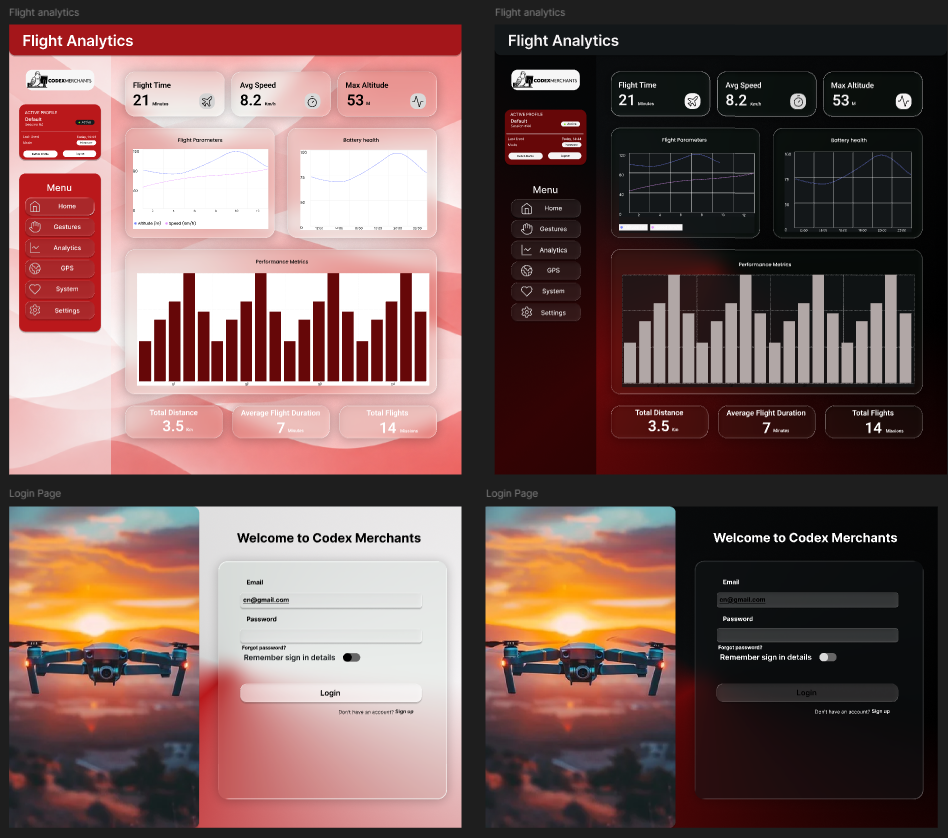

# Brand Style Guide

## Logo 

## Colour Palette

### Primary Colours 
  * Red (#A4161A)
  * Light Red (#BA181B)
  * Dark Red (#660708)

### Secondary Colours
  * Off Black (#161A1D)

### Neutral Colours
  * Dark Gray (#B1A7A6)
  * Grey (#D3D3D3)
  * Off White (#F5F3F4)

### Colour Usage Rules

* Use bg-LightRed (#BA181B) and bg-Red (#A4161A) as the primary action colours — buttons, links, active states, and CTAs
* Use bg-DarkRed (#660708) for hover and pressed states on red elements — never as the dominant colour
* Use bg-OffBlack (#161A1D) for dark backgrounds and hero sections; pair with white or OffWhite text for contrast
* Use bg-Grey and bg-OffWhite for light mode page backgrounds and surface areas
* Use bg-DarkGrey (#B1A7A6) for muted text, placeholders, borders, and disabled states
* The glass and glass-dark shadow tokens are designed to sit on top of * OffBlack backgrounds — always pair them with a backdrop-blur-md or higher for the effect to render
* Never place red text on a dark red background — contrast is insufficient for accessibility

## Wire Frames

### Gesture Control Dashboard

### Telemetry Dashboard
