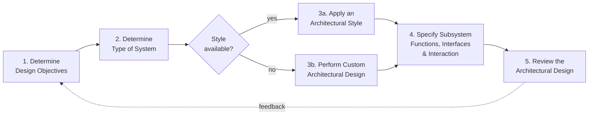
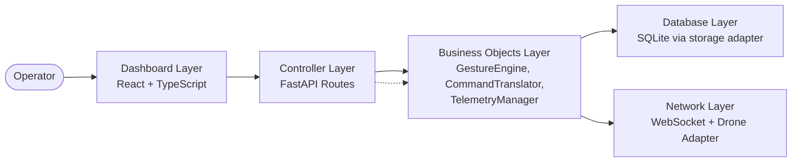
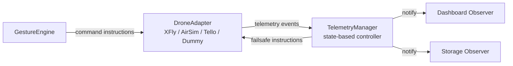
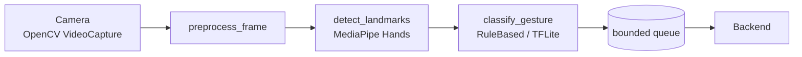
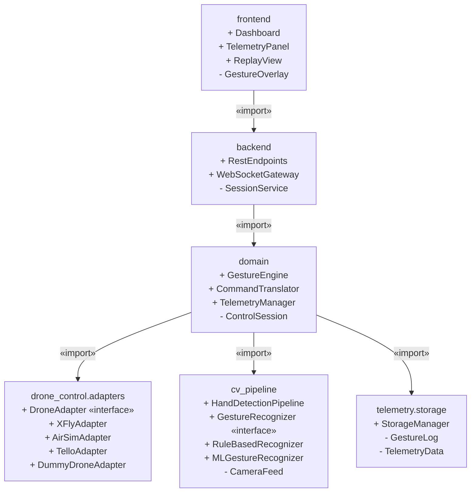

# Architectural Design

## 1. Introduction

This document presents the **architectural design** of the Gesture-Based Drone
Control System (GBDCS). 

The document is the canonical reference for *how* the requirements set out in
[`SRS.md`](SRS.md) are realised in software, and is the bridge between the
analysis-level domain model and the implementation in
`apps/`, `services/`, and `packages/`.

### 1.1 Scope of this document

- The **5-step architectural-design process** applied to GBDCS.
- The **architectural styles** chosen for each subsystem and their rationale.
- A **package diagram** showing the static structure and import direction
  between modules.
- The **design class diagram** (DCD) — the design-level descendant of the
  domain model in `SRS.md`.
- The **design principles and patterns** applied.
- The **brand and UI design** — palette, typography, and wireframes.

### 1.2 The 5-step process at a glance

*Figure 1.1 — The architectural-design process (slide 6-6) applied to GBDCS.*

---

## 2. Step 1 — Design Objectives

Per slide 6-7, the design must be evaluated against seven considerations.
Each is given below with the corresponding posture for GBDCS and the SRS
requirements that justify the posture.

| # | Consideration | Posture for GBDCS | Driving requirements |
| --- | --- | --- | --- |
| 1 | **Ease of change & maintenance** | The drone integration layer must accept new SDKs without ripple changes; the gesture recogniser must accept new strategies. | `R8.2`, `R8.3`, `R12.1` |
| 2 | **Use of COTS parts** | MediaPipe, OpenCV, FastAPI, React, AirSim, Tello SDK are used unchanged; no in-house equivalent is built. | §2.1.4 SRS |
| 3 | **System performance (real-time)** | The pipeline is real-time: ≥ 30 FPS capture, ≤ 200 ms end-to-end latency. | `R3.1.1`, `R4.3`, `R7.1`, `R7.2` |
| 4 | **Reliability** | ≥ 95 % gesture-classification accuracy; pipeline crashes must not crash the backend. | `R9.1`, `R10.1` |
| 5 | **Security** | WebSocket access is token-gated; telemetry never leaves the host. | `R11.1`, `R11.2` |
| 6 | **Software fault tolerance** | Idle, link-loss, and battery thresholds each trip a defined failsafe. | `R5.2.1`, `R6.1.1`, `R6.2.1` |
| 7 | **Recovery** | The system enters failsafe-hover and surfaces an error within 1 s of any pipeline crash. | `R10.1` |

These objectives are revisited in §6 (Review) where the architecture is
checked against them.

---

## 3. Step 2 — System Type

Our four common subsystem types: **interactive,
event-driven, transformational, and object-persistence**. GBDCS is a
*composite* system — different subsystems exhibit different types, and the
design method for each is matched accordingly (slide 6-13: *the design method
applied needs to match the type of subsystem under development*).

### 3.1 Subsystem classification

| Subsystem | Type | Why |
| --- | --- | --- |
| **Operator Dashboard** (`apps/frontend`) | Interactive | A fixed sequence of operator requests (open dashboard, log in, start session) and system responses; one human actor; begins and ends with the actor (slide 6-9). |
| **CV / Gesture Pipeline** (`services/cv_pipeline`) | Transformational | A network of activities — capture → preprocess → landmark detection → classification — that transforms frame input into a gesture-event output (slide 6-11). |
| **Drone Adapter Layer** (`services/drone_control/adapters`) | Event-driven | Receives telemetry events from the UAV and dispatches commands; requests arrive asynchronously; behaviour is state-dependent (slide 6-10). |
| **Telemetry & Session Store** (SQLite via `services/telemetry/storage`) | Object-persistence | Stores and retrieves `GestureLog`, `TelemetryData`, and `ControlSession` objects; does little business logic itself (slide 6-12). |
| **Backend API** (`apps/backend`) | Client-server | The frontend issues requests; the backend responds and brokers between the pipeline, adapters, and store (slide 6-9 client-server posture). |

### 3.2 Implication

Because GBDCS spans four subsystem types, the system-level architecture is
**custom** (slide 6-21), composed of well-known styles at the subsystem
level. Step 3 picks the style for each.

---

## 4. Step 3 — Architectural Styles

Slide 6-15 prescribes the canonical style for each system type. GBDCS applies
the table directly.

### 4.1 Style selection

| Subsystem | System type | Architectural style (slide 6-15) |
| --- | --- | --- |
| Backend API + Dashboard | Interactive / Client-server | **N-Tier + Client-Server** |
| CV / Gesture Pipeline | Transformational | **Main Program & Subroutines** (asynchronous pipeline variant) |
| Drone Adapter Layer | Event-driven | **Event-Driven** |
| Telemetry & Session Store | Object-persistence | **Persistence Framework** |

### 4.2 N-Tier view of the dashboard + backend

The dashboard and backend form a five-layer N-tier structure (slide 6-16),
adapted to the GBDCS domain.

*Figure 4.1 — N-tier view of GBDCS (slide 6-16 applied).*

### 4.3 Event-driven view of the drone integration

The drone integration layer behaves as an event-driven subsystem (slide 6-19):
the active `DroneAdapter` emits telemetry events; a state-based controller
inside `TelemetryManager` decides what to forward, what to log, and what to
escalate to a failsafe.

*Figure 4.2 — Event-driven view of the drone integration layer (slide 6-19).*

### 4.4 Transformational view of the CV pipeline

The pipeline is a transformational subsystem (slide 6-11), expressed as an
asynchronous **main program + subroutines** chain (slide 6-18) with a
bounded queue between stages to keep the pipeline non-blocking.

*Figure 4.3 — Transformational view of the CV pipeline.*

### 4.5 Persistence framework

Storage follows the persistence-framework style (slide 6-20): business
objects (`GestureLog`, `TelemetryData`, `ControlSession`) talk to a
single `StorageManager` in Python; the manager hides the SQLite-specific
access from the rest of the system, so a future switch to PostgreSQL would
not propagate into the domain code.

---

## 5. Step 4 — Subsystems, Interfaces & Interactions

Per slide 6-22, this step has four substeps:

1. Allocate requirements and objectives to subsystems.
2. Specify the functionality of each subsystem.
3. Specify the interfaces of each subsystem.
4. Specify the interaction behaviour of the subsystems.

### 5.1 Package diagram

The package structure mirrors the codebase. Imports flow *downward* — the
GUI may import from the controller layer; the domain layer does not import
from the GUI. This satisfies *Information Hiding* and *Low Coupling*
(§7).

*Figure 5.1 — Package diagram (slide 6-24 style). `+` = public, `-` = private to the package.*

### 5.2 Design Class Diagram

The design class diagram below is the design-level descendant of the analysis
domain model in [`SRS.md` §5](SRS.md#5-domain-model--architecture). The
analysis model captured the vocabulary of the problem; the DCD captures the
classes that will exist in code, the design patterns that bind them, and the
navigability between them.

*Figure 5.2 — Design Class Diagram (re-using the model from the tender
response). Three patterns are visible: the **Adapter** pattern across the
`DroneAdapter` interface and its four concrete adapters; the **Strategy**
pattern across `GestureRecognizer`, `RuleBasedRecognizer`, and
`MLGestureRecognizer`; and the **Observer** pattern between
`TelemetryManager` and its `TelemetryObserver`s.*

### 5.3 Subsystem functions, interfaces, and interactions

Light prose descriptions per slide 6-22. Method signatures and types live
in the per-service docs under `docs/services/`.

#### 5.3.1 Operator Dashboard (`apps/frontend`)

**Function.** Presents the live camera feed with landmark overlay, the
current recognised gesture and its mapped command, drone telemetry, and
critical alerts. Provides replay and emergency-stop controls.

**Interface.** Consumes a WebSocket stream at `/ws/live` carrying
`GestureEvent` and `TelemetryFrame` messages, plus REST endpoints under
`/api/v1` for configuration, history queries, and session replay.

**Interaction.** Acts as a client; the backend pushes events; the dashboard
issues control requests (start, stop, emergency-stop) over REST.

Allocated requirements: `R1.*`, `R14.*`, `R16.*`.

#### 5.3.2 Backend API (`apps/backend`)

**Function.** Brokers between the dashboard, the CV pipeline, the drone
adapter, and the storage layer. Authenticates dashboard sessions, fans out
gesture events and telemetry frames over WebSocket, and persists session
data.

**Interface.** Exposes the WebSocket gateway and REST endpoints listed in
[`api/API_REFERENCE.md`](api/API_REFERENCE.md). Calls into the domain layer
through Python imports; does not import from `frontend` (one-way
dependency).

**Interaction.** Receives gesture events from the pipeline via an in-process
async queue; receives telemetry frames from the active drone adapter via the
`TelemetryObserver` callback; persists both through `StorageManager`.

Allocated requirements: `R2.3`, `R2.4`, `R5.*`, `R6.3`, `R11.1`.

#### 5.3.3 CV / Gesture Pipeline (`services/cv_pipeline`)

**Function.** Captures frames, preprocesses them, detects 21 hand landmarks
with MediaPipe Hands, and classifies the gesture using the currently
selected `GestureRecognizer` strategy.

**Interface.** Exposes a single async generator yielding `GestureEvent`s.
The strategy in use is selected at construction time and is replaceable at
runtime (slide 6-25 *Design for Change*).

**Interaction.** Pulls frames from the camera, pushes events into a bounded
queue read by the backend.

Allocated requirements: `R3.*`, `R7.2`, `R9.1`, `R9.2`.

#### 5.3.4 Drone Adapter Layer (`services/drone_control/adapters`)

**Function.** Hides the differences between drone SDKs and simulators
behind a single `DroneAdapter` interface.

**Interface.** All four adapters (`XFlyAdapter`, `AirSimAdapter`,
`TelloAdapter`, `DummyDroneAdapter`) expose the same operations: connect,
take-off, move, hover, land, and a telemetry stream. The active adapter is
selected via an environment variable.

**Interaction.** Receives commands from `CommandTranslator`; emits
telemetry events to `TelemetryManager`. Per-adapter behaviour is documented
under `docs/services/`.

Allocated requirements: `R2.2`, `R4.3`, `R5.*`, `R8.2`.

#### 5.3.5 Telemetry & Session Store (`services/telemetry/storage`)

**Function.** Persists `GestureLog`, `TelemetryData`, and `ControlSession`
records; provides session-replay queries.

**Interface.** A `StorageManager` class with CRUD operations on each
record type. Hides SQLite-specific calls from the rest of the system.

**Interaction.** Invoked by the backend whenever a gesture event or
telemetry frame is received; queried by the replay endpoint.

Allocated requirements: `R6.3`, `R11.2`.

### 5.4 Patterns applied

Three Gang-of-Four patterns appear in the DCD; each maps directly to a
design constraint in the SRS.

=== "Adapter (R8.2)"

    **Intent.** Decouple the system from any single drone SDK.

    **Participants.** `DroneAdapter` (target interface), `XFlyAdapter`,
    `AirSimAdapter`, `TelloAdapter`, `DummyDroneAdapter` (adaptees).

    **Why here.** SDKs differ in transport, message format, and lifecycle.
    The adapter pattern lets the rest of the system speak one vocabulary
    regardless of which drone is connected — the textbook posture for
    "Design for Change" (slide 6-25).

=== "Strategy (R8.3)"

    **Intent.** Make the gesture-classification algorithm interchangeable
    at runtime.

    **Participants.** `GestureRecognizer` (strategy interface),
    `RuleBasedRecognizer`, `MLGestureRecognizer` (concrete strategies);
    `GestureEngine` (context).

    **Why here.** The rule-based recogniser is deterministic and the
    baseline for Demo 1. The TFLite recogniser is the planned upgrade and
    can be slotted in without changing `GestureEngine` or anything
    downstream of it.

=== "Observer (R8.4)"

    **Intent.** Fan out telemetry to many consumers without coupling the
    producer to any of them.

    **Participants.** `TelemetryManager` (subject), `TelemetryObserver`
    (observer interface), with the dashboard, storage, and any future
    consumer (e.g. an analytics sink) as concrete observers.

    **Why here.** Adding an observer must not require changes to the
    drone adapter or the manager.

---

## 6. Step 5 — Review

Per slide 6-23, the architecture is reviewed against three checklists.

=== "Meets requirements & objectives"

    | Objective (§2) | Where realised |
    | --- | --- |
    | Ease of change | Adapter + Strategy patterns (§5.4); one-way package imports (§5.1). |
    | COTS reuse | MediaPipe, OpenCV, FastAPI, React, AirSim (§3.1 SRS). |
    | Real-time performance | Bounded-queue async pipeline (§4.4); WS push instead of polling (§4.2). |
    | Reliability | Strategy lets us swap recognisers if accuracy drops; pipeline isolation prevents crash propagation (`R10.1`). |
    | Security | WS token gating in the controller layer (`R11.1`). |
    | Fault tolerance | Event-driven controller in the drone layer enforces idle, link-loss, and battery failsafes (§4.3). |
    | Recovery | Pipeline supervisor restarts on crash and surfaces error within 1 s (`R10.1`). |

=== "Satisfies design principles"

=== "Satisfies security constraints"

    - Token-gated WebSocket (`R11.1`).
    - No third-party telemetry transmission (`R11.2`).
    - SQLite store is local-only (`R11.2`).
    - Adapter layer rejects pre-`READY` take-off (`R6.2.2`).

---

## 7. Design Principles Applied

=== "Design for Change"

    The two most likely change vectors — *which drone is connected* and
    *which classification algorithm runs* — are absorbed by the
    Adapter (`R8.2`) and Strategy (`R8.3`) patterns. Adding a new drone
    or a new recogniser requires zero changes outside its own module.

=== "Separation of Concerns"

    The six tiers map to six folders. The CV pipeline knows nothing about
    HTTP; the dashboard knows nothing about MediaPipe; the storage layer
    knows nothing about WebSockets.

=== "Information Hiding"

    Every package exposes only the symbols marked `+` in the package
    diagram (§5.1). Concrete adapter classes are accessed only through
    the `DroneAdapter` interface; storage details are hidden inside
    `StorageManager`.

=== "High Cohesion"

    Each subsystem has one purpose: capture and recognise; broker and
    serve; translate to commands; speak to a drone; persist a session.
    Nothing crosses these boundaries.

=== "Low Coupling"

    The package diagram is acyclic and one-directional. The only
    cross-package vocabulary is the small set of shared types in
    `packages/contracts` (`GestureEvent`, `TelemetryFrame`,
    `DroneCommand`).

=== "KISS"

    Rule-based recognition ships first and remains the default; the ML
    path is opt-in (`R8.3`). The dummy adapter exists explicitly so the
    pipeline can run without any SDK installed during development.

---

## 8. Applying Agile Principles

Per slide 6-28, the design follows the two agile principles from the
chapter:

- **Working software over comprehensive documentation.** This document
  captures the *committed* architectural decisions; per-service detail
  lives next to the code in `docs/services/` and is updated as the code
  changes.
- **The 20/80 rule.** The first 20 % of the architecture (Adapter,
  Strategy, Observer, bounded-queue pipeline) covers 80 % of the
  expected change pressure — additional patterns are deferred until a
  concrete need surfaces.

---

## 9. Brand & UI Design

The architectural decisions above shape *how* the system works; this
section captures *what it looks like*. The brand vocabulary and the
operator-facing wireframes are kept in this document so that the visual
design and the architectural design ship together.

### 9.1 Logo

### 9.2 Colour Palette

#### 9.2.1 Primary colours

- **Red** &mdash; `#A4161A`
- **Light Red** &mdash; `#BA181B`
- **Dark Red** &mdash; `#660708`

#### 9.2.2 Secondary colours

- **Off Black** &mdash; `#161A1D`

#### 9.2.3 Neutral colours

- **Dark Grey** &mdash; `#B1A7A6`
- **Grey** &mdash; `#D3D3D3`
- **Off White** &mdash; `#F5F3F4`

#### 9.2.4 Usage rules

- Use **Light Red (`#BA181B`)** and **Red (`#A4161A`)** as the primary
  action colours — buttons, links, active states, and CTAs.
- Use **Dark Red (`#660708`)** for hover and pressed states on red
  elements — never as the dominant colour.
- Use **Off Black (`#161A1D`)** for dark backgrounds and hero sections;
  pair with white or Off White text for contrast.
- Use **Grey** and **Off White** for light-mode page backgrounds and
  surface areas.
- Use **Dark Grey (`#B1A7A6`)** for muted text, placeholders, borders,
  and disabled states.
- The glass and glass-dark shadow tokens are designed to sit on top of
  Off Black backgrounds — always pair them with a `backdrop-blur-md` or
  higher for the effect to render.
- Never place red text on a dark red background — contrast is
  insufficient for accessibility.

### 9.3 Wireframes

=== "Gesture Control Dashboard"

    

    *Figure 9.1 — Gesture-control dashboard wireframe. Realises
    `R1.1.1`–`R1.1.3` (live feed with overlay, current gesture,
    telemetry panel).*

=== "Telemetry Dashboard"

    

    *Figure 9.2 — Telemetry dashboard wireframe. Realises `R1.1.3` and
    `R1.2.*` (telemetry panel and critical alerts).*

---

## Appendix A — Design-to-Requirement Traceability

| Design element | Implements | Verified by |
| --- | --- | --- |
| N-tier dashboard + backend (§4.2) | `R1.*`, `R2.3`, `R2.4`, `R14.*` | Frontend unit + Playwright E2E |
| Transformational pipeline (§4.4) | `R3.*`, `R7.2` | `tests/cv_pipeline_testing` |
| Event-driven drone layer (§4.3) | `R5.*`, `R6.1.*`, `R6.2.*` | Adapter integration tests |
| Persistence framework (§4.5) | `R6.3`, `R11.2` | Storage unit tests |
| Adapter pattern (§5.4) | `R8.2` | Adapter integration tests |
| Strategy pattern (§5.4) | `R8.3` | Recogniser unit tests |
| Observer pattern (§5.4) | `R8.4` | Telemetry-manager unit tests |
| Token-gated WS (§6, security) | `R11.1` | Backend auth tests |
| One-way package imports (§5.1) | `R12.1` | Static import check in CI |