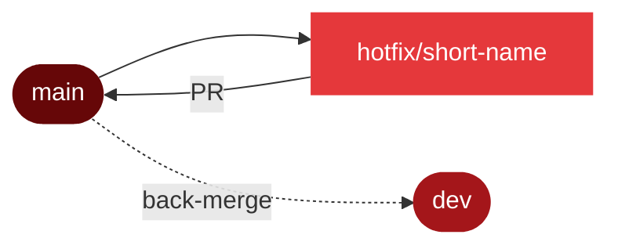

# Git Conventions

<div class="tx-badges">
  <span class="tx-status"><span class="tx-status__dot"></span>Flow · GitHub Flow (extended)</span>
  <span class="tx-status">Commits · Conventional Commits</span>
  <span class="tx-status">Merge · Merge commit (no squash)</span>
</div>

!!! abstract "What this document covers"
    The branch flow, commit conventions, and pull-request rules used by
    Codex Merchants on the Gesture-Based Drone Control System. This is
    the *human-side* counterpart to [CI/CD](CICD.md) — the pipeline
    enforces what this document specifies. Conventional Commits are
    required by [`R15.2`](SRS.md#r15-process--documentation).

---

## 1. Branch Flow

The repository uses a four-level branch hierarchy that mirrors the
structure of the work: features compose into use cases, use cases
compose into a release-candidate integration branch, and that branch is
promoted to production.


*Figure 1.1 — Four-level branch hierarchy. Every promotion is a
reviewed pull request, never a direct push.*

### 1.1 Branches

| Branch | Lifetime | Pushable directly? | Purpose |
| --- | --- | --- | --- |
| `main` | Permanent | No | Production-ready code. Tagged at each demo. The docs site is rebuilt on every push here. |
| `dev` | Permanent | No | Integration branch. All Use-Case branches merge here when ready for cross-feature integration testing. |
| `Use-Case<n>` | Per-use-case | No | One per SRS use case (e.g. `Use-Case-1` for UC-1 — gesture control). Features are integrated and stabilised here before promotion to `dev`. |
| `feature/UC<n>/<short-name>` | Per-feature | Yes (your own) | Individual feature or fix work. Created from the parent Use-Case branch. |

### 1.2 Rationale

The intermediate `Use-Case` branches act as **mini-integration branches**.
This gives the team two layers of safety: a feature stabilises with its
sibling features on the Use-Case branch before that whole unit is
proposed to `dev`. The cost is one extra PR per promotion — a price the
team is happy to pay for fewer post-merge regressions in `dev`.

!!! tip "Keep your Use-Case branch current"
    Merge `dev` into your Use-Case branch at least once a week. Long-lived
    Use-Case branches that lag behind `dev` produce the worst merge
    conflicts the team encounters.

---

## 2. Branch Naming

| Pattern | Example | Notes |
| --- | --- | --- |
| `Use-Case<n>` | `Use-Case-1` | The `n` matches the UC number in the [SRS](SRS.md#4-use-cases). |
| `feature/UC<n>/<short-name>` | `feature/UC1/openpalm-recognizer` | `<short-name>` is kebab-case, ≤ 4 words, describes the *outcome* not the *task* (`openpalm-recognizer`, not `add-recognizer-code`). |
| `fix/UC<n>/<short-name>` | `fix/UC2/telemetry-units` | Bug fixes follow the same shape, with `fix/` instead of `feature/`. |
| `hotfix/<short-name>` | `hotfix/demo-day-crash` | Reserved for emergency fixes off `main` (see [§6](#6-hotfix-flow)). |
| `docs/<short-name>` | `docs/srs-ieee830` | Documentation-only changes targeting `main` or `dev` directly. |

Branch names are lowercase except for `Use-Case` (the only branch
prefix that uses a capital). No spaces, no underscores in the
short-name segment.

---

## 3. Commit Conventions

The project uses [**Conventional Commits**](https://www.conventionalcommits.org/)
per `R15.2`. Every commit message has the form:

```
<type>(<scope>): <short summary>

<optional body>

<optional footer(s)>
```

### 3.1 Types

| Type | Use for | Example |
| --- | --- | --- |
| `feat` | A new user-facing capability. | `feat(recognizer): add open-palm gesture` |
| `fix` | A bug fix. | `fix(telemetry): correct altitude unit conversion` |
| `docs` | Documentation only — no code changes. | `docs(srs): adopt IEEE 830 structure` |
| `test` | Adding or fixing tests. | `test(cv): add ambiguous-gesture rejection cases` |
| `ci` | CI/CD configuration. | `ci: cache playwright browsers` |
| `revert` | Reverts a previous commit. | `revert: feat(recognizer): add open-palm gesture` |

### 3.2 Scopes

Scopes match the top-level codebase folders or the user-facing area:
`backend`, `frontend`, `services`, `cv`, `recognizer`, `adapters`,
`telemetry`, `docs`, `ci`, `dependencies`. If a commit genuinely spans multiple
scopes and cannot be split, the scope may be omitted.

### 3.3 Examples

=== "Good"

    ```text
    feat(recognizer): add open-palm gesture (R3.2.2)

    Implements rule-based detection of an open palm and maps it to the
    HOVER command. Adds a confidence threshold of 0.85 before emitting
    the gesture.

    Closes #42
    ```

=== "Acceptable"

    ```text
    fix(telemetry): correct altitude unit conversion
    ```

=== "Bad &mdash; rejected at review"

    ```text
    updates

    final version

    asdf
    ```

Citing the requirement ID (`R3.2.2`) and the issue (`Closes #42`) is
encouraged whenever the commit clearly maps to one.

---

## 4. Pull Requests

### 4.1 Title

The PR title follows the same Conventional-Commit form as the merge
commit it will produce:

```
feat(recognizer): add open-palm gesture (R3.2.2)
```

### 4.2 Description template

```markdown
## What
A one-sentence summary of the change.

## How
A short walkthrough — files touched, design decisions worth flagging,
anything reviewers should know.

## Testing
- [ ] Lint passes locally
- [ ] Unit tests pass locally
- [ ] Manual test:&nbsp;<short description>


Closes #<issue>
```

### 4.3 Review requirements

| Target branch | Approving reviews | Required CI checks |
| --- | --- | --- |
| `Use-Case<n>` from `feature/*` | 1 from the Use-Case sub-team | Lint workflow |
| `dev` from `Use-Case<n>` | 1 from another sub-team | Lint + Test workflows |
| `main` from `dev` | 1 from the Scrum Master + 1 from another team member | Lint + Test workflows |
| `main` from `hotfix/*` | 1 (any team member) | Lint workflow |

CI checks are enforced by GitHub branch protection — see
[CI/CD §5](CICD.md#5-branch-protection--required-checks).

### 4.4 Merge strategy

PRs are merged with **"Create a merge commit"** &mdash; not squash, not
rebase. Rationale:

- The branch history shows *how* the work was done (intermediate
  commits, fixups during review). This is valuable when bisecting a
  regression.
- The merge commit itself gives a single record of *when* the PR was
  integrated and links back to the PR number on GitHub.
- Conventional-Commit prefixes on the individual commits remain useful
  in a `git log` because they are preserved verbatim.

Branches **must not** be deleted automatically by GitHub on merge —
leave the branch in place for at least 24 hours after merging so the
team can recover if a problem surfaces immediately.

---

## 5. Feature Development Workflow

The day-to-day workflow for a developer picking up a story is the same
whether you use the command line or the VS Code source-control panel.

=== "Command line"

    ```bash
    # 1. Start from the parent Use-Case branch
    git checkout Use-Case-1
    git pull origin Use-Case-1

    # 2. Create your feature branch
    git checkout -b feature/UC1/openpalm-recognizer

    # 3. Work, committing often with conventional messages
    git add services/cv_pipeline/gestures/open_palm.py
    git commit -m "feat(recognizer): add open-palm gesture (R3.2.2)"

    # 4. Before opening the PR, pull the latest Use-Case changes
    git fetch origin
    git merge origin/Use-Case-1
    # resolve any conflicts locally and commit

    # 5. Push and open a PR into Use-Case-1
    git push -u origin feature/UC1/openpalm-recognizer
    # open the PR on GitHub from the link in the push output
    ```

=== "VS Code source control"

    1. Open the Source Control panel (`Ctrl/Cmd+Shift+G`).
    2. Use the branch indicator in the status bar (bottom-left) to
       switch to your parent Use-Case branch, then PULL to refresh.
    3. Create new branch from… → pick the Use-Case branch → name it
       `feature/UCn/short-name`.
    4. Stage files in the Source Control panel and commit using the
       Conventional-Commit form in the message box.
    5. Before opening the PR, open the Command Palette
       (`Ctrl/Cmd+Shift+P`) → Git: Merge Branch… → select your
       Use-Case branch. Resolve conflicts in the editor's three-way
       merge view.
    6. Sync Changes to push, then click Create Pull Request in
       the panel (with the GitHub Pull Requests extension installed) or
       open the PR on GitHub.

---

## 6. Hotfix Flow

For an emergency fix that must reach `main` *immediately* — typically
discovered minutes before a demo — the team uses a shortened flow:



*Figure 6.1 — Hotfix branches start from `main`, merge back into
`main`, and are then back-merged into `dev`.*

Rules:

1. Branch from `main`, not from `dev` or a Use-Case branch.
2. Keep the change minimal — one bug, one PR.
3. Lint must still pass; the test suite is **strongly encouraged** but
   may be skipped if a demo is imminent (Scrum value of *Courage* — own
   the decision in the PR description).
4. After merging to `main`, immediately open a second PR back-merging
   `main` into `dev` so the fix is not lost when the next regular
   release goes out.

---

## 7. CLI Reference

A copy-paste-ready cheatsheet for the most common operations on this
repository. Every command is what you would actually type in a terminal
opened at the repo root.

### 7.1 First-time setup

```bash
# Clone the repository
git clone https://github.com/COS301-SE-2026/Gesture-Based-Drone-Control.git
cd Gesture-Based-Drone-Control

# Identify yourself (once per machine)
git config --global user.name  "Your Name"
git config --global user.email "your.email@example.com"

# Fetch all branches and tags
git fetch --all --tags
```

### 7.2 Daily — start a new feature

```bash
# 1. Sync the parent Use-Case branch
git checkout Use-Case-1
git pull origin Use-Case-1

# 2. Branch off it
git checkout -b feature/UC1/openpalm-recognizer

# 3. Verify you're where you expect to be
git branch --show-current
# → feature/UC1/openpalm-recognizer
```

### 7.3 Daily — commit and push

```bash
# Inspect what changed
git status
git diff

# Stage selectively
git add services/cv_pipeline/gestures/open_palm.py
git add services/tests/test_open_palm.py

#Stage all files altered/added
git add .

# Commit with Conventional-Commit form
git commit -m "feat(recognizer): add open-palm gesture (R3.2.2)"

# Subsequent pushes
git push
```

### 7.4 Sync your Use-Case branch with `dev`

Run this at least once a week on every active Use-Case branch.

```bash
# Update dev locally
git checkout dev
git pull origin dev

# Merge dev into the Use-Case branch
git checkout Use-Case-1
git merge dev
# resolve any conflicts, then:
git push origin Use-Case-1
```

### 7.5 Before opening a PR — merge the parent in

```bash
# Make sure the parent Use-Case branch is fresh
git fetch origin

# Merge the latest parent into your feature branch
git merge origin/Use-Case-1
# resolve any conflicts, commit, then:
git push
```

### 7.6 Promote a Use-Case branch to `dev`

```bash
# Sync first
git checkout Use-Case-1
git pull origin Use-Case-1
git fetch origin

# Bring dev in to catch any drift
git merge origin/dev
git push origin Use-Case-1

# Then open the PR Use-Case-1 → dev on GitHub
```

### 7.7 Promote `dev` to `main`

```bash
# Sync dev
git checkout dev
git pull origin dev

# Then open the PR dev → main on GitHub
# (Two approving reviews required — see §4.3)
```

### 7.8 Hotfix

```bash
# Branch off main, not dev
git checkout main
git pull origin main
git checkout -b hotfix/demo-day-crash

# Fix, commit, push
git commit -m "fix(backend): handle missing telemetry frame on startup"
git push -u origin hotfix/demo-day-crash

# After the hotfix → main PR is merged, back-merge to dev
git checkout dev
git pull origin dev
git merge origin/main
git push origin dev
```

### 7.9 Inspecting history

```bash
# Last 10 commits, one line each, with branch graph
git log --oneline --graph --decorate -10

# Who touched a specific file?
git log --follow apps/backend/app/main.py

# Show a specific commit
git show <commit-sha>

# Find which commit introduced a bug
git bisect start
git bisect bad
git bisect good demo-1
# git will check out commits; mark each as good/bad until it isolates the culprit
git bisect reset
```

### 7.10 Undoing things

```bash
# Discard unstaged changes in a file
git restore apps/backend/app/main.py

# Unstage a file you accidentally added
git restore --staged apps/backend/app/main.py

# Amend the last commit message (only before pushing)
git commit --amend -m "feat(recognizer): add open-palm gesture (R3.2.2)"

# Revert a merged commit by creating a new commit that undoes it
git revert <commit-sha>

# Stash work-in-progress without committing
git stash push -m "wip: gesture overlay"
git stash list
git stash pop
```

!!! warning "Never `git reset --hard` on a shared branch"
    `git reset --hard` and `git push --force` on `dev`, `main`, or a
    `Use-Case*` branch will silently destroy other team members' work.
    Only use these on your own feature branch, and only when you are
    certain nobody else has pulled it.

## 8. Best Practices

A short list, in priority order:

1. **Pull before you push.** Every push begins with a `git pull` (or
   *Sync Changes*) on the branch you are about to push to.
2. **Merge Use-Case into your feature *before* opening the PR.** The
   reviewer should never be the one to discover a merge conflict.
3. **Commit early, commit often.** Many small commits with good
   messages beat one giant commit titled "wip".
4. **Never `git push --force` to a shared branch.** Only your own
   feature branch may receive a forced push, and only when you are
   certain nobody else has pulled it.
5. **Don't commit secrets.** `.env` files are listed in `.gitignore`;
   keep them there. Use `.env.example` for documenting required
   variables.
6. **Don't commit generated artefacts.** `site/`, `node_modules/`,
   `.venv/`, `dist/`, `__pycache__/` are all in `.gitignore`.
7. **Reference the requirement.** If the change implements an SRS
   requirement, cite the ID in the commit body and the PR
   description.

---