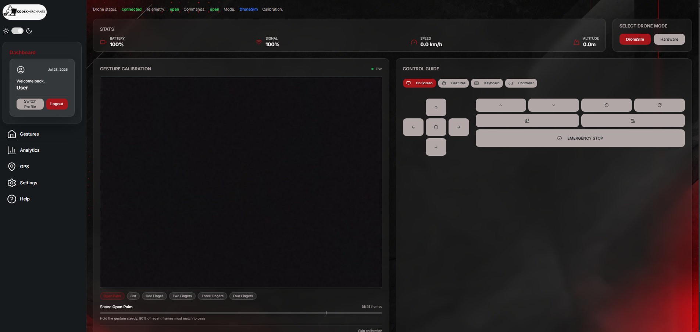
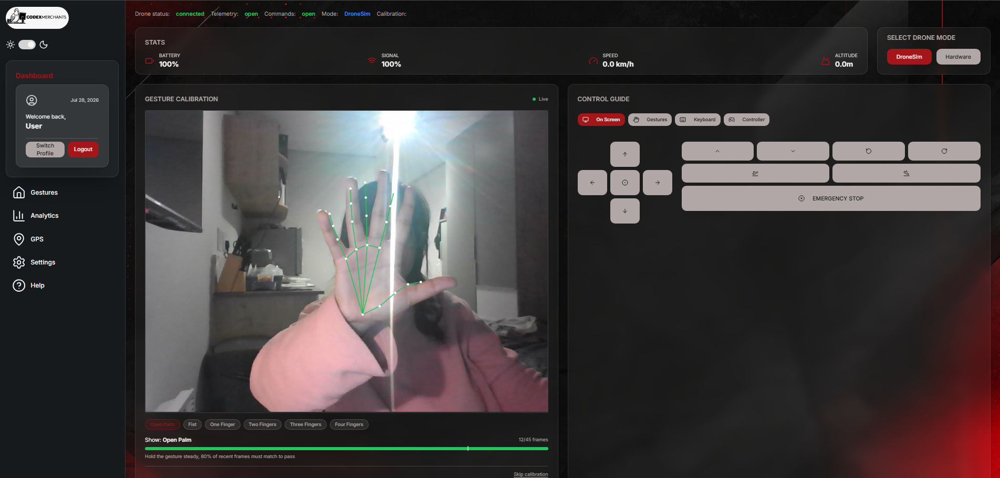
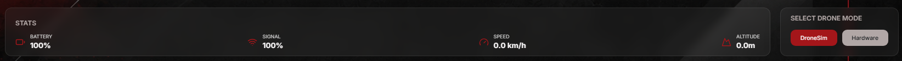

# User Manual

  "Welcome"
    Welcome to the **Gesture-Based Drone Control System** — *GBDCS* for
    short. This system lets you fly a drone with your hand
    instead of a remote control, however controller and keyboard support
    have been added for user preference/accessibility. You can stand in front of your computer's
    camera, the system watches your hand, and the drone does what you
    show it.

    This manual is written for a complete beginner. You do not need to
    have flown a drone before. You do not need to know anything about
    programming. If you can wave your hand at a camera, you can fly
    this drone.

---

## What This Manual Covers

The manual is organised by **what you want to do**. Each section is a
single feature, with the same shape:

1. **What is it?** — one sentence saying what the feature does.
2. **When would I use it?** — when this feature matters in real life.
3. **How to use it** — step-by-step instructions you can follow along.
4. **What you should see** — what the screen looks like at each step.
5. **What if it goes wrong?** — common problems and how to fix them.

If you have never opened the app before, start with
[§2 Set Up &amp; Sign In](#2-set-up--sign-in). Otherwise jump straight to
the feature you need.

| Section | Use this when… |
| --- | --- |
| [§2 Set Up &amp; Sign In](#2-set-up--sign-in) | It's your first time, or you're signing in on a new computer. |
| [§3 Fly the Drone with Your Hand](#3-fly-the-drone-with-your-hand) (UC-1) | You want to actually fly the drone. |
| [§4 Watch What the Drone Is Doing](#4-watch-what-the-drone-is-doing) (UC-2) | You want to see battery, altitude, and warnings. |
| [§5 Practise with the AirSim Simulator](#5-practise-with-the-airsim-simulator) (UC-3) | You don't have a real drone, or you want a safe place to practise. |
| [§7 The Gesture Vocabulary](#7-the-gesture-vocabulary) | Quick reference card for every hand gesture the system understands. |
| [§8 Help Menu](#8-help-menu) | You're stuck while flying and need a reminder. |
| [§9 Safety Features](#9-safety-features) | You want to know what the drone does on its own to stay safe. |
| [§10 Troubleshooting](#10-troubleshooting) | Something isn't working and you don't know why. |

---

## 1. Before You Begin

You will need:

- **A computer** — Windows or Linux. A laptop with a built-in
  camera works fine.
- **A webcam** — built-in or USB. The camera must be able to see your
  hand clearly.
- **Good lighting** — bright enough that you can see your hand on the
  screen without squinting.
- **Some clear space** — the drone needs room to fly.
  Move chairs, lamps, and pets out of the way.
- **One of:**
    - A real drone (DJI Tello or compatible), **or**
    - The **AirSim simulator** running on your computer (see §5).

!!! tip "First-time advice"
    If you are completely new, start in the **AirSim simulator**
    (§5). It lets you make mistakes safely. Once you can land a
    simulated drone without crashing, switch to the real one.

---

## 2. Set Up &amp; Sign In

This is the very first thing you do, and you only do it once.

### 2.1 What is it?

**Signing in** tells the system who you are. The system uses this to
remember your settings (like light or dark mode) and to keep a log of
your flights so you can look back at them later.

### 2.2 How to use it

=== "If you've never used the system before"

    1. Open the GBDCS app or website.
    2. On the welcome screen, click **Create an account**.
    3. Type in your **email address** and a **password**.
        - The password needs to be reasonably strong — the form will
          tell you if it isn't strong enough.
    4. Click **Register**.
    5. The system will sign you in straight away and take you to the
       main dashboard.

=== "If you already have an account"

    1. Open the GBDCS app or website.
    2. Type in your **email address** and **password** on the sign-in
       form.
    3. Click **Sign in**.
    4. You land on the main dashboard.

### 2.3 What you should see

After signing in, you arrive on the **Gesture Control Dashboard** —
the home base for everything else in this manual.

*Figure 2.1 — The dashboard you land on after signing in (for this example dark mode has been selected). The big
square in the middle is the camera view; the panel on the right is
the drone's input control options.*

### 2.4 What if it goes wrong?

| Problem | What to do |
| --- | --- |
| *"The email or password is incorrect."* | Double-check both fields. Email addresses are not case-sensitive but passwords are. |
| The password form rejects your password | Make it longer, mix some letters and numbers. The form will tell you exactly what's missing. |
| You get logged out by itself after a while | This is normal. The system signs you out after 30 minutes for security. Just sign back in. |
| You forgot your password | Speak to the team via codexmerchants@gmail.com — password reset is on the roadmap and not yet self-service. |

---

## 3. Fly the Drone with Your Hand &nbsp;<small>UC-1</small>

This is the headline feature. Everything else exists to make this one
work well.

### 3.1 What is it?

You stand in front of the camera and **make a hand gesture**. The
system recognises the gesture and sends a matching command to the
drone — *take off*, *hover*, *go left*, *land*, and so on.

### 3.2 When would I use it?

Any time you want the drone to do something. This is the main way to
control the drone.

### 3.3 How to use it

1. Make sure you've signed in (§2).
2. Make sure a drone or simulator is connected. The top of the
   dashboard will say **CONNECTED** when the system is ready to fly.
3. Hold your hand up in front of the camera. You should see complete the calibration as a start and then see a faint
   skeleton drawn on top of your hand on screen — that's the system
   tracking your fingers.
4. Make the gesture for **take off** (see §7). Hold it for about half
   a second so the system is sure.
5. The drone takes off and starts to hover.
6. Try other gestures: an open palm, a pointing
   finger to move in that direction or a fist.
7. To stop the drone immediately, lower your hand and click the
   **EMERGENCY STOP** button on the dashboard.

### 3.4 What you should see

The left of the dashboard shows your camera feed in real time, with
a thin coloured skeleton drawn on your hand. The badge on screen
shows the **current gesture** the system thinks you're
making and the **command** it has sent to the drone.

*Figure 3.1 — While flying, the dashboard shows the live feed with
your hand skeleton, the current recognised gesture, and the drone's state.*

### 3.5 What if it goes wrong?

| Problem | What to do |
| --- | --- |
| You make a gesture and nothing happens | The system needs to be confident before it acts. Hold the gesture steadier, and make sure your whole hand is in the camera view. If that does not work try recalibrating. |
| The skeleton on your hand looks jumpy | Improve your lighting. The system needs to see your hand clearly. |
| The drone does the wrong thing | Check the gesture card in §7 — the gestures look similar at first. Practise in the simulator (§5) if you keep mixing them up. |
| You see *"Idle — hovering"* on screen | The system stopped seeing a gesture for a few seconds, so it parked the drone safely in mid-air. Make a fresh gesture to take over again. |
| The drone takes off by itself when you didn't mean it to | It won't — the system refuses to take off until the pipeline is **CONNECTED** and a recognised take-off gesture has been held. If this ever does happen, hit **EMERGENCY STOP** and report it as a Critical defect. |

!!! warning "Keep the drone in sight"
    Always be able to see the real drone with your own eyes. The
    camera is watching your hand, not the drone. South African Civil
    Aviation rules (and common sense) require you to keep the drone in
    line of sight at all times.

---

## 4. Watch What the Drone Is Doing &nbsp;<small>UC-2</small>

### 4.1 What is it?

The **telemetry panel** is where the drone tells you how it's doing —
how high it is, how much battery it has left, what flight mode it's
in, and whether its connection to your computer is good.

### 4.2 When would I use it?

You should glance at it every few seconds while you fly. The system
will also have pop up alerts on its own if anything important changes
(low battery, lost connection).

### 4.3 How to use it

Just look at the top of the dashboard. There's nothing to
click. The numbers update on their own every second 
while you fly.

### 4.4 What you should see

*Figure 4.1 — The telemetry panel. Altitude, battery, signal, and speed followed by a flight mode,
that are all visible together; alerts will appear above the
panel when something needs your attention.*

The four things on the telemetry panel:

| Reading | What it means | Worry when… |
| --- | --- | --- |
| **Altitude** | How high the drone is, in metres above where it took off. | It drops unexpectedly. |
| **Battery** | How much charge is left, as a percentage. | It hits **20 %** — the drone will land itself automatically (see §9). |
| **Signal** | Is the drone's signal to the controlling device good enough?  | signal suddenly drops indicates that the drone is no longer connected. |
| **Speed** | How fast the drone is moving, in km/h. | If the drones speed is too high the chances of avoiding obstacles is higher. |

### 4.5 What if it goes wrong?

| Problem | What to do |
| --- | --- |
| The numbers stop updating | The drone has probably lost its connection. The system will tell you in a banner alert at the top of the screen. |
| A red banner appears at the top of the screen | Read it — it tells you exactly what's wrong and what to do. Acknowledge it by clicking it once you've understood. |

---

## 5. Practise with the AirSim Simulator &nbsp;<small>UC-3</small>

### 5.1 What is it?

**AirSim** is a free drone simulator that runs on your computer.
GBDCS can talk to it just like it talks to a real drone — same
gestures, same dashboard, same safety features. The only difference
is that the drone is on screen instead of in the real world with real consequences.

### 5.2 When would I use it?

- The very first time you try the system.
- Whenever you don't have a real drone handy.
- Before making a mistake on a real drone, so you can practise without
  risking a crash.

### 5.3 How to use it

1. Start AirSim. It opens a window with a flying environment.
2. In the GBDCS app, look for the **DroneSim** button in the dashboard options.
3. CLick on it and give it a second to start up.
4. Start the session as normal.
5. Fly as you would in §3 — every gesture and control works the same way.

### 5.4 What you should see

The dashboard looks exactly the same as for a real drone (§3 and §4).
The difference is that the AirSim window also shows the simulated
drone flying around. Switch between them as you fly — the dashboard
for your readings, the AirSim window for what the drone is doing.

### 5.5 What if it goes wrong?

| Problem | What to do |
| --- | --- |
| The dashboard says *"Connection failed"* | AirSim isn't running, or it started after GBDCS did. Close GBDCS, make sure AirSim is open, then re-open GBDCS. |
| The drone in AirSim doesn't move when you gesture | Check the **Adapter** dropdown is set to *DroneSim* and not to *Hardware*. |
| AirSim crashes | AirSim is a heavy software. Close any other big applications and try again. |

---

## 6. View analytics about the drone's flight &nbsp;<small>UC-5</small>

### 6.1 What is it?

The system records every flight automatically — every gesture you
made, every command it sent, every telemetry reading the drone sent
back.

### 6.2 When would I use it?

- To review what happened in a flight that didn't go to plan.
- To show a teammate or mentor exactly what they missed.
- For evaluation to see how the drone works/flies in real time.

### 6.3 How to use it

1. From the main dashboard, click **Analytics** in the navigation menu.
2. You see a list of all your past sessions, with the date, time,
   and how long each one lasted.
3. The dashboard displays the flight: the telemetry data from the drone, all playing back at in real time or from past flights.

### 6.4 What you should see

The analytics view displays a variety of statistics cards along with different graphs displaying the drones speed over time, battery health over time and your last 7 flights with their duration.

### 6.5 What if it goes wrong?

| Problem | What to do |
| --- | --- |
| The session list is empty | You haven't flown yet, or you're signed in as a different user. Each user only sees their own sessions. |
| The playback feels fast or slow | The replay runs at the original speed. If something looks wrong, report it. |

---

## 7. The Gesture Vocabulary
<!-- TODO: SHAV NEEDS TO UPDATE ONCE GESTURES ADAPTER IS DONE AND GESTURES ARE MAPPED -->
A quick reference for every gesture the system understands. Hold the
gesture steady for about half a second to make sure the system sees
it.

| Gesture | Hand shape | What it tells the drone |
| --- | --- | --- |
| **Open Palm** | All five fingers spread, palm facing the camera | Hover in place |
| **Fist** | All fingers curled into a closed fist | Land now |
| **Thumb Up** | Thumb extended upward, other fingers curled | Take off / rise |
| **Thumb Down** | Thumb extended downward, other fingers curled | Descend |
| **Pointer Left** | Index finger extended, pointing to your left | Move left |
| **Pointer Right** | Index finger extended, pointing to your right | Move right |

!!! tip "Practise tips"
    - **Show your whole hand.** If only half of it is in the camera
      view, the system will refuse to act on a half-seen gesture
      rather than guess wrong.
    - **One gesture at a time.** Don't try to swap quickly between
      gestures — pause briefly between them.
    - **If in doubt, hover.** An open palm is the safest gesture
      because it just tells the drone to wait.

If the system isn't sure what you mean, it does **nothing** — the
drone keeps doing what it was doing before. This is by design (see
§9 Safety Features).

---

## 8. Help Menu

Every page has a **HELP?** icon in the navigation menu. Click it to
open the in-app help menu.

The help menu includes:

- Short tutorials for each feature in this manual.
- Frequently asked quesions that might answer your questions.
- A link to this full user manual.
- A *Contact* link to reach the team if you're stuck.

---

## 9. Safety Features

The system has four built-in safety behaviours that **the drone does
on its own** — you don't have to remember to trigger them. They are
there to keep you, the drone, and anyone nearby out of trouble.

| Safety feature | What triggers it | What the drone does |
| --- | --- | --- |
| **Hover on idle** | You stop gesturing for 3 seconds | The drone stops moving and waits for your next gesture. |
| **Hover on connction/signal loss** | The drone loses contact with your computer for 2 seconds | The drone freezes in place and the dashboard shows a banner alert. |
| **Auto-land on low battery** | Battery drops below 20 % | The drone lands itself automatically, gently, on the spot. |
| **Take-off lockout** | You try to take off before the system is fully ready | The system refuses and tells you why on the dashboard. |

There is also a **manual safety control** that you can use at any
time:

| Control | How to use |
| --- | --- |
| **EMERGENCY STOP** button on the dashboard | One click — drone lands immediately. |
| **ESCAPE KEY** | Works from anywhere on the dashboard if the keyboard input is selected. |

---

## 10. Troubleshooting

A quick reference for the most common things that go wrong, in the
order people normally hit them.

### 10.1 The system can't see my hand

- Check the camera permissions in your browser or operating system —
  GBDCS needs them to see anything.
- Improve the lighting. Aim for "comfortably readable" levels.
- Move your hand closer to the camera. About one to two arms-length
  works best.
- Take rings, watches, or sleeves out of the way of the joints in
  your hand if they are confusing the tracker.

### 10.2 The system sees my hand but doesn't recognise the gesture

- Hold the gesture more **steady**. Half a second is the rule of
  thumb.
- Make the gesture more **distinct** — straight fingers for the
  pointer, closed fingers for the fist, etc.
- Step back so your whole hand fits in the camera view.

### 10.3 The drone won't take off

- Check the dashboard status — it must say **CONNECTED** before take-off
  works.
- Make sure the drone is switched on and connected.
- Battery too low? The system will refuse to take off below the
  safety threshold.

### 10.4 The drone took off but the dashboard is stuck

- A banner alert will tell you what's wrong. Read it.
- If the link to the drone has been lost, the drone is already
  hovering — you don't need to panic. Move closer to the drone or
  restart the adapter.

### 10.5 I lost my session

- Re-sign-in (§2). The command history in the home page will still have everything
  you did, even if the live session was cut short.

### 10.6 It still isn't working

Click **Contact** in the help menu (§8) to reach the team. Include:

- What you were trying to do.
- What you saw on screen.
- What time it happened.

The team will look at the replay log for that time and tell you what
happened.

---

## 11. Glossary

| Word | What it means in this manual |
| --- | --- |
| **Adapter** | The piece of software that talks to your specific drone (Tello, AirSim, dummy). You choose it from a dropdown — the rest of the system doesn't change. |
| **Dashboard** | The main screen with the camera view, telemetry, and controls. |
| **Failsafe** | A safety behaviour the system runs on its own — see §9. |
| **Gesture** | A hand shape the system recognises — see §7. |
| **Landmarks** | The 21 invisible dots the system tracks on your hand to read your gestures. |
| **Operator** | You — the person flying the drone. |
| **Replay** | Watching a recording of a past flight (§6). |
| **Session** | One single flight, from when you start to when you stop. Every session is automatically recorded. |
| **Telemetry** | The numbers the drone sends back about itself — altitude, battery, link status, flight mode (§4). |