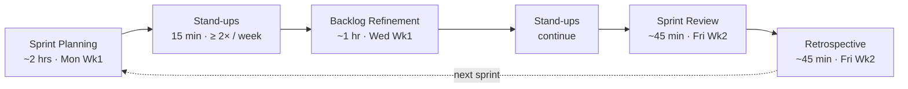
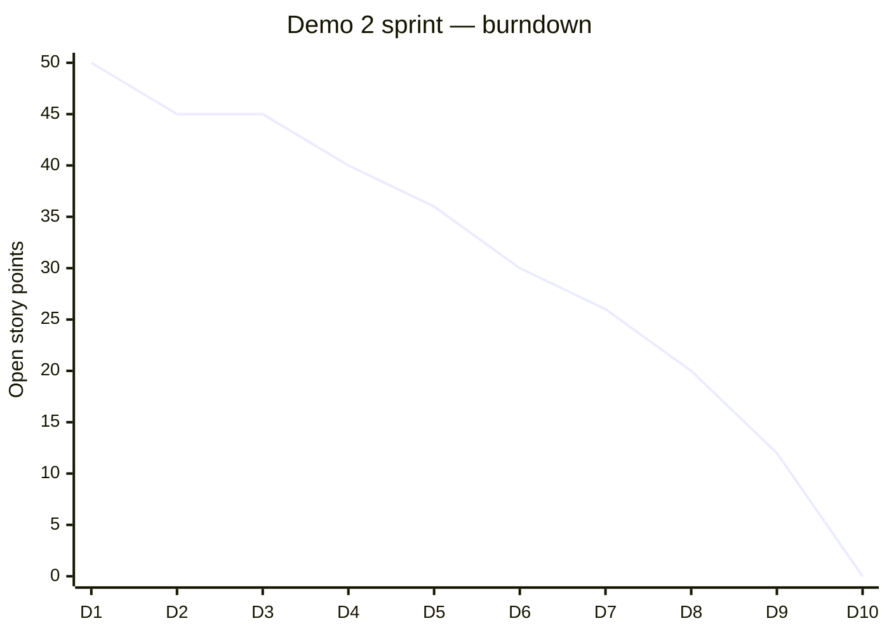
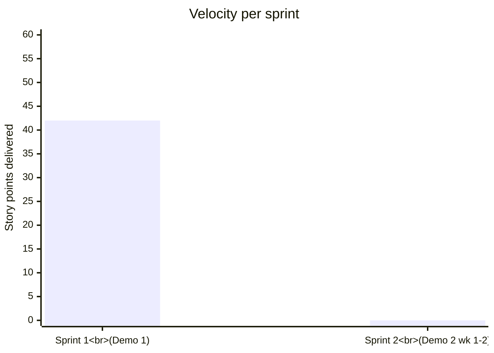

# Project Plan

  Demo 3 sprint in flight
  Methodology · Agile (Scrum)
  Sprint cadence · 2 weeks

!!! abstract "Document overview"
    This document captures *how* the Gesture-Based Drone Control System
    (GBDCS) is being delivered. It is built around **Agile** as the
    methodology and **Scrum** as the framework.

    The plan is the bridge between [SRS](SRS.md) (*what* we are
    building), [SAS](SAS.md) (*how* it is structured), and [BRAND](BRAND.md)
    (*what it looks like*) — it answers *when* and *in what order*.

---

## 1. Methodology

### 1.1 Why Agile

The team adopts **Agile** because the problem is volatile: gesture
recognition accuracy, drone-SDK behaviour, and operator expectations
cannot be fully specified up front and will be discovered iteratively.
The four values of the **Agile Manifesto** are adopted verbatim — the
team values the items on the left more than the items on the right.

| We value | … over |
| --- | --- |
| Individuals and interactions | Processes and tools |
| Working software | Comprehensive documentation |
| Customer collaboration | Contract negotiation |
| Responding to change | Following a plan |

### 1.2 Why Scrum on top of Agile

Within Agile, the team uses **Scrum** as the operating framework — fixed
roles, fixed ceremonies, two-week time-boxes — because the project has
hard, externally-imposed milestones (the four COS 301 demos) that benefit
from short, predictable iterations.

### 1.3 Scrum values

The five Scrum values guide every decision the framework itself does
not cover:

**Commitment.** The team personally commits to the goals of each sprint and to the demo it leads to.

**Focus.** Each sprint locks scope. Mid-sprint additions go to the backlog, never to the sprint board.

**Openness.** Blockers, doubts, and unknowns are surfaced in standup the day they appear.

**Respect.** Every team member is treated as capable and independent. No silent rewrites of someone else's work.

**Courage.** The team raises hard problems early, including telling the mentor when a target will slip.

---

## 2. Scrum Setup

### 2.1 Roles

The team's role assignments. Role boundaries are intentionally
permeable — every dev contributes across the stack and to testing.

| Role | Member | Why |
| --- | --- | --- |
| **Product Owner** | *Rotates demo-to-demo; primary contact with the EPI-USE mentor* | Owns the backlog and priorities; agrees Definition of Done with the team. |
| **Scrum Master + Dev** | Ayush Beekum | Strongest integration / cross-cutting experience; removes impediments and coaches the team on the process. |
| **Dev Team — Frontend lead** | Chinmayi Santhosh | UI engineering and React / Tailwind background. |
| **Dev Team — Frontend + QA** | Diya Narotam | UI / UX, PWA, Playwright / Jest / Vitest experience. |
| **Dev Team — DevOps & Infrastructure** | Jaitin Moodally | Homelab / multi-OS / low-level background; owns the CI/CD pipeline, containerisation, and deployment. |
| **Dev Team — CV & ML** | Shavir Vallabh | TechTeam at UP, ML and HPC experience; owns the CV pipeline, recogniser strategies, and drone-adapter integration. |

### 2.2 Ceremonies

The team runs the full Scrum ceremony set on a two-week cadence. In
addition to the in-sprint ceremonies, the team meets at least **twice
weekly** for the COS 301-mandated stand-ups (see §2.4).

*Figure 2.1 — The two-week Scrum cadence applied to GBDCS.*

| Ceremony | Length | Cadence | Purpose |
| --- | --- | --- | --- |
| Sprint Planning | ~2 hrs | Monday, Week 1 | Agree the sprint goal and pull stories from the product backlog into the sprint backlog. |
| Stand-up | 15 min | At least twice weekly | "Yesterday / today / blockers." Minutes logged in the Group Discussion on ClickUP (see §2.4). |
| Backlog Refinement | ~1 hr | Wednesday, Week 1 | Clarify, size, and split upcoming PBIs before the next planning session. |
| Mentor Meeting (lecturer) | ~30 min | Every second week | Alignment on documentation, scope, and team-dynamics issues. |
| Sprint Review | ~45 min | Friday, Week 2 | Demo the increment to the EPI-USE and academic mentors. |
| Retrospective | ~45 min | Friday, Week 2 | What worked, what didn't, what we commit to changing next sprint. |

### 2.3 Artifacts

Three Scrum artifacts are maintained.

- **Product Backlog** — the master list of every PBI for GBDCS
  (see [§4](#4-product-backlog)). Lives in the GitHub Project board.
- **Sprint Backlog** — the PBIs the team has pulled into the current
  sprint. Tracked as GitHub Issues.
- **Burndown Chart** — the open story-point total per day of the sprint
  (see [§7](#7-burndown--velocity)).

### 2.4 Meeting cadence and minute-logging

The COS 301 Demo 2 brief requires the team to maintain a documented
meeting cadence. The team complies as follows.

| Cadence | What | Where logged |
| --- | --- | --- |
| **At least twice weekly** | Stand-up (15 min). "Yesterday / today / blockers" per member. | Group Discussion on ClickUP for the current demo, with **date, time, and attendees**. |
| **Every second week** | Lecturer-mentor meeting. Documentation alignment, scope, team dynamics. | Group Discussion on ClickUP, with **date, time, and attendees**. |
| **As needed** | Industry-mentor check-in with EPI-USE. | Group Discussion on ClickUP, with **date, time, and attendees**. |

An assigned team member is responsible for posting the minutes after every
meeting. Missing minutes affect the team and individual marks per the
Demo 2 brief; they are not optional.

---

## 3. Definition of Ready &amp; Definition of Done

The Definition of Done is *agreed between the team and the PO,
realistic, within the team's control, short (5–8 items), well
understood, and visible*. Both DoR and DoD are pinned to the GitHub
Project board.

=== "Definition of Ready (DoR)"

    A backlog item is *Ready* to be pulled into a sprint when:

    1. It is written in the user-story format (As a … I want … so that …).
    2. It cites at least one requirement ID from the [SRS](SRS.md).
    3. It has at least one Given / When / Then acceptance criterion.
    4. It has been sized by the team (story-point estimate agreed).
    5. Its dependencies on other PBIs are listed.
    6. The team agrees it is small enough to complete inside one sprint
       (INVEST — *Small*).

=== "Definition of Done (DoD)"

    A backlog item is *Done* when:

    1. All acceptance criteria pass (manual + automated).
    2. Unit tests cover the new code at ≥ 80 % line coverage
       (per `R10.2`).
    3. Code has been reviewed and merged into `dev` via a pull request
       conforming to [`GIT.md`](GIT.md).
    4. CI is green on the merge commit (lint, type-check, test).
    5. The documentation site has been updated for any user-facing change.

---

## 4. Product Backlog

The product backlog is the flat, prioritised list of every PBI for the
system. PBIs are derived directly from the SRS — each maps to one or
more `R` identifiers and to one or more use cases.

| # | PBI | Use case | First targeted demo |
| --- | --- | --- | --- | --- |
| PBI-01 | Hand tracking pipeline | UC-1 | Demo 1 |
| PBI-02 | Telemetry dashboard | UC-2 | Demo 1 |
| PBI-03 | AirSim simulator adapter | UC-3 | Demo 1 |
| PBI-04 | Base features (login, themes, form validation) | Base Case | Demo 1 |
| PBI-05 | Rule-based gesture recognition | UC-1 | Demo 2 |
| PBI-06 | Gesture → command translation | UC-1 | Demo 2 |
| PBI-07 | Real-drone adapter  | UC-1 | Demo 3 |
| PBI-08 | Safety layer (idle, link loss, low battery, emergency stop) | UC-1, UC-2 | Demo 3 |
| PBI-09 | Gesture overlay on dashboard feed | UC-1 | Demo 2 |
| PBI-10 | Command + telemetry persistence + replay | UC-5 | Demo 2 |

PBIs targeted at Demo 3 and Demo 4 will be added to the backlog as the
team approaches them. Per the Scrum value of **Focus**, the team is
not pre-planning work beyond the next demo.

### 4.1 Demo 2 — 5-use-case coverage

The Demo 2 brief requires *five fully integrated use cases*. The
mapping below shows how the active backlog satisfies that requirement.
All five are existing use cases from [`SRS.md` §4](SRS.md#4-use-cases),
brought to production-quality "no mocks, full integration, unit and
E2E testing" status for Demo 2.

| Use case | New for Demo 2? |
| --- | --- | --- |
| UC-8 — Gesture Calibration | New (users calibrate before flying the drone) |
| UC-7 — User Tutorial | New (user help and tutorial page) |
| UC-4 — Different controller adapters | New (accessbility options for different ways to control the drone) |
| UC-6 — GPS tracker | New (tracks the drones movements and displays it on a graph with telemtetry data live) |
| UC-5 —True telemetry data live tracked | New |

---

## 5. Epics &amp; User Stories

The active backlog  is broken down into epics,
then into user stories using the standard *"As a … I want … so that …"*
template with Given / When / Then acceptance criteria.

### 5.1 Epic — Gesture Recognition (PBI-05, PBI-06)

!!! example "US-1 — Recognise the *Open Palm* gesture"
    **Story.**
    *As an operator, I want the system to recognise an open-palm gesture
    so that I can command the drone to hover.*

    **Value:** 40 &middot; **Size:** Medium &middot; **Maps to:** `R3.2.2`, `R4.1`

    **Acceptance criteria.**

    - **Given** the operator holds an open palm in view of the camera
      for ≥ 250 ms,
      **when** the pipeline classifies the frame,
      **then** the recognised gesture shall be `OPEN_PALM`.
    - **Given** the operator holds an ambiguous hand shape,
      **when** the classifier cannot meet the confidence threshold,
      **then** no command shall be issued (`R3.2.3`).
    - **Given** the lighting is below 200 lux,
      **when** the operator holds an open palm,
      **then** the dashboard shall surface a "low-light" warning
      (`R11.3`).

!!! example "US-2 — Recognise directional pointer gestures"
    **Story.**
    *As an operator, I want the system to distinguish pointer-left from
    pointer-right so that I can steer the drone horizontally.*

    **Value:** 30 &middot; **Size:** Medium &middot; **Maps to:** `R3.2.2`, `R4.1`

    **Acceptance criteria.**

    - **Given** the operator points the index finger left,
      **when** the pipeline classifies the frame,
      **then** the recognised gesture shall be `POINTER_LEFT`.
    - **Given** the operator points the index finger right,
      **then** the recognised gesture shall be `POINTER_RIGHT`.
    - **Given** the operator holds a fist (no extended finger),
      **then** neither pointer gesture shall be reported.

### 5.2 Epic — Command Translation (PBI-06)

!!! example "US-3 — Dispatch commands within latency budget"
    **Story.**
    *As an operator, I want my recognised gesture to translate into a
    drone command within 200 ms so that the drone feels responsive.*

    **Value:** 40 &middot; **Size:** Medium &middot; **Maps to:** `R4.3`, `R7.1`

    **Acceptance criteria.**

    - **Given** a gesture is recognised at time `t`,
      **when** the command translator dispatches the command,
      **then** the dispatch shall occur at `t + ≤ 200 ms` at the
      95th percentile.
    - **Given** a gesture maps to the same command as the previous frame,
      **when** the translator runs,
      **then** a duplicate command shall not be re-dispatched.

### 5.3 Epic — Real-Drone Adapter (PBI-07)

!!! example "US-4 — Plug a real drone in behind the existing interface"
    **Story.**
    *As a maintainer, I want the real-drone adapter to satisfy the same
    `DroneAdapter` interface as the simulator adapter so that the rest
    of the system requires no changes.*

    **Value:** 50 &middot; **Size:** Large &middot; **Maps to:** `R2.2`

    **Acceptance criteria.**

    - **Given** the active adapter is switched from `airsim` to
      `tello` via the environment variable,
      **when** the system is launched,
      **then** the pipeline shall connect to the physical drone with no
      change to any non-adapter source file.
    - **Given** the physical drone is unreachable,
      **when** the adapter attempts to connect,
      **then** an error shall be surfaced on the dashboard and take-off
      shall be refused (`R6.2.2`, `R11.3`).

### 5.4 Epic — Safety Layer (PBI-08)

!!! example "US-5 — Hover on idle"
    **Story.**
    *As an operator, I want the drone to hover whenever I stop gesturing
    so that it never drifts on its own.*

    **Value:** 50 &middot; **Size:** Small &middot; **Maps to:** `R6.1.1`

    **Acceptance criteria.**

    - **Given** the drone is airborne,
      **when** no gesture is detected for more than 3 s,
      **then** the system shall issue `HOVER`.
    - **Given** the system has issued `HOVER` for idle,
      **when** the dashboard receives the event,
      **then** an *"Idle — hovering"* indicator shall be shown
      (`R6.1.2`).

!!! example "US-6 — Auto-land on low battery"
    **Story.**
    *As an operator, I want the drone to land itself when the battery
    drops below 15 % so that I do not have to react to it.*

    **Value:** 50 &middot; **Size:** Small &middot; **Maps to:** `R6.2.1`

    **Acceptance criteria.**

    - **Given** the drone reports battery < 15 %,
      **when** the telemetry frame is received,
      **then** an auto-land sequence shall be initiated and a critical
      alert raised on the dashboard (`R1.2.1`).

!!! example "US-7 — Heartbeat / link-loss hover"
    **Story.**
    *As an operator, I want the drone to hover automatically if the
    link drops so that it does not fly off uncontrolled.*

    **Value:** 40 &middot; **Size:** Small &middot; **Maps to:** `R5.2.1`, `R5.2.2`

    **Acceptance criteria.**

    - **Given** the drone adapter has sent no telemetry for > 2 s,
      **when** the heartbeat check runs,
      **then** the system shall command `HOVER` and surface a banner
      alert.

### 5.5 Epic — Dashboard Live View &amp; Replay (PBI-09, PBI-10)

!!! example "US-8 — Live gesture overlay"
    **Story.**
    *As an operator, I want to see the MediaPipe skeleton drawn on the
    live feed so that I can tell whether the system is tracking my hand
    correctly.*

    **Value:** 20 &middot; **Size:** Small &middot; **Maps to:** `R1.1.1`

    **Acceptance criteria.**

    - **Given** the operator's hand is in frame,
      **when** the dashboard renders the feed,
      **then** the 21 landmark points and their connecting bones shall
      be drawn at no less than 24 FPS.

!!! example "US-9 — Persist a session for replay"
    **Story.**
    *As a reviewer, I want every command and telemetry frame to be
    logged so that I can replay a session afterwards.*

    **Value:** 25 &middot; **Size:** Medium &middot; **Maps to:** `R6.3`

    **Acceptance criteria.**

    - **Given** a session is active,
      **when** any command or telemetry frame is produced,
      **then** it shall be written to SQLite with an ISO-8601
      timestamp.
    - **Given** a recorded session exists,
      **when** the reviewer triggers replay,
      **then** the dashboard shall reconstruct the original gesture and
      telemetry stream at original cadence (UC-5).

---

## 6. Demo Plan

### 6.1 Demo 1 — Foundations &nbsp;<small>Delivered</small>

| Goal | Demonstrate the system skeleton: tracking + telemetry + simulator adapter + base features. |
| --- | --- |
| **PBIs delivered** | PBI-01, PBI-02, PBI-03, PBI-04 |
| **Requirements satisfied** | `R3.1.*`, `R3.2.1`, `R1.1.3`, `R5.1.2`, `R2.2`, `R16.*` |
| **Outcome** | Hand tracking, dashboard telemetry, AirSim adapter, and login / theme / validation features were demonstrated. Mentor feedback called out documentation formatting — addressed in this round of rewrites. |

### 6.2 Demo 2 — Recognition, Real Drone, Safety, Replay &nbsp;<small>In flight</small>

| Goal | Close the loop: recognise gestures, send commands to a real drone through the existing adapter interface, arm the safety layer, and demonstrate session replay — all five use cases fully integrated, no mocks. |
| --- | --- |
| **Sprint goal** | A live gesture demo on real hardware with the failsafes proven on stage, plus replay of the demo run from the dashboard. |
| **PBIs in scope** | PBI-05, PBI-06, PBI-07, PBI-08, PBI-09, PBI-10 |
| **Use cases brought to integration** | UC-1, UC-2, UC-3, UC-4, UC-5 |
| **Requirements newly satisfied** | `R3.2.2`, `R3.2.3`, `R4.*`, `R5.*`, `R6.*`, `R1.1.1`, `R1.1.2`, `R1.2.*`, `R8.1`, `R8.3` |
| **Demo-level Definition of Done** | Drone takes off, executes at least four distinct commands from gestures, hovers on idle, hovers on link loss, lands on low battery, and the session is reviewable in replay — all on a live, publicly-accessible deployment per the SAS deployment section. |

### 6.3 Demos 3 &amp; 4 &nbsp;<small>To be planned</small>

Per the Scrum value of **Focus**, the team is not pre-planning these.
Backlog refinement at the end of the Demo 2 sprint will surface the
Demo 3 PBIs from the SRS requirements that are not yet satisfied —
chiefly the `R7.*` performance bar, the `R9.*` reliability bar, and
the `R11.*` usability targets. Demo 4 will be planned at the close of
Demo 3 in the same way.

---

## 7. Burndown &amp; Velocity

Two charts are tracked across the project.

### 7.1 Sprint burndown (Demo 2 sprint, current)

*Figure 7.1 — Burndown for the current Demo 2 sprint. The straight line
from 50 → 0 over 10 working days is the ideal trajectory; the team's
actual line is plotted against it. Updated daily at stand-up.*

### 7.2 Velocity (story points per sprint)

*Figure 7.2 — Velocity after Sprint 1 (Demo 1). Sprint 2 closes at the
end of the current cadence; the bar will be filled at the sprint review.
Velocity will guide commitment in subsequent sprints — the team will not
pull more story points into a sprint than the rolling average.*

!!! note "Live updates"
    These charts are illustrative snapshots committed to the repo. The
    live burndown and velocity for each sprint are tracked on the
    GitHub Project board and updated at every stand-up and sprint
    review.

---

## 8. Blockers &amp; Mitigations

| # | Blocker | Status | Mitigation |
| --- | --- | --- | --- |
| B1 | Real-drone SDK behaviour (xFly / Tello) differs from AirSim | Tracking | Adapter parity tests; vendor support thread open; `DummyDroneAdapter` covers offline development. |
| B2 | Telemetry-format divergence between AirSim and physical drone | Tracking | Shared `TelemetryFrame` schema in `packages/contracts`; per-adapter translators map vendor payloads to the schema. |
| B3 | Latency variability under load | Tracking | Bounded-queue pipeline (see [SAS §2.1](SAS.md#21-architectural-patterns)); CPU profile in CI; latency harness planned for Demo 3. |
| B4 | Cloud-deployment provisioning not yet complete | Tracking | Render account being wired up during the Demo 2 sprint; local Docker-Compose path covers all dev and integration testing in the interim (see [SAS §5.3](SAS.md#53-reproducible-deployment)). |
| B5 | Time-zone overlap for joint mentor reviews | Resolved | Sprint Review scheduled in a window that suits both mentors. |

The Scrum Master logs every new impediment in the project board as it
surfaces in stand-up.

---

## 9. Buzzword Reference (GBDCS-specific)

A short reference of the terms used in this document, mapped to how
they apply on GBDCS.

| Term | Definition | What it looks like on GBDCS |
| --- | --- | --- |
| **PBI** | Product Backlog Item | A row in [§4](#4-product-backlog). |
| **Epic** | A large PBI broken into smaller stories | Each subsection of [§5](#5-epics--user-stories). |
| **User Story** | "As a … I want … so that …" | The `!!! example` blocks in §5. |
| **AC** | Given / When / Then conditions | The bullets inside each user story. |
| **DoR / DoD** | Definition of Ready / Definition of Done | [§3](#3-definition-of-ready--definition-of-done). |
| **Sprint** | Fixed 2-week time-box | The cadence in [§2.2](#22-ceremonies). |
| **Velocity** | Story points completed per sprint | [§7.2](#72-velocity-story-points-per-sprint). |
| **Story Points** | Relative effort estimate | The "Size" field on each user story (Small / Medium / Large). |
| **Impediment** | Anything blocking team progress | An entry in [§8](#8-blockers--mitigations). |
| **MVP** | Smallest thing that delivers real value | Demo 1 — hand tracking + telemetry + simulator. |
| **INVEST** | Independent · Negotiable · Valuable · Estimable · Small · Testable | Each story in §5 is checked against this before becoming Ready. |