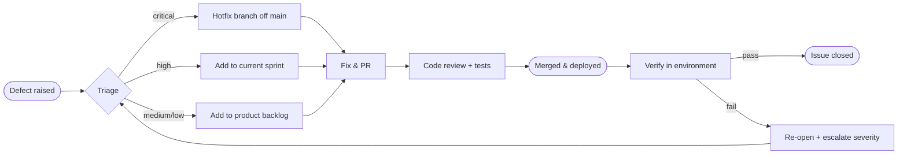

# Testing Policy

  Demo 2 deliverable
  Coverage gate · ≥ 80 % per module
  Severity · Critical / High / Medium / Low

!!! abstract "What this document covers"
    This is the **Testing Policy** for the Gesture-Based Drone Control
    System (GBDCS). It is the *contract* — what the team commits to
    when it comes to quality. The companion document
    [`TESTING.md`](testing/TESTING.md) is the operational *manual* — how
    to actually write and run the tests this policy mandates.

    The policy is binding on every contributor and is enforced through
    the CI/CD gates described in [`CICD.md`](CICD.md) and the
    pull-request rules in [`GIT.md`](GIT.md).

---

## 1. Purpose &amp; Scope

### 1.1 Purpose

This document defines the standards, procedures, and responsibilities
associated with software testing on GBDCS. It exists so that:

- The team has one clear answer to *"is this change accepted?"*
- The academic and industry mentors can audit the testing approach
  without reading the codebase.
- Future maintainers know what the bar was and why.

### 1.2 Scope

The policy covers all production source code in the repository, the
documentation that ships alongside it, the CI/CD pipeline, and the
deployed system. It does not cover throwaway code under `sandbox/`,
which is exempt by design (see §10 Exemptions).

### 1.3 Relationship to other documents

| Document | Role |
| --- | --- |
| [`SRS.md`](SRS.md) | Source of the quality requirements (R7 – R11) that the testing strategy verifies. |
| [`SAS.md`](SAS.md) | Source of the architectural decisions that the test types target. |
| [`PLAN.md`](PLAN.md) | Definition of Done that depends on this policy being satisfied. |
| [`CICD.md`](CICD.md) | The automated enforcement of this policy. |
| [`GIT.md`](GIT.md) | The pull-request workflow this policy gates. |
| [`TESTING.md`](testing/TESTING.md) | The operational manual — how to satisfy this policy in practice. |

---

## 2. Testing Objectives

Testing on GBDCS exists to verify five concrete things, each tied
back to a quantified quality requirement in the SRS.

| Objective | Verifies | Policy bar |
| --- | --- | --- |
| **Behavioural correctness** | Functional requirements R1 – R6, R16 | Every functional requirement has at least one automated test that exercises it end-to-end. |
| **Performance** | R7.* — gesture-to-command latency, FPS, dashboard render | Latency and FPS measured in a dedicated harness; regressions block merge to `main`. |
| **Security** | R8.* — token gating, secret hygiene, schema validation | No secrets in any commit (gitleaks-gated). 100 % of REST endpoints carry schema validation tests. |
| **Reliability** | R9.* — classification accuracy, false-positive rate, pipeline crash isolation | Recogniser accuracy is benchmarked against a labelled dataset every release; pipeline-crash recovery is verified by a chaos test. |
| **Maintainability** | R10.* — module coverage, deploy time | ≥ 80 % line coverage per module is enforced in CI. |
| **Usability** | R11.* — first-flight time, error messages | Manual UX audits and accessibility scans run before each demo. |

---

## 3. Testing Types

The team runs six classes of test. Each has a different owner, a
different runner, and a different gate.

### 3.1 Unit testing

| Property | Value |
| --- | --- |
| **Owner** | The author of the code under test. |
| **Runner** | `pytest` for Python (`apps/backend`, `services`); Vitest / Jest for TypeScript (`apps/frontend`). |
| **Scope** | Pure functions, classes in isolation, mocked collaborators. No real network, no real disk, no real drone. |
| **Gate** | Required on every PR to `dev`, `main`, or `Use-Case*`. |
| **Coverage target** | ≥ 80 % line coverage per module (`R10.2`). |
| **Naming** | `test_<unit-under-test>.py` or `<unit>.test.ts`. One assertion focus per test. |

### 3.2 Integration testing

| Property | Value |
| --- | --- |
| **Owner** | The author of the integration surface — e.g. the adapter author owns adapter integration tests. |
| **Runner** | `pytest` with the real component on one side and a controlled fake on the other. |
| **Scope** | Multi-component interactions: backend ↔ storage, pipeline ↔ recogniser, adapter ↔ telemetry manager, REST ↔ WebSocket. |
| **Gate** | Required on every PR to `dev` and `main`. |
| **Fakes &amp; doubles** | `DummyDroneAdapter` is the canonical fake for drone tests; an in-memory SQLite database is the canonical fake for storage tests. |

### 3.3 End-to-end (E2E) testing

| Property | Value |
| --- | --- |
| **Owner** | Authors of UI-touching changes contribute the scenarios. |
| **Runner** | **Playwright** against a fully wired-up dashboard talking to a real backend with the `DummyDroneAdapter`. |
| **Scope** | Whole-user journeys: login → start session → recognise gesture → see telemetry → emergency stop → review replay. |
| **Gate** | Required on every PR to `dev` or `main` that touches `apps/frontend/**`, `apps/backend/**`, or `packages/contracts/**`. |
| **Browser matrix** | Chromium + WebKit + Firefox, on Linux. |

### 3.4 Performance testing

| Property | Value |
| --- | --- |
| **Owner** | Shavir Vallabh, Jaitin Moodally and Ayush Beekum(CV / ML owner; latency budget owner). |
| **Runner** | Custom harness in `services/tests/perf/` invoking the pipeline at controlled FPS and recording the 95th-percentile latency. |
| **Scope** | `R7.1` (≤ 200 ms p95 gesture-to-command), `R7.2` (≥ 30 FPS at ≤ 70 % CPU), `R7.3` (≥ 24 FPS dashboard render). |
| **Gate** | Run before each demo and posted to the sprint review. A regression > 10 % from the previous demo blocks merge to `main`. |

### 3.5 Accessibility testing

| Property | Value |
| --- | --- |
| **Owner** | Chinmayi Santhosh (frontend lead) + Diya Narotam (QA lead). |
| **Runner** | Lighthouse Accessibility audit, axe DevTools, WAVE — targets per [`BRAND.md` §8.6](BRAND.md#86-audit-targets). |
| **Scope** | WCAG 2.2 AA conformance on every operator-facing surface. |
| **Gate** | Manual run before each demo while the audit-on-PR job is *planned for Demo 2*. |

### 3.6 Manual exploratory testing

| Property | Value |
| --- | --- |
| **Owner** | The whole team — every member contributes one exploratory session per demo. |
| **Runner** | Human + real drone (or AirSim). |
| **Scope** | Edge cases the automated suite cannot reach: weird lighting, occluded hand, battery edge, mid-flight link loss, two hands in frame. |
| **Gate** | Defects raised here follow §6 Defect Management. Demos do not ship with any open Critical defect. |

---

## 4. Tools and Environments

### 4.1 Tools

| Concern | Tool | Configured in |
| --- | --- | --- |
| Python lint | **Ruff** | `pyproject.toml` |
| Python tests | **pytest** + `pytest-cov` | `pyproject.toml` |
| TypeScript lint | **ESLint** | `eslint.config.js` |
| TypeScript format | **Prettier** | `.prettierrc` |
| Browser E2E | **Playwright** | `playwright.config.ts` |
| Static type-check (Python) | **mypy** *(planned)* | `pyproject.toml` |
| Static type-check (TS) | **tsc --noEmit** | `tsconfig.json` |
| Accessibility | **Lighthouse / axe / WAVE** | Run manually pre-demo; CI integration *planned for Demo 2*. |
| Secrets scanning | **gitleaks** *(planned for Demo 2)* | `.github/workflows/secret-scan.yml` |
| Coverage reporting | `pytest-cov` + `c8` (TS) | `pyproject.toml`, `package.json` |
| CI runner | **GitHub Actions** | `.github/workflows/` |

### 4.2 Environments

| Environment | What runs there | Test gating |
| --- | --- | --- |
| **Local developer machine** | Full stack under Docker Compose with `DummyDroneAdapter`. | Author runs unit + integration + E2E locally before pushing. |
| **CI (GitHub Actions)** | Lint and test workflows per [`CICD.md`](CICD.md). | All required checks must pass before merge to a protected branch. |
| **Staging** *(planned for Demo 2)* | Same artefact as production, separate Render service. | Smoke tests against the deployed staging URL after every push to `dev`. |
| **Production** *(planned for Demo 2)* | Live deployment on Render. | Post-deploy health-check + a single smoke E2E run. |

---

## 5. Acceptance Criteria

A change is *accepted* into a protected branch only when **every** item
below is satisfied. This is the union of the Definition of Done in
[`PLAN.md` §3](PLAN.md#3-definition-of-ready--definition-of-done) and
the testing-specific gates that live in this policy.

1. **All automated tests pass** in CI on the merge commit — lint
   (Ruff, ESLint, Prettier), unit, integration, and (where applicable)
   E2E.
2. **Coverage gate is green** — ≥ 80 % line coverage per touched module;
   CI fails the PR otherwise.
3. **No new Critical or High defects** are open against the touched
   area.
4. **Code review approval** is in place per [`GIT.md` §4.3](GIT.md#43-review-requirements).
5. **Manual smoke** has been run by the PR author on their local stack
   for any change that touches a user-visible surface or the drone
   adapter.
6. **Performance has not regressed** beyond 10 % on any tracked metric
   (`R7.*`) if the change touches the CV pipeline or the gesture-to-command
   path.

Failing any single item blocks the merge.

---

## 6. Defect Management

### 6.1 Where defects live

Every defect is a **GitHub Issue** on the project repository, with the
`bug` label and a severity label (`severity:critical` / `severity:high`
/ `severity:medium` / `severity:low`). Defects discovered during a
sprint go straight onto the sprint board if they block the sprint
goal; otherwise they land on the product backlog and are triaged at
the next backlog refinement.

### 6.2 Severity scale

| Severity | Description | Examples on GBDCS |
| --- | --- | --- |
| **Critical** | Renders the system unusable or unsafe; demo cannot proceed. | Drone refuses to land on command. Emergency-stop control does nothing. Auth bypass. Pipeline crash with no failsafe trip. |
| **High** | A primary use case is broken or substantially degraded. | A documented gesture is not recognised. Telemetry stops updating. Replay view fails to load any recorded session. |
| **Medium** | A non-primary feature is broken, or a primary feature works but is wrong in detail. | Light/dark theme toggle does not persist. A toast lingers past its dismissal time. Latency p95 measures 240 ms instead of 200 ms. |
| **Low** | Cosmetic, copy, or minor edge-case issue. | Misaligned icon. Typo in an error message. Tooltip clipped at the viewport edge. |

### 6.3 Service-level expectations

These are the team's targets — not contractual SLAs, but the cadence
the team commits to in front of mentors.

| Severity | Acknowledge | Triage | Fix target |
| --- | --- | --- | --- |
| Critical | Same day | Same day | Hotfix branch off `main` per [`GIT.md` §6](GIT.md#6-hotfix-flow); deployed before the next demo. |
| High | Within 1 working day | At the next stand-up | Inside the current sprint. |
| Medium | Within 2 working days | At the next backlog refinement | Inside the current or next sprint. |
| Low | Logged | At the next backlog refinement | Whenever the relevant area is next touched. |

### 6.4 Workflow

*Figure 6.1 — Defect lifecycle. Every defect ends with explicit
verification before the issue is closed.*

### 6.5 Regression protection

Every Critical or High defect, once fixed, **must** ship with at least
one new automated test that fails against the broken code and passes
against the fix. This protects against the same defect ever returning.

---

## 7. Roles &amp; Responsibilities

Every team member carries both **development** and **testing** duties
— there are no testing-only or development-only roles. The
distribution below shows where each member leads in addition to their
default share of unit / integration testing for their own code.

| Member | Default duty (every PR they author) | Testing leadership |
| --- | --- | --- |
| **Ayush Beekum** (Scrum Master + Dev) | Unit + integration tests for own code. | Owns the policy itself; runs the pre-demo dry run; chairs the test-strategy retro. |
| **Chinmayi Santhosh** (Frontend lead) | Unit tests on every component; visual smoke before PR. | Co-owns accessibility audits with Diya; owns component-level snapshot tests. |
| **Diya Narotam and Chinmayi Santhosh** (Frontend + QA lead) | Unit + integration tests for own code. | **E2E lead** — owns the Playwright suite and the manual exploratory rotation; co-owns accessibility audits. |
| **Jaitin Moodally** (DevOps + Infrastructure) | Unit + integration tests for own code. | Owns the CI configuration that enforces this policy; owns the gitleaks workflow once introduced. |
| **Shavir Vallabh** (CV + ML) | Unit + integration tests for own code. | **Performance lead** — owns the latency / FPS harness; owns the recogniser-accuracy benchmark. |

### 7.1 Other stakeholders

| Stakeholder | Testing-related role |
| --- | --- |
| **Industry mentor (EPI-USE)** | Reviews the test approach at fortnightly check-ins; raises any quality concerns to the Scrum Master and accepts each story in sprint review against the acceptance criteria written into it. |
| **Academic mentor** | Reviews documentation and CI evidence each second week. |

---

## 8. Test Data &amp; Privacy

- **No production data is used in testing.** Test fixtures are
  synthetic gesture-frame datasets and synthetic telemetry sequences.
- **The labelled gesture dataset** used for the recogniser-accuracy
  benchmark is contributed by the team and committed under
  `services/tests/datasets/`. It contains no personally identifying
  information.
- **No live webcam capture is committed** to the repository for any
  purpose. Test inputs are pre-recorded video frames or synthetic
  landmark sequences.
- **Secrets** required for tests (e.g. test-only JWT signing keys) are
  generated at test-runtime; nothing sensitive is ever committed.

---

## 9. Release Readiness

Before any demo, the team runs the **Release Readiness Checklist**
below. The Scrum Master records the result and posts it to the
ClickUP group discussion before the demo slot.

- [ ] CI is green on the demo tag.
- [ ] No open Critical defect; no open High defect against a demo
      feature.
- [ ] Coverage report meets the gate on every touched module.
- [ ] The performance harness has been run on the demo branch and the
      results are within budget.
- [ ] An accessibility audit (Lighthouse + axe) has been run on the
      live dashboard and meets the targets in
      [`BRAND.md` §8.6](BRAND.md#86-audit-targets).
- [ ] Every team member has completed one exploratory testing session
      against the demo build and logged any findings.
- [ ] A backup demo recording exists in case the live system
      misbehaves.

---

## 10. Exemptions

The following are explicitly **out of scope** of this policy. They
are exempt from the coverage gate and the merge gates, though they
must still pass lint.

- `sandbox/` — exploration / proof-of-concept scripts.
- `docs/**` — markdown is reviewed but not unit-tested.
- One-off migration scripts under `infrastructure/scripts/`.
- Generated code (e.g. type bindings from OpenAPI).

Anything added to this list requires a PR that updates this section
and is approved by the Scrum Master.

---

## 11. Policy Review

This policy is reviewed at the **retrospective** of every demo
sprint. Material changes (new tools, new gates, role changes) require
the team's consensus and an update to this document in the same PR.

| Version | Date | Author | Notes |
| --- | --- | --- | --- |
| 1.0 | Demo 2 | Codex Merchants | Initial policy for the Demo 2 deliverable. |