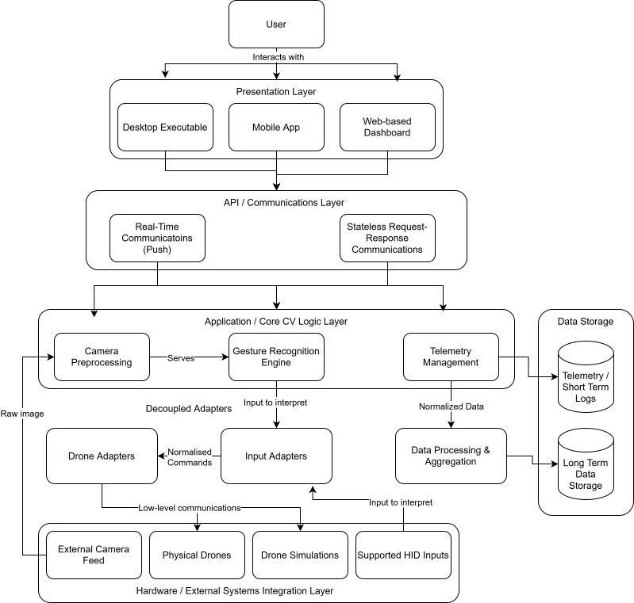
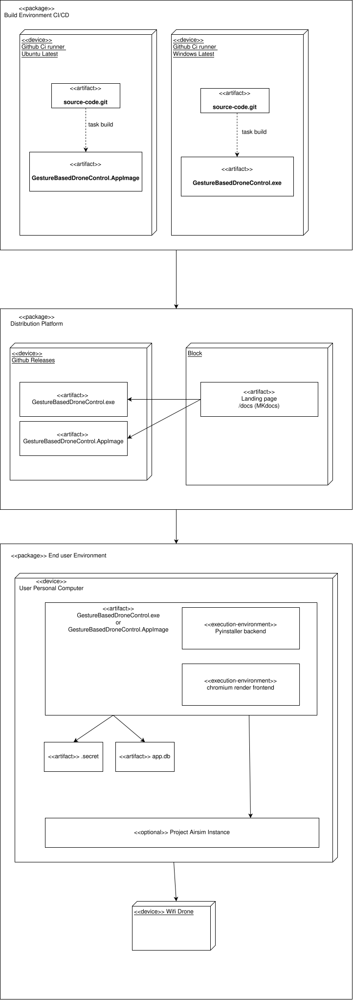
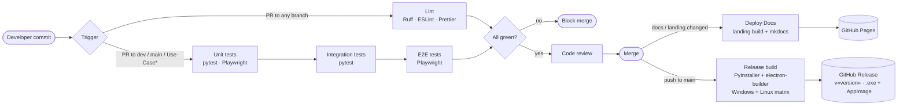

# Software Architecture Specification

<div class="tx-badges">
  <span class="tx-status"><span class="tx-status__dot"></span>Demo 3 deliverable</span>
</div>

!!! abstract "What this document covers"
    This is the primary technical specification of the system. Whereas the [SRS](SRS.md)
    specifies what the Gesture-Based Drone Control System must
    do, this document specifies how the system is designed to
    satisfy those requirements. It includes the architectural design considerations,
    details on the tech stack, our architecture and deployment strategy, etc.

---

## 1. Introduction

### 1.1 Purpose

This SAS is the canonical architectural reference for GBDCS. It
documents:

- the **architectural and design patterns** that organise the codebase;
- the **constraints** that bound the design;
- an ** architectural diagram** and the
  **mapping from quality requirements to architectural decisions**;
- the **technology stack** chosen and justified;
- the **API contracts** between subsystems;
- the **deployment topology** put in place,
  including the **CI/CD pipeline** that builds and ships it.

### 1.2 Scope

This document covers the system as designed for Demo 3 and is
maintained for subsequent demos. It complements:

- [`SRS.md`](SRS.md) - *what* the system must do (functional
  requirements, use cases, domain model, quantified quality
  requirements);
- [`BRAND.md`](BRAND.md) - *what the system looks like* (design system,
  component library, brand guidelines);
- [`CICD.md`](CICD.md) - the operational detail of the CI/CD pipeline
  summarised in §5.4 of this document;
- [`GIT.md`](GIT.md) - the human-side branching and review workflow
  that feeds the pipeline.

### 1.3 Stakeholders

| Stakeholder | Interest in this document |
| --- | --- |
| Development team | Authoritative reference for how to slot new code in. |
| Capstone & industry mentors | Evidence that architectural decisions trace to requirements. |
| Future maintainers | Single source of truth for "why is it built this way?". |

---

## 2. Architectural Requirements

### 2.1 Architectural Patterns

GBDC involves the integration of several subsystems into one coherent product.
Thus, elements from several architectural patters are utilized.

| Subsystem | Architectural style | Rationale |
| --- | --- | --- |
| **Backend API + Operator Dashboard** | **6-Tier** | The system is broken down into 6 decoupled tiers, separating hardware input from CV pipeline, API, Frontend, etc. |
| **CV / Gesture Pipeline** | **Pipes-and-Filters** (using an asynchronous main-program + subroutines) | The pipeline is a transformational subsystem: a chain of independent stages (capture -> preprocess -> landmark detection -> classify) are connected by bounded queues |
| **Drone Adapter Layer** | **Event-Driven** | The connected `DroneAdapter` emits telemetry asynchronously; This data is handled statefully by the frontend, for example recording flight logs and drone tracking |

### 2.2 Design Patterns

=== "Adapter"

    **Intent.** A unique two-way adapter is in place to decouple input methods
    from drones, and ensure cross-compatibility on all fronts.

    **Participants.** `DroneAdapter` (target interface);
    `XFlyAdapter`, `AirSimAdapter`, `ProjectAirSimAdapter`
    (adaptees).

    `InputAdapter` as well as `KeyboardAdapter`, `GamepadAdapter`, follow suit.

    **Why here.** Hardware integration tends to be a challenge. Each input method varies greatly, 
    as does each drone. Designing their interfaces like this guarantees that every input method is automatically
    fully compatible with each drone implementation, and vice versa.

    **Realises.** `R2.*`, `R4.*`, `R5.*`.

=== "Strategy"

    **Intent.** Make the gesture-classification algorithm
    interchangeable at runtime.

    **Participants.** `GestureRecognizer` (strategy interface);
    `RuleBasedRecognizer`, `MLGestureRecognizer` (concrete strategies);
    `GestureEngine` (context).

    **Why here.** The rule-based recogniser is deterministic and ships
    as the baseline. The TFLite recogniser is used for more complex or 
    ambiguous gestures and can be used to increase interpretation accuracy. 

    **Realises.** `R3.2.*`, `R9.1`, `R9.2`.

=== "Singleton"

    **Intent.** Used by the CalibrationManager and CV pipeline to ensure that 
    there can only be one of each. 

    **Participants.** `CalibrationManager`, `CvPipeline`

    **Why here.**  Only one of each of these classes are needed at runtime, formally enforcing this
    increases the integrity and safety of these components


### 2.3 Constraints

| # | Constraint | Reason |
| --- | --- | --- |
| C1 | The backend and CV pipeline shall be implemented in Python 3.11.x. | Libraries we depend on, such as MediaPipe and ProjectAirSim, have limited compatibility |
| C2 | The frontend shall be implemented in TypeScript with React 18+. | Best compatibility, especially with packaging the app with Electron or Capacitor |
| C3 | All inter-process communication shall use JSON over WebSocket or HTTP | Consistency across subsystems, and easier to debug and maintain |
| C5 | The host machine shall be a single workstation with low-mid range specs (iGPU). | PAS may need higher specs since its in UE5, but the core app should run on any modern hardware |
| C6 | No credentials, API keys, or connection strings may be committed to the repository. | General security needs; realises `R8.2`. |
| C7 | The main branch shall be deployable to a non-local environment automatically. | Demo 2 brief, §3.2.3 - Environment Parity. |
| C8 | A deployment shall be reachable via a public URL on Demo day. | The product needs to be packaged as commercial software |
| C9 | The CV pipeline may not transmit any telemetry to third-party services at runtime. | Privacy / `R8.2` (security) and SRS §3.3 product scope. |

### 2.4 Architectural Diagram



*Figure 2.1 - Technology-neutral architectural diagram.

#### 2.4.1 Component responsibilities

| Component | Responsibility | Allocated requirements |
| --- | --- | --- |
| **Operator Dashboard** | Main point of interaction. Displays the live feed, overlay, gesture indicator, telemetry, alerts, and Help menu. | `R1.*`, `R11.*`, `R16.*` |
| **WebSockets Endpoints** | Responsible for broadcasting and receiving stateful live data; telemetry, inputs, etc. | `R2.3`, `R5.1.2`, `R8.1` |
| **REST API** | Stateless, less time-sensitive operations. Auth, input switching, initial connections  | `R2.4`, `R8.3`, `R16.*` |
| **GestureEngine** | Interprets and broadcasts gestures being performed  | `R3.2.*`, `R9.1`, `R9.2` |
| **CV Pipeline** | Capture -> preprocess -> landmark detection -> classification, with bounded queues between stages. | `R3.*`, `R7.2` |
| **Telemetry** | Responsible for getting, formatting, and broadcasting live telemetry data for all compatible drones | `R5.*`, `R6.1.*`, `R6.2.*` |
| **DroneAdapter** layer | Hides SDK differences; one implementation per target drone or simulator. | `R2.2`, `R4.3`, `R5.*` |
| **InputAdapter** layer | Accepts different HID inputs, and provides a common interface to forward commands to DroneAdapters | `R2.2`, `R4.3`, `R5.*` |
| **Storage Manager** | SQLite-backed persistence for `GestureLog`, `TelemetryData`. | `R6.3` |

### 2.5 Mapping Quality Requirements to Architectural Decisions

The five quantified quality requirements in [`SRS.md` §3.3](SRS.md#33-non-functional-quality-requirements)
map to specific architectural decisions in this document.

| Quality requirement | Target | Architectural decision |
| --- | --- | --- |
| **Performance** - gesture-to-command latency <= 200 ms p95 (`R7.1`); pipeline >= 30 FPS at <= 70 % CPU (`R7.2`); dashboard >= 24 FPS (`R7.3`) | < 200 ms p95 | (i) Pipes-and-Filters CV pipeline with **bounded queues** between stages so stages can be tuned independently; (ii) **WebSocket push** from backend to dashboard |
| **Security** - token-gated WS, no committed secrets, schema-validated APIs (`R8.1`–`R8.3`) | 30-min tokens; 0 secrets in repo; 100 % schema coverage | (i) **Token-gated WebSocket gateway** - short-lived JWT issued by `/auth/login`; (ii) **secrets loaded from environment** via the `.env.example` pattern per [`CICD.md`](CICD.md); (ii) **JSON-schema validation** at the REST boundary, rejecting malformed payloads with `400 Bad Request`. |
| **Reliability** - >= 95 % classification accuracy (`R9.1`); <= 1 % false positives (`R9.2`); pipeline crash isolated, failsafe <= 1 s (`R9.3`) | >= 95 % / <= 1 % / <= 1 s | (i) **Strategy pattern** on the recogniser so a stronger classifier can be swapped in without disturbing the engine; (ii) **process isolation** between the CV pipeline and the backend - a pipeline crash trips a supervisor that puts the drone in `HOVER` and surfaces an error within 1 s; (iii) **Observer fan-out** on telemetry so the failsafe path does not block on dashboard delivery. |
| **Maintainability** - declared imports only (`R10.1`); >= 80 % coverage (`R10.2`); <= 30-min merge-to-deploy (`R10.3`) | one-way imports; >= 80 %; <= 30 min | (i) **One-way package import graph** (Figure 2.1) - the GUI depends on the backend, the backend on the domain, the domain on infrastructure; never the reverse; (ii) **CI coverage gate** at 80 % per module in [`CICD.md`](CICD.md); (iii) **Push-triggered deploy** on `main` *(planned for Demo 2)* so the deploy step is at most a few minutes. |
| **Usability** - first-flight in <= 5 min (`R11.1`); >= 85 % satisfaction (`R11.2`); 100 % actionable error messages (`R11.3`) | <= 5 min / >= 85 % / 100 % | (i) **In-product Help Menu** linked from the dashboard chrome (see Demo 2 brief §3.8); (ii) **single-view dashboard** - feed, gesture, telemetry, alerts visible without navigation, per the wireframes in [`BRAND.md`](BRAND.md); (iii) **error envelope contract** - every backend error returns a `cause` and a `suggestion` field, enforced by schema. |

---

## 3. Technology Requirements

Each row below names a technology, the role it plays in GBDCS, the
quality requirement it most directly supports, and the alternative the
team considered and rejected.

### 3.1 Runtime stack

| Concern | Choice | Version | Justification | Alternative considered |
| --- | --- | --- | --- | --- |
| Backend language & runtime | **Python** | 3.11.x | Compatibility for MediaPipe, OpenCV, ProjectAirSim, etc. Ease of use for the domain, and industry standard for similar projects. | Node.js - rejected for library compatibility, specifically due to MediaPipe and ProjectAirSim. |
| Backend web framework | **FastAPI** | 0.110+ | Most coherence with the rest of our backend, ease of use for both REST and WebSockets endpoints. | None. This was the obvious choice to us. |
| Frontend language | **TypeScript** | 5.x | Type safety across the WS message envelope. | Plain JS - reliability due to poor type checking. |
| Frontend framework | **React** | 18 | Team familiarity + ecosystem fit with Electron / Capacitor packaging; concurrent rendering keeps the live feed and telemetry panel responsive at >= 24 FPS (`R7.3`). | Vue - viable but the team's React experience was deeper. |
| CV - landmark detection | **MediaPipe Hands** | 0.10+ | 21-point landmark model is the reference solution for the problem; runs on relatively weak hardware. | None. This was the clear choice for compatibility and reliability |
| CV - frame capture | **OpenCV** | 4.8+ | The universal abstraction over UVC cameras; same code path works on Win / macOS / Linux. | Vendor-specific capture APIs - rejected for portability. |
| Optional ML recogniser | **TensorFlow Lite** | 2.x | Lightweight on-device inference; opt-in via the Strategy pattern in §2.2. | Full TensorFlow - rejected; runtime costs are far too high. |
| Local persistence | **SQLite** | 3.x | Zero-config; file-based; `R8.2` (no external service) is trivially satisfied; the storage volume cap in `R6.3` is well within SQLite's comfort zone. | PostgreSQL - rejected for Demo 2 because it adds a service to provision; the Persistence Framework style means it can be added later without domain changes. |
| Drone simulator | **ProjectAirSim** | latest | Free, scriptable, sufficient for UC-3 demonstration without flight-hardware risk. | Gazebo - heavier setup, worse SDK. |
| Desktop packaging | **Electron** | latest | Ships the dashboard as a desktop app with native webcam access. Easy packaging | Tauri - viable; Electron chosen for team familiarity. |

### 3.2 Build, test, and operations

| Concern | Choice | Justification |
| --- | --- | --- |
| Python dependency manager | **uv** 0.11.x | Significantly faster installs than `pip` |
| Task runner  | **Task(Taskfile.yml)** | Same commands on Windows, macOS and Linux; CI runs the identical targets |
| Python lint | **Ruff** | One tool, fast, fails fast on violations. |
| JS / TS lint & format | **ESLint + Prettier** | Lint catches bugs; Prettier eliminates style debates. |
| Test runner (Python) | **pytest** | backend testing coverage for api and services files |
| Test runner (JS / TS) | **Playwright** | True E2E, including WebSocket. Browsers [`CICD.md`](CICD.md). |
| CI runner | **GitHub Actions** | 4 workflows: lint, test,docs, release,  documented in [`CICD.md`](CICD.md). |
| Docs site | **MkDocs Material** | Auto-deploy to GitHub Pages on push with landing page. |
| Hosting (frontend) | **Render Static Site** | A static site on github pages that maintains our docs, landing page, and a download link for the executable. |
| App distribution | **GitHub Releases | Windows `.exe` and Linux `.AppImage` built and published automatically from `main`. |

---

## 4. API Contracts

The backedn exposes everything under a single `/apiz prefix, grouped into routers. Every request and response body is a Pydantic schema, so malformed payloads are rejected with 4xx and the full contract is served at `/docs` (OpenAPI).

### 4.1 Authentication (`/api/auth`)

Cookie-based JWT, `login` and `signup` set an access token and a refresh token as httpOnly cookies; `refresh` rotates the access token; `logout` clears both, and because the tokensa are in the cookies, the frontend and WebSocket connection authenticate without handling tokens in JS.

| Method | Path | Purpose |
| --- | --- | --- |
| `POST` | `/api/auth/signup` | Register; validates email and password strength; registers a new user. |
| `POST` | `/api/auth/login` | Authenticate; validates an existing user and returns a set of valid tokens on success. |
| `POST` | `/api/auth/refresh` | Issue a fresh access token and jwt stored in httponly cookies. |
| `POST` | `/api/auth/logout` | Clear auth cookies. |
| `GET` | `/api/auth/health` | Liveness. |

### 4.2 Drone control (`/api/drone`)

| Method | Path | Purpose |
| --- | --- | --- |
| `POST` | `/api/drone/connect` | Connect an adapter. Body selects `adapter` (`dummy`, `airsim`, `projectairsim`) plus host/port/vehicle options; switching adapters disconnects the previous one seamlessly. |
| `POST` | `/api/drone/disconnect` | Disconnect the current adapter. |
| `GET` | `/api/drone/status` | Snapshot of the connected adapter's state. |
| `WS` | `/api/drone/ws/telemetry` | Live telemetry stream. |
| `WS` | `/api/drone/ws/commands` | Command channel to the connected drone. |

### 4.3 Input (`/api/input`)

Same shape as the drone router: `connect` / `disconnect` / `status` for input adapters (`dummy`, `keyboard`, `gamepad on frontend UI`), plus `WS /api/input/ws/keybaord` and `WS /api/input/ws/gamepad` for streaming raw input events from the frontend.

## 4.4 Gestures and calibration

| Method | Path | Purpose |
| --- | --- | --- |
| `GET` | `/api/gestures` | The gesture vocabulary the recogniser supports. |
| `WS` | `/api/gestures/stream` | Live annotated camera frames plus recognised gestures. |
| `GET` | `/api/calibration/status` | Current calibration state. Flight endpoints return `409` until this reports `is_calibrated: true` (completed or skipped). State is in-memory, so a backend restart resets it. |
| `POST` | `/api/calibration/start` | Start or restart a calibration run over the full gesture sequence. |
| `POST` | `/api/calibration/skip` | Mark the user calibrated without the sequence, for returning operators. |
| `WS` | `/api/calibration/stream` | Live calibration progress; connecting starts a fresh run. |

## 4.5 Analytics (`/api/analytics`)

`GET /api/analytics/flights` lists flight records and
`GET /api/analytics/summary` aggregates them for Analytics page.

## 4.6 Adapter interfaces

Every drone adapter implements the same async interface: `connect`, `disconnect`, an `execute`/command path covering the `CommandType` enum (`TAKEOFF`, `LAND` the `MOVE_*` set, `ROTATE_SW`/`CCW`, `HOVER`, `EMERGENCY_STOP`, `ANALOG`), and a telemetry stream. Commands carry a priority: `EMERGENCY_STOP` is always `PRIORITY_CRITICAL`, so it pre-empts anything queued. Input adapters implement `set_handler` and emit `Command` objects, which is what makes any input source compatible with the drone sim.

---

## 5. Deployment

### 5.1 Environments

| Environment | What runs there | Deployed how |
| --- | --- | --- |
| **Development** | Full stack on the developer's machine: `task dev` (uvicorn + Vite). SQLite for database management. | Manual, local. |
| **Public site** | Landing page (site root) and documentation hub (`/docs`) on GitHub Pages. | Automatic on push to `main`/`dev` through the docs workflow. |
| **Distributed app** | Packaged desktop app: Electron to package the app and provided on windows `.exe` and and Linux `.AppImage`. | Automatic push to `main` through the release workflow; published as a versioned GitHub Release. |

The public URL is 
[cos301-se-2026.github.io/Gesture-Based-Drone-Control](https://cos301-se-2026.github.io/Gesture-Based-Drone-Control/),
linked from the README, with the app download available from the
repository's Releases page.

### 5.2 Deployment Diagram


*Figure 5.1 - Production deployment topology. The entire runtime (frontend, backend, CV pipeline, database) runs on the user's workstation inside the packaged app. GitHub hosts the landing page and docs sits and distributes the builds through GitHub releases.*

### 5.3 Reproducible deployment

A fresh clone of the `main` comes up with:

```bash
git clone https://github.com/COS301-SE-2026/Gesture-Based-Drone-Control.git
cd Gesture-Based-Drone-Control
 
cp .env.example .env      # set ports and secrets locally
task prereqs              # optional: installs Python 3.11, uv, node, yarn
task install              # uv sync + yarn install
task dev                  # backend + frontend in dev mode
```

the packaged equivalent is `task build`, which is exactly what the release workflow runs on both OS runners, so a local build and a CI build are the same artifactt.


### 5.4 CI/CD Pipeline

The pipeline is documented in full in [`CICD.md`](CICD.md). Commit to shipped artifact:



*Figure 5.2 - Pipeline stages, tools and artifacts.*

### 5.5 Secrets Management

- `.gitignore` `.env`; `env.example` documents every variable with a placeholder.
- CI secrets (Codecov token, JWT test key) live in GitHub Actions Secrets and are exposed only through `env:` blocks where needed.
- The packaged app reads its configuration from the environment at runtime; nothing sensitive baked into a build.

### 5.6 Rollback Strategy

Every push to 'main` produces a versioned GitHub Release, so the release history is the rollback mechanism:

1. Indentify the last known-good release tag.
2. Point users at that release's artifacts; nothing needs rebuilding
3. 'git revert' the bad commit on `main` via PR, which produces a new fixed release.

For the site, Pages serves the last successful `gh-pagez push, so a broken docs build changes nothing until the next green push.

---

