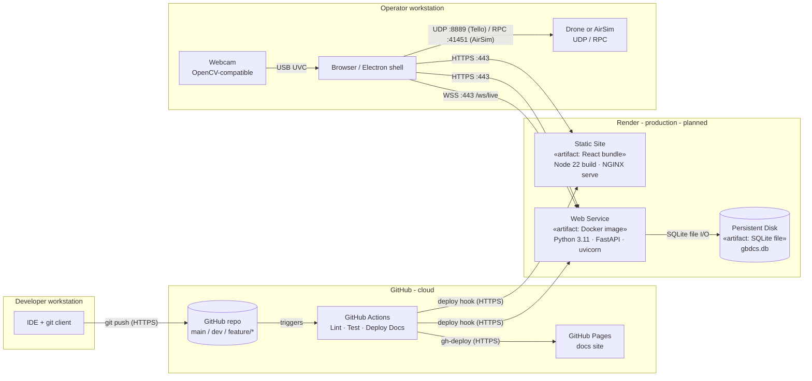
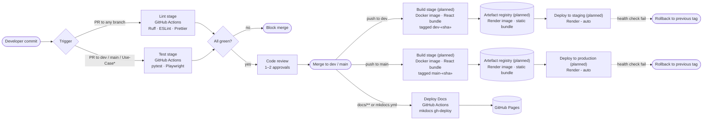

# Software Architecture Specification

<div class="tx-badges">
  <span class="tx-status"><span class="tx-status__dot"></span>Demo 2 deliverable</span>
</div>

!!! abstract "What this document covers"
    This is the primary technical specification of the system. Whereas the [SRS](SRS.md)
    specifies what the Gesture-Based Drone Control System must
    do, this document specifies how the system is designed to
    satisfy those requirements. It includes the architectural design considerations,
    details on the tech stack, our architecture and deployment strategy, etc.

---

## 1. Introduction

### 1.1 Purpose

This SAS is the canonical architectural reference for GBDCS. It
documents:

- the **architectural and design patterns** that organise the codebase;
- the **constraints** that bound the design;
- an ** architectural diagram** and the
  **mapping from quality requirements to architectural decisions**;
- the **technology stack** chosen and justified;
- the **API contracts** between subsystems;
- the **deployment topology** put in place,
  including the **CI/CD pipeline** that builds and ships it.

### 1.2 Scope

This document covers the system as designed for Demo 2 and is
maintained for subsequent demos. It complements:

- [`SRS.md`](SRS.md) - *what* the system must do (functional
  requirements, use cases, domain model, quantified quality
  requirements);
- [`BRAND.md`](BRAND.md) - *what the system looks like* (design system,
  component library, brand guidelines);
- [`CICD.md`](CICD.md) - the operational detail of the CI/CD pipeline
  summarised in §5.4 of this document;
- [`GIT.md`](GIT.md) - the human-side branching and review workflow
  that feeds the pipeline.

### 1.3 Stakeholders

| Stakeholder | Interest in this document |
| --- | --- |
| Development team | Authoritative reference for how to slot new code in. |
| Capstone & industry mentors | Evidence that architectural decisions trace to requirements. |
| Future maintainers | Single source of truth for "why is it built this way?". |

---

## 2. Architectural Requirements

### 2.1 Architectural Patterns

GBDC involves the integration of several subsystems into one coherent product.
Thus, elements from several architectural patters are utilized.

| Subsystem | Architectural style | Rationale |
| --- | --- | --- |
| **Backend API + Operator Dashboard** | **6-Tier** | The system is broken down into 6 decoupled tiers, separating hardware input from CV pipeline, API, Frontend, etc. |
| **CV / Gesture Pipeline** | **Pipes-and-Filters** (using an asynchronous main-program + subroutines) | The pipeline is a transformational subsystem: a chain of independent stages (capture -> preprocess -> landmark detection -> classify) are connected by bounded queues |
| **Drone Adapter Layer** | **Event-Driven** | The connected `DroneAdapter` emits telemetry asynchronously; This data is handled statefully by the frontend, for example recording flight logs and drone tracking |

### 2.2 Design Patterns

=== "Adapter"

    **Intent.** A unique two-way adapter is in place to decouple input methods
    from drones, and ensure cross-compatibility on all fronts.

    **Participants.** `DroneAdapter` (target interface);
    `XFlyAdapter`, `AirSimAdapter`, `ProjectAirSimAdapter`
    (adaptees).

    `InputAdapter` as well as `KeyboardAdapter`, `GamepadAdapter`, follow suit.

    **Why here.** Hardware integration tends to be a challenge. Each input method varies greatly, 
    as does each drone. Designing their interfaces like this guarantees that every input method is automatically
    fully compatible with each drone implementation, and vice versa.

    **Realises.** `R2.*`, `R4.*`, `R5.*`.

=== "Strategy"

    **Intent.** Make the gesture-classification algorithm
    interchangeable at runtime.

    **Participants.** `GestureRecognizer` (strategy interface);
    `RuleBasedRecognizer`, `MLGestureRecognizer` (concrete strategies);
    `GestureEngine` (context).

    **Why here.** The rule-based recogniser is deterministic and ships
    as the baseline. The TFLite recogniser is used for more complex or 
    ambiguous gestures and can be used to increase interpretation accuracy. 

    **Realises.** `R3.2.*`, `R9.1`, `R9.2`.

=== "Singleton"

    **Intent.** Used by the CalibrationManager and CV pipeline to ensure that 
    there can only be one of each. 

    **Participants.** `CalibrationManager`, `CvPipeline`

    **Why here.**  Only one of each of these classes are needed at runtime, formally enforcing this
    increases the integrity and safety of these components


### 2.3 Constraints

| # | Constraint | Reason |
| --- | --- | --- |
| C1 | The backend and CV pipeline shall be implemented in Python 3.11.x. | Libraries we depend on, such as MediaPipe and ProjectAirSim, have limited compatibility |
| C2 | The frontend shall be implemented in TypeScript with React 18+. | Best compatibility, especially with packaging the app with Electron or Capacitor |
| C3 | All inter-process communication shall use JSON over WebSocket or HTTP | Consistency across subsystems, and easier to debug and maintain |
| C5 | The host machine shall be a single workstation with low-mid range specs (iGPU). | PAS may need higher specs since its in UE5, but the core app should run on any modern hardware |
| C6 | No credentials, API keys, or connection strings may be committed to the repository. | General security needs; realises `R8.2`. |
| C7 | The main branch shall be deployable to a non-local environment automatically. | Demo 2 brief, §3.2.3 - Environment Parity. |
| C8 | A deployment shall be reachable via a public URL on Demo day. | The product needs to be packaged as commercial software |
| C9 | The CV pipeline may not transmit any telemetry to third-party services at runtime. | Privacy / `R8.2` (security) and SRS §3.3 product scope. |

### 2.4 Architectural Diagram

<!-- TODO add the architectural diagram -->

*Figure 2.1 - Technology-neutral architectural diagram.

#### 2.4.1 Component responsibilities

| Component | Responsibility | Allocated requirements |
| --- | --- | --- |
| **Operator Dashboard** | Main point of interaction. Displays the live feed, overlay, gesture indicator, telemetry, alerts, and Help menu. | `R1.*`, `R11.*`, `R16.*` |
| **WebSockets Endpoints** | Responsible for broadcasting and receiving stateful live data; telemetry, inputs, etc. | `R2.3`, `R5.1.2`, `R8.1` |
| **REST API** | Stateless, less time-sensitive operations. Auth, input switching, initial connections  | `R2.4`, `R8.3`, `R16.*` |
| **GestureEngine** | Interprets and broadcasts gestures being performed  | `R3.2.*`, `R9.1`, `R9.2` |
| **CV Pipeline** | Capture -> preprocess -> landmark detection -> classification, with bounded queues between stages. | `R3.*`, `R7.2` |
| **Telemetry** | Responsible for getting, formatting, and broadcasting live telemetry data for all compatible drones | `R5.*`, `R6.1.*`, `R6.2.*` |
| **DroneAdapter** layer | Hides SDK differences; one implementation per target drone or simulator. | `R2.2`, `R4.3`, `R5.*` |
| **InputAdapter** layer | Accepts different HID inputs, and provides a common interface to forward commands to DroneAdapters | `R2.2`, `R4.3`, `R5.*` |
| **Storage Manager** | SQLite-backed persistence for `GestureLog`, `TelemetryData`. | `R6.3` |

### 2.5 Mapping Quality Requirements to Architectural Decisions

The five quantified quality requirements in [`SRS.md` §3.3](SRS.md#33-non-functional-quality-requirements)
map to specific architectural decisions in this document.

| Quality requirement | Target | Architectural decision |
| --- | --- | --- |
| **Performance** - gesture-to-command latency <= 200 ms p95 (`R7.1`); pipeline >= 30 FPS at <= 70 % CPU (`R7.2`); dashboard >= 24 FPS (`R7.3`) | < 200 ms p95 | (i) Pipes-and-Filters CV pipeline with **bounded queues** between stages so stages can be tuned independently; (ii) **WebSocket push** from backend to dashboard |
| **Security** - token-gated WS, no committed secrets, schema-validated APIs (`R8.1`–`R8.3`) | 30-min tokens; 0 secrets in repo; 100 % schema coverage | (i) **Token-gated WebSocket gateway** - short-lived JWT issued by `/auth/login`; (ii) **secrets loaded from environment** via the `.env.example` pattern per [`CICD.md`](CICD.md); (ii) **JSON-schema validation** at the REST boundary, rejecting malformed payloads with `400 Bad Request`. |
| **Reliability** - >= 95 % classification accuracy (`R9.1`); <= 1 % false positives (`R9.2`); pipeline crash isolated, failsafe <= 1 s (`R9.3`) | >= 95 % / <= 1 % / <= 1 s | (i) **Strategy pattern** on the recogniser so a stronger classifier can be swapped in without disturbing the engine; (ii) **process isolation** between the CV pipeline and the backend - a pipeline crash trips a supervisor that puts the drone in `HOVER` and surfaces an error within 1 s; (iii) **Observer fan-out** on telemetry so the failsafe path does not block on dashboard delivery. |
| **Maintainability** - declared imports only (`R10.1`); >= 80 % coverage (`R10.2`); <= 30-min merge-to-deploy (`R10.3`) | one-way imports; >= 80 %; <= 30 min | (i) **One-way package import graph** (Figure 2.1) - the GUI depends on the backend, the backend on the domain, the domain on infrastructure; never the reverse; (ii) **CI coverage gate** at 80 % per module in [`CICD.md`](CICD.md); (iii) **Push-triggered deploy** on `main` *(planned for Demo 2)* so the deploy step is at most a few minutes. |
| **Usability** - first-flight in <= 5 min (`R11.1`); >= 85 % satisfaction (`R11.2`); 100 % actionable error messages (`R11.3`) | <= 5 min / >= 85 % / 100 % | (i) **In-product Help Menu** linked from the dashboard chrome (see Demo 2 brief §3.8); (ii) **single-view dashboard** - feed, gesture, telemetry, alerts visible without navigation, per the wireframes in [`BRAND.md`](BRAND.md); (iii) **error envelope contract** - every backend error returns a `cause` and a `suggestion` field, enforced by schema. |

---

## 3. Technology Requirements

Each row below names a technology, the role it plays in GBDCS, the
quality requirement it most directly supports, and the alternative the
team considered and rejected.

### 3.1 Runtime stack

| Concern | Choice | Version | Justification | Alternative considered |
| --- | --- | --- | --- | --- |
| Backend language & runtime | **Python** | 3.11.x | Compatibility for MediaPipe, OpenCV, ProjectAirSim, etc. Ease of use for the domain, and industry standard for similar projects. | Node.js - rejected for library compatibility, specifically due to MediaPipe and ProjectAirSim. |
| Backend web framework | **FastAPI** | 0.110+ | Most coherence with the rest of our backend, ease of use for both REST and WebSockets endpoints. | None. This was the obvious choice to us. |
| Frontend language | **TypeScript** | 5.x | Type safety across the WS message envelope. | Plain JS - reliability due to poor type checking. |
| Frontend framework | **React** | 18 | Team familiarity + ecosystem fit with Electron / Capacitor packaging; concurrent rendering keeps the live feed and telemetry panel responsive at >= 24 FPS (`R7.3`). | Vue - viable but the team's React experience was deeper. |
| CV - landmark detection | **MediaPipe Hands** | 0.10+ | 21-point landmark model is the reference solution for the problem; runs on relatively weak hardware. | None. This was the clear choice for compatibility and reliability |
| CV - frame capture | **OpenCV** | 4.8+ | The universal abstraction over UVC cameras; same code path works on Win / macOS / Linux. | Vendor-specific capture APIs - rejected for portability. |
| Optional ML recogniser | **TensorFlow Lite** | 2.x | Lightweight on-device inference; opt-in via the Strategy pattern in §2.2. | Full TensorFlow - rejected; runtime costs are far too high. |
| Local persistence | **SQLite** | 3.x | Zero-config; file-based; `R8.2` (no external service) is trivially satisfied; the storage volume cap in `R6.3` is well within SQLite's comfort zone. | PostgreSQL - rejected for Demo 2 because it adds a service to provision; the Persistence Framework style means it can be added later without domain changes. |
| Drone simulator | **ProjectAirSim** | latest | Free, scriptable, sufficient for UC-3 demonstration without flight-hardware risk. | Gazebo - heavier setup, worse SDK. |
| Physical drone | **xFly** | latest SDK | Low-cost, well documented, recommended by the project owners. | DJI Mavic - rejected on cost. |
| Desktop packaging | **Electron** | latest | Ships the dashboard as a desktop app with native webcam access. Easy packaging | Tauri - viable; Electron chosen for team familiarity. |
| Mobile packaging | **Capacitor** | latest | Reuses the same React codebase in a PWA + native wrapper; cheap to publish a "view-only" mobile companion. | React Native - rejected; would have required a parallel codebase. |

### 3.2 Build, test, and operations

| Concern | Choice | Justification |
| --- | --- | --- |
| Python dependency manager | **uv** 0.11.x | Significantly faster installs than `pip` |
| Python lint | **Ruff** | One tool, fast, fails fast on violations. |
| JS / TS lint & format | **ESLint + Prettier** | Lint catches bugs; Prettier eliminates style debates. |
| Test runner (Python) | **pytest** | Industry standard; `pytest-cov` for the `R10.2` coverage gate. |
| Test runner (JS / TS) | **Playwright** | True E2E, including WebSocket. Browsers cached in CI per [`CICD.md`](CICD.md). |
| CI runner | **GitHub Actions** | Already available; free; matches the workflow already documented in [`CICD.md`](CICD.md). |
| Docs site | **MkDocs Material** | Auto-deploy to GitHub Pages on push (`R15.1`). |
| Hosting (frontend) | **Render Static Site** | A static site on github pages that maintains our docs, landing page, and a download link for the executable. |
| Secrets manager | **GitHub Actions Secrets** *(in use)* + **Render Environment Groups** *(planned for Demo 2)* | Realises `C6` / `R8.2`. |

---

## 4. API Contracts

GBDCS exposes three contract surfaces. Each is the responsibility of the
backend and is consumed by the frontend and the drone adapters.

### 4.1 REST API (`/api/v1`)

Every endpoint returns `application/json`. Every error response
conforms to the envelope:

```json
{
  "error": "invalid_credentials",
  "cause":   "The email or password is incorrect.",
  "suggestion": "Check the email field and re-enter the password.",
  "request_id": "01J… (ULID)"
}
```

| Method | Path | Auth | Purpose | Realises |
| --- | --- | --- | --- | --- |
| `POST` | `/api/v1/auth/register` | No | Register a new user. Body: `{email, password}`. Validates per `R16.1.2`. | `R16.1.1` |
| `POST` | `/api/v1/auth/login` | No | Authenticate; returns `{token, expires_at}` with `expires_at <= now + 30 min`. | `R8.1`, `R16.1.3` |
| `POST` | `/api/v1/auth/logout` | Yes | Invalidate the caller's token. | `R8.1` |
| `GET` | `/api/v1/config` | Yes | Return the current gesture->command mapping, theme, and active adapter. | `R4.2`, `R16.2.*` |
| `PUT` | `/api/v1/config` | Yes | Update the mapping or theme; re-validated server-side. | `R4.2`, `R16.3.2` |
| `GET` | `/api/v1/sessions` | Yes | List recorded sessions for the authenticated user. | `R6.3`, UC-5 |
| `GET` | `/api/v1/sessions/{id}` | Yes | Fetch metadata for a single session. | UC-5 |
| `POST` | `/api/v1/sessions/{id}/replay` | Yes | Start a replay; the server then streams the session over the WS endpoint. | UC-5 |
| `POST` | `/api/v1/control/emergency-stop` | Yes | Immediate land. | `R6.2.3` |

Full schemas are generated from FastAPI's OpenAPI document and served
at `/api/v1/openapi.json`.

### 4.2 WebSocket (`/ws/live`)

A single multiplexed channel. The token issued by `/auth/login` is
passed as the `?token=` query parameter on the WS handshake. Messages
are JSON objects with a discriminator field `kind`.

```json
// kind = "gesture"
{
  "kind": "gesture",
  "ts": "2026-07-31T10:14:22.103Z",
  "gesture": "OPEN_PALM",
  "confidence": 0.91,
  "command": "HOVER"
}

// kind = "telemetry"
{
  "kind": "telemetry",
  "ts": "2026-07-31T10:14:22.300Z",
  "altitude_m": 1.4,
  "battery_pct": 78,
  "flight_mode": "MANUAL",
  "link": "OK"
}

// kind = "alert"
{
  "kind": "alert",
  "ts": "2026-07-31T10:14:25.000Z",
  "severity": "critical",
  "code": "LINK_LOSS",
  "cause": "No telemetry frame received for 2.1 s.",
  "suggestion": "Move closer to the drone or restart the adapter."
}
```

| Direction | `kind` | Cadence | Realises |
| --- | --- | --- | --- |
| Server -> Client | `gesture` | On every recognised gesture | `R1.1.2`, `R3.2.*` |
| Server -> Client | `telemetry` | >= 5 Hz | `R1.1.3`, `R5.1.*` |
| Server -> Client | `alert` | On threshold trip | `R1.2.*`, `R5.2.2` |
| Client -> Server | `ack` | On user acknowledgement of an alert | `R1.2.2` |

### 4.3 `DroneAdapter` interface

Every adapter (XFly, AirSim, Tello, Dummy) implements the same Python
ABC:

```python
class DroneAdapter(Protocol):
    async def connect(self) -> None: ...
    async def disconnect(self) -> None: ...
    async def takeoff(self) -> None: ...
    async def land(self) -> None: ...
    async def hover(self) -> None: ...
    async def move(self, cmd: DroneCommand) -> None: ...
    def telemetry(self) -> AsyncIterator[TelemetryFrame]: ...
    @property
    def state(self) -> Literal["INIT", "READY", "FLYING", "FAULT"]: ...
```

`DroneCommand` and `TelemetryFrame` are defined in
`packages/contracts/` and shared verbatim between Python and TypeScript
via codegen.

---

## 5. Deployment

!!! warning "Demo 2 deployment status"
    The deployment described in this section is the **target topology
    planned for Demo 2**. At the time of writing the public-URL
    deployment is in active provisioning; the diagrams below define the
    end state the team is wiring up. Until provisioning completes,
    GBDCS runs locally via the **Local deployment (Docker Compose)**
    path documented in §5.3.

### 5.1 Environments

| Environment | Branch | Hosting | Auto-deployed? | Status |
| --- | --- | --- | --- | --- |
| **Development** | `feature/*` | Local - Docker Compose | No | In use |
| **Staging** *(planned for Demo 2)* | `dev` | Render (separate service) | Yes - on every push to `dev` | Planned |
| **Production** *(planned for Demo 2)* | `main` | Render | Yes - on every push to `main`, gated by Lint + Test | Planned |

Once provisioned, the production URL will be announced in the
repository README and in the Demo 2 slides.

### 5.2 Deployment Diagram

The diagram below shows the **target production topology** *(planned
for Demo 2)*. The staging environment is materially identical - same
artefact, different Render service and a separate database file - so a
separate diagram is not warranted.



*Figure 5.1 - Target production deployment topology (planned for
Demo 2). Nodes are runtime environments; artefacts are the deployed
units; arrows are annotated with the protocol and port. The CV
pipeline runs locally on the operator's workstation as part of the
Electron shell - the cloud will host only the backend, the static
frontend, and the docs site.*

#### 5.2.1 Why the CV pipeline is *not* in the cloud

Streaming a webcam to a cloud service would add hundreds of
milliseconds of network latency and would violate `R8.2`'s privacy
posture (no third-party telemetry transmission). Running MediaPipe on
the operator's machine keeps the gesture-to-command path local and
sub-200 ms.

### 5.3 Reproducible deployment

A fresh clone of the `main` branch can be brought up by either of two
documented paths.

=== "Local deployment (Docker Compose) - available today"

    ```bash
    # 1. Clone & enter
    git clone https://github.com/COS301-SE-2026/Gesture-Based-Drone-Control.git
    cd Gesture-Based-Drone-Control

    # 2. Configure secrets locally
    cp .env.example .env
    # edit .env

    # 3. Bring the stack up
    docker compose up --build

    # Backend on http://localhost:8000
    # Frontend on http://localhost:3000
    ```

=== "Cloud deployment (Render) - planned for Demo 2"

    ```bash
    # 1. Connect the repo to a Render account
    # 2. Render reads `render.yaml` from the repo root
    # 3. Push to main -> Render builds the Docker image and the static
    #    site automatically
    git push origin main
    ```

    `render.yaml` will declare both services and the persistent disk;
    no click-ops required. This path becomes the default once
    provisioning completes during the Demo 2 sprint.

### 5.4 CI/CD Pipeline

The pipeline is documented in full in [`CICD.md`](CICD.md). The
diagram below is the **Demo 2 deliverable view** of the same pipeline
- commit-to-deployed-artefact, with the stages, the tools, and the
artefacts produced. The Lint / Test / Deploy-Docs stages are **live
today**; the cloud Deploy stages are **planned for Demo 2**.



*Figure 5.2 - CI/CD pipeline from commit to deployed artefact.
Trigger events are dashed at the left; pipeline stages are sequential;
artefacts produced are tagged with the commit SHA; health-check
failures invoke the rollback path. Stages annotated *(planned)* are
the cloud-deploy additions scheduled for the Demo 2 sprint; the
Lint / Test / Deploy-Docs stages are live today.*

### 5.5 Secrets Management

- No secrets are committed to the repository. `.gitignore` excludes
  `.env`; `.env.example` documents every required variable with a
  placeholder value.
- In CI, secrets are loaded from GitHub Actions Secrets and exposed
  to jobs only via the `env:` block where strictly needed.
- In production, secrets will live in Render Environment Groups and
  will be injected into the running container at start time
  *(planned for Demo 2)*.
- A `gitleaks` scan is **planned for Demo 2** as a new workflow under
  `.github/workflows/secret-scan.yml`; once added it will run on every
  PR and any leaked secret will fail the build.

This satisfies the Demo 2 brief's Secrets Management requirement and
`R8.2`.

### 5.6 Rollback Strategy

*(planned for Demo 2 - applies once cloud deployment is provisioned.)*
Each successful build will push a Docker image tagged with the commit
SHA - for example `gbdcs-backend:main-9a3f7c2`. To roll back:

1. Identify the last known-good SHA from the deploy history.
2. In Render, switch the service's active image to that tag (one
   click) - Render performs a rolling restart.
3. Open a `fix/UC*/revert-<sha>` branch from `main` to add a
   regression test that pins the bad behaviour, then revert the
   bad commit via `git revert` so `main` and the deployed artefact
   converge again.

For frontend-only failures (broken bundle) the same procedure
applies: re-point the Render static site at the previous build.

For documentation failures (broken MkDocs build), Pages serves the
last successful `gh-pages` commit, so no extra rollback action is
needed - the next green push to `docs/**` overwrites it.

Until the cloud deployment lands, rollback is the simpler local
procedure: `git revert <bad-sha>` on `main`, push, and re-deploy via
`docker compose up --build`.

---

## 6. Architectural Review

The architecture is reviewed against three lenses.

=== "Meets requirements & objectives"

    | Quality requirement | Where realised |
    | --- | --- |
    | `R7.*` Performance | §2.1 pipes-and-filters CV pipeline; §2.4 WS push; §3.1 rule-based recogniser as default. |
    | `R8.*` Security | §2.3 C6 (no secrets in repo); §4.1 token-gated endpoints; §4.2 token on WS handshake; §5.5 secrets management. |
    | `R9.*` Reliability | §2.2 Strategy pattern enables recogniser upgrades; §2.4 process isolation between pipeline and backend; §2.2 Observer pattern keeps failsafe path independent of dashboard delivery. |
    | `R10.*` Maintainability | §2.4 one-way import graph; CI coverage gate in `CICD.md`; §5.4 push-triggered deploy. |
    | `R11.*` Usability | §2.4 single-view dashboard; `BRAND.md` design system; §4.1 error envelope contract. |

=== "Satisfies design principles"

    The design honours Design for Change (Adapter / Strategy / Observer
    patterns absorb the two highest-volatility change vectors),
    Separation of Concerns (four logical tiers map to four package
    roots), Information Hiding (concrete adapters and storage hidden
    behind interfaces), High Cohesion + Low Coupling (acyclic
    one-directional import graph), and KISS (rule-based recogniser
    ships first; ML and PostgreSQL are opt-in upgrades).

=== "Satisfies security constraints"

    - Token-gated WebSocket and REST surface (§4.1, §4.2 - `R8.1`).
    - No third-party telemetry transmission (§5.2.1 - `R8.2`).
    - SQLite store is local-only (§3.1 - `R8.2`).
    - Adapter layer rejects pre-`READY` take-off (`R6.2.2`).
    - 100 % schema validation at the REST boundary (§4.1 - `R8.3`).
    - `gitleaks` workflow planned for Demo 2 (§5.5 - `R8.2`).