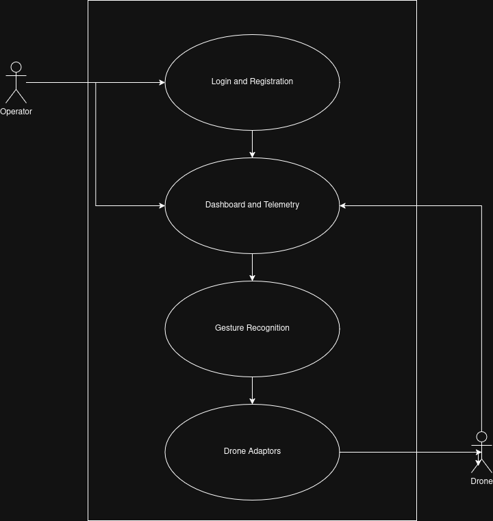

# Software Requirements Specification
## Gesture-Based Drone Control System

---

# 1. Introduction

## 1.1 Purpose

This Software Requirements Specification (SRS) document describes the functional and non-functional requirements for the Gesture-Based Drone Control System (GBDCS). It is intended to guide the design, development, and testing of a system that enables users to control an unmanned aerial vehicle (UAV) through real-time hand gesture recognition, eliminating the need for traditional handheld remote controllers.

## 1.2 Scope

The Gesture-Based Drone Control System shall:

- Capture and interpret human gestures in real time using computer vision
- Translate recognized gestures into precise drone flight commands (e.g., takeoff, land, move, rotate, hover)
- Provide a low-latency, reliable communication interface between the gesture recognition module and the drone's flight controller
- Support operation in varied lighting and environmental conditions
- Ensure safe failsafe behavior in the event of gesture misrecognition or signal loss

The system is designed for applications including aerial photography, search and rescue operations, recreational use, and accessibility-focused UAV control for users with limited motor ability.

## 1.3 Definitions, Acronyms, and Abbreviations

| Term | Definition |
|------|------------|
| **UAV** | Unmanned Aerial Vehicle — the drone being controlled |
| **GBDCS** | Gesture-Based Drone Control System |
| **SRS** | Software Requirements Specification |
| **CV** | Computer Vision — image processing used to detect gestures |
| **ML** | Machine Learning — used to classify gesture inputs |
| **GCS** | Ground Control Station — the processing unit running gesture recognition |
| **API** | Application Programming Interface |
| **SDK** | Software Development Kit |
| **FPS** | Frames Per Second — camera capture rate |
| **Latency** | Time delay between gesture input and drone response |
| **Failsafe** | Predefined safe behavior triggered upon system fault |

## 1.4 Overview

The remainder of this SRS is organized as follows:

- **Section 2 — Functional Requirements:** Details the specific behaviors and functions the system must perform.
- **Section 3 — Non-Functional Requirements:** Specifies performance, reliability, safety, and usability standards.
- **Section 4 — Constraints and Assumptions:** Lists technical, regulatory, and design limitations.
- **Appendices:** Supporting material including glossary, diagrams, and reference documents.

---

# 2. Functional Requirements

## 2.1 Gesture Recognition  

  * FR-01: The system shall capture video at minimum 30 fps  
  * FR-02: The system shall detect and track hand landmarks in real time using a computer vision library  
  * FR03: The system shall recognize a list of predefined gestures  
  * FR-04: The system shall reject unrecognized or ambiguous gestures and maintain the drone's last valid state.
    
## 2.2 Gesture Command Mapping

  * FR-05: The system shall map each recognized gesture to a specific drone command
  * FR-06: The system shall process and dispatch a command within 200ms of gesture recognition.

## 2.3 Drone Communications
    
  * FR-07: The system shall trigger a failsafe hover or land command if the communication link is lost for more than 2 seconds.
  * FR-08: The system shall receive and process telemetry data from the drone at regular intervals.

## 2.4 Failsafe and Safety

  * FR-09: The system shall immediately command the drone to hover if no gesture is detected for more than 3 seconds.
  * FR-10: The system shall initiate an emergency landing if the drone battery drops below 15%.
  * FR-11: The system shall prevent takeoff if the gesture recognition module is not fully initialized. 
  * FR-12: The system shall log all issued commands and system events with timestamps for post-flight review.

## 2.5 User Interface
  * FR-13: The system shall display a live camera feed with gesture landmark overlays on the operator's screen.
  * FR-14: The system shall display the currently recognized gesture and the corresponding command in real time.
  * FR-15: The system shall display key drone telemetry data including altitude, battery percentage, and flight mode.
  * FR-16: The system shall provide visual and/or audio alerts for critical events such as low battery, signal loss, or failsafe activation.

# 3. Non-Functional Requirements

## 3.1 Performance

  * NFR-01: End-to-end gesture-to-command latency shall not exceed 200ms
  * NFR-02: Gesture recognition shall not cause CPU usage to exceed 70% on the target hardware.

## 3.2 Reliability

  * NFR-04: The system shall maintain a command success rate of at least 95% under normal operating conditions.  
  * NFR-05: False command rate due to background noise or environmental interference shall not exceed 1%.

## 3.3 Usability 

  * NFR-06: A new user shall complete basic flight operations after no more than 15 minutes of training.
  * NFR-07: All critical information shall be visible in a single view without navigation.
  * NFR-08: Error messages shall clearly describe the issue and suggest a corrective action.

## 3.4 Safety 

  * NFR-09: All failure modes shall result in a defined safe state - no failure shall cause uncontrolled drone behavior.
    
## 3.5 Maintainability

  * NFR-14: The codebase shall follow a modular architecture separating gesture recognition, command mapping, and drone communication.
  * NFR-15: Each module shall have a unit test suite with at least 80% code coverage.

# Base Features
Some functionality is deemed as a base feature and as such does not fall part of a use case
  * Base Feature 1: Registration and Login System
  * Base Feature 2: Basic Themes
  * Base Feature 3: Form Validation

# Use Cases 
  
  * Use Case 1: Hand Tracking and Gesture Recognition
  * Use Case 2: Dashboard Telemetry
  * Use Case 3: Drone Simulator and Adaptors

## Use Case Diagram
