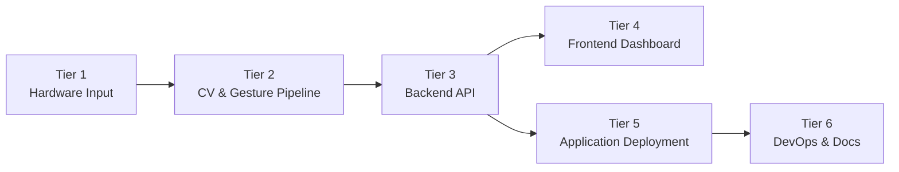

# Software Requirements Specification

## 1. Introduction

### 1.1 Purpose

This SRS specifies the **Gesture-Based Drone Control System (GBDCS)** — a real-time
computer-vision pipeline that translates hand gestures into unmanned aerial vehicle (UAV)
flight commands. It is the authoritative reference for:

- The **development team** at Codex Merchants, for implementation and verification.
- The **Project owner and mentor**, EPI-USE Labs, as the acceptance baseline.
- The **academic mentors** (COS 301, University of Pretoria), for evaluation.

### 1.2 Scope

**Product name.** Gesture-Based Drone Control System (hereafter **GBDCS**).

**What the product will do.** GBDCS captures a live camera feed, detects 21-point hand
landmarks using MediaPipe, classifies the resulting gestures via a rule-based engine
(with an optional TFLite-based recognizer as a strategy alternative), translates the
recognised gestures into flight commands, and dispatches those commands to a drone or
drone simulator through an adapter abstraction. A web dashboard provides live telemetry,
gesture-overlay video, and command auditing.

**What the product will *not* do.**

- It will not perform autonomous mission planning (e.g. waypoint flight, GPS
  route-following).
- It will not perform computer-vision tasks beyond hand-landmark detection
  (no face recognition, object tracking, or scene understanding).
- It will not control multiple drones simultaneously in v1.
- It will not operate in beyond-visual-line-of-sight (BVLOS) conditions.

**Benefits.** Removal of the physical controller barrier improves accessibility for
novices and users with limited fine-motor capability, and creates a natural
human–computer interaction model suitable for educational, demonstration, and
experiential settings.

### 1.3 Definitions, Acronyms, and Abbreviations

| Term | Definition |
| --- | --- |
| **GBDCS** | Gesture-Based Drone Control System — the product specified by this SRS. |
| **UAV** | Unmanned Aerial Vehicle. |
| **GCS** | Ground Control Station — the host machine running the recognition pipeline. |
| **CV** | Computer Vision. |
| **ML** | Machine Learning. |
| **MediaPipe** | Google's framework for real-time hand-landmark detection. |
| **TFLite** | TensorFlow Lite — lightweight on-device ML inference runtime. |
| **FPS** | Frames Per Second. |
| **SDK** | Software Development Kit. |
| **API** | Application Programming Interface. |
| **WS** | WebSocket. |
| **Failsafe** | A predefined safe-state behaviour triggered automatically on fault. |
| **Latency** | End-to-end delay from gesture occurrence to command dispatch. |
| **Adapter** | Component implementing the `DroneAdapter` interface, decoupling the system from any specific drone SDK or simulator. |

A site-wide list of abbreviations is auto-appended on every page via
`docs/includes/abbreviations.md`.

### 1.4 References

1. Kung, D. C. *Software Engineering* (2nd ed.). McGraw-Hill, 2024.
   Chapters 3 (System Engineering), 4 (Requirements Elicitation),
   5 (Domain Modeling), 6 (Architectural Design), 7 (Use Cases).
2. COS 301 Lectures — *System Engineering & Software Requirements Elicitation.*
   University of Pretoria, 2026.
3. EPI-USE Labs. *Gesture-Based Drone Control — Project Brief* (tender document, 2026).
4. Codex Merchants. *Tender Response & Proposed Architecture*
   (`docs/reports/tender.pdf`).
5. MediaPipe Hands documentation —
   [google.github.io/mediapipe/solutions/hands](https://google.github.io/mediapipe/solutions/hands).
6. xFly SDK / DJI Tello SDK product documentation.
7. Microsoft AirSim — [microsoft.github.io/AirSim](https://microsoft.github.io/AirSim).

### 1.5 Overview

The remainder of this document is organised as follows.

- **Section 2 — Overall Description.** Product perspective, interfaces, operating
  environment, assumptions, and dependencies.
- **Section 3 — Specific Requirements.** External-interface, functional,
  performance, design-constraint, and quality-attribute requirements,
  numbered using the hierarchical `R<i>.<j>.<k>` scheme.
- **Section 4 — Use Cases.** Use-case diagram and full use-case descriptions
  for the primary operational scenarios.
- **Section 5 — Domain Model & Architecture.** Pointers to the domain model
  and architectural diagrams that anchor the design.
- **Appendices.** Requirements-elicitation methodology, traceability matrix,
  and revision history.

---

## 2. Overall Description

### 2.1 Product Perspective

GBDCS is a **self-contained, ground-based application** that interfaces with a
detachable UAV (real or simulated) and a single human operator via a camera and a
dashboard. It is structured into six tiers, applying the **top-down,
divide-and-conquer decomposition**

*Figure 2.1 — Six-tier architectural decomposition of GBDCS.*

Each tier is functionally cohesive and loosely coupled.

#### 2.1.1 System Interfaces

| Interface | Direction | Protocol | Purpose |
| --- | --- | --- | --- |
| Camera → Pipeline | In | OpenCV `VideoCapture` (USB / built-in) | Raw video frames at ≥30 FPS. |
| Pipeline → Backend | In-process | Python async queue | Recognised-gesture events. |
| Backend ⇄ Frontend | Bidirectional | WebSocket (JSON) | Live gestures, telemetry, control. |
| Backend ⇄ Drone Adapter | Bidirectional | xFly SDK / Tello SDK / AirSim RPC | Command dispatch and telemetry. |
| Backend ⇄ Storage | Out | SQLite (file) | Gesture log, telemetry history. |

#### 2.1.2 User Interfaces

A single-page web dashboard, served by the backend and packaged via Electron
(desktop) or PWA + Capacitor (mobile), provides:

- A live video feed with hand-landmark overlay.
- A current-gesture indicator and the command it maps to.
- Telemetry panels (altitude, battery, signal, flight mode).
- Critical-event alerts (low battery, signal loss, failsafe).

Detailed wireframes are documented in [`DESIGN.md`](DESIGN.md).

#### 2.1.3 Hardware Interfaces

- A standard webcam or built-in laptop camera (≥720p, ≥30 FPS).
- A supported UAV (initial target: DJI Tello / xFly-compatible) **or** a machine capable of running AirSim.

#### 2.1.4 Software Interfaces

| Software | Version | Role |
| --- | --- | --- |
| Python | 3.11.x | CV / ML / backend runtime. |
| OpenCV | 4.8+ | Frame capture and pre-processing. |
| MediaPipe Hands | 0.10+ | Landmark detection. |
| TensorFlow Lite | 2.x | Optional ML gesture classifier. |
| FastAPI | 0.110+ | REST + WebSocket backend. |
| SQLite | 3.x | Local persistence. |
| React + TypeScript | 18 / 5.x | Frontend dashboard. |
| Electron | latest | Desktop packaging. |
| Capacitor | latest | Mobile packaging. |
| AirSim | latest | Drone simulator. |
| xFly / Tello SDK | latest | Physical-drone interface. |

#### 2.1.5 Communications Interfaces

- **WebSockets** for live gesture / telemetry streams between
  backend and frontend.
- **HTTP/1.1 + JSON** for configuration, history queries, and authentication.
- **Vendor SDK transports** (UDP for Tello, RPC for AirSim) hidden behind the
  `DroneAdapter` abstraction.

#### 2.1.6 Memory Constraints

- Target footprint on the GCS: ≤ 1 GB RAM at steady state.
- SQLite log volume capped at 250 MB before automatic rotation.

#### 2.1.7 Operations

GBDCS operates in two modes:

=== "Live mode"

    Operator stands in front of the camera, system runs the full
    capture → recognition → command pipeline against a connected drone or
    simulator. Telemetry streams continuously to the dashboard.

=== "Replay mode"

    The dashboard replays a logged session from SQLite, including the
    recognised-gesture stream and the resulting telemetry. No drone is
    required.

#### 2.1.8 Site-Adaptation Requirements

The system requires no on-site adaptation beyond:

- Selecting the active drone adapter (`tello` / `airsim` / `dummy`) via an
  environment variable.
- Configuring the camera index if multiple cameras are connected.

### 2.2 Product Functions (Summary)

At a high level, GBDCS shall:

1. Capture and pre-process a live video stream from a camera.
2. Detect and track hand landmarks in real time.
3. Classify hand pose into one of a fixed gesture vocabulary.
4. Translate gestures into drone commands via a deterministic mapping.
5. Dispatch commands through a pluggable drone adapter (Tello / AirSim / dummy).
6. Stream gestures, commands, and telemetry to a live dashboard.
7. Persist gesture and telemetry logs for review and replay.
8. Enforce safety failsafes (hover, auto-land, idle detection, takeoff lockout).

### 2.3 Assumptions and Dependencies

- **A1.** The operator has at least one hand visible to the camera, in
  adequate lighting.
- **A2.** The host machine has a working webcam accessible via OpenCV.
- **A3.** A drone simulator (AirSim) or a compatible physical drone is
  available at runtime.
- **A4.** GitHub remains available for CI/CD and documentation hosting.

---

## 3. Specific Requirements

### 3.1 External Interface Requirements

#### R1: User Interface

- **R1.1:** The system shall provide a live operator dashboard.
    - **R1.1.1:** The dashboard shall display the live camera feed with the
      MediaPipe hand-landmark skeleton overlaid, at no less than 24 FPS.
    - **R1.1.2:** The dashboard shall display the currently recognised
      gesture and the command it is mapped to, visible without scrolling.
    - **R1.1.3:** The dashboard shall display drone telemetry — altitude,
      battery percentage, flight mode, and link status — in a single
      panel.
- **R1.2:** The system shall present critical alerts.
    - **R1.2.1:** Critical events (low battery, signal loss, failsafe
      activation) shall raise both a visual indicator and an audible cue.
    - **R1.2.2:** Each alert shall remain visible until acknowledged by the
      operator or until the underlying condition clears.

#### R2: Hardware & Software Interfaces

- **R2.1:** The system shall accept video input from any OpenCV-compatible
  camera device (USB UVC or built-in).
- **R2.2:** The system shall dispatch commands to a UAV through an
  implementation of the `DroneAdapter` interface defined in
  [`services/drone_adapter.md`](services/drone_adapter.md).
- **R2.3:** The system shall expose a WebSocket endpoint at `/ws/live`
  carrying JSON-encoded `GestureEvent` and `TelemetryFrame` messages.
- **R2.4:** The system shall expose REST endpoints under `/api/v1` for
  configuration, session history, and replay control. Full schema is given
  in [API Reference](api/API_REFERENCE.md).

### 3.2 Functional Requirements

#### R3: Capture & Detection

- **R3.1:** The system shall capture video for gesture recognition.
    - **R3.1.1:** The pipeline shall capture frames at a minimum of 30 FPS.
    - **R3.1.2:** The pipeline shall preprocess each frame (resize, colour
      conversion) before landmark detection.
- **R3.2:** The system shall detect and classify hand gestures.
    - **R3.2.1:** The pipeline shall detect and track 21 hand landmarks in
      real time using MediaPipe Hands.
    - **R3.2.2:** The pipeline shall recognise a fixed vocabulary of at
      least six gestures: Open Palm, Fist, Thumb Up, Thumb Down,
      Pointer-Left, Pointer-Right.
    - **R3.2.3:** The pipeline shall reject unrecognised or ambiguous
      gestures and shall not produce a command in such cases.

#### R4: Gesture–Command Mapping

- **R4.1:** The system shall map each recognised gesture to exactly one
  drone command via a deterministic mapping table.
- **R4.2:** The mapping table shall be configurable without code changes
  (e.g. via a JSON or YAML profile file).
- **R4.3:** The system shall dispatch a command to the active drone
  adapter within 200 ms of the gesture being recognised
  (see also performance requirement `R7.1`).

#### R5: Drone Communication

- **R5.1:** The system shall maintain bidirectional communication with the
  active drone adapter.
    - **R5.1.1:** The system shall ingest telemetry frames from the drone
      adapter at a minimum rate of 5 Hz.
    - **R5.1.2:** The system shall forward telemetry frames to the
      dashboard via the WebSocket endpoint.
- **R5.2:** The system shall detect and respond to link loss.
    - **R5.2.1:** If the heartbeat to the drone adapter is missed for more
      than 2 seconds, the system shall command `HOVER`.
    - **R5.2.2:** Link-loss events shall be surfaced as a banner alert on
      the dashboard.

#### R6: Failsafes & Safety

- **R6.1:** The system shall hold a safe state in the absence of input.
    - **R6.1.1:** If no gesture is detected for more than 3 seconds, the
      system shall command `HOVER`.
    - **R6.1.2:** While in `HOVER` for idle, the dashboard shall display an
      "Idle — hovering" indicator.
- **R6.2:** The system shall protect against critical failure modes.
    - **R6.2.1:** When reported battery falls below 15 %, the system shall
      initiate an auto-land sequence.
    - **R6.2.2:** The system shall reject any take-off command issued
      before the gesture-recognition pipeline reports `READY`.
    - **R6.2.3:** The dashboard shall expose an emergency-stop control
      that commands an immediate landing.
- **R6.3:** The system shall log every issued command and significant
  system event (start, stop, failsafe trip, error) with an ISO-8601
  timestamp in SQLite.

### 3.3 Performance Requirements

#### R7: Performance

- **R7.1:** End-to-end gesture-to-command latency shall not exceed 200 ms
  at the 95th percentile, measured from frame timestamp to command
  dispatch.
- **R7.2:** The pipeline shall sustain ≥ 30 FPS while keeping CPU usage
  ≤ 70 % on the target reference machine (4-core x86_64, 8 GB RAM,
  integrated GPU).
- **R7.3:** The dashboard shall render incoming WebSocket frames at
  ≥ 24 FPS.

### 3.4 Design Constraints

#### R8: Design Constraints

- **R8.1:** The system shall be implemented in Python 3.11+ (backend &
  pipeline) and TypeScript with React 18 (frontend).
- **R8.2:** The drone integration layer shall use the **Adapter** design
  pattern, with a `DroneAdapter` interface common to all implementations
  (XFly, AirSim, Tello, Dummy).
- **R8.3:** Gesture recognition shall use the **Strategy** pattern, with
  `RuleBasedRecognizer` and `MLGestureRecognizer` as interchangeable
  implementations of `GestureRecognizer`.
- **R8.4:** Telemetry distribution shall use the **Observer** pattern.
- **R8.5:** All inter-process communication shall use JSON over WebSocket
  or HTTP — no binary or vendor-specific wire formats.
- **R8.6:** Source control shall use Git with the workflow defined in
  [`GIT.md`](GIT.md).

### 3.5 Software System Attributes

#### R9: Reliability

- **R9.1:** Under nominal lighting, gesture-classification accuracy shall
  be ≥ 95 % measured against a labelled test set of at least 300 samples.
- **R9.2:** False-positive command rate (a command issued from a
  non-deliberate gesture) shall not exceed 1 %.

#### R10: Availability

- **R10.1:** A crash in the recognition pipeline shall not crash the
  backend; the system shall enter failsafe hover and surface an error to
  the dashboard within 1 second.

#### R11: Security

- **R11.1:** The WebSocket endpoint shall require a short-lived session
  token issued via the REST login endpoint.
- **R11.2:** Logged telemetry shall be stored locally only; no data shall
  be transmitted to third-party services at runtime.

#### R12: Maintainability

- **R12.1:** The codebase shall be partitioned into the modules listed in
  [`DESIGN.md`](DESIGN.md); no module shall import from a sibling outside
  its declared interface.
- **R12.2:** Each module shall maintain ≥ 80 % line coverage in its unit
  test suite. CI shall fail any PR that drops coverage below this
  threshold.

#### R13: Portability

- **R13.1:** The system shall run on Windows 10+, macOS 13+, and Ubuntu
  22.04+ without source-level changes.
- **R13.2:** The frontend shall additionally run as a PWA on modern
  Chromium- and WebKit-based mobile browsers.

#### R14: Usability

- **R14.1:** A first-time operator shall be able to complete the basic
  flight sequence (take-off, hover, move, land) within 15 minutes of
  receiving a one-page gesture-vocabulary reference.
- **R14.2:** All operational information needed during a flight shall be
  visible without navigation away from the dashboard's main view.
- **R14.3:** Every user-visible error shall describe the cause and
  suggest a corrective action.

### 3.6 Other Requirements

#### R15: Process & Documentation

- **R15.1:** All project documentation shall be authored in Markdown and
  rendered by MkDocs Material to GitHub Pages, deployed automatically on
  push to `main` and `dev`.
- **R15.2:** The project shall use **Conventional Commits** for all
  changes merged into shared branches.

#### R16: Base Features

Base features are foundational capabilities shared by most modern
applications and are therefore documented separately from the
domain-specific use cases.

- **R16.1:** The system shall provide a registration and login flow.
    - **R16.1.1:** A new user shall be able to register an account using
      an email address and a password.
    - **R16.1.2:** Passwords shall be validated against a minimum-strength
      policy at registration time.
    - **R16.1.3:** Returning users shall be able to authenticate using
      their email address and password and shall receive a short-lived
      session token (see also `R11.1`).
- **R16.2:** The system shall provide light and dark themes.
    - **R16.2.1:** The dashboard shall offer a light and a dark colour
      scheme, switchable by the operator at runtime.
    - **R16.2.2:** The selected theme shall persist across sessions for
      the same user.
- **R16.3:** The system shall validate all user-submitted forms.
    - **R16.3.1:** Form submissions shall be validated client-side before
      being sent to the backend.
    - **R16.3.2:** The backend shall re-validate every submission and
      reject any payload that fails validation, returning a clear error
      message (see also `R14.3`).

---

## 4. Use Cases

The use cases derived from the functional requirements are modelled below.
Each follows the standard use-case template: scope, actors,
preconditions, main flow, alternative flows, post-conditions. Requirement
IDs are cited inline so the mapping back to Section 3 is unambiguous.

### 4.1 Use-Case Diagram

*Figure 4.1 — Primary use cases and actors.*

### 4.2 UC-1 — Control Drone via Gesture

!!! example "UC-1 Control Drone via Gesture"
    **Scope.** *The user begins with performing a hand
    gesture in front of the camera at the ground control station. The
    user ends with confirming the drone has executed the
    corresponding command on the live dashboard.*

    **Actors.** user (operator->primary), Drone (secondary, via adapter).

    **Preconditions.**

    - The system is launched and the pipeline reports `READY`.
    - A drone adapter is connected and reports healthy telemetry.

    **Main flow.**

    1. The Operator performs a gesture in view of the camera.
    2. The pipeline detects the hand and classifies the gesture
       (`R3.2.1`, `R3.2.2`).
    3. The command translator maps the gesture to a drone command
       (`R4.1`).
    4. The backend dispatches the command via the drone adapter within
       200 ms (`R4.3`, `R7.1`).
    5. The drone executes the command; telemetry is streamed back
       (`R5.1.1`).
    6. The dashboard reflects the new gesture, command, and resulting
       telemetry (`R1.1.1`–`R1.1.3`).

    **Post-conditions.** The drone is in the new commanded state and the
    event is logged (`R6.3`).

    **Alternative flows.**

    - *A1 — Unrecognised gesture.* If the classifier rejects the input
      (`R3.2.3`), no command is issued; the last command persists.
    - *A2 — Link loss.* If telemetry stops for > 2 s, the system issues
      `HOVER` and surfaces a banner (`R5.2.1`, `R5.2.2`).
    - *A3 — Idle.* If no gesture is seen for > 3 s, the system issues
      `HOVER` (`R6.1.1`).

### 4.3 UC-2 — Monitor Telemetry & Alerts in Frontend

!!! example "UC-2 Monitor Telemetry & Alerts"
    **Scope.** *The user begins with opening the telemetry
    panel on the dashboard at the ground control station. The user ends
    with acknowledging the current drone status and any
    raised alerts on the dashboard.*

    **Actor.** User (Operator).

    **Preconditions.** Dashboard is open and connected to the backend
    WebSocket endpoint.

    **Main flow.**

    1. The Operator focuses the telemetry panel.
    2. The backend streams telemetry frames at ≥ 5 Hz (`R5.1.1`).
    3. The dashboard updates altitude, battery, link, and flight-mode
       indicators in real time (`R1.1.3`).
    4. When a threshold trips (e.g. battery < 15 %), the dashboard
       raises a visual + audible alert (`R1.2.1`) and the backend
       initiates auto-land (`R6.2.1`).

    **Post-conditions.** Operator is aware of all critical state changes;
    failsafes are armed and visible.

### 4.4 UC-3 — AirSim Implementation with Basic Drone Controls

!!! example "UC-3 AirSim Implementation with Basic Drone Controls"
    **Scope.** *The user begins with launching the AirSim
    simulator alongside the GBDCS application on the ground control
    station. The user ends with confirming the simulated
    drone has performed the basic flight commands within the AirSim
    environment.*

    **Actors.** User (operator->primary), AirSim Simulator (secondary, via
    `AirSimAdapter`).

    **Preconditions.**

    - The AirSim simulator is running and reachable from the host machine.
    - The active drone adapter is configured to `airsim` (see
      [`services/airsim_adapter.md`](services/airsim_adapter.md)).

    **Main flow.**

    1. The Operator selects the AirSim adapter and starts the system.
    2. The `AirSimAdapter` establishes a connection with the simulator
       and reports `READY` (`R2.2`).
    3. The Operator issues a basic command (take-off, hover, directional
       move, land) via a recognised gesture (`R3.2.2`, `R4.1`).
    4. The backend dispatches the command to the simulator through the
       adapter (`R4.3`).
    5. The simulated drone executes the command and streams telemetry
       back to the dashboard (`R5.1.1`, `R5.1.2`).

    **Post-conditions.** The simulated drone is in the new commanded
    state and the event is logged (`R6.3`).

    **Alternative flows.**

    - *A1 — Simulator unreachable.* If the `AirSimAdapter` fails to
      establish a connection, the system refuses take-off (`R6.2.2`)
      and surfaces an error on the dashboard (`R14.3`).
    - *A2 — Link loss during flight.* If communication with the
      simulator is lost for > 2 s, the system issues `HOVER`
      (`R5.2.1`, `R5.2.2`).

---

## 5. Domain Model & Architecture

The detailed analysis-level domain model and the design-level architecture
diagram are maintained alongside this document.

=== "Domain model"

    

    *Figure 5.1 — Analysis-level domain model. See
    [`DESIGN.md`](DESIGN.md#domain-model) for the design class diagram
    derived from this model.*

=== "Architecture"

    

    *Figure 5.2 — Logical architecture aligned to the six-tier
    decomposition in §2.1. See [`DESIGN.md`](DESIGN.md#architecture) for
    the patterns applied.*

---

## Appendix A — Requirements Elicitation Methodology

The requirements in this document were elicited following the five-step
process. Following Demo 1, the team
is now enforcing this process strictly for every subsequent demo.

=== "1. Collecting information"

    Sources of information used:

    - **Customer presentation** — EPI-USE Labs project brief and
      kickoff meeting.
    - **Literature survey** — MediaPipe Hands documentation, AirSim
      and drone SDK documentation, prior gesture-control research.
    - **Stakeholder survey** — bi-weekly meetings with our capstone
      mentor.
    - **User stories** — drafted by the team from the perspective of
      operator, demonstrator, and reviewer roles.

=== "2. Constructing analysis models"

    More descriptive diagrams will be provided through the continuous
    development of the project:

    - **Use-case diagram** — Figure 4.1, captures actor–system
      interaction.
    - **Class / domain model** — Figure 5.1, captures the conceptual
      vocabulary of the application.
    - **Architecture diagram** — Figure 5.2, captures the six-tier
      logical decomposition.

=== "3. Deriving requirements"

    Capabilities are derived from the user stories, business goals, and
    analysis models, then phrased as "The system shall …" statements in
    Section 3.

=== "4. Feasibility study"

    Technical feasibility was validated through the `sandbox/` proof of
    concepts (interactive control, stdin control, AirSim trials),
    which demonstrated end-to-end command flow before commitment.

=== "5. Reviewing the specification"

    This SRS is reviewed by the company mentor and capstone mentor
    frequently:

    - The development team (technical review — completeness, internal
      consistency).
    - The academic mentor (expert review).
    - The industry mentor (customer review).

---

## Appendix B — Requirements Traceability Matrix

| Requirement | Type | Verified by | Target demo | Status |
| --- | --- | --- | --- | --- |
| `R3.1.*`, `R3.2.*` | Capture & detection | `tests/cv_pipeline_testing` | Demo 1 | Delivered |
| `R4.*` | Mapping | `services/tests/test_command.py` | Demo 1 | Delivered |
| `R16.*` | Base features | Frontend unit + Playwright E2E | Demo 1 | Delivered |
| `R5.*` | Drone comms | Adapter integration tests | Demo 2 | Planned |
| `R6.*` | Safety & failsafes | Manual + integration tests | Demo 2 | Planned |
| `R1.*` | Dashboard UI | Playwright E2E | Demo 2 | Planned |
| `R7.*` | Performance | Load / latency harness | Demo 3 | Planned |
| `R9.*` | Reliability / accuracy | Labelled-set evaluation | Demo 3 | Planned |
| `R12.*` | Maintainability | CI coverage gate | Continuous | Active |
| `R13.*` | Portability | CI matrix (Win / macOS / Linux) | Demo 4 | Planned |