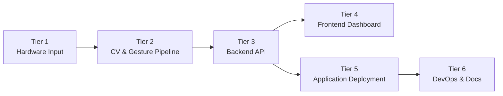

# Software Requirements Specification

## 1. Introduction

### 1.1 Purpose

This SRS specifies the **Gesture-Based Drone Control (GBDC)** system, a real-time pipeline 
utilising computer vision that translates hand gestures into unmanned aerial vehicle (UAV)
flight commands. It is the authoritative reference for:

- The **development team** at Codex Merchants, for implementation and verification.
- The **Project owner and mentor(s)**, EPI-USE Labs, as the acceptance baseline.
- The **academic mentors** (COS 301 staff), for evaluation.

### 1.2 Scope

**Product name.** Gesture-Based Drone Control (hereafter **GBDC**).

**What the product will do.** GBDC captures a live camera feed, detects 21-point hand
landmarks using MediaPipe, classifies the resulting gestures via a rule-based engine
(with an optional TFLite-based recognizer as a strategy alternative), translates the
recognised gestures into flight commands, and dispatches those commands to a drone or
drone simulator through an adapter abstraction. A web dashboard provides live telemetry,
gesture-overlay video, and command auditing.

**What the product will *not* do.**

- It will not perform autonomous mission planning (e.g. waypoint flight, GPS
  route-following).
- It will not perform computer-vision tasks beyond hand-landmark detection
  (no face recognition, object tracking, or scene understanding).
- It will not control multiple drones simultaneously in v1.
- It will not operate in beyond-visual-line-of-sight (BVLOS) conditions.

**Benefits.** Removal of the physical controller barrier improves accessibility for
novices and users with limited fine-motor capability, and creates a natural
human–computer interaction model suitable for educational, demonstration, and
experiential settings.

### 1.3 Definitions, Acronyms, and Abbreviations

| Term | Definition |
| --- | --- |
| **GBDC** | Gesture-Based Drone Control system - the product specified by this SRS. |
| **UAV** | Unmanned Aerial Vehicle. Our drone in this case. |
| **GCS** | Ground Control Station - the host machine running the recognition pipeline. |
| **FPS** | Frames Per Second. |
| **CV** | Computer Vision. |
| **OpenCV** | Open-source Computer Vision library. Used for camera frame capture and preprocessing.|
| **UVC** | USB Video Class. The standard protocol used by USB-connected cameras, enabling plug-and-play use with OpenCV |
| **MediaPipe** | Google's framework for real-time hand-landmark detection. |
| **HID** | Human Interface Device. Any hardware input peripheral, such as a keyboard, gamepad, or camera. |
| **Latency** | End-to-end delay from each step in the pipeline, i.e. gesture recognition to command dispatch. |
| **ML** | Machine Learning. |
| **TFLite** | TensorFlow Lite - lightweight on-device ML inference runtime. |
| **SDK** | Software Development Kit. |
| **API** | Application Programming Interface. |
| **WS** | WebSocket, used for real-time communications such as gesture streaming |
| **REST** | Representational State Transfer, endpoints used for config, logs, system faults  |
| **Failsafe** | A predefined safe-state behaviour triggered automatically on fault. |
| **Adapters** | A two-way adapter is implemented to decouple input methods and UAV options. |
| **PAS** | Project AirSim. Microsoft's Unreal Engine 5 based drone sim, the successor to legacy AirSim. |
| **AS** | AirSim.  Microsoft's legacy Unreal Engine 4 based drone simulator.  |
| **pynng** | Python bindings for the NNG (Nanomsg Next Generation) messaging library. Used by PAS's Python client.|

A site-wide list of abbreviations is auto-appended on every page via
`docs/includes/abbreviations.md`.

### 1.4 References

1. Kung, D. C. *Software Engineering* (2nd ed.). McGraw-Hill, 2024.
   Chapters 3–5 and 7 (System Engineering, Requirements Elicitation,
   Domain Modeling, Use Cases). Architectural content (Ch. 6) is now
   covered by [`SAS.md`](SAS.md).
2. [`SAS.md`](SAS.md) - Software Architecture Specification (the
   architectural, technological, and deployment counterpart to this
   document).
3. [`BRAND.md`](BRAND.md) - Brand & Design System (the visual and UX
   counterpart to this document).
4. COS 301 lecture material - *System Engineering & Software
   Requirements Elicitation.* University of Pretoria, 2026.
5. EPI-USE Labs. *Gesture-Based Drone Control - Project Brief* (tender
   document, 2026).
6. Codex Merchants. *Tender Response & Proposed Architecture*
   [`docs/reports/tender.pdf`](reports/tender.pdf).
7. MediaPipe Hands documentation -
   [google.github.io/mediapipe/solutions/hands](https://google.github.io/mediapipe/solutions/hands).
8. xFly SDK / DJI Tello SDK product documentation.
9. Microsoft AirSim - [microsoft.github.io/AirSim](https://microsoft.github.io/AirSim).

### 1.5 Overview

The remainder of this document is organised as follows.

- **Section 2 - Overall Description.** Product perspective, interfaces, operating
  environment, user characteristics, assumptions, and dependencies.
- **Section 3 - Specific Requirements.** External-interface, functional, and
  quality-attribute requirements, plus base features and process requirements,
  numbered using the hierarchical `R<i>.<j>.<k>` scheme. Architectural and
  technological decisions that realise these requirements live in
  [`SAS.md`](SAS.md).
- **Section 4 - Use Cases.** Use-case diagram and full use-case descriptions
  for the primary operational scenarios.
- **Section 5 - Domain Model.** The analysis-level domain model that
  anchors the design.
- **Appendices.** Requirements-elicitation methodology, traceability matrix,
  and revision history.

---

## 2. Overall Description

### 2.1 Product Perspective

GBDC is a **self-contained, ground-based application** that interfaces with a
detachable UAV (real or simulated) and a single human operator via a camera and a
dashboard. It is structured into six tiers, applying a **top-down,
divide-and-conquer decomposition** so that each tier is functionally cohesive and
loosely coupled.

*Figure 2.1 - Six-tier logical decomposition of GBDC. The corresponding
architectural-style choices for each tier are documented in
[`SAS.md` Section 2](SAS.md#2-architectural-requirements).*

#### 2.1.1 System Interfaces

| Interface | Direction | Protocol | Purpose |
| --- | --- | --- | --- |
| Camera -> Processing Pipeline | In | OpenCV `VideoCapture` (USB / built-in) | Raw video frames at ≥30 FPS. |
| Processing Pipeline -> Backend | In-process | Python async queue | Recognised-gesture events. |
| Backend <-> Frontend | Bidirectional | WebSocket (JSON) | Live gestures, telemetry, control. |
| Backend <-> Drone Adapter | Bidirectional | xFly SDK / Tello SDK / AirSim RPC | Command dispatch and telemetry. |
| Backend <-> Storage | Out | SQLite (file) | Gesture log, telemetry history. |

#### 2.1.2 User Interfaces

A single-page web dashboard, served by the backend, and either hosted externally, or packaged via Electron
(desktop) / PWA + Capacitor (mobile), provides:

- A live video feed with hand-landmark overlay.
- A current-gesture indicator and the command it maps to.
- Telemetry panels (altitude, battery, signal, flight mode).
- Critical-event alerts (low battery, signal loss, failsafe).

Final visual specifications, component states, and wireframes are documented
in [`BRAND.md`](BRAND.md).

#### 2.1.3 Hardware Interfaces

- A standard webcam or built-in laptop camera (≥720p, ≥30 FPS).
- A supported UAV (initially an XFly drone ) **or** a machine running AirSim or PAS.

#### 2.1.4 Software Interfaces

The runtime software stack and the rationale for each choice are documented
in [`SAS.md` Section 3: Technology Requirements](SAS.md#3-technology-requirements).
A summary of the major versions is provided here for context:

| Software | Version | Role |
| --- | --- | --- |
| Python | 3.11.x | CV / ML / backend runtime. |
| FastAPI | 0.110+ | REST + WebSocket backend. |
| OpenCV | 4.8+ | Frame capture and pre-processing. |
| MediaPipe Hands | 0.10+ | Landmark detection. |
| TensorFlow Lite | 2.x | Optional ML gesture classifier. |
| React + TypeScript | 18 / 5.x | Frontend dashboard. |
| Project AirSim | latest | Primary drone simulator. |
| AirSim | latest | Secondary drone simulator. |
| xFly Tello SDK | latest | Physical-drone interface. |
| Capacitor | latest | Mobile packaging. |
| Electron | latest | Desktop packaging. |
| SQLite | 3.x | Local persistence. |

#### 2.1.5 Communications Interfaces

- **WebSockets** for live gesture / telemetry streams between
  backend and frontend.
- **HTTP/1.1 + REST endpoints** for configuration, history queries, and authentication.
- **Vendor SDK transports** (UDP for Tello, RPC for AirSim) hidden behind the
  `DroneAdapter` abstraction.

#### 2.1.6 Memory Constraints

- Target footprint on the GCS: ≤ 1 GB RAM at steady state. This excludes the footprint of drone simulations, which are computationally expensive by nature.
- SQLite log volume capped at 250 MB before automatic rotation.

#### 2.1.7 Operations

GBDC operates in multiple modes:

=== "Live mode"

    Operator stands in front of the camera, system runs the full
    capture -> recognition -> command pipeline against a connected drone or
    simulator. Telemetry streams continuously to the dashboard.

=== "Replay mode"

    The dashboard replays a logged session from SQLite, including the
    recognised-gesture stream and the resulting telemetry. No drone is
    required.

#### 2.1.8 Site-Adaptation Requirements

The system requires no on-site adaptation beyond:

- Selecting the active drone adapter (`pas` / `airsim` / `xfly`) via an on screen prompt.
- Configuring the camera index if multiple cameras are connected.

### 2.2 Product Functions (Summary)

At a high level, GBDC shall:

1. Capture and pre-process a live video stream from a camera.
2. Detect and track hand landmarks in real time.
3. Classify hand pose into one of a fixed gesture vocabulary.
4. Translate gestures into drone commands via a deterministic mapping.
5. Dispatch commands through a pluggable drone adapter (xfly / pas / as).
6. Stream gestures, commands, and telemetry to a live dashboard.
7. Persist gesture and telemetry logs for review and replay.
8. Enforce safety failsafes (hover, auto-land, idle detection, takeoff lockout).

- For the sake of broader accessibility, this core loop is supplemented by the option for multiple input methods, such as keyboard controls or on-screen buttons. These behave similarly, using the same command interface as the main loop.

### 2.3 User Characteristics

GBDC is operated by a single human at a time. Three user roles are
recognised:

| Role | Description | Primary use cases |
| --- | --- | --- |
| **Operator** | The person standing in front of the camera issuing gestures. Assumed to be of average physical ability with at least one hand in clear view, indoors with adequate lighting. No prior pilot training is required. | UC-1, UC-2, UC-3, UC-4 |
| **Demonstrator** | A team member or evaluator presenting the system. Familiar with the gesture vocabulary and the dashboard. | UC-1, UC-2, UC-3, UC-5 |
| **Reviewer** | A mentor, evaluator, or stakeholder reviewing recorded sessions through the replay view. Does not interact with the live pipeline. | UC2, UC-5 |

### 2.4 Assumptions and Dependencies

- **A1.** The operator has at least one hand visible to the camera.
- **A2.** All operations are done indoors, with consistent lighting.
- **A3.** The host machine has a working webcam accessible via OpenCV.
- **A4.** A drone simulator (PAS) or a compatible physical drone is
  available at runtime.

---

## 3. Specific Requirements

### 3.1 External Interface Requirements

#### R1: User Interface

- **R1.1:** The system shall provide a live operator dashboard.
    - **R1.1.1:** The dashboard shall display the live camera feed with the
      MediaPipe hand-landmark skeleton overlaid, at no less than 24 FPS.
    - **R1.1.2:** The dashboard shall display the currently recognised
      gesture and the command it is mapped to, visible without scrolling.
    - **R1.1.3:** The dashboard shall display drone telemetry - altitude,
      battery percentage, flight mode, and link status - in a single
      panel.
- **R1.2:** The system shall present critical alerts.
    - **R1.2.1:** Critical events (low battery, signal loss, failsafe
      activation) shall raise both a visual indicator and an audible cue.
    - **R1.2.2:** Each alert shall remain visible until acknowledged by the
      operator or until the underlying condition clears.

> The majority of this functional requirement is handled in use case 2. The data processing & aggregation component of the system will be responsible for the majority of the alerts **(R1.2)**, and the CV pipeline is responsible for the dashboard elements **(R1.1)**

#### R2: Hardware & Software Interfaces

- **R2.1:** The system shall accept video input from any OpenCV-compatible
  camera device (USB UVC or built-in).
- **R2.2:** The system shall dispatch commands to a UAV through an
  implementation of the `DroneAdapter` interface. The interface contract is
  defined in [`SAS.md` Section 4 API Contracts](SAS.md#4-api-contracts).
- **R2.3:** The system shall expose a WebSocket endpoint at `/ws/live`
  carrying JSON-encoded `GestureEvent` and `TelemetryFrame` messages.
- **R2.4:** The system shall expose REST endpoints under `/api/v1` for
  configuration, session history, and replay control. Full schema is given
  in [`SAS.md` Section 4 API Contracts](SAS.md#4-api-contracts).

> These requirements are delegated equally between the CV Pipeline and Adapter subsystems.

### 3.2 Functional Requirements

#### R3: Camera Capture & Detection

- **R3.1:** The system shall capture video for gesture recognition.
    - **R3.1.1:** The pipeline shall capture frames at a minimum of 30 FPS.
    - **R3.1.2:** The pipeline shall preprocess each frame (resize, colour
      conversion) before landmark detection.
- **R3.2:** The system shall detect and classify hand gestures.
    - **R3.2.1:** The pipeline shall detect and track 21 hand landmarks in
      real time using MediaPipe Hands.
    - **R3.2.2:** The pipeline shall recognise a fixed vocabulary of at
      least six gestures: Open Palm, Fist, Thumb Up, Thumb Down,
      Pointer-Left, Pointer-Right.
    - **R3.2.3:** The pipeline shall reject unrecognised or ambiguous
      gestures and shall not produce a command in such cases.

> This entire requirement remains the responsibility of the CV pipeline, and is accomplished using OpenCV for preprocessing **(R3.1)**, in conjunction with MediaPipe Hands **(R3.2)**.

#### R4: Gesture–Command Mapping

- **R4.1:** The system shall map each recognised gesture to exactly one
  drone command via a deterministic mapping table, defined in the Gesture class.
- **R4.2:** The mapping table shall be configurable without code changes
  (e.g. via a JSON or YAML profile file).
- **R4.3:** The system shall dispatch a command to the active drone
  adapter within 200 ms of the gesture being recognised
  (see also `NFR1.1`).
- **R4.4:** All control inputs, regardless of the source, shall be encapsulated in a common object containing the command's type, a source identifier, and any optional payloads before dispatch.

> This forms part of th CV pipeline, and is done by interpreting key landmarks on the users' hand. **R4.3-R4.4** represents the handoff to the HID to Drone adapters subsystem.

#### R5: Drone Communication

- **R5.1:** The system shall maintain bidirectional communication with the
  active drone adapter.
    - **R5.1.1:** The system shall ingest telemetry frames from the drone
      adapter at a minimum rate of 5 Hz.
    - **R5.1.2:** The system shall forward telemetry frames to the
      dashboard via the WebSocket endpoint.
- **R5.2:** The system shall detect and respond to link loss.
    - **R5.2.1:** If the heartbeat to the drone adapter is missed for more
      than 2 seconds, the system shall command `HOVER`.
    - **R5.2.2:** Link-loss events shall be surfaced as a banner alert on
      the dashboard.
- **R5.3:** All drone adapters must return normalised telemetry data of the same shape, containing at minimum altitude, speed, battery percentage, heading direction, and flight state.

> This is handled entirely by the adapters subsystem. Each supported drone, i.e. every concrete DroneAdapter, implements these features.

#### R6: Failsafes 

- **R6.1:** The system shall hold a safe state in the absence of input.
    - **R6.1.1:** If no gesture is detected for more than 3 seconds, the
      system shall command `HOVER`.
    - **R6.1.2:** While in `HOVER` for idle, the dashboard shall display an
      "Idle - hovering" indicator.
- **R6.2:** The system shall protect against critical failure modes.
    - **R6.2.1:** When reported battery falls below 15 %, the system shall
      initiate an auto-land sequence.
    - **R6.2.2:** The system shall reject any take-off command issued
      before the gesture-recognition pipeline reports a valid connection.
    - **R6.2.3:** The dashboard shall expose an emergency-stop control
      that commands an immediate landing.
    - **R6.2.4:** An emergency-landing or other safety-critical operations must override all pending operations of a lower level of importance.
- **R6.3:** The system shall log every issued command and significant
  system event (start, stop, failsafe trip, error) with a
  timestamp in SQLite, as well as to a debug console.

> Failsafes are included in all parts of the interaction loop. Most notably in the main points of interaction of the system, camera capture, and drone interaction. Logs are created at every step of the process.

#### R7: Alternative Input Control

 - **R7.1:** The system shall accept multiple supplementary input sources.
    - **R7.1.1:** The system shall accept keyboard input as a control source, mapping key presses to drone commands via a fixed binding table.
    - **R7.1.2:** The system shall accept gamepad input as a control source, allowing for analog control rather than discrete, digital input
    - **R7.1.3:** Input sources must be switchable seamlessly at runtime, via a simple button press on the dashboard. This needs to be quick and responsive.
    - **R7.1.4** Details of the currently selected input source must be clearly visible, including a controls legend, as well as real-time indications of any connection issues
 - **R7.2:** The system must implement each supported input source to be fully compatible and consistent with every supported drone implementation.

> This is handled entirely in the adapter subsystem. Each input method is guarunteed to behave the same with every drone via the DroneAdapter interface. InputAdapters allow each input device to behave identically.

#### R8: User Authentication and Preference Management
  - **R8.1:** The system shall provide user registration and authentication.
    - **R8.1.1:** A new user can register an account with an email address and a password
    - **R8.1.2:** Passwords shall be validated against a minimum length / strength policy and stored using a cryptographic hashing function and salted.
    - **R8.1.3:** Returning users shall be able to authenticate using their email address and password.
    - **R8.1.4:** On logout, the WebSocket connection should be closed, and the dashboard should return the user to the login screen.
  - **R8.2:** The system shall store user preferences.
    - **R8.2.1:** Settings chosen by the user, such as theme (light/dark), and any other customization options, should be saved and loaded upon login
    - **R8.2.2:** Stored settings may be modified at runtime, with any changes taking effect without any page reload
    - **R8.2.3:** If a stored preference is unable to be fetched, a default value should be used in its place.

> This is handled by its own subsystem, specifically for user management. 

### 3.3 Non-Functional (Quality) Requirements

The Demo 2 brief targets *five* quantified quality requirements. The five
chosen for GBDC are the attributes that materially constrain the
architecture; the architectural decisions that realise each are tabulated
in [`SAS.md` Section 2.5](SAS.md#25-mapping-quality-requirements-to-architectural-decisions).

#### NFR1: Performance

- **NFR1.1:** End-to-end gesture-to-command latency shall not exceed
  **200 ms at the 95th percentile**, measured from frame timestamp to
  command dispatch, under nominal load on the reference machine (4-core
  x86_64, 8 GB RAM, integrated GPU, a lower end laptop running Windows).
- **NFR1.2:** The pipeline shall sustain **≥ 30 FPS** while keeping CPU
  usage **≤ 70 %** on the reference machine.
- **NFR1.3:** The dashboard shall render incoming WebSocket frames at
  **≥ 24 FPS** with no dropped frames over a 10-minute steady-state run.

#### NFR2: Security

- **NFR2.1:** The WebSocket endpoint shall require a short-lived
  (**≤ 30-minute**) session token issued via the REST login endpoint.
- **NFR2.2:** All credentials and connection strings shall be loaded from
  environment variables or the host's secrets manager; **zero secrets**
  shall be committed to the repository (verified by a pre-commit
  secret-scan hook and `gitleaks` in CI).
- **NFR2.3:** Every API endpoint shall validate its input payload against
  a JSON schema and reject malformed requests with `400 Bad Request`;
  **100 %** of endpoints shall be covered by schema validation.

#### NFR3: Reliability

- **NFR3.1:** Under adequate indoor lighting, gesture-classification accuracy shall
  be **≥ 95 %** measured against a labelled test set of at least 300
  samples.
- **NFR3.2:** False-positive command rate (a command issued from a
  non-deliberate gesture) shall not exceed **1 %** over the same test set.
- **NFR3.3:** A crash in the recognition pipeline shall not crash the
  backend; the system shall enter failsafe-hover and surface an error to
  the dashboard within **≤ 1 second**.

#### NFR4: Maintainability

- **NFR4.1:** The codebase shall be partitioned into the modules listed in
  [`SAS.md` Section 2.4](SAS.md#24-architectural-diagram); no module shall
  import from a sibling outside its declared interface (enforced by a
  static-import check in CI).
- **NFR4.2:** Each module shall maintain **≥ 80 % line coverage** in its
  unit test suite. CI shall fail any PR that drops coverage below this
  threshold.
- **NFR4.3:** A bug fix or small feature shall be deployable from a green
  PR to the production environment within **≤ 30 minutes** end-to-end
  (merge -> CI -> deploy).

#### NFR5: Usability

- **NFR5.1:** A first-time operator shall be able to complete the basic
  flight sequence (take-off, hover, move, land) within **≤ 5 minutes**
  of opening the system, given access to the in-product tutorial.
- **NFR5.2:** The system shall achieve **≥ 85 % user satisfaction** in
  end-of-demo usability testing with at least five external
  participants.
- **NFR5.3:** Every user-visible error shall describe the cause and
  suggest a corrective action; **100 %** of error states shall meet
  this rule in a quarterly UX audit.

### 3.4 Other Requirements

#### OR1: Process & Documentation

- **OR1.1:** All project documentation shall be authored in Markdown and
  rendered by MkDocs Material to GitHub Pages, deployed automatically on
  push to `main` and `dev`.
- **OR1.2:** The project shall use **Conventional Commits** for all
  changes merged into shared branches.

---

## 4. Use Cases

The use cases derived from the functional requirements are modelled below.
Each follows the standard use-case template: scope, actors,
preconditions, main flow, alternative flows, post-conditions. Requirement
IDs are cited inline so the mapping back to Section 3 is unambiguous.

### 4.1 Use-Case Diagram

*Figure 4.1 - Primary use cases and actors.*

### 4.2 UC-1 - Control Drone via Gesture

!!! example "UC-1 Control Drone via Gesture"
    **Scope.** *The user begins with performing a hand
    gesture in front of the camera at the ground control station. The
    user ends with confirming the drone has executed the
    corresponding command on the live dashboard.*

    **Actors.** Operator (primary); Drone (secondary, via adapter).

    **Preconditions.**

    - The system is launched and the pipeline reports `READY`.
    - A drone adapter is connected and reports healthy telemetry.

    **Main flow.**

    1. The Operator performs a gesture in view of the camera.
    2. The pipeline detects the hand and classifies the gesture
       (`R3.2.1`, `R3.2.2`).
    3. The command translator maps the gesture to a drone command
       (`R4.1`).
    4. The backend dispatches the command via the drone adapter within
       200 ms (`R4.3`, `NFR1.1`).
    5. The drone executes the command; telemetry is streamed back
       (`R5.1.1`).
    6. The dashboard reflects the new gesture, command, and resulting
       telemetry (`R1.1.1`–`R1.1.3`).

    **Post-conditions.** The drone is in the new commanded state and the
    event is logged (`R6.3`).

    **Alternative flows.**

    - *A1 - Unrecognised gesture.* If the classifier rejects the input
      (`R3.2.3`), no command is issued; the last command persists.
    - *A2 - Link loss.* If telemetry stops for > 2 s, the system issues
      `HOVER` and surfaces a banner (`R5.2.1`, `R5.2.2`).
    - *A3 - Idle.* If no gesture is seen for > 3 s, the system issues
      `HOVER` (`R6.1.1`).

### 4.3 UC-2 - Monitor Telemetry & Alerts in Frontend

!!! example "UC-2 Monitor Telemetry & Alerts"
    **Scope.** *The user begins with opening the telemetry
    panel on the dashboard at the ground control station. The user ends
    with acknowledging the current drone status and any
    raised alerts on the dashboard.*

    **Actor.** Operator.

    **Preconditions.** Dashboard is open and connected to the backend
    WebSocket endpoint.

    **Main flow.**

    1. The Operator focuses the telemetry panel.
    2. The backend streams telemetry frames at ≥ 5 Hz (`R5.1.1`).
    3. The dashboard updates altitude, battery, link, and flight-mode
       indicators in real time (`R1.1.3`).
    4. When a threshold trips (e.g. battery < 15 %), the dashboard
       raises a visual + audible alert (`R1.2.1`) and the backend
       initiates auto-land (`R6.2.1`).

    **Post-conditions.** Operator is aware of all critical state changes;
    failsafes are armed and visible.

### 4.4 UC-3 - AirSim Implementation with Basic Drone Controls

!!! example "UC-3 AirSim Implementation with Basic Drone Controls"
    **Scope.** *The user begins with launching the AirSim
    simulator alongside the GBDC application on the ground control
    station. The user ends with confirming the simulated
    drone has performed the basic flight commands within the AirSim
    environment.*

    **Actors.** Operator (primary); AirSim Simulator (secondary, via
    `AirSimAdapter`).

    **Preconditions.**

    - The AirSim simulator is running and reachable from the host machine.
    - The active drone adapter is configured to `airsim`.

    **Main flow.**

    1. The Operator selects the AirSim adapter and starts the system.
    2. The `AirSimAdapter` establishes a connection with the simulator
       and reports `READY` (`R2.2`).
    3. The Operator issues a basic command (take-off, hover, directional
       move, land) via a recognised gesture (`R3.2.2`, `R4.1`).
    4. The backend dispatches the command to the simulator through the
       adapter (`R4.3`).
    5. The simulated drone executes the command and streams telemetry
       back to the dashboard (`R5.1.1`, `R5.1.2`).

    **Post-conditions.** The simulated drone is in the new commanded
    state and the event is logged (`R6.3`).

    **Alternative flows.**

    - *A1 - Simulator unreachable.* If the `AirSimAdapter` fails to
      establish a connection, the system refuses take-off (`R6.2.2`)
      and surfaces an error on the dashboard (`NFR5.3`).
    - *A2 - Link loss during flight.* If communication with the
      simulator is lost for > 2 s, the system issues `HOVER`
      (`R5.2.1`, `R5.2.2`).

### 4.5 UC-4 - Authenticate Operator Session

!!! example "UC-4 Authenticate Operator Session"
    **Scope.** *The user begins with opening the dashboard
    login screen. The user ends with arriving on the operator dashboard
    with a valid short-lived session token.*

    **Actor.** Operator.

    **Preconditions.** The backend is reachable and the user has a
    registered account (`OR2.1.1`).

    **Main flow.**

    1. The Operator opens the dashboard.
    2. The Operator submits their email and password on the login form
       (`OR2.1.3`).
    3. The frontend validates the form client-side (`OR2.3.1`) and
       posts it to `/api/v1/auth/login`.
    4. The backend re-validates the payload (`OR2.3.2`), authenticates
       the credentials, and issues a session token of lifetime
       ≤ 30 minutes (`NFR2.1`).
    5. The dashboard establishes the WebSocket connection at
       `/ws/live` using the issued token.

    **Post-conditions.** A live session is open and any subsequent
    gesture/telemetry traffic is associated with the operator's user
    record.

    **Alternative flows.**

    - *A1 - Invalid credentials.* The backend returns `401`; the
      dashboard surfaces an error explaining the cause and the
      corrective action (`NFR5.3`).
    - *A2 - Expired token mid-session.* The WebSocket is closed and
      the dashboard prompts re-authentication.

### 4.6 UC-5 - Replay a Recorded Session

!!! example "UC-5 Replay a Recorded Session"
    **Scope.** *The reviewer begins with selecting a historical
    session in the dashboard's replay view. The reviewer ends with the
    full gesture stream and telemetry replayed in the dashboard, with
    no live drone connected.*

    **Actor.** Reviewer.

    **Preconditions.**

    - At least one session has been recorded and persisted (`R6.3`).
    - The reviewer is authenticated (`OR2.1.3`).

    **Main flow.**

    1. The Reviewer opens the replay view from the dashboard.
    2. The dashboard requests the session index from
       `/api/v1/sessions`.
    3. The Reviewer selects a session.
    4. The backend streams the recorded `GestureEvent` and
       `TelemetryFrame` records over the WebSocket in their original
       order and at their original cadence.
    5. The dashboard reconstructs the live view: gesture overlay,
       current-command indicator, and telemetry panel (`R1.1.1`–`R1.1.3`).

    **Post-conditions.** The Reviewer has observed the session and any
    failsafe events that occurred.

---

## 5. Domain Model

The analysis-level domain model captures the conceptual vocabulary of the
problem and is the input to the design class diagram in
[`SAS.md` Section 2.4](SAS.md#24-architectural-diagram).

*Figure 5.1 - Analysis-level domain model.*

---

## Appendix A - Requirements Elicitation Methodology

The requirements in this document were elicited following the five-step
process. Following Demo 1, the team is now enforcing this process
strictly for every subsequent demo.

=== "1. Collecting information"

    Sources of information used:

    - **Customer presentation** - EPI-USE Labs project brief and
      kickoff meeting.
    - **Literature survey** - MediaPipe Hands documentation, AirSim
      and drone SDK documentation, prior gesture-control research.
    - **Stakeholder survey** - bi-weekly meetings with our capstone
      mentor.
    - **User stories** - drafted by the team from the perspective of
      operator, demonstrator, and reviewer roles.

=== "2. Constructing analysis models"

    More descriptive diagrams will be provided through the continuous
    development of the project:

    - **Use-case diagram** - Figure 4.1, captures actor–system
      interaction.
    - **Domain model** - Figure 5.1, captures the conceptual
      vocabulary of the application.
    - **Architecture diagram** - see
      [`SAS.md` Section 2.4](SAS.md#24-architectural-diagram).

=== "3. Deriving requirements"

    Capabilities are derived from the user stories, business goals, and
    analysis models, then phrased as "The system shall …" statements in
    Section 3.

=== "4. Feasibility study"

    Technical feasibility was validated through the `sandbox/` proof of
    concepts (interactive control, stdin control, AirSim trials),
    which demonstrated end-to-end command flow before commitment.

=== "5. Reviewing the specification"

    This SRS is reviewed by the company mentor and capstone mentor
    frequently:

    - The development team (technical review - completeness, internal
      consistency).
    - The academic mentor (expert review).
    - The industry mentor (customer review).

---

## Appendix B - Requirements Traceability Matrix

| Requirement | Type | Verified by | Target demo | Status |
| --- | --- | --- | --- | --- |
| `R3.1.*`, `R3.2.1` | Capture & detection | `tests/cv_pipeline_testing` | Demo 1 | Delivered |
| `R3.2.2`, `R3.2.3` | Gesture classification | Recogniser unit tests | Demo 1 | Delivered |
| `OR2.*` | Base features | Frontend unit + Playwright E2E | Demo 1 | Delivered |
| `R4.*` | Mapping | `services/tests/test_command.py` | Demo 2 | In progress |
| `R5.*` | Drone comms | Adapter integration tests | Demo 2 | In progress |
| `R6.*` | Safety & failsafes | Manual + integration tests | Demo 2 | In progress |
| `R1.*` | Dashboard UI | Playwright E2E | Demo 2 | In progress |
| `NFR2.*` | Security | Backend auth + schema tests | Demo 2 | In progress |
| `NFR1.*` | Performance | Load / latency harness | Demo 3 | Planned |
| `NFR3.*` | Reliability / accuracy | Labelled-set evaluation | Demo 3 | Planned |
| `NFR4.*` | Maintainability | CI coverage gate | Continuous | Active |
| `NFR5.*` | Usability | UX audit + Playwright E2E | Demo 3 | Planned |

---

## Appendix C - Revision History

| Version | Date | Author | Summary of changes |
| --- | --- | --- | --- |
| 1.0 | Demo 1 | Codex Merchants | Initial SRS - full set of functional, performance, reliability, security, maintainability, portability, usability requirements; embedded architectural-style and design-pattern constraints under `NFR2`. |
| **2.0** | **Demo 2** | **Codex Merchants** | **Architectural content extracted to [`SAS.md`](SAS.md).** Removed the former `NFR2` *Design Constraints* block (architectural-style choice and Adapter / Strategy / Observer pattern constraints) - these are now architectural decisions in `SAS.md Section 2`. Renumbered `NFR2` to *Security* and consolidated the quality requirements to **five quantified NFRs** (Performance `NFR1`, Security `NFR2`, Reliability `NFR3`, Maintainability `NFR4`, Usability `NFR5`) per the Demo 2 brief. Added UC-4 (Authenticate Operator Session) and UC-5 (Replay a Recorded Session) to reach five fully integrated use cases. Replaced all `DESIGN.md` cross-references with the equivalent `SAS.md` and `BRAND.md` pointers (`DESIGN.md` was retired). Added Section 2.3 User Characteristics. Brand and wireframe content moved to [`BRAND.md`](BRAND.md). |