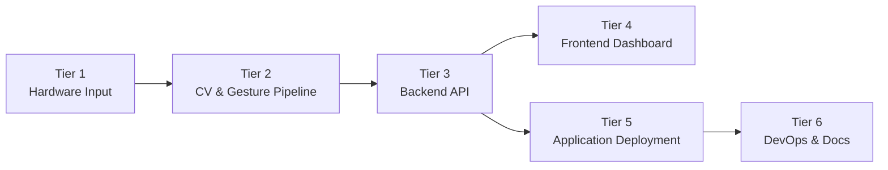

# Software Requirements Specification

## 1. Introduction

### 1.1 Purpose

This SRS specifies the **Gesture-Based Drone Control (GBDC)** system, a real-time pipeline 
utilising computer vision that translates hand gestures into unmanned aerial vehicle (UAV)
flight commands. It is the authoritative reference for:

- The **development team** at Codex Merchants, for implementation and verification.
- The **Project owner and mentor(s)**, EPI-USE Labs, as the acceptance baseline.
- The **academic mentors** (COS 301 staff), for evaluation.

### 1.2 Scope

**Product name.** Gesture-Based Drone Control (hereafter **GBDC**).

**What the product will do.** GBDC captures a live camera feed, detects 21-point hand
landmarks using MediaPipe, classifies the resulting gestures via a rule-based engine
(with an optional TFLite-based recognizer as a strategy alternative), translates the
recognised gestures into flight commands, and dispatches those commands to a drone or
drone simulator through an adapter abstraction. A web dashboard provides live telemetry,
gesture-overlay video, and command auditing.

**What the product will *not* do.**

- It will not perform autonomous mission planning (e.g. waypoint flight, GPS
  route-following).
- It will not perform computer-vision tasks beyond hand-landmark detection
  (no face recognition, object tracking, or scene understanding).
- It will not control multiple drones simultaneously in v1.
- It will not operate in beyond-visual-line-of-sight (BVLOS) conditions.

**Benefits.** Removal of the physical controller barrier improves accessibility for
novices and users with limited fine-motor capability, and creates a natural
human–computer interaction model suitable for educational, demonstration, and
experiential settings.

### 1.3 Definitions, Acronyms, and Abbreviations

| Term | Definition |
| --- | --- |
| **GBDC** | Gesture-Based Drone Control system - the product specified by this SRS. |
| **UAV** | Unmanned Aerial Vehicle. Our drone in this case. |
| **GCS** | Ground Control Station - the host machine running the recognition pipeline. |
| **FPS** | Frames Per Second. |
| **CV** | Computer Vision. |
| **OpenCV** | Open-source Computer Vision library. Used for camera frame capture and preprocessing.|
| **UVC** | USB Video Class. The standard protocol used by USB-connected cameras, enabling plug-and-play use with OpenCV |
| **MediaPipe** | Google's framework for real-time hand-landmark detection. |
| **HID** | Human Interface Device. Any hardware input peripheral, such as a keyboard, gamepad, or camera. |
| **Latency** | End-to-end delay from each step in the pipeline, i.e. gesture recognition to command dispatch. |
| **ML** | Machine Learning. |
| **TFLite** | TensorFlow Lite - lightweight on-device ML inference runtime. |
| **SDK** | Software Development Kit. |
| **API** | Application Programming Interface. |
| **WS** | WebSocket, used for real-time communications such as gesture streaming |
| **REST** | Representational State Transfer, endpoints used for config, logs, system faults  |
| **Failsafe** | A predefined safe-state behaviour triggered automatically on fault. |
| **Adapters** | A two-way adapter is implemented to decouple input methods and UAV options. |
| **PAS** | Project AirSim. Microsoft's Unreal Engine 5 based drone sim, the successor to legacy AirSim. |
| **AS** | AirSim.  Microsoft's legacy Unreal Engine 4 based drone simulator.  |
| **pynng** | Python bindings for the NNG (Nanomsg Next Generation) messaging library. Used by PAS's Python client.|

A site-wide list of abbreviations is auto-appended on every page via
`docs/includes/abbreviations.md`.

### 1.4 References

1. Kung, D. C. *Software Engineering* (2nd ed.). McGraw-Hill, 2024.
   Chapters 3–5 and 7 (System Engineering, Requirements Elicitation,
   Domain Modeling, Use Cases). Architectural content (Ch. 6) is now
   covered by [`SAS.md`](SAS.md).
2. [`SAS.md`](SAS.md) - Software Architecture Specification (the
   architectural, technological, and deployment counterpart to this
   document).
3. [`BRAND.md`](BRAND.md) - Brand & Design System (the visual and UX
   counterpart to this document).
4. COS 301 lecture material - *System Engineering & Software
   Requirements Elicitation.* University of Pretoria, 2026.
5. EPI-USE Labs. *Gesture-Based Drone Control - Project Brief* (tender
   document, 2026).
6. Codex Merchants. *Tender Response & Proposed Architecture*
   [`docs/reports/tender.pdf`](reports/tender.pdf).
7. MediaPipe Hands documentation -
   [google.github.io/mediapipe/solutions/hands](https://google.github.io/mediapipe/solutions/hands).
8. xFly SDK / DJI Tello SDK product documentation.
9. Microsoft AirSim - [microsoft.github.io/AirSim](https://microsoft.github.io/AirSim).

### 1.5 Overview

The remainder of this document is organised as follows.

- **Section 2 - Overall Description.** Product perspective, interfaces, operating
  environment, user characteristics, assumptions, and dependencies.
- **Section 3 - Specific Requirements.** External-interface, functional, and
  quality-attribute requirements, plus base features and process requirements,
  numbered using the hierarchical `R<i>.<j>.<k>` scheme. Architectural and
  technological decisions that realise these requirements live in
  [`SAS.md`](SAS.md).
- **Section 4 - Use Cases.** Use-case diagram and full use-case descriptions
  for the primary operational scenarios.
- **Section 5 - Domain Model.** The analysis-level domain model that
  anchors the design.
- **Appendices.** Requirements-elicitation methodology, traceability matrix,
  and revision history.

---

## 2. Overall Description

### 2.1 Product Perspective

GBDC is a **self-contained, ground-based application** that interfaces with a
detachable UAV (real or simulated) and a single human operator via a camera and a
dashboard. It is structured into six tiers, applying a **top-down,
divide-and-conquer decomposition** so that each tier is functionally cohesive and
loosely coupled.

*Figure 2.1 - Six-tier logical decomposition of GBDC. The corresponding
architectural-style choices for each tier are documented in
[`SAS.md` Section 2](SAS.md#2-architectural-requirements).*

#### 2.1.1 System Interfaces

| Interface | Direction | Protocol | Purpose |
| --- | --- | --- | --- |
| Camera -> Processing Pipeline | In | OpenCV `VideoCapture` (USB / built-in) | Raw video frames at ≥30 FPS. |
| Processing Pipeline -> Backend | In-process | Python async queue | Recognised-gesture events. |
| Backend <-> Frontend | Bidirectional | WebSocket (JSON) | Live gestures, telemetry, control. |
| Backend <-> Drone Adapter | Bidirectional | xFly SDK / Tello SDK / AirSim RPC | Command dispatch and telemetry. |
| Backend <-> Storage | Out | SQLite (file) | Gesture log, telemetry history. |

#### 2.1.2 User Interfaces

A single-page web dashboard, served by the backend, and either hosted externally, or packaged via Electron
(desktop) / PWA + Capacitor (mobile), provides:

- A live video feed with hand-landmark overlay.
- A current-gesture indicator and the command it maps to.
- Telemetry panels (altitude, battery, signal, flight mode).
- Critical-event alerts (low battery, signal loss, failsafe).

Final visual specifications, component states, and wireframes are documented
in [`BRAND.md`](BRAND.md).

#### 2.1.3 Hardware Interfaces

- A standard webcam or built-in laptop camera (≥720p, ≥30 FPS).
- A supported UAV (initially an XFly drone ) **or** a machine running AirSim or PAS.

#### 2.1.4 Software Interfaces

The runtime software stack and the rationale for each choice are documented
in [`SAS.md` Section 3: Technology Requirements](SAS.md#3-technology-requirements).
A summary of the major versions is provided here for context:

| Software | Version | Role |
| --- | --- | --- |
| Python | 3.11.x | CV / ML / backend runtime. |
| FastAPI | 0.110+ | REST + WebSocket backend. |
| OpenCV | 4.8+ | Frame capture and pre-processing. |
| MediaPipe Hands | 0.10+ | Landmark detection. |
| TensorFlow Lite | 2.x | Optional ML gesture classifier. |
| React + TypeScript | 18 / 5.x | Frontend dashboard. |
| Project AirSim | latest | Primary drone simulator. |
| AirSim | latest | Secondary drone simulator. |
| xFly Tello SDK | latest | Physical-drone interface. |
| Capacitor | latest | Mobile packaging. |
| Electron | latest | Desktop packaging. |
| SQLite | 3.x | Local persistence. |

#### 2.1.5 Communications Interfaces

- **WebSockets** for live gesture / telemetry streams between
  backend and frontend.
- **HTTP/1.1 + REST endpoints** for configuration, history queries, and authentication.
- **Vendor SDK transports** (UDP for Tello, RPC for AirSim) hidden behind the
  `DroneAdapter` abstraction.

#### 2.1.6 Memory Constraints

- Target footprint on the GCS: ≤ 1 GB RAM at steady state. This excludes the footprint of drone simulations, which are computationally expensive by nature.
- SQLite log volume capped at 250 MB before automatic rotation.

#### 2.1.7 Operations

GBDC operates in multiple modes:

=== "Live mode"

    Operator stands in front of the camera, system runs the full
    capture -> recognition -> command pipeline against a connected drone or
    simulator. Telemetry streams continuously to the dashboard.

=== "Replay mode"

    The dashboard replays a logged session from SQLite, including the
    recognised-gesture stream and the resulting telemetry. No drone is
    required.

#### 2.1.8 Site-Adaptation Requirements

The system requires no on-site adaptation beyond:

- Selecting the active drone adapter (`pas` / `airsim` / `xfly`) via an on screen prompt.
- Configuring the camera index if multiple cameras are connected.

### 2.2 Product Functions (Summary)

At a high level, GBDC shall:

1. Capture and pre-process a live video stream from a camera.
2. Detect and track hand landmarks in real time.
3. Classify hand pose into one of a fixed gesture vocabulary.
4. Translate gestures into drone commands via a deterministic mapping.
5. Dispatch commands through a pluggable drone adapter (xfly / pas / as).
6. Stream gestures, commands, and telemetry to a live dashboard.
7. Persist gesture and telemetry logs for review and replay.
8. Enforce safety failsafes (hover, auto-land, idle detection, takeoff lockout).

- For the sake of broader accessibility, this core loop is supplemented by the option for multiple input methods, such as keyboard controls or on-screen buttons. These behave similarly, using the same command interface as the main loop.

### 2.3 User Characteristics

GBDC is operated by a single human at a time. Three user roles are
recognised:

| Role | Description | Primary use cases |
| --- | --- | --- |
| **Operator** | The person standing in front of the camera issuing gestures. Assumed to be of average physical ability with at least one hand in clear view, indoors with adequate lighting. No prior pilot training is required. | UC-1, UC-2, UC-3, UC-4 |
| **Demonstrator** | A team member or evaluator presenting the system. Familiar with the gesture vocabulary and the dashboard. | UC-1, UC-2, UC-3, UC-5 |
| **Reviewer** | A mentor, evaluator, or stakeholder reviewing recorded sessions through the replay view. Does not interact with the live pipeline. | UC2, UC-5 |

### 2.4 Assumptions and Dependencies

- **A1.** The operator has at least one hand visible to the camera.
- **A2.** All operations are done indoors, with consistent lighting.
- **A3.** The host machine has a working webcam accessible via OpenCV.
- **A4.** A drone simulator (PAS) or a compatible physical drone is
  available at runtime.

---

## 3. Specific Requirements

### 3.1 External Interface Requirements

#### R1: User Interface

- **R1.1:** The system shall provide a live operator dashboard.
    - **R1.1.1:** The dashboard shall display the live camera feed with the
      MediaPipe hand-landmark skeleton overlaid, at no less than 24 FPS.
    - **R1.1.2:** The dashboard shall display the currently recognised
      gesture and the command it is mapped to, visible without scrolling.
    - **R1.1.3:** The dashboard shall display drone telemetry - altitude,
      battery percentage, flight mode, and link status - in a single
      panel.
- **R1.2:** The system shall present critical alerts.
    - **R1.2.1:** Critical events (low battery, signal loss, failsafe
      activation) shall raise both a visual indicator and an audible cue.
    - **R1.2.2:** Each alert shall remain visible until acknowledged by the
      operator or until the underlying condition clears.

> The majority of this functional requirement is handled in use case 2. The data processing & aggregation component of the system will be responsible for the majority of the alerts **(R1.2)**, and the CV pipeline is responsible for the dashboard elements **(R1.1)**

#### R2: Hardware & Software Interfaces

- **R2.1:** The system shall accept video input from any OpenCV-compatible
  camera device (USB UVC or built-in).
- **R2.2:** The system shall dispatch commands to a UAV through an
  implementation of the `DroneAdapter` interface. The interface contract is
  defined in [`SAS.md` Section 4 API Contracts](SAS.md#4-api-contracts).
- **R2.3:** The system shall expose a WebSocket endpoint at `/ws/live`
  carrying JSON-encoded `GestureEvent` and `TelemetryFrame` messages.
- **R2.4:** The system shall expose REST endpoints under `/api/v1` for
  configuration, session history, and replay control. Full schema is given
  in [`SAS.md` Section 4 API Contracts](SAS.md#4-api-contracts).

> These requirements are delegated equally between the CV Pipeline and Adapter subsystems.

### 3.2 Functional Requirements

#### R3: Camera Capture & Detection

- **R3.1:** The system shall capture video for gesture recognition.
    - **R3.1.1:** The pipeline shall capture frames at a minimum of 30 FPS.
    - **R3.1.2:** The pipeline shall preprocess each frame (resize, colour
      conversion) before landmark detection.
- **R3.2:** The system shall detect and classify hand gestures.
    - **R3.2.1:** The pipeline shall detect and track 21 hand landmarks in
      real time using MediaPipe Hands.
    - **R3.2.2:** The pipeline shall recognise a fixed vocabulary of at
      least six gestures: Open Palm, Fist, Thumb Up, Thumb Down,
      Pointer-Left, Pointer-Right.
    - **R3.2.3:** The pipeline shall reject unrecognised or ambiguous
      gestures and shall not produce a command in such cases.

> This entire requirement remains the responsibility of the CV pipeline, and is accomplished using OpenCV for preprocessing **(R3.1)**, in conjunction with MediaPipe Hands **(R3.2)**.

#### R4: Gesture–Command Mapping

- **R4.1:** The system shall map each recognised gesture to exactly one
  drone command via a deterministic mapping table, defined in the Gesture class.
- **R4.2:** The mapping table shall be configurable without code changes
  (e.g. via a JSON or YAML profile file).
- **R4.3:** The system shall dispatch a command to the active drone
  adapter within 200 ms of the gesture being recognised
  (see also `NFR1.1`).
- **R4.4:** All control inputs, regardless of the source, shall be encapsulated in a common object containing the command's type, a source identifier, and any optional payloads before dispatch.

> This forms part of th CV pipeline, and is done by interpreting key landmarks on the users' hand. **R4.3-R4.4** represents the handoff to the HID to Drone adapters subsystem.

#### R5: Drone Communication

- **R5.1:** The system shall maintain bidirectional communication with the
  active drone adapter.
    - **R5.1.1:** The system shall ingest telemetry frames from the drone
      adapter at a minimum rate of 5 Hz.
    - **R5.1.2:** The system shall forward telemetry frames to the
      dashboard via the WebSocket endpoint.
- **R5.2:** The system shall detect and respond to link loss.
    - **R5.2.1:** If the heartbeat to the drone adapter is missed for more
      than 2 seconds, the system shall command `HOVER`.
    - **R5.2.2:** Link-loss events shall be surfaced as a banner alert on
      the dashboard.
- **R5.3:** All drone adapters must return normalised telemetry data of the same shape, containing at minimum altitude, speed, battery percentage, heading direction, and flight state.

> This is handled entirely by the adapters subsystem. Each supported drone, i.e. every concrete DroneAdapter, implements these features.

#### R6: Failsafes 

- **R6.1:** The system shall hold a safe state in the absence of input.
    - **R6.1.1:** If no gesture is detected for more than 3 seconds, the
      system shall command `HOVER`.
    - **R6.1.2:** While in `HOVER` for idle, the dashboard shall display an
      "Idle - hovering" indicator.
- **R6.2:** The system shall protect against critical failure modes.
    - **R6.2.1:** When reported battery falls below 15 %, the system shall
      initiate an auto-land sequence.
    - **R6.2.2:** The system shall reject any take-off command issued
      before the gesture-recognition pipeline reports a valid connection.
    - **R6.2.3:** The dashboard shall expose an emergency-stop control
      that commands an immediate landing.
    - **R6.2.4:** An emergency-landing or other safety-critical operations must override all pending operations of a lower level of importance.
- **R6.3:** The system shall log every issued command and significant
  system event (start, stop, failsafe trip, error) with a
  timestamp in SQLite, as well as to a debug console.

> Failsafes are included in all parts of the interaction loop. Most notably in the main points of interaction of the system, camera capture, and drone interaction. Logs are created at every step of the process.

#### R7: Alternative Input Control

 - **R7.1:** The system shall accept multiple supplementary input sources.
    - **R7.1.1:** The system shall accept keyboard input as a control source, mapping key presses to drone commands via a fixed binding table.
    - **R7.1.2:** The system shall accept gamepad input as a control source, allowing for analog control rather than discrete, digital input
    - **R7.1.3:** Input sources must be switchable seamlessly at runtime, via a simple button press on the dashboard. This needs to be quick and responsive.
    - **R7.1.4** Details of the currently selected input source must be clearly visible, including a controls legend, as well as real-time indications of any connection issues
 - **R7.2:** The system must implement each supported input source to be fully compatible and consistent with every supported drone implementation.

> This is handled entirely in the adapter subsystem. Each input method is guarunteed to behave the same with every drone via the DroneAdapter interface. InputAdapters allow each input device to behave identically.

#### R8: User Authentication and Preference Management
  - **R8.1:** The system shall provide user registration and authentication.
    - **R8.1.1:** A new user can register an account with an email address and a password
    - **R8.1.2:** Passwords shall be validated against a minimum length / strength policy and stored using a cryptographic hashing function and salted.
    - **R8.1.3:** Returning users shall be able to authenticate using their email address and password.
    - **R8.1.4:** On logout, the WebSocket connection should be closed, and the dashboard should return the user to the login screen.
  - **R8.2:** The system shall store user preferences.
    - **R8.2.1:** Settings chosen by the user, such as theme (light/dark), and any other customization options, should be saved and loaded upon login
    - **R8.2.2:** Stored settings may be modified at runtime, with any changes taking effect without any page reload
    - **R8.2.3:** If a stored preference is unable to be fetched, a default value should be used in its place.

> This is handled by its own subsystem, specifically for user management. 

#### R9: Tutorial and Assist Mode

  - **R9.1** The system shall provide an interactive tutorial.
    - **R9.1.1** The tutorial must be accessible from the dashboard or triggered on first login.
    - **R9.1.2** The system shall retrieve tutorial steps from the backend through a REST endpoint.
    - **R9.1.3** Each tutorial step shall define an instruction payload and a completion condition.
    - **R9.1.4** the system shall enforce sequential progression.
    - **R9.1.5** The frontend shall render tutorial content using overlays, highlighting, and animations to guide user actions.
    - **R9.1.6** The tutorial may be revisited or restarted at any time.
  - **R9.2** The system must provide an 'assist mode' for safety
    - **R9.2.1** Assist Mode needs to modify drone behaviour during tutorial sessions.
    - **R9.2.2** Assist Mode must be toggleable at will during normal drone operation.
    - **R9.2.3** Max altitude, speed, and sensitivity contraints must be enforced by assist mode.
    - **R9.2.4** The frontend shall clearly indicate Assist Mode status in the dashboard UI

> This is once again its own subsystem, that when in use, acts as a 'filter' for the general CV pipeline.
> This tutorial subsystem is not standalone, but rather interfaces heavily with the rest of the system, similar to training wheels.

### 3.3 Non-Functional (Quality) Requirements

The Demo 2 brief targets *five* quantified quality requirements. The five
chosen for GBDC are the attributes that materially constrain the
architecture; the architectural decisions that realise each are tabulated
in [`SAS.md` Section 2.5](SAS.md#25-mapping-quality-requirements-to-architectural-decisions).

#### NFR1: Performance

- **NFR1.1:** End-to-end gesture-to-command latency shall not exceed
  **200 ms at the 95th percentile**, measured from frame timestamp to
  command dispatch, under nominal load on the reference machine (4-core
  x86_64, 8 GB RAM, integrated GPU, a lower end laptop running Windows).
- **NFR1.2:** The pipeline shall sustain **≥ 30 FPS** while keeping CPU
  usage **≤ 70 %** on the reference machine.
- **NFR1.3:** The dashboard shall render incoming WebSocket frames at
  **≥ 24 FPS** with no dropped frames over a 10-minute steady-state run.

#### NFR2: Security

- **NFR2.1:** The WebSocket endpoint shall require a short-lived
  (**≤ 30-minute**) session token issued via the REST login endpoint.
- **NFR2.2:** All credentials and connection strings shall be loaded from
  environment variables or the host's secrets manager; **zero secrets**
  shall be committed to the repository (verified by a pre-commit
  secret-scan hook and `gitleaks` in CI).
- **NFR2.3:** Every API endpoint shall validate its input payload against
  a JSON schema and reject malformed requests with `400 Bad Request`;
  **100 %** of endpoints shall be covered by schema validation.

#### NFR3: Reliability

- **NFR3.1:** Under adequate indoor lighting, gesture-classification accuracy shall
  be **≥ 95 %** measured against a labelled test set of at least 300
  samples.
- **NFR3.2:** False-positive command rate (a command issued from a
  non-deliberate gesture) shall not exceed **1 %** over the same test set.
- **NFR3.3:** A crash in the recognition pipeline shall not crash the
  backend; the system shall enter failsafe-hover and surface an error to
  the dashboard within **≤ 1 second**.

#### NFR4: Maintainability

- **NFR4.1:** The codebase shall be partitioned into the modules listed in
  [`SAS.md` Section 2.4](SAS.md#24-architectural-diagram); no module shall
  import from a sibling outside its declared interface (enforced by a
  static-import check in CI).
- **NFR4.2:** Each module shall maintain **≥ 80 % line coverage** in its
  unit test suite. CI shall fail any PR that drops coverage below this
  threshold.
- **NFR4.3:** A bug fix or small feature shall be deployable from a green
  PR to the production environment within **≤ 30 minutes** end-to-end
  (merge -> CI -> deploy).

#### NFR5: Usability

- **NFR5.1:** A first-time operator shall be able to complete the basic
  flight sequence (take-off, hover, move, land) within **≤ 5 minutes**
  of opening the system, given access to the in-product tutorial.
- **NFR5.2:** The system shall achieve **≥ 85 % user satisfaction** in
  end-of-demo usability testing with at least five external
  participants.
- **NFR5.3:** Every user-visible error shall describe the cause and
  suggest a corrective action; **100 %** of error states shall meet
  this rule in a quarterly UX audit.

### 3.4 Other Requirements

#### OR1: Process & Documentation

- **OR1.1:** All project documentation shall be authored in Markdown and
  rendered by MkDocs Material to GitHub Pages, deployed automatically on
  push to `main` and `dev`.

---

## 4. Use Cases

The use cases derived from the functional requirements are modelled below.
Each follows the standard use-case template: scope, actors,
preconditions, main flow, alternative flows, post-conditions. Requirement
IDs are cited inline so the mapping back to Section 3 is unambiguous.

### 4.1 Use-Case Diagram

*Figure 4.1 - Primary use cases and actors.*

### 4.2 UC-1 - Hand Tracking & Gesture Recognition

This use case represents the core entrypoint for the system and the basis of the Computer Vision pipeline. Gesture detection must be reliable and have low latency, as all downstream drone commands depend entirely on the output of this stage.

**Actors.** Operator (primary)

**Preconditions.**

- The system is launched and the drone adapter is connected.
- The drone adapter reports healthy telemetry data.

**Main flow.**

1. The Operator positions their hand in view of the camera.
2. OpenCV captures the live video and preprocesses each frame; adjusting contrast, colours, and saturation to improve detection
    (`R3.1.1`, `R3.1.2`).
3. Each preprocessed frame is passed to MediaPipe Hands, which detects and tracks the hand landmarks in real time (`R3.2.1`).
4. The landmark array is passed to a rule-based gesture recogniser, which classifies the hand position against a fixed ruleset to determine a confidence level for the current action (`R3.2.2`).
5. The recognised gesture, confidence score, and timestamp are emitted to the dashboard via a WebSocket endpoint (`R2.3`).
6. The landmark skeleton and the aforementioned info points are rendered as an overlay on the live camera feed on the dashboard (`R1.1.1`, `R1.1.2`).

**Post-conditions.** A drone command has been dispatched, and the details of the gesture is visible on the dashboard. All events are logged with a timestamp (`R6.3`).

**Alternative flows.**

- *A1 - Unrecognised or ambiguous gesture.* If the classifier cannot confidently classify the hand pose (`R3.2.3`), no command is issued,
the landmark overlay continues to be rendered, and the gesture indicator displays an unknown state. The last issued command remains in effect.

### 4.3 UC-2 - Statistics Dashboard and Telemetry Logging

This use case validates the full data pipeline from backend to frontend and serves as the primary visual centrepiece for system demonstrations.
The charts and visualisations produced here are central to validating full integration once a physical drone is involved.

**Actors.** Operator (priamry).

**Preconditions.**

- The system is launched and the drone adapter is connected.
- The drone adapter reports healthy telemetry data.
- The operator has an active browser session open on the dashboard.

**Main flow.**

1. The drone adapter begins producing telemetry at a fixed polling interval, covering altitude, speed, heading, battery percentage, and signal strength (`R2.1`).
2. The backend telemetry emitter packages each reading into a timestamped payload and broadcasts it to all connected clients over a WebSocket endpoint (`R2.3`).
3. The dashboard receives the WebSocket stream and updates the live altitude and speed line charts in real time (`R1.2.1`).
4. The battery and signal strength gauge components update on each received payload (`R1.2.2`).
5. On session end, the backend aggregates the telemetry rows for that session and writes a summary record to the flight log table (`R6.2`).
6. The operator may request a flight summary at any time via a REST endpoint, which returns the aggregated statistics for the current or prior session (`R2.2`).

**Post-conditions.** All telemetry readings for the session are stored in the telemetry log table. 
A flight summary record exists in the flight log table. 
The dashboard reflects the final known state of all live components.
All events are logged with a timestamp (`R6.3`).

### 4.4 UC-3 - Drone Simulator Controls and Adapter

This use case establishes the two-way adapter pattern that all future drone integrations, including real hardware, will follow. Correctness here means that swapping in a physical drone later requires a configuration change rather than an architectural one.

**Actors.** Operator (primary)

**Preconditions.**

- A simulator or real drone is available.
- A DroneAdapter is running to establish a connection to the drone.
- The dashboard is open in the operator's browser.
- The backend is running and ready to accept inputs.

**Main flow.**

1. On startup, the backend instantiates the configured concrete DroneAdapter (`R4.1`).
2. The adapter calls `connect()`, establishing a connection to the AirSim RPC endpoint and enabling API control of the UAV (`R4.2`).
3. The dashboard polls the simulator status indicator, which reflects the active adapter name, connection state, and telemetry. (`R1.3.1`).
4. A recognised event is received, and this is delegated to the correct InputAdapter to package into a Command (`R3.3.1`, `R7.1`).
5. The adapter translates the method call into the appropriate API/SDK call and dispatches it to the simulator (`R4.3`).
6. The simulator executes the command and the drone state updates accordingly.
7. The adapter asynchronously retrieves updated telemetry via `get_telemetry()` and returns it to the telemetry pipeline for broadcasting and persistence (`R2.1`).

**Post-conditions.** The drone has responded to the issued command. Updated telemetry reflects the new state. The dashboard status indicator shows the adapter as connected. All commands and state transitions are logged with a timestamp (`R6.3`).

**Alternative flows.**

- *A1 - Simulator unreachable on connect.* If `connect()` fails to reach the drone instance,
the adapter returns a failed connection status without raising an unhandled exception.
The dashboard status indicator reflects the disconnected state. No commands are dispatched until a successful connection is established.
The user may repeat the process.
- *A2 - Command issued while adapter is disconnected.* If a gesture event triggers a command translation while the adapter is not connected, the Command is logged as dropped and no further action is taken. Nothing is sent to the simulator
- *A3 - Adapter swap at runtime.* If the active adapter is changed while the system is running,
the previous adapter calls `disconnect()` to release API control before the new adapter is initialised and connected.
The status indicator updates to reflect the new adapter. In-flight commands from the previous adapter are not forwarded to the replacement.
This process should take a couple seconds at most.

### 4.5 UC-4 - Controller-Based Drone Control.

This use case provides an alternative control mechanism to gesture recognition by allowing an operator to fly the drone using a gamepad.
The controller input path uses the same Command abstraction and DroneAdapter pipeline as all other input methods,
ensuring that new control mechanisms can be added without modifying the drone-control subsystem.
This is its own use case due to the intricacies of analog controls, making this a much more complex input method than most.

**Actors.** Operator (primary)

**Preconditions.**

- A supported controller is connected to the operator's device, either via bluetooth or USB.
- The dashboard is open in the operator's browser and is fully up and running
- The DroneAdapter is connected to a simulator or a physical drone
- The `Controller` input method is selected on the dashboard.

**Main flow.**

1. The operator connects a controller to the host device.
2. The dashboard detects the controller and displays the current controller status (`R7.2.1`).
3. A high-frequency polling service continuously samples the controller state, via WebSockets (`R7.2.2`).
4. Raw controller readings are normalised, 
applying deadzone filtering and sensitivity adjustments to analog inputs (`R7.2.3`).
5. The processed controller state is transmitted to the backend through a dedicated WebSocket endpoint (`R2.3`, `R7.2.4`).
6. The ControllerInputAdapter receives the controller payload and converts it into one or more Command objects using the shared command vocabulary (`R7.1`).
7. Use case 3 is invoked. The resulting Command objects are forwarded to the active DroneAdapter (`R2.2`).
8. The dashboard updates the controller visualisation component to reflect 
the current stick positions, button states, and generated commands (`R1.1`, `R7.2.5`).

**Post-conditions.**

The drone has responded to the issued controller commands. The dashboard displays the current controller state and updated telemetry.
All controller inputs and resulting commands are logged with timestamps (`R6.3`).

**Alternative flows.**

- *A1 - Controller disconnected during operation.* If the controller becomes unavailable while a session is active,
the polling service reports the disconnect, no further controller commands are created,
and the dashboard displays a controller-disconnected warning.
The drone remains in its last valid state until another command source becomes active.
- *A2 - Invalid controller payload.* If the backend receives malformed controller data,
the payload is rejected by backend validation (`NFR2.3`). No command is generated and the error is logged.
- *A3 - Analog input inside deadzone.* If an analog stick remains within the configured deadzone (`R7.2.3`),
no movement command is generated and the drone maintains its current state.

### 4.6 UC-5 - Real Telemetry Logging and Analytics

This use case enables the collection, storage, and analysis of telemetry data originating from physical drones. Telemetry is continuously streamed from the active drone connection, persisted for historical analysis, and aggregated into user-specific statistics that provide operational insights across multiple flights. The focus of this use case is on the physical drone, which does not provide a built-in way to collect telemetry data.

**Actors.** Operator (primary), Physical Drone (supporting)

**Preconditions.**

- The physical drone is powered on and connected through a supported DroneAdapter.
- The telemetry subsystem is operational.
- A valid database for storage is available.

**Main flow.**

1. The operator establishes a connection to a physical drone through the dashboard (`R8.1`).
2. The DroneAdapter begins receiving live telemetry from the drone SDK (`R8.2`).
3. Telemetry measurements are streamed to the dashboard for real-time display (`R2.1`).
4. The system continuously aggregates telemetry data during  the flight session (`R8.5`).
5. The operator performs one or more flight operations.
6. The telemetry subsystem updates aggregate statistics as new data arrives (`R8.5`).
7. When the flight session ends, the system finalises and stores a flight summary (`R8.6`).
8. The operator views historical flight records and personal performance statistics through the dashboard (`R8.7`).

**Post-conditions.**

- Telemetry data has been stored for the completed flight session.
- A flight summary has been generated.
- User-specific aggregate statistics have been updated.

**Alternative flows.**

- *A1 - Packet loss.* If telemetry packets are lost, the system ignores the loss up to a specified threshold,
                      since polling happens at such a high rate (`R8.8`).

- *A2 - Database unavailable.* If telemetry cannot be persisted, the system continues displaying live telemetry while logging storage failures.
                                      The operator is notified of the issue (`R8.9`).

- *A3 - Drone disconnects unexpectedly.* If communication with the drone is lost during flight, telemetry collection stops and the session is logged as incomplete (`R8.10`).

- *A4 - Invalid telemetry received.* If malformed telemetry data is received from the drone SDK, 
the packet is discarded and an error is logged. Normal collection continues for subsequent valid packets (`NFR2.3`).

### 4.7 UC-6 - 

### 4.8 UC-7 - Interactive User Tutorial and Assist Mode

This use case provides a guided onboarding experience for new operators.
The system presents an interactive tutorial that teaches users how to use the dashboard, connect to a drone, understand telemetry,
and execute flight commands safely.
During the tutorial, an optional Assist Mode can be enabled to reduce flight risk by limiting drone performance and providing additional stabilisation between commands.

**Actors.** Operator (primary)

**Preconditions.**

- The operator is authenticated.
- The dashboard is accessible.
- A DroneAdapter is available and connected.

**Main flow.**

1. The operator selects the "Start Tutorial" option from the dashboard, or
accepts the tutorial prompt when creating a new account. (`R9.1.1`)
2. The system retrieves the ordered list of tutorial steps from the backend. (`R9.1.2`, `R9.1.3`)
3.  The dashboard displays a tutorial overlay explaining the current objective. (`R9.1.6`)
4. The tutorial guides the operator through basic dashboard functionality, including telemetry displays and drone status indicators. (`R9.1.3`, `R9.1.4`)
5. When the completion condition is satisfied, the frontend notifies the backend via a REST endpoint. (`R9.1.5`)
6. The backend updates tutorial progression state and returns the next step in sequence.
7. The tutorial continues iteratively until all steps are completed, covering:
  - Dashbrad navigation
  - Telemetry interpretation
  - Drone connection
  - Command execution
8. The system optionally enables **Assist Mode** when required by the tutorial flow or user selection.
9. If the system detects that the user is struggling to progress (e.g. repeated invalid actions or inactivity beyond a threshold),
contextual hints are displayed to guide the user. (`R9.1.7`)
10. Upon completion of all tutorial steps, the system displays a completion screen summarising progress. (`R9.1.8`)

**Post-conditions.**

- The user has completed the full onboarding sequence.
- The operator is capable of basic drone control and hopefully won't crash the drone.

**Alternative flows.**

- *A1 - Tutorial resumed after interruption.* If the user exits the tutorial mid-sequence,
progress is persisted. On return, the system resumes from the last incomplete step (`R9.1.4`).
- *A2 - Completion condition not met.*  If a step condition is not satisfied,
the system remains on the current step and provides additional contextual hints (`R9.1.7`).

### 4.6 UC-8 - 

---

## 5. Domain Model

The analysis-level domain model captures the conceptual vocabulary of the
problem and is the input to the design class diagram in
[`SAS.md` Section 2.4](SAS.md#24-architectural-diagram).

*Figure 5.1 - Analysis-level domain model.*

---

## Appendix A - Requirements Elicitation Methodology

The requirements in this document were elicited following the five-step
process. Following Demo 1, the team is now enforcing this process
strictly for every subsequent demo.

=== "1. Collecting information"

    Sources of information used:

    - **Customer presentation** - EPI-USE Labs project brief and
      kickoff meeting.
    - **Literature survey** - MediaPipe Hands documentation, AirSim
      and drone SDK documentation, prior gesture-control research.
    - **Stakeholder survey** - bi-monthly meetings with our capstone
      mentor.
    - **Standups** - Frequent meetings between members of the team.
    - **User stories** - drafted by the team from the perspective of
      operator, demonstrator, and reviewer roles.

=== "2. Constructing analysis models"

    More descriptive diagrams will be provided through the continuous
    development of the project:

    - **Use-case diagram** - Figure 4.1, captures actor–system
      interaction.
    - **Domain model** - Figure 5.1, captures the conceptual
      vocabulary of the application.
    - **Architecture diagram** - see
      [`SAS.md` Section 2.4](SAS.md#24-architectural-diagram).

=== "3. Deriving requirements"

    Capabilities are derived from the user stories, business goals, and
    analysis models, then phrased as "The system shall …" statements in
    Section 3.

=== "4. Feasibility study"

    Technical feasibility was validated through the `sandbox/` proof of
    concepts (interactive control, stdin control, AirSim trials),
    which demonstrated end-to-end command flow before commitment.

=== "5. Reviewing the specification"

    This SRS is reviewed by the company mentor and capstone mentor
    frequently:

    - The development team (technical review - completeness, internal
      consistency).
    - The academic mentor (expert review).
    - The industry mentor (customer review).

---

## Appendix B - Requirements Traceability Matrix

| Requirement | Type | Verified by | Target demo | Status |
| --- | --- | --- | --- | --- |
| `R3.1.*`, `R3.2.1` | Capture & detection | `tests/cv_pipeline_testing` | Demo 1 | Delivered |
| `R3.2.2`, `R3.2.3` | Gesture classification | Recogniser unit tests | Demo 1 | Delivered |
| `OR2.*` | Base features | Frontend unit + Playwright E2E | Demo 1 | Delivered |
| `R4.*` | Mapping | `services/tests/test_command.py` | Demo 2 | In progress |
| `R5.*` | Drone comms | Adapter integration tests | Demo 2 | In progress |
| `R6.*` | Safety & failsafes | Manual + integration tests | Demo 2 | In progress |
| `R1.*` | Dashboard UI | Playwright E2E | Demo 2 | In progress |
| `NFR2.*` | Security | Backend auth + schema tests | Demo 2 | In progress |
| `NFR1.*` | Performance | Load / latency harness | Demo 3 | Planned |
| `NFR3.*` | Reliability / accuracy | Labelled-set evaluation | Demo 3 | Planned |
| `NFR4.*` | Maintainability | CI coverage gate | Continuous | Active |
| `NFR5.*` | Usability | UX audit + Playwright E2E | Demo 3 | Planned |

---

## Appendix C - Revision History

| Version | Date | Author | Summary of changes |
| --- | --- | --- | --- |
| 1.0 | Demo 1 | Codex Merchants | Initial SRS - full set of functional, performance, reliability, security, maintainability, portability, usability requirements; embedded architectural-style and design-pattern constraints under `NFR2`. |
| **2.0** | **Late May** | **Ayush** | **Architectural content extracted to [`SAS.md`](SAS.md).** Removed the former `NFR2` *Design Constraints* block (architectural-style choice and Adapter / Strategy / Observer pattern constraints) - these are now architectural decisions in `SAS.md Section 2`. Renumbered `NFR2` to *Security* and consolidated the quality requirements to **five quantified NFRs** (Performance `NFR1`, Security `NFR2`, Reliability `NFR3`, Maintainability `NFR4`, Usability `NFR5`) per the Demo 2 brief. Added UC-4 (Authenticate Operator Session) and UC-5 (Replay a Recorded Session) to reach five fully integrated use cases. Replaced all `DESIGN.md` cross-references with the equivalent `SAS.md` and `BRAND.md` pointers (`DESIGN.md` was retired). Added Section 2.3 User Characteristics. Brand and wireframe content moved to [`BRAND.md`](BRAND.md). |
| **2.1** | **25 June** | **Shavir** | Complete refactor, with a focus on diagrams, requirements, and use cases to line up with Demo 2 goals.  |