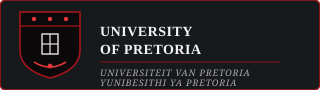

---
hide:
  - navigation
  - toc
---

  
Codex Merchants · COS 301 · 2026

  <h1>Gesture-Based <em>Drone Control</em></h1>
  

    A real-time computer-vision system that eliminates the physical controller entirely.
    Hand gestures detected through a live camera feed, classified by a dual rule-based and ML engine,
    translated directly into flight commands — with safety fail-safes built in from the ground up.
  

  

    Demo 1 Delivered
  

  

    
    
    
    
    
  

  

    <a href="SRS/" class="tx-btn tx-btn--primary">Read the SRS →</a>
    <a href="https://github.com/COS301-SE-2026/Gesture-Based-Drone-Control" class="tx-btn tx-btn--secondary">GitHub ↗</a>
  

  

  
Core Capabilities

  

  

    
🧠

    
Core Intelligence

    <h3>Dual Recognition Engine</h3>
    
MediaPipe-driven 21-point landmark detection feeding a rule-based classifier and a TFLite ML model over an asyncio-bounded queue.

    <a href="DESIGN/" class="tx-card__link">Architecture →</a>
  

  

    
⚡

    
Real-Time Pipeline

    <h3>Millisecond Latency</h3>
    
Live camera feed → 21-point detection → gesture classification → command translation → drone. FastAPI WebSocket backend, React telemetry dashboard.

    <a href="api/API_REFERENCE/" class="tx-card__link">API Reference →</a>
  

  

    
🛡️

    
Safety First

    <h3>Built-In Fail-Safes</h3>
    
Hover on tracking loss, emergency stop gesture, idle detection auto-land, and a full telemetry observer chain — all active by default.

    <a href="testing/TESTING/" class="tx-card__link">Testing strategy →</a>
  

  

  
Documentation

  

  

    
01 · Requirements

    <h3>Software Requirements Specification</h3>
    
Functional requirements, use cases, domain model, and quality attributes for the full system.

    <a href="SRS/" class="tx-card__link">Open SRS →</a>
  

  

    
02 · Architecture

    <h3>Design & Wireframes</h3>
    
Brand style guide, component wireframes, architectural patterns, and system diagrams.

    <a href="DESIGN/" class="tx-card__link">Open Design →</a>
  

  

    
03 · API

    <h3>API Reference</h3>
    
REST and WebSocket contracts, request/response schemas, and annotated examples.

    <a href="api/API_REFERENCE/" class="tx-card__link">Open API Docs →</a>
  

  

    
04 · Testing

    <h3>Testing Strategy</h3>
    
Unit, integration, and E2E coverage approach — Pytest for backend, Jest for frontend.

    <a href="testing/TESTING/" class="tx-card__link">Open Testing →</a>
  

  

    
05 · DevOps

    <h3>CI/CD Pipeline</h3>
    
GitHub Actions workflows, quality gates, linting, and automated docs deployment.

    <a href="CICD/" class="tx-card__link">Open CI/CD →</a>
  

  

    
06 · Standards

    <h3>Git Conventions</h3>
    
Branching strategy, commit format, PR rules, and feature-driven development workflow.

    <a href="GIT/" class="tx-card__link">Open Git Conventions →</a>
  

  

  
The Team · Codex Merchants

  

  

    
    
Ayush Beekum

    
Team Lead · Full Stack

    
u23596351

    

      <a href="https://github.com/Ayush-B99">GH</a>
      <a href="https://linkedin.com/in/ayush-beekum">LI</a>
    

  

  

    
    
Shavir Vallabh

    
AI · Optimization · HPC

    
u23718146

    

      <a href="https://github.com/ShavirV">GH</a>
      <a href="https://za.linkedin.com/in/shavir-vallabh">LI</a>
    

  

  

    
    
Jaitin Moodally

    
Systems · DevOps · Low Level

    
u23621372

    

      <a href="https://github.com/Wave2055">GH</a>
    

  

  

    
    
Team Member 4

    
Role TBC

    
u23547747

    

      <a href="https://github.com/COS301-SE-2026">GH</a>
    

  

  

    
    
Team Member 5

    
Role TBC

    
u2xxxxxxx

    

      <a href="https://github.com/COS301-SE-2026">GH</a>
    

  

!!! tip "Fill in the team details"
    Replace the placeholder members above with the actual names, student numbers, GitHub handles, and LinkedIn URLs from your README.

  

  
In Partnership With

  

  

    
    
Academic Host

    
COS 301 Software Engineering · Faculty of EBIT

  

  

    
    
Industry Sponsor & Client

    
Project owner and mentorship

  

