# NFR Evidence

  Generated from test runs
  Performance · Usability · Security · Reliability

!!! abstract "How to read this page"
    Every section below was written by `tests/nfr/report.py` from the JSON a test produced. Nothing here is typed by hand. Each section shows **what was measured and how**, the **result against the target**, the **distribution** of the raw samples, a **chart** drawn from those samples, any **screenshots**, and links to the **test source** and the **raw data files**, so every number can be traced back to code without cloning the repository.

**Totals:** 41 pass · 1 fail · 2 pending (awaiting usability-study participants) · 1 informational · 6 not measured.

## Where these numbers were measured

| Machine | Commit | Runner | Requirements |
|---|---|---|---|
| Darwin arm64, 8 cores | [`f63bc74b70`](https://github.com/COS301-SE-2026/Gesture-Based-Drone-Control/commit/f63bc74b70) | local | 34 |
| Darwin arm64, 8 cores | [`a8c0e38fd9`](https://github.com/COS301-SE-2026/Gesture-Based-Drone-Control/commit/a8c0e38fd9) | local | 11 |

Measurements recorded between **2026-09-29T01:35:42+00:00** and **2026-09-29T01:47:30+00:00** (UTC).

!!! note "Reference machine"
    SRS NFR1.1 sets the reference machine as a 4-core x86_64 laptop with 8 GB RAM. Numbers measured on a slower machine than that are conservative; numbers from a faster machine should be re-confirmed on the reference laptop before a demo.

---

## NFR1 Performance

### QR-03

**Recognition p95 < 50 ms (rule)** · SRS `NFR1.1` · tactic: Pure-geometry classifier · **PASS**

| Metric | Target | Actual |
|---|---|---|
| p95 single-frame recognition latency (ms) | < 50.0 | **0.0031** |

**How it was measured.** RuleBaedRecognizer.intepret_gesture timed on every sample of the labelled dataset

| n | min | mean | p50 | p95 | p99 | max |
|---|---|---|---|---|---|---|
| 5837 | 0.0025 | 0.0029 | 0.0029 | 0.0031 | 0.0034 | 0.0469 |

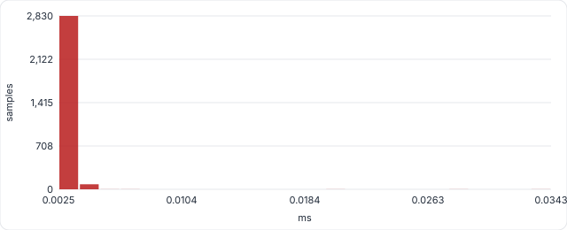

| Detail | Value |
|---|---|
| `frames` | 5837 |
| `mean_ms` | 0.0029 |

<small>Recorded 2026-09-29T01:46:50+00:00 on Darwin arm64, 8 cores · commit `f63bc74b70` (local) · [JSON](evidence/QR-03.json) · [raw samples CSV](evidence/raw/QR-03.csv) · [test source](https://github.com/COS301-SE-2026/Gesture-Based-Drone-Control/blob/f63bc74b70/tests/nfr/test_latency.py)</small>

### QR-25

**Recognition p95 < 50 ms (ML)** · SRS `NFR1.1` · tactic: 63-feature MLP · **PASS**

| Metric | Target | Actual |
|---|---|---|
| p95 single-frame recognition latency, ML engine (ms) | < 50.0 | **0.137** |

**How it was measured.** MLBasedRecognizer.interpret_gesture (feature extraction + MLP predict_proba + finger-state helper) timed on every sample of the labelled dataset.

| n | min | mean | p50 | p95 | p99 | max |
|---|---|---|---|---|---|---|
| 5837 | 0.0692 | 0.0876 | 0.0757 | 0.137 | 0.371 | 0.9127 |

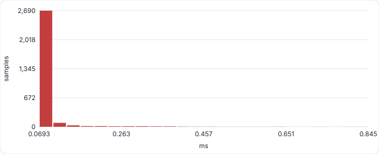

<small>Recorded 2026-09-29T01:46:51+00:00 on Darwin arm64, 8 cores · commit `a8c0e38fd9` (local) · [JSON](evidence/QR-25.json) · [raw samples CSV](evidence/raw/QR-25.csv) · [test source](https://github.com/COS301-SE-2026/Gesture-Based-Drone-Control/blob/a8c0e38fd9/tests/nfr/test_latency.py)</small>

### QR-26

**Hand detection p95 <= 100 ms, live** · SRS `NFR1.1` · tactic: MediaPipe lite model · **PASS**

| Metric | Target | Actual |
|---|---|---|
| p95 MediaPipe hand-detection time per frame, live at 30 fps (ms) | <= 100.0 | **17.744** |

**How it was measured.** MediaPipe Hands (model_complexity=0) timed on every 640x480 frame of real footage while the full pipeline, broadcast and 11 clients run. No hand is in the footage, so the palm detector runs on every frame (its slowest path).

| n | min | mean | p50 | p95 | p99 | max |
|---|---|---|---|---|---|---|
| 897 | 11.671 | 14.557 | 13.705 | 17.744 | 35.744 | 102.876 |

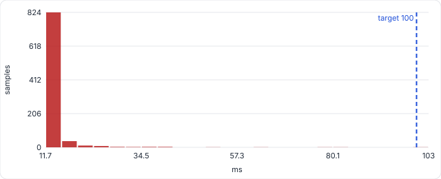

<small>Recorded 2026-09-29T01:47:30+00:00 on Darwin arm64, 8 cores · commit `a8c0e38fd9` (local) · [JSON](evidence/QR-26.json) · [raw samples CSV](evidence/raw/QR-26.csv) · [test source](https://github.com/COS301-SE-2026/Gesture-Based-Drone-Control/blob/a8c0e38fd9/tests/nfr/test_realtime_performance.py)</small>

### QR-27

**Frame serialization p95 <= 20 ms** · SRS `NFR1.1` · tactic: Encode once, fan out · **PASS**

| Metric | Target | Actual |
|---|---|---|
| p95 frame serialization for broadcast (JPEG + landmarks) (ms) | <= 20.0 | **0.939** |

**How it was measured.** serialize_event(include_frame=True) on real 640x480 frames with 1-2 hands: JPEG q60 encode, base64 and the pydantic model the WebSocket sends.

| n | min | mean | p50 | p95 | p99 | max |
|---|---|---|---|---|---|---|
| 580 | 0.698 | 0.808 | 0.789 | 0.939 | 1.154 | 1.94 |

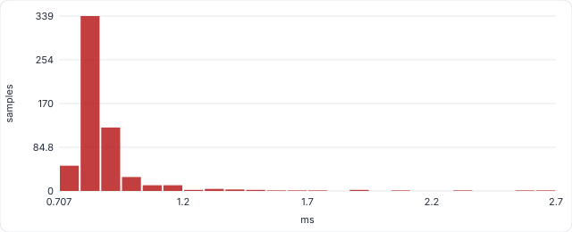

| Detail | Value |
|---|---|
| `mean_payload_kb` | 55.3 |

<small>Recorded 2026-09-29T01:46:53+00:00 on Darwin arm64, 8 cores · commit `a8c0e38fd9` (local) · [JSON](evidence/QR-27.json) · [raw samples CSV](evidence/raw/QR-27.csv) · [test source](https://github.com/COS301-SE-2026/Gesture-Based-Drone-Control/blob/a8c0e38fd9/tests/nfr/test_latency.py)</small>

### QR-28

**Resolve + dispatch p95 <= 30 ms** · SRS `NFR1.1` · tactic: Dict command maps · **PASS**

| Metric | Target | Actual |
|---|---|---|
| p95 gesture payload -> command resolved and executed (ms) | <= 30.0 | **0.0048** |

**How it was measured.** GestureAdapter confidence gate, two-hand/one-hand resolution, stability hold and history log, then DroneAdapter.execute() on the dummy drone.

| n | min | mean | p50 | p95 | p99 | max |
|---|---|---|---|---|---|---|
| 2900 | 0.0027 | 0.0037 | 0.0034 | 0.0048 | 0.0059 | 0.0411 |

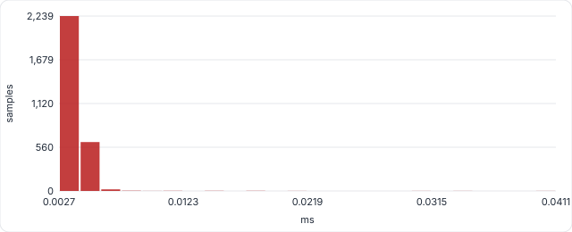

<small>Recorded 2026-09-29T01:46:53+00:00 on Darwin arm64, 8 cores · commit `a8c0e38fd9` (local) · [JSON](evidence/QR-28.json) · [raw samples CSV](evidence/raw/QR-28.csv) · [test source](https://github.com/COS301-SE-2026/Gesture-Based-Drone-Control/blob/a8c0e38fd9/tests/nfr/test_latency.py)</small>

### QR-29

**Frame -> drone command p95 <= 200 ms** · SRS `NFR1.1` · tactic: Bounded queue, one consumer · **PASS**

| Metric | Target | Actual |
|---|---|---|
| p95 frame timestamp -> command dispatched to drone (ms) | <= 200.0 | **20.5** |

**How it was measured.** Latency from CapturedFrame.timestamp to DroneAdapter.execute() returning, for every command the GestureAdapter emitted in a 30 s window at 30 fps. Includes queue wait, detection, ML recognition, stabilizer, JPEG encode, fan-out, adapter resolution and dispatch.

| n | min | mean | p50 | p95 | p99 | max |
|---|---|---|---|---|---|---|
| 841 | 13.108 | 17.33 | 15.309 | 20.5 | 89.134 | 219.944 |

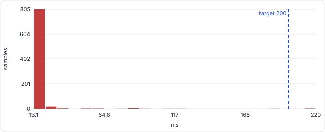

| Detail | Value |
|---|---|
| `commands_dispatched` | 841 |

<small>Recorded 2026-09-29T01:47:30+00:00 on Darwin arm64, 8 cores · commit `a8c0e38fd9` (local) · [JSON](evidence/QR-29.json) · [raw samples CSV](evidence/raw/QR-29.csv) · [test source](https://github.com/COS301-SE-2026/Gesture-Based-Drone-Control/blob/a8c0e38fd9/tests/nfr/test_realtime_performance.py)</small>

### QR-30

**Gesture onset -> command p95 <= 200 ms** · SRS `NFR1.1` · tactic: 3-of-5 vote + 2-frame hold · **FAIL**

| Metric | Target | Actual |
|---|---|---|
| p95 new gesture shown -> its command dispatched (ms) | <= 200.0, no missed gestures | **122.301** |

**How it was measured.** What the operator feels: time from the first frame showing a new gesture to its command reaching the drone. Includes the deliberate 3-of-5 stabilizer vote and the 2-frame adapter hold that suppress false positives (NFR3.2).

| n | min | mean | p50 | p95 | p99 | max |
|---|---|---|---|---|---|---|
| 24 | 110.712 | 116.385 | 115.858 | 122.301 | 124.834 | 124.834 |

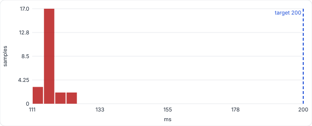

| Detail | Value |
|---|---|
| `transitions` | 30 |
| `missed` | ["segment 8: ROTATE_CW", "segment 13: ROTATE_CW", "segment 18: ROTATE_CW", "segment 23: ROTATE_CW", "segment 28: ROTATE_CW", "segment 33: ROTATE_CW"] |

<small>Recorded 2026-09-29T01:47:30+00:00 on Darwin arm64, 8 cores · commit `a8c0e38fd9` (local) · [JSON](evidence/QR-30.json) · [raw samples CSV](evidence/raw/QR-30.csv) · [test source](https://github.com/COS301-SE-2026/Gesture-Based-Drone-Control/blob/a8c0e38fd9/tests/nfr/test_realtime_performance.py)</small>

### QR-35

**REST p95 <= 100 ms, 10 clients** · SRS `NFR1.1` · tactic: Async FastAPI · **PASS**

| Metric | Target | Actual |
|---|---|---|
| REST p95 latency, 10 concurrent clients (ms) | <= 100.0, 0 errors | **13.216** |

**How it was measured.** 10 simulated clients (several dashboard tabs polling at once) each fire 20 requests back to back at random read endpoints through the real ASGI app and sqlite database. Repeated at 50 clients as an ungated stress run.

| n | min | mean | p50 | p95 | p99 | max |
|---|---|---|---|---|---|---|
| 200 | 0.116 | 2.899 | 0.206 | 13.216 | 16.964 | 21.945 |

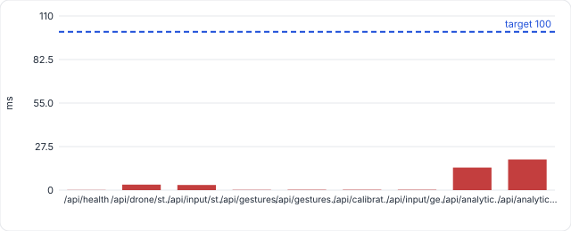

!!! warning "Finding"
    At 50 simultaneous clients (stress, not gated) the analytics endpoints dominate the tail: every request queues for the single sqlite connection. A single-operator desktop app never generates that load, but a short-lived cache on /analytics/summary would remove it.

| Detail | Value |
|---|---|
| `requests` | 200 |
| `throughput_rps` | 3030.8 |
| `error_count` | 0 |
| `per_endpoint_p95_ms` | {"/api/health": 0.137, "/api/drone/status": 3.507, "/api/input/status": 3.26, "/api/gestures/status": 0.167, "/api/gestures/recognizer": 0.2, "/api/calibration/status": 0.221, "/api/input/gesture/events": 0.205, "/api/analytics/flights": 14.271, "/api/analytics/summary": 19.381} |
| `stress_test` | {"clients": 50, "gated": false, "stats": {"n": 1000, "min": 0.116, "mean": 13.594, "p50": 0.23, "p95": 71.492, "p99": 114.432, "max": 183.152}, "throughput_rps": 2659.4, "errors": 0, "per_endpoint_p95_ms": {"/api/health": 0.206, "/api/drone/status": 17.969, "/api/input/status": 17.462, "/api/gestures/status": 0.216, "/api/gestures/recognizer": 0.263, "/api/calibration/status": 0.315, "/api/input/g… |

<small>Recorded 2026-09-29T01:46:25+00:00 on Darwin arm64, 8 cores · commit `f63bc74b70` (local) · [JSON](evidence/QR-35.json) · [raw samples CSV](evidence/raw/QR-35.csv) · [test source](https://github.com/COS301-SE-2026/Gesture-Based-Drone-Control/blob/f63bc74b70/tests/nfr/test_backend_performance.py)</small>

### QR-37

**Command round trip p95 <= 100 ms** · SRS `NFR1.1` · tactic: Persistent WebSocket · **PASS**

| Metric | Target | Actual |
|---|---|---|
| p95 command round trip over /api/drone/ws/commands (ms) | <= 100.0 | **0.205** |

**How it was measured.** Send a command the way the on-screen pad does, wait for the backend ack after DroneAdapter.execute(). TAKEOFF and LAND also open/close a flight row in sqlite.

| n | min | mean | p50 | p95 | p99 | max |
|---|---|---|---|---|---|---|
| 202 | 0.138 | 0.193 | 0.157 | 0.205 | 0.37 | 3.1 |

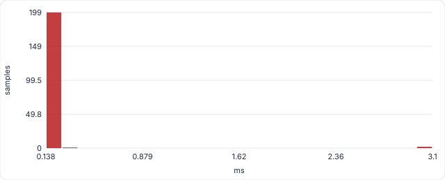

| Detail | Value |
|---|---|
| `commands` | 202 |

<small>Recorded 2026-09-29T01:46:41+00:00 on Darwin arm64, 8 cores · commit `f63bc74b70` (local) · [JSON](evidence/QR-37.json) · [raw samples CSV](evidence/raw/QR-37.csv) · [test source](https://github.com/COS301-SE-2026/Gesture-Based-Drone-Control/blob/f63bc74b70/tests/nfr/test_backend_performance.py)</small>

### QR-38

**Login p95 <= 1 s** · SRS `NFR1.1` · tactic: bcrypt cost 13 · **PASS**

| Metric | Target | Actual |
|---|---|---|
| p95 login response time (ms) | <= 1000.0 | **478.212** |

**How it was measured.** POST /api/auth/login with a registered user, 8 sequential logins timed end to end.

| n | min | mean | p50 | p95 | p99 | max |
|---|---|---|---|---|---|---|
| 8 | 470.327 | 475.174 | 474.875 | 478.212 | 478.212 | 478.212 |

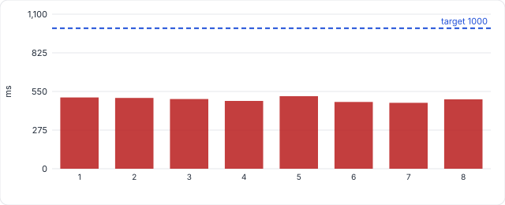

!!! warning "Finding"
    bcrypt.checkpw runs directly on the asyncio event loop, so while a login is verified every other request, telemetry tick and gesture broadcast waits. event_loop_stall_ms is the longest the loop was frozen during a login. Moving the hash into a worker thread (asyncio.to_thread) would remove it.

| Detail | Value |
|---|---|
| `event_loop_stall_ms` | 474.6 |

<small>Recorded 2026-09-29T01:46:47+00:00 on Darwin arm64, 8 cores · commit `f63bc74b70` (local) · [JSON](evidence/QR-38.json) · [raw samples CSV](evidence/raw/QR-38.csv) · [test source](https://github.com/COS301-SE-2026/Gesture-Based-Drone-Control/blob/f63bc74b70/tests/nfr/test_backend_performance.py)</small>

### QR-40

**Analytics query p95 <= 250 ms** · SRS `NFR1.1` · tactic: Aggregates in SQL · **PASS**

| Metric | Target | Actual |
|---|---|---|
| slowest analytics query p95 over 200 flights / 20000 rows (ms) | <= 250.0 | **3.359** |

**How it was measured.** The queries behind the Analytics page (summary stats, recent flights) and the aggregate run when a flight ends, against a seeded history.

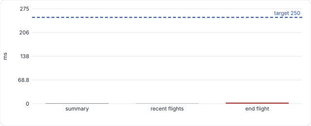

| Detail | Value |
|---|---|
| `per_query` | {"summary": {"n": 20, "min": 0.675, "mean": 0.812, "p50": 0.751, "p95": 1.013, "p99": 1.124, "max": 1.124}, "recent flights": {"n": 20, "min": 0.304, "mean": 0.388, "p50": 0.357, "p95": 0.532, "p99": 0.575, "max": 0.575}, "end flight": {"n": 5, "min": 2.461, "mean": 2.839, "p50": 2.69, "p95": 3.359, "p99": 3.359, "max": 3.359}} |

<small>Recorded 2026-09-29T01:46:50+00:00 on Darwin arm64, 8 cores · commit `f63bc74b70` (local) · [JSON](evidence/QR-40.json) · [raw samples CSV](evidence/raw/QR-40.csv) · [test source](https://github.com/COS301-SE-2026/Gesture-Based-Drone-Control/blob/f63bc74b70/tests/nfr/test_backend_performance.py)</small>

### QR-41

**Cold start <= 10 s, first frame <= 3 s** · SRS `NFR1.1` · tactic: Lazy camera start · **PASS**

| Metric | Target | Actual |
|---|---|---|
| slowest backend cold start: process launch -> /api/health OK (s) | <= 10.0 s; first gesture frame <= 3.0 s | **1.37** |

**How it was measured.** uvicorn started as a new process (imports, DB create, seed) and polled every 50 ms, exactly what Electron waits for before opening the window. First gesture frame: GestureStream.subscribe() until the first payload arrives (MediaPipe init + first frame; physical webcam open time excluded).

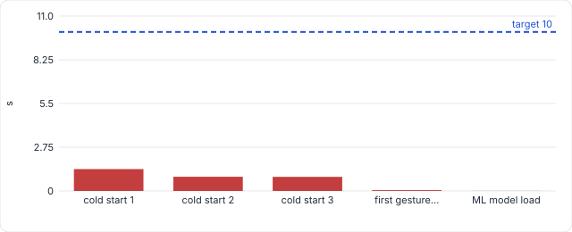

| Detail | Value |
|---|---|
| `cold_starts_s` | [1.37, 0.89, 0.89] |
| `first_gesture_frame_s` | 0.053 |
| `ml_model_load_s` | 0.005 |

<small>Recorded 2026-09-29T01:40:39+00:00 on Darwin arm64, 8 cores · commit `f63bc74b70` (local) · [JSON](evidence/QR-41.json) · [raw samples CSV](evidence/raw/QR-41.csv) · [test source](https://github.com/COS301-SE-2026/Gesture-Based-Drone-Control/blob/f63bc74b70/tests/nfr/test_resources.py)</small>

### QR-51

**Every screen LCP <= 2.5 s** · SRS `NFR1.1` · tactic: Static production bundle · **PASS**

| Metric | Target | Actual |
|---|---|---|
| slowest screen: largest contentful paint, cold start (ms) | LCP <= 2500, FCP <= 1800 on every screen | **812** |

**How it was measured.** Each screen opened in a vrand new browser process from the production build, as when the desktop app launches. FCP and LCP are read from the browsers own Paint timing and largest contentful paint apis

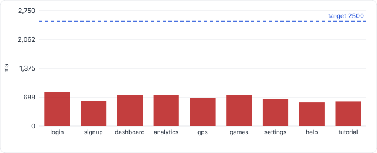

| Detail | Value |
|---|---|
| `worst_fcp_ms` | 792 |
| `per_screen` | [{"route": "login", "fcp": 792, "lcp": 812, "dcl": 720, "kb": 1589}, {"route": "signup", "fcp": 584, "lcp": 600, "dcl": 538, "kb": 1589}, {"route": "dashboard", "fcp": 740, "lcp": 740, "dcl": 611, "kb": 383}, {"route": "analytics", "fcp": 736, "lcp": 736, "dcl": 630, "kb": 383}, {"route": "gps", "fcp": 668, "lcp": 668, "dcl": 569, "kb": 383}, {"route": "games", "fcp": 744, "lcp": 744, "dcl": 642, … |

<small>Recorded 2026-09-29T01:36:06+00:00 on Darwin arm64, 8 cores, Chromium 149.0.7827.55 · commit `f63bc74b70` (local) · [JSON](evidence/QR-51.json) · [raw samples CSV](evidence/raw/QR-51.csv) · [test source](https://github.com/COS301-SE-2026/Gesture-Based-Drone-Control/blob/f63bc74b70/apps/frontend/tests/nfr/performance.nfr.spec.ts)</small>

### QR-52

**Click -> command confirmed <= 200 ms** · SRS `NFR1.1` · tactic: WS ack + history · **PASS**

| Metric | Target | Actual |
|---|---|---|
| p95 click -> command shown in Command History (ms) | <= 200, every click confirmed | **53.7** |

**How it was measured.** Clocks the on screen take off,D pad and land buttons. Time from the click event to the command appearing in Command History, i.e. UI ->. command WebSocket -> re-render

| n | min | mean | p50 | p95 | p99 | max |
|---|---|---|---|---|---|---|
| 22 | 52 | 53.28 | 53.3 | 53.7 | 54.6 | 54.6 |

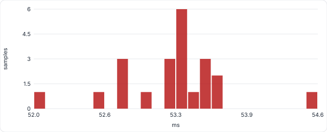

| Detail | Value |
|---|---|
| `clicks` | 22 |
| `unconfirmed_clicks` | 0 |

<small>Recorded 2026-09-29T01:36:15+00:00 on Darwin arm64, 8 cores, Chromium 149.0.7827.55 · commit `f63bc74b70` (local) · [JSON](evidence/QR-52.json) · [raw samples CSV](evidence/raw/QR-52.csv) · [test source](https://github.com/COS301-SE-2026/Gesture-Based-Drone-Control/blob/f63bc74b70/apps/frontend/tests/nfr/performance.nfr.spec.ts)</small>

### QR-18

**Pipeline stays bounded under load** · SRS `NFR1.2` · tactic: Drop-oldest frame queue · **PASS**

| Metric | Target | Actual |
|---|---|---|
| max queue depth under sustained load | <= 2 | **2** |

| Detail | Value |
|---|---|
| `pushes` | 100 |
| `drop_count` | 98 |
| `expected_drops` | 98 |

<small>Recorded 2026-09-29T01:40:35+00:00 on Darwin arm64, 8 cores · commit `f63bc74b70` (local) · [JSON](evidence/QR-18.json) · [test source](https://github.com/COS301-SE-2026/Gesture-Based-Drone-Control/blob/f63bc74b70/tests/nfr/test_realtime_robustness.py)</small>

### QR-31

**Capacity >= 30 fps** · SRS `NFR1.2` · tactic: Camera thread + async consumer · **MISSING**

Not measured in the committed run. Test: [`test_realtime_performance.py`](https://github.com/COS301-SE-2026/Gesture-Based-Drone-Control/blob/HEAD/tests/nfr/test_realtime_performance.py).

### QR-32

**CPU <= 70 % at 30 fps** · SRS `NFR1.2` · tactic: Lite model, JPEG once · **MISSING**

Not measured in the committed run. Test: [`test_realtime_performance.py`](https://github.com/COS301-SE-2026/Gesture-Based-Drone-Control/blob/HEAD/tests/nfr/test_realtime_performance.py).

### QR-33

**Frames dropped <= 1 % at 30 fps** · SRS `NFR1.2` · tactic: Consumer keeps pace · **MISSING**

Not measured in the committed run. Test: [`test_realtime_performance.py`](https://github.com/COS301-SE-2026/Gesture-Based-Drone-Control/blob/HEAD/tests/nfr/test_realtime_performance.py).

### QR-42

**No per-frame memory growth** · SRS `NFR1.2` · tactic: Bounded buffers · **MISSING**

Not measured in the committed run. Test: [`test_resources.py`](https://github.com/COS301-SE-2026/Gesture-Based-Drone-Control/blob/HEAD/tests/nfr/test_resources.py).

### QR-34

**Every client >= 24 fps (+1 stalled)** · SRS `NFR1.3` · tactic: Per-client 1-slot queues · **MISSING**

Not measured in the committed run. Test: [`test_realtime_performance.py`](https://github.com/COS301-SE-2026/Gesture-Based-Drone-Control/blob/HEAD/tests/nfr/test_realtime_performance.py).

### QR-36

**Telemetry >= 9 Hz** · SRS `NFR1.3` · tactic: 100 ms push loop · **PASS**

| Metric | Target | Actual |
|---|---|---|
| telemetry updates pushed per second during a recorded flight (Hz) | >= 9.0 Hz, p95 gap <= 150.0 ms | **9.81** |

**How it was measured.** Dummy drone connected, TAKEOFF sent so a flight is being recorded (every 10th tick also writes a telemetry row to sqlite), then 150 consecutive telemetry messages timed on the client side. Design rate is 10 Hz.

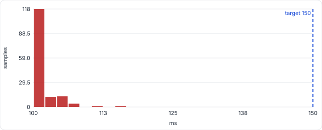

| Detail | Value |
|---|---|
| `gap_stats_ms` | {"n": 149, "min": 100.147, "mean": 101.94, "p50": 101.377, "p95": 104.829, "p99": 108.957, "max": 118.124} |
| `messages` | 150 |

<small>Recorded 2026-09-29T01:46:41+00:00 on Darwin arm64, 8 cores · commit `f63bc74b70` (local) · [JSON](evidence/QR-36.json) · [raw samples CSV](evidence/raw/QR-36.csv) · [test source](https://github.com/COS301-SE-2026/Gesture-Based-Drone-Control/blob/f63bc74b70/tests/nfr/test_backend_performance.py)</small>

### QR-39

**Telemetry write p95 <= 50 ms** · SRS `NFR1.3` · tactic: Write every 10th tick · **PASS**

| Metric | Target | Actual |
|---|---|---|
| p95 telemetry row write, with 20k rows of history (ms) | <= 50.0 | **1.5** |

**How it was measured.** FlightManager.record_telemetry (new session, insert, commit) on the real sqlite file, the call the telemetry WebSocket makes every 10th 100 ms tick. Must stay far below 100 ms or the live telemetry stream stutters.

| n | min | mean | p50 | p95 | p99 | max |
|---|---|---|---|---|---|---|
| 200 | 0.593 | 0.877 | 0.766 | 1.5 | 2.945 | 4.492 |

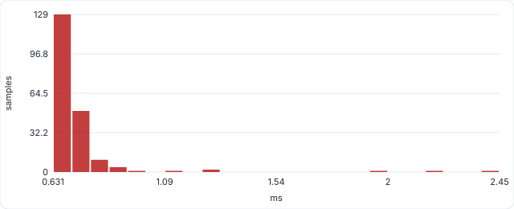

| Detail | Value |
|---|---|
| `history_rows` | 20000 |

<small>Recorded 2026-09-29T01:46:50+00:00 on Darwin arm64, 8 cores · commit `f63bc74b70` (local) · [JSON](evidence/QR-39.json) · [raw samples CSV](evidence/raw/QR-39.csv) · [test source](https://github.com/COS301-SE-2026/Gesture-Based-Drone-Control/blob/f63bc74b70/tests/nfr/test_backend_performance.py)</small>

### QR-50

**Dashboard renders >= 24 fps** · SRS `NFR1.3` · tactic: Canvas + ImageBitmap · **PASS**

| Metric | Target | Actual |
|---|---|---|
| dashboard live-feed frames painted per second (fps) | >= 24 fps and >= 99% of received frames painted | **30** |

**How it was measured.** The real dashboard receives 30 fps GestureFramePayload messages (real 640x480 JPEG frames + hand landmarks) over the gesture WebSocket. Every canvas drawImage of a frame is counted, and every message is timestamped as it reaches page. Painted $ = frames painted / frames recieved in the same window. 

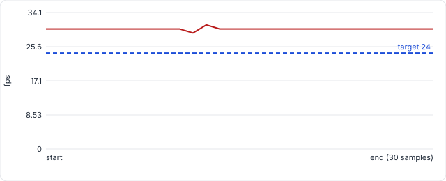

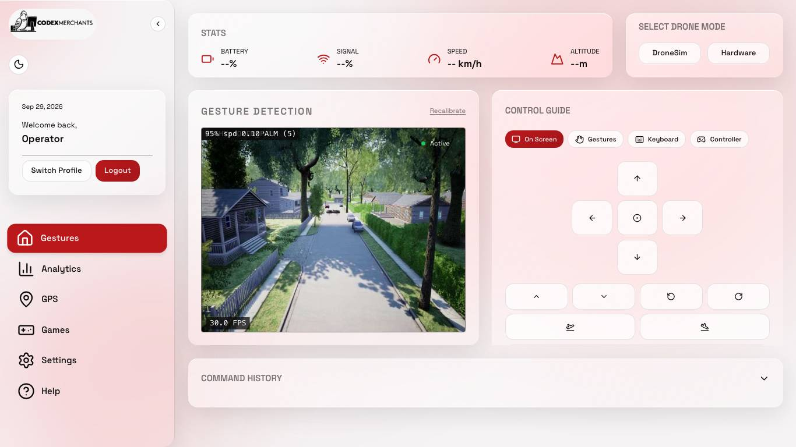{ loading=lazy }

| Detail | Value |
|---|---|
| `window_s` | 30 |
| `frames_sent` | 901 |
| `frames_received` | 901 |
| `arrival_gap_ms` | {"n": 900, "min": 3.8, "mean": 33.33, "p50": 33.3, "p95": 35.4, "p99": 36.6, "max": 63.7} |
| `back_to_back_arrivals` | 1 |
| `frames_painted` | 900 |
| `painted_pct` | 99.89 |
| `frame_gap_ms` | {"n": 899, "min": 3.2, "mean": 33.33, "p50": 33.3, "p95": 35.6, "p99": 37.1, "max": 65.5} |
| `long_tasks` | {"count": 1, "worst_ms": 67} |

<small>Recorded 2026-09-29T01:35:42+00:00 on Darwin arm64, 8 cores, Chromium 149.0.7827.55 · commit `f63bc74b70` (local) · [JSON](evidence/QR-50.json) · [raw samples CSV](evidence/raw/QR-50.csv) · [test source](https://github.com/COS301-SE-2026/Gesture-Based-Drone-Control/blob/f63bc74b70/apps/frontend/tests/nfr/performance.nfr.spec.ts)</small>

---

## NFR2 Security

### QR-07

**Session token <= 30 min** · SRS `NFR2.1` · tactic: Short-lived JWT · **PASS**

| Metric | Target | Actual |
|---|---|---|
| access-token lifetime (minutes) |  <= 30 | **15** |

<small>Recorded 2026-09-29T01:40:40+00:00 on Darwin arm64, 8 cores · commit `f63bc74b70` (local) · [JSON](evidence/QR-07.json) · [test source](https://github.com/COS301-SE-2026/Gesture-Based-Drone-Control/blob/f63bc74b70/tests/nfr/test_security.py)</small>

### QR-12

**Invalid tokens rejected** · SRS `NFR2.1` · tactic: JWT exp/aud/iss/sig checks · **PASS**

| Metric | Target | Actual |
|---|---|---|
| invalid access tokens rejected | all rejected | **5/5** |

<small>Recorded 2026-09-29T01:40:40+00:00 on Darwin arm64, 8 cores · commit `f63bc74b70` (local) · [JSON](evidence/QR-12.json) · [test source](https://github.com/COS301-SE-2026/Gesture-Based-Drone-Control/blob/f63bc74b70/tests/nfr/test_token_validation.py)</small>

### QR-08

**Password hash cost >= 12 rounds** · SRS `NFR2.2` · tactic: Configurable bcrypt rounds · **PASS**

| Metric | Target | Actual |
|---|---|---|
| bcrypt cost factor (rounds) | >= 12 | **13** |

| Detail | Value |
|---|---|
| `hash_time_ms` | 538.5 |

<small>Recorded 2026-09-29T01:46:54+00:00 on Darwin arm64, 8 cores · commit `a8c0e38fd9` (local) · [JSON](evidence/QR-08.json) · [test source](https://github.com/COS301-SE-2026/Gesture-Based-Drone-Control/blob/a8c0e38fd9/tests/nfr/test_password_security.py)</small>

### QR-09

**Weak passwords rejected** · SRS `NFR2.2` · tactic: Strength policy regexes · **PASS**

| Metric | Target | Actual |
|---|---|---|
| weak password rejected by strength policy | all rejected | **5/5** |

| Detail | Value |
|---|---|
| `strong_password_accepted` | True |

<small>Recorded 2026-09-29T01:46:54+00:00 on Darwin arm64, 8 cores · commit `a8c0e38fd9` (local) · [JSON](evidence/QR-09.json) · [test source](https://github.com/COS301-SE-2026/Gesture-Based-Drone-Control/blob/a8c0e38fd9/tests/nfr/test_password_security.py)</small>

### QR-10

**Password hashes salted** · SRS `NFR2.2` · tactic: bcrypt gensalt · **PASS**

| Metric | Target | Actual |
|---|---|---|
| identical passwords produce distinct digests | distinct | **distinct** |

| Detail | Value |
|---|---|
| `both_verify` | True |

<small>Recorded 2026-09-29T01:46:56+00:00 on Darwin arm64, 8 cores · commit `a8c0e38fd9` (local) · [JSON](evidence/QR-10.json) · [test source](https://github.com/COS301-SE-2026/Gesture-Based-Drone-Control/blob/a8c0e38fd9/tests/nfr/test_password_security.py)</small>

---

## NFR3 Reliability

### QR-01

**Gesture accuracy >= 95% (ML)** · SRS `NFR3.1` · tactic: ML recognizer (MLP) · **PASS**

| Metric | Target | Actual |
|---|---|---|
| gesture classification accuracy (%) | >= 95.0 | **99.71** |

| Detail | Value |
|---|---|
| `engine` | ml |
| `samples` | 5837 |
| `top_confusions` | [["TWO_FINGERS->THREE_FINGERS", 3], ["FIST->ONE_FINGER", 2], ["TWO_FINGERS->ONE_FINGER", 2], ["THREE_FINGERS->TWO_FINGERS", 2], ["FIST->TWO_FINGERS", 1]] |

<small>Recorded 2026-09-29T01:46:24+00:00 on Darwin arm64, 8 cores · commit `f63bc74b70` (local) · [JSON](evidence/QR-01.json) · [test source](https://github.com/COS301-SE-2026/Gesture-Based-Drone-Control/blob/f63bc74b70/tests/nfr/test_accuracy.py)</small>

### QR-02

**Every gesture >= 95% (ML)** · SRS `NFR3.1` · tactic: ML recognizer (MLP) · **PASS**

| Metric | Target | Actual |
|---|---|---|
| lowest per-gesture accuracy (%) | >= 95.0 | **99.0** |

| Detail | Value |
|---|---|
| `engine` | ml |
| `per_gesture` | {"FIST": 99.0, "OPEN_PALM": 100.0, "ONE_FINGER": 99.9, "TWO_FINGERS": 99.5, "THREE_FINGERS": 99.7, "FOUR_FINGERS": 99.8} |

<small>Recorded 2026-09-29T01:46:24+00:00 on Darwin arm64, 8 cores · commit `f63bc74b70` (local) · [JSON](evidence/QR-02.json) · [test source](https://github.com/COS301-SE-2026/Gesture-Based-Drone-Control/blob/f63bc74b70/tests/nfr/test_accuracy.py)</small>

### QR-01-rule

**Rule-based accuracy (informational)** · SRS `NFR3.1` · tactic: Rule-based ceiling · **INFO**

| Metric | Target | Actual |
|---|---|---|
| rule-based accuracy, informational (%) | informational (ML is the gated engine) | **55.9** |

| Detail | Value |
|---|---|
| `engine` | rule |
| `lowest_per_gesture` | 37.5 |
| `per_gesture` | {"FIST": 56.4, "OPEN_PALM": 98.3, "ONE_FINGER": 37.5, "TWO_FINGERS": 52.3, "THREE_FINGERS": 65.8, "FOUR_FINGERS": 61.5} |

<small>Recorded 2026-09-29T01:46:25+00:00 on Darwin arm64, 8 cores · commit `f63bc74b70` (local) · [JSON](evidence/QR-01-rule.json) · [test source](https://github.com/COS301-SE-2026/Gesture-Based-Drone-Control/blob/f63bc74b70/tests/nfr/test_accuracy.py)</small>

### QR-06

**Confidence gate >= 0.85** · SRS `NFR3.2` · tactic: MIN_CONFIDENCE filter · **PASS**

| Metric | Target | Actual |
|---|---|---|
| minimum confidence threshold for command emission | >= 0.85 | **0.85** |

<small>Recorded 2026-09-29T01:46:50+00:00 on Darwin arm64, 8 cores · commit `f63bc74b70` (local) · [JSON](evidence/QR-06.json) · [test source](https://github.com/COS301-SE-2026/Gesture-Based-Drone-Control/blob/f63bc74b70/tests/nfr/test_command_mapping.py)</small>

### QR-19

**Single-frame noise suppressed** · SRS `NFR3.2` · tactic: GestureStabilizer voting · **PASS**

| Metric | Target | Actual |
|---|---|---|
| single-frame noise suppressed by stabilizer | rejected | **rejected** |

| Detail | Value |
|---|---|
| `switches_on_sustained_hold` | True |
| `window` | 5 |
| `min_agreement` | 3 |

<small>Recorded 2026-09-29T01:40:35+00:00 on Darwin arm64, 8 cores · commit `f63bc74b70` (local) · [JSON](evidence/QR-19.json) · [test source](https://github.com/COS301-SE-2026/Gesture-Based-Drone-Control/blob/f63bc74b70/tests/nfr/test_realtime_robustness.py)</small>

### QR-04

**All single-hand gestures mapped** · SRS `NFR3.2` · tactic: SINGLE_HAND_MAP · **PASS**

| Metric | Target | Actual |
|---|---|---|
| single-hand gestures resloving to command | all mapped | **3/3** |

| Detail | Value |
|---|---|
| `mapped` | {"OPEN_PALM": "HOVER", "ONE_FINGER": "MOVE_UP", "TWO_FINGERS": "MOVE_DOWN"} |

<small>Recorded 2026-09-29T01:46:50+00:00 on Darwin arm64, 8 cores · commit `f63bc74b70` (local) · [JSON](evidence/QR-04.json) · [test source](https://github.com/COS301-SE-2026/Gesture-Based-Drone-Control/blob/f63bc74b70/tests/nfr/test_command_mapping.py)</small>

### QR-05

**All two-hand combos resolve** · SRS `NFR3.2` · tactic: Two-hand maps + _resolve · **PASS**

| Metric | Target | Actual |
|---|---|---|
| two-hand combinations resolving correctly | all resolve | **9/9** |

<small>Recorded 2026-09-29T01:46:50+00:00 on Darwin arm64, 8 cores · commit `f63bc74b70` (local) · [JSON](evidence/QR-05.json) · [test source](https://github.com/COS301-SE-2026/Gesture-Based-Drone-Control/blob/f63bc74b70/tests/nfr/test_command_mapping.py)</small>

### QR-13

**E-stop always critical priority** · SRS `NFR3.3` · tactic: Command priority elevation · **PASS**

| Metric | Target | Actual |
|---|---|---|
| EMERGENCY_STOP priority after contruction | == 999 | **999** |

<small>Recorded 2026-09-29T01:40:40+00:00 on Darwin arm64, 8 cores · commit `f63bc74b70` (local) · [JSON](evidence/QR-13.json) · [test source](https://github.com/COS301-SE-2026/Gesture-Based-Drone-Control/blob/f63bc74b70/tests/nfr/test_safety.py)</small>

### QR-14

**E-stop grounds the drone** · SRS `NFR3.3` · tactic: Adapter emergency_stop · **PASS**

| Metric | Target | Actual |
|---|---|---|
| is_flying after emergency stop | grounded | **grounded** |

<small>Recorded 2026-09-29T01:40:40+00:00 on Darwin arm64, 8 cores · commit `f63bc74b70` (local) · [JSON](evidence/QR-14.json) · [test source](https://github.com/COS301-SE-2026/Gesture-Based-Drone-Control/blob/f63bc74b70/tests/nfr/test_safety.py)</small>

---

## NFR5 Usability

### QR-44

**Predicted first flight <= 5 min (KLM)** · SRS `NFR5.1` · tactic: Keystroke-Level Model · **PASS**

| Metric | Target | Actual |
|---|---|---|
| KLM-predicted time from opening the app to completing the basic flight (s) | <= 300.0 | **220.2** |

**How it was measured.** Keystroke-Level Model (Card, Moran & Newell): K=0.28, P=1.10, B=0.10, H=0.40, M=1.35 s. Form fields, tutorial clip lengths, calibration sequence and window are read from the product itself; system response times come from this run. An error-free prediction: a feasibility check, confirmed or refuted by QR-45.

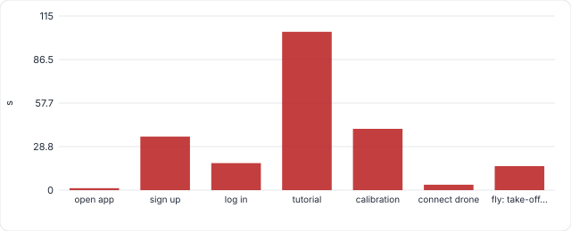

!!! warning "Finding"
    Feasible, but tight: 204.0 s of the 300 s budget goes on sign-up, log-in, the full tutorial and calibration before the first take-off. With a x2 allowance for a first-time user the estimate is 440.4 s, over the limit, so the real-participant timing (QR-45) is the deciding evidence. Shortening the path (skippable tutorial steps, calibration offered after the first flight) would add margin.

| Detail | Value |
|---|---|
| `phases_s` | {"open app": 1.4, "sign up": 35.5, "log in": 18.0, "tutorial": 104.9, "calibration": 40.6, "connect drone": 3.6, "fly: take-off, hover, move, land": 16.2} |
| `onboarding_before_takeoff_s` | 204.0 |
| `with_x2_novice_allowance_s` | 440.4 |
| `tutorial_steps` | 12 |
| `tutorial_video_s` | 55.6 |
| `calibration_gestures` | 6 |
| `inputs` | {"login": "QR-38 measured", "gesture onset": "default (measurement not in this run)", "cold start": "QR-41 measured"} |

<small>Recorded 2026-09-29T01:40:41+00:00 on Darwin arm64, 8 cores · commit `f63bc74b70` (local) · [JSON](evidence/QR-44.json) · [raw samples CSV](evidence/raw/QR-44.csv) · [test source](https://github.com/COS301-SE-2026/Gesture-Based-Drone-Control/blob/f63bc74b70/tests/nfr/test_usability.py)</small>

### QR-45

**>= 80% fly within 5 min (study)** · SRS `NFR5.1` · tactic: Moderated usability study · **PENDING**

| Metric | Target | Actual |
|---|---|---|
| participants completing the basic flight within 5 minutes (%) | >= 80.0% of >= 5 external participants | **0/5 participants logged** |

**How it was measured.** Awaiting the usability study; see docs/nfr/usability/PROTOCOL.md.

<small>Recorded 2026-09-29T01:40:41+00:00 on Darwin arm64, 8 cores · commit `f63bc74b70` (local) · [JSON](evidence/QR-45.json) · [test source](https://github.com/COS301-SE-2026/Gesture-Based-Drone-Control/blob/f63bc74b70/tests/nfr/test_usability.py)</small>

### QR-56

**Basic flight <= 6 confirmed clicks** · SRS `NFR5.1` · tactic: On-screen flight pad · **PASS**

| Metric | Target | Actual |
|---|---|---|
| clicks to complete take-off, hover, move, land on screen | <= 6 clicks, each confirmed within 1 s, drone landed | **5** |

**How it was measured.** Scripted walk-through of the basic flight on the on-screen pad. Counts interactions and checks each one is confirmed on screen (Command History) within 1 s. The human time for the same task comes from the usability study (QR-45).

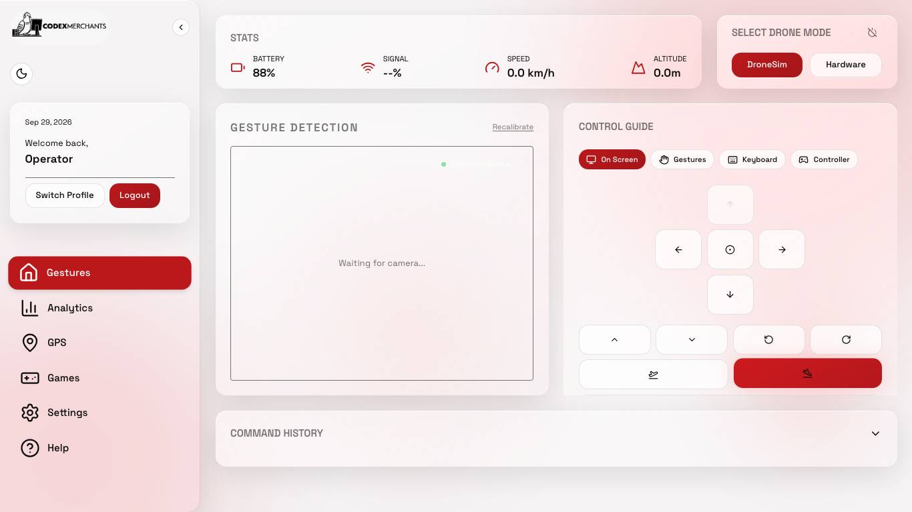{ loading=lazy }

| Detail | Value |
|---|---|
| `steps` | [{"action": "choose drone mode", "confirmed": true}, {"action": "take off", "confirmed": true}, {"action": "hover", "confirmed": true}, {"action": "move forward", "confirmed": true}, {"action": "land", "confirmed": true}] |
| `automated_run_s` | 1.1 |
| `drone_landed` | True |

<small>Recorded 2026-09-29T01:36:48+00:00 on Darwin arm64, 8 cores, Chromium 149.0.7827.55 · commit `f63bc74b70` (local) · [JSON](evidence/QR-56.json) · [test source](https://github.com/COS301-SE-2026/Gesture-Based-Drone-Control/blob/f63bc74b70/apps/frontend/tests/nfr/usability.nfr.spec.ts)</small>

### QR-46

**Mean SUS >= 85, >= 5 external users** · SRS `NFR5.2` · tactic: System Usability Scale · **PENDING**

| Metric | Target | Actual |
|---|---|---|
| mean System Usability Scale score (0-100) | >= 85.0 with >= 5 external participants | **0/5 participants logged** |

**How it was measured.** Awaiting the usability study; see docs/nfr/usability/PROTOCOL.md.

<small>Recorded 2026-09-29T01:40:41+00:00 on Darwin arm64, 8 cores · commit `f63bc74b70` (local) · [JSON](evidence/QR-46.json) · [test source](https://github.com/COS301-SE-2026/Gesture-Based-Drone-Control/blob/f63bc74b70/tests/nfr/test_usability.py)</small>

### QR-55

**Gesture + command visible, no scrolling** · SRS `R1.1.2` · tactic: Dashboard layout · **PASS**

| Metric | Target | Actual |
|---|---|---|
| screen sizes showing gesture AND mapped command without scrolling | 3/3, no sideways scrolling at 1024 px | **3/3** |

**How it was measured.** Dashboard rendered at common laptop resolutions with a live gesture stream. The gesture overlay (camera feed) must be at least half on screen and the Command History heading, where the mapped command appears, fully on screen, with no scrolling. Every screen is also checked for horizontal overflow at 1024x768.

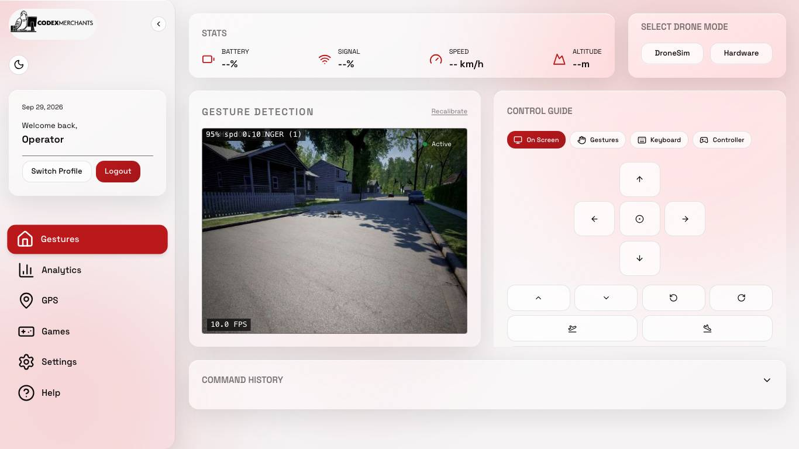{ loading=lazy }

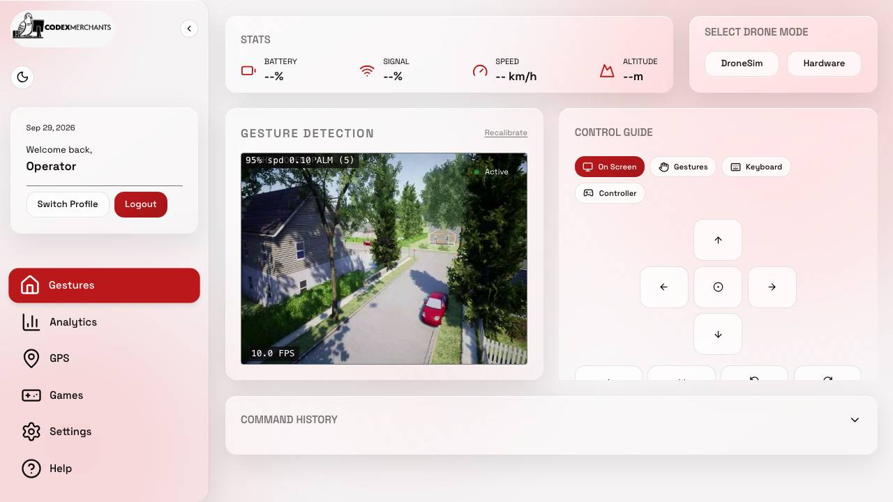{ loading=lazy }

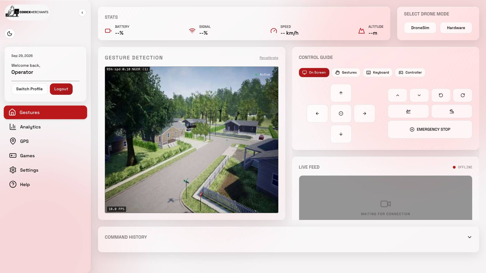{ loading=lazy }

| Detail | Value |
|---|---|
| `per_viewport` | {"1366x768": {"gesture_feed_visible": 1, "command_history_top_px": 638, "command_history_visible": true, "emergency_stop_visible": true, "viewport_height": 768}, "1280x720": {"gesture_feed_visible": 1, "command_history_top_px": 590, "command_history_visible": true, "emergency_stop_visible": true, "viewport_height": 720}, "1920x1080": {"gesture_feed_visible": 1, "command_history_top_px": 924, "comm… |

<small>Recorded 2026-09-29T01:36:45+00:00 on Darwin arm64, 8 cores, Chromium 149.0.7827.55 · commit `f63bc74b70` (local) · [JSON](evidence/QR-55.json) · [test source](https://github.com/COS301-SE-2026/Gesture-Based-Drone-Control/blob/f63bc74b70/apps/frontend/tests/nfr/usability.nfr.spec.ts)</small>

### QR-49

**One history entry per held gesture** · SRS `R1.1.2` · tactic: Transition-only event log · **PASS**

| Metric | Target | Actual |
|---|---|---|
| command-history entries for 2 holds (10 s + 3 s, with a dropout) | 2 (one per hold) | **2** |

**How it was measured.** Feeds 392 frames through the real GestureAdapter: the drone still receives a command every frame, but the operator-facing history must show one row per hold.

| Detail | Value |
|---|---|
| `history` | ["MOVE_UP", "HOVER"] |
| `frames` | 392 |
| `commands_sent_to_drone` | 387 |

<small>Recorded 2026-09-29T01:40:41+00:00 on Darwin arm64, 8 cores · commit `f63bc74b70` (local) · [JSON](evidence/QR-49.json) · [test source](https://github.com/COS301-SE-2026/Gesture-Based-Drone-Control/blob/f63bc74b70/tests/nfr/test_usability.py)</small>

### QR-48

**Keyboard + gamepad reach every command** · SRS `R7 / US-A-02` · tactic: Shared Command vocabulary · **PASS**

| Metric | Target | Actual |
|---|---|---|
| gesture commands also reachable from keyboard and gamepad | all, including EMERGENCY_STOP | **keyboard 12/12, gamepad 12/12** |

**How it was measured.** Compares the real mapping tables of GestureAdapter, KeyboardAdapter and GamepadAdapter.

!!! warning "Finding"
    Only 3 of 12 commands work with a single hand (HOVER, MOVE_DOWN, MOVE_UP); take-off and land need both hands. US-A-01 and the U3 description in SRS 3.1.2.4 expect full one-handed gesture control, so a one-handed operator relies on keyboard or gamepad (which this row confirms).

| Detail | Value |
|---|---|
| `missing` | {"keyboard": [], "gamepad": []} |
| `one_handed_gesture_commands` | ["HOVER", "MOVE_DOWN", "MOVE_UP"] |

<small>Recorded 2026-09-29T01:40:41+00:00 on Darwin arm64, 8 cores · commit `f63bc74b70` (local) · [JSON](evidence/QR-48.json) · [test source](https://github.com/COS301-SE-2026/Gesture-Based-Drone-Control/blob/f63bc74b70/tests/nfr/test_usability.py)</small>

### QR-53

**Every control has an accessible name** · SRS `U3 / WCAG 4.1.2` · tactic: Labelled controls · **PASS**

| Metric | Target | Actual |
|---|---|---|
| controls and images with an accessible name (%) | 100 | **100** |

**How it was measured.** Reads Chromium's own accessibility tree (what a screen reader or voice-control user gets) on every screen and counts buttons, links, inputs, tabs and images with no name.

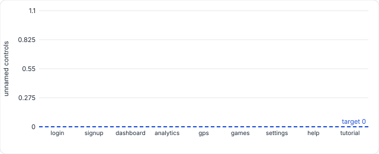

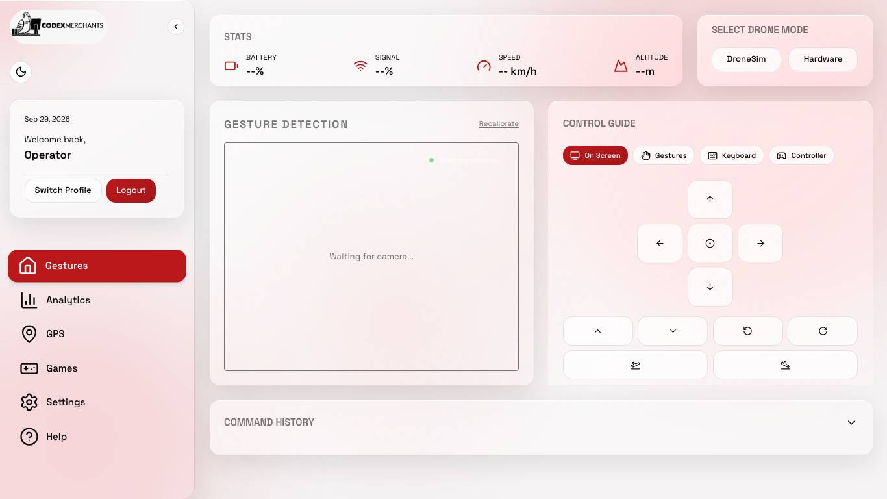{ loading=lazy }

| Detail | Value |
|---|---|
| `controls` | 147 |
| `unnamed_controls` | 0 |
| `per_screen` | {"login": {"total": 8, "unnamed": 0, "examples": []}, "signup": {"total": 11, "unnamed": 0, "examples": []}, "dashboard": {"total": 31, "unnamed": 0, "examples": []}, "analytics": {"total": 11, "unnamed": 0, "examples": []}, "gps": {"total": 15, "unnamed": 0, "examples": []}, "games": {"total": 18, "unnamed": 0, "examples": []}, "settings": {"total": 14, "unnamed": 0, "examples": []}, "help": {"to… |

<small>Recorded 2026-09-29T01:36:28+00:00 on Darwin arm64, 8 cores, Chromium 149.0.7827.55 · commit `f63bc74b70` (local) · [JSON](evidence/QR-53.json) · [raw samples CSV](evidence/raw/QR-53.csv) · [test source](https://github.com/COS301-SE-2026/Gesture-Based-Drone-Control/blob/f63bc74b70/apps/frontend/tests/nfr/usability.nfr.spec.ts)</small>

### QR-54

**Keyboard focus always visible** · SRS `U3 / WCAG 2.4.7` · tactic: Focus styles · **PASS**

| Metric | Target | Actual |
|---|---|---|
| keyboard tab stops with a visible focus indicator (%) | 100 | **100** |

**How it was measured.** Presses Tab through the login screen and the dashboard. At each stop the element's outline, box-shadow, border, background and text colour are compared focused vs unfocused; no difference means a keyboard user cannot see where they are.

{ loading=lazy }

| Detail | Value |
|---|---|
| `tab_stops` | 28 |
| `per_screen` | {"login": {"stops": 8, "invisible": []}, "dashboard": {"stops": 20, "invisible": []}} |

<small>Recorded 2026-09-29T01:36:32+00:00 on Darwin arm64, 8 cores, Chromium 149.0.7827.55 · commit `f63bc74b70` (local) · [JSON](evidence/QR-54.json) · [test source](https://github.com/COS301-SE-2026/Gesture-Based-Drone-Control/blob/f63bc74b70/apps/frontend/tests/nfr/usability.nfr.spec.ts)</small>

---

## NFR6 Maintainability

### QR-20

**Drone adapters implement interface** · SRS `NFR6.1` · tactic: DroneAdapter ABC · **PASS**

| Metric | Target | Actual |
|---|---|---|
| DroneAdapter adapters fully implementing the interface | all loaded adapters complete | **4/4 loaded** |

| Detail | Value |
|---|---|
| `interface_methods` | ["analog", "connect", "disconnect", "emergency_stop", "get_telemetry", "hover", "land", "move", "takeoff"] |

<small>Recorded 2026-09-29T01:46:53+00:00 on Darwin arm64, 8 cores · commit `a8c0e38fd9` (local) · [JSON](evidence/QR-20.json) · [test source](https://github.com/COS301-SE-2026/Gesture-Based-Drone-Control/blob/a8c0e38fd9/tests/nfr/test_maintainabiility.py)</small>

### QR-21

**Input adapters implement interface** · SRS `NFR6.1` · tactic: InputAdapter ABC · **PASS**

| Metric | Target | Actual |
|---|---|---|
| InputAdapter adapters fully implementing the interface | all loaded adapters complete | **4/4 loaded** |

| Detail | Value |
|---|---|
| `interface_methods` | ["handle_message", "start"] |

<small>Recorded 2026-09-29T01:46:53+00:00 on Darwin arm64, 8 cores · commit `a8c0e38fd9` (local) · [JSON](evidence/QR-21.json) · [test source](https://github.com/COS301-SE-2026/Gesture-Based-Drone-Control/blob/a8c0e38fd9/tests/nfr/test_maintainabiility.py)</small>

### QR-22

**No function above complexity 15** · SRS `NFR6.2` · tactic: Small functions · **MISSING**

Not measured in the committed run. Test: [`test_maintainabiility.py`](https://github.com/COS301-SE-2026/Gesture-Based-Drone-Control/blob/HEAD/tests/nfr/test_maintainabiility.py).

---

## NFR7 Availability

### QR-23

**Every subsystem has a liveness probe** · SRS `NFR7.1` · tactic: /health per router · **PASS**

| Metric | Target | Actual |
|---|---|---|
| subsystems exposing a liveness probe | all present | **4/4** |

| Detail | Value |
|---|---|
| `health_routes` | ["/api/auth/health", "/api/drone/health", "/api/gestures/health", "/api/health"] |

<small>Recorded 2026-09-29T01:46:25+00:00 on Darwin arm64, 8 cores · commit `f63bc74b70` (local) · [JSON](evidence/QR-23.json) · [test source](https://github.com/COS301-SE-2026/Gesture-Based-Drone-Control/blob/f63bc74b70/tests/nfr/test_availability.py)</small>

### QR-24

**Health probes need no auth** · SRS `NFR7.2` · tactic: Open health routes · **PASS**

| Metric | Target | Actual |
|---|---|---|
| health probes reachable without authentication | all unauthenticated | **4/4** |

<small>Recorded 2026-09-29T01:46:25+00:00 on Darwin arm64, 8 cores · commit `f63bc74b70` (local) · [JSON](evidence/QR-24.json) · [test source](https://github.com/COS301-SE-2026/Gesture-Based-Drone-Control/blob/f63bc74b70/tests/nfr/test_availability.py)</small>

