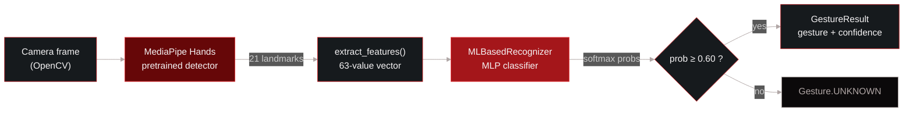
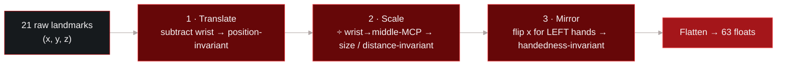
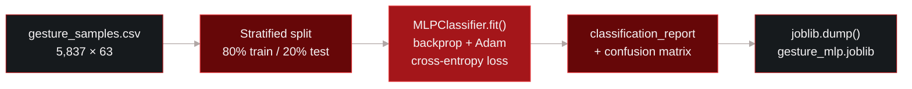
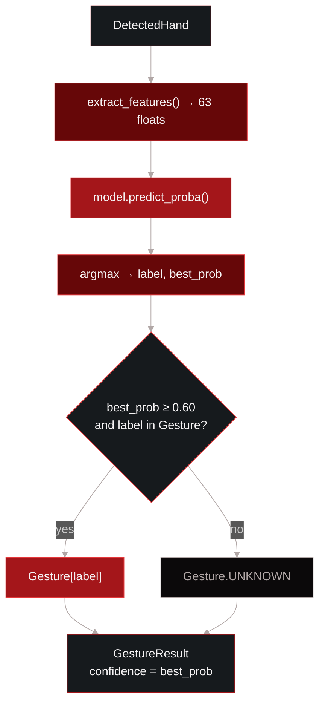

# Machine Learning Gesture Recognition

> How the `MLBasedRecognizer` classifies hand gestures from MediamPipe landmarks,
> what kind of learning it uses, how the model is trained, and how it runs at
> inference time. Source lives under
> `services/cv_pipeline/gestures/` (`recognizers/ml_based.py`, 
> `ml_training/`).

## What kind of learning is this?

The ML recognizer is a **supervised, multi-class classifier** builr as a small 
**feed-forward nueral network** (a Multi-Layer Perceptron). It is trained 
**offline in batch** on **human-labelled** landmark samples and is a 
**discrimintaive** model: it learns to sperate the 6 gesture classes rather 
than to model how the data was generated.

| Property | Value |
| --- | --- |
| Learning Paradigm | Supervised learning |
| Task | Multi-class classification (6 classes) |
| Model family | Feed-forward neural network (MLP) |
| Implementation | `sklearn.nueral_network.MLPClassifier` |
| Training regime " Offline / batch, one-off fit |
|Input | 63 normalised hand-landmark features (not raw pixels) |
| Output | Softmax probability over 6 gestures, thresholded to `UNKNOWN` |

The label on every training sample (`FIST`, `OPEN_PALM`, `ONE_FINGER`, ...) is
supplied by a human during data collection, which is what makes this 
*supervised* learning. A useful nuance for the report: the full recognition
stack is 2 stages, a **pretrained deep vision model** (MediaPipe Hands, doing
landmakr detection) feeding a **shallow supervised classifier** (this MLP).
Using a frozen pretrained model as a fixed feature extractor and training only a 
small head on top is, conceptually, a form of **transfer learning**.

## Where it sits in the pipeline

The classifier never sees an image, MediaPipe solves the perception problem and
hands over 21 landmarks; the MLP works purely on that geometry.



## Feature representation 

Each detected hand becomes a **63-value feature vector**: 21 landmarks, each with
`(x, y, z)`. Before the vector reaches the network, `extract_features()` normalises it so the classifier learns hand *shape* rather than where the hand happens to be, how big it is, or which hand it is.



This hand-built normalisation is why a tiny network is enough: the nuisance variation a raw-pixel model would have to learn to ignore has already been removed, leaving a nearly linearly seperable representation of pose.

## Neural network architecture

The model is an MLP with 2 hidden layers, `63 -> 64 -> 32 6`. Hidden layers use **ReLU**; the output layer uses **softmax** to produce a probability dsitribution over the 6 gestures. Every layer is fully connected (each node below connects to *a;;* nodes in the next layer, only representative edges are drawn for readability).

```mermaid
%%{init: {'theme':'dark','themeVariables':{'primaryColor':'#A4161A','primaryTextColor':'#F5F3F4','primaryBorderColor':'#E5383B','lineColor':'#8a8080','secondaryColor':'#161A1D','background':'#0B090A','fontFamily':'JetBrains Mono, monospace'}}}%%
flowchart LR
    subgraph IN["Input · 63 features"]
        direction TB
        i1(("x&#8321;")):::in
        i2(("x&#8322;")):::in
        id(("&#8942;")):::dots
        i63(("x&#8326;&#8323;")):::in
    end
    subgraph H1["Hidden 1 · 64 · ReLU"]
        direction TB
        a1(("h&#8321;")):::hid
        a2(("h&#8322;")):::hid
        ad(("&#8942;")):::dots
        a64(("h&#8326;&#8324;")):::hid
    end
    subgraph H2["Hidden 2 · 32 · ReLU"]
        direction TB
        b1(("h&#8321;")):::hid
        bd(("&#8942;")):::dots
        b32(("h&#8323;&#8322;")):::hid
    end
    subgraph OUT["Output · 6 · softmax"]
        direction TB
        o1(("FIST")):::out
        o2(("OPEN_PALM")):::out
        o3(("ONE_FINGER")):::out
        o4(("TWO_FINGERS")):::out
        o5(("THREE_FINGERS")):::out
        o6(("FOUR_FINGERS")):::out
    end
 
    i1 --> a1 & a2 & a64
    i2 --> a1 & a2 & a64
    i63 --> a1 & a2 & a64
    a1 --> b1 & b32
    a2 --> b1 & b32
    a64 --> b1 & b32
    b1 --> o1 & o2 & o3 & o4 & o5 & o6
    b32 --> o1 & o2 & o3 & o4 & o5 & o6
 
    classDef in fill:#161A1D,stroke:#A4161A,color:#F5F3F4
    classDef hid fill:#161A1D,stroke:#BA181B,color:#F5F3F4
    classDef out fill:#A4161A,stroke:#E5383B,color:#F5F3F4
    classDef dots fill:#0B090A,stroke:#0B090A,color:#B1A7A6
```



| Layer | Shape | Activation | Weights + biases |
| --- | --- | --- | --- |
|Input | 63 | - | - |
| Dense 1 | 64 | ReLU | 63x64 + 64 = 4 096 |
| Dense 2 | 32 | ReLU | 64x32 + 32 = 2 080 |
| Output | 6 | Softmax | 32x6 + 6 = 198 |
| **Total** | | | **6 374 trainable parameters** |

**Activation.** ReLU (`max(0, x)`) in the hidden layers is cheap and avoids
vanishing gradients; softmaxat the output turns the 6 raw scores into probabilities that sum to 1, which is exactly wha tthe confidence gate needs.

## Training

## Data collection

`ml_training/collect_landmarks.py` opens the camera, runs MediaPipe, and appends one normalised feature row per frame to `data/gesture_samples.csv` under the label chosen with a key press. Only clean single-hand frames are recorded so labels can't be polluted. Target is ~1000 samples per gesture, varied by position, tilt, distance, and hand.

### Dataset

| Gesture | Samples |
| --- | --- |
| ONE_FINGER | 1.657 |
| TWO_FINGERS | 1.222 |
| THREE_FINGERS | 1 206 |
| FOUR_FINGERS | 936 |
| OPEN_PALM | 410 |
| FIST | 406 |
| **Total** | **5 837** |

These numbers are actually relatively low to showcase the model first performing poorly but in demo 4 the dataset will be significantly larger and almost dead accurate.

> **Class imbalance.** `ONE_FINGER` has ~4x the samples of `FIST` / `OPEN_PALM`.
> The training script warns below 200 samples per class; the split is stratified 
> so proportions are preserved, but the imbalance is worth calling out when
> reporting results.

### Training workflow

`ml_training/train_model.py` loads the CSV, does an 80/20 **stratified** split,
fits the MLP, prints a per-class report, and saves the model with `joblib`.



### Hyperparameters

| Parameter | Value |
| --- | --- |
| `hidden_layer_sizes` | `(64, 32)` |
| `activation` | `relu` |
| Optimizer | Adam (sklearn default) |
| Loss | Cross-entropy |
| `max_iter` | 500 (converaged at 424) |
| `tol` / `n_iter_no_change` | `1e-4` / 20 |
| `random_state` | 42 |
| Train / test split | 80 /20, stratified |

### Infeerence and confidence gating

At runtime `interpret_gesture()` extracts features, runs `predict_proba`, takes
the top class, and only accepts it if its probability clears the `min_confidence`
threshold (default **0.60**), otherwise it returns `UNKNOWN` rather than guessing.
This matters for a system that flies a drone.



The returned `GestureResult` also carries a `finger_state` borrowed from the `RuleBasedRecognizer`, and `confidence` here is the **model probaility**, not MediaPipes detection confidence. Because `MLBasedRecognizer` implements the same `GestureRecognizer` interface as the rule-based engine, it swaps in at runtime with `engine.set_recognizer(MLBasedRecognizer())`.

## File map

| Path | Role |
| --- | --- |
| `recognizers/ml_based.py` | `MLBasedRecognizer` + `extract_features()` |
| `recognizers/gesture_recognizer.py` | ABC + `Gesture` enum + `GestureResult` |
| `recognizers/models/gesture_mlp.joblib` | Trained model artefact |
| `ml_training/collect_landmarks.py` | Interactive data capture |
| `ml_training/train_model.py` | Train + evaluate + save |
| `ml_training/data/gesture_samples.csv` | Labelledd dataset |

## Retraining

```bash
# from services/
# 1. collect more samples (optional; appends to the CSV)
python -m cv_pipeline.gestures.ml_training.collection_landmarks
# for mac
python3 -m cv_pipeline.gestures.ml_training.collection_landmarks
# 2. retrain and overwrite gesture_mlp.joblib
python -m cv_pipeline.gestures.ml_training.train_model
# for mac
python3 -m cv_pipeline.gestures.ml_training.train_model
```
